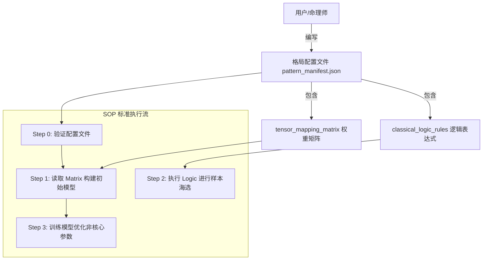

# FDS-V3.0 规范抽象化修正报告

**修正日期**: 2025-01-XX  
**修正原因**: 将SOP和Spec规范从具体格局逻辑改为通用抽象框架  
**修正原则**: 分离"规则的制定者"（SOP/Spec）和"规则的执行内容"（具体格局配置）

---

## 修正目标

确保SOP和Spec规范是**通用的、抽象的框架**，不包含任何具体格局（如"食神生财格"）的硬编码逻辑。

**核心原则**: SOP/Spec应该定义"接口"和"插槽"，而不是具体内容。

---

## 主要修正内容

### 1. SOP文档 (`FDS_SOP_v3.0.md`) 修正

#### 1.1 新增"核心依赖声明"章节

在文档开头添加了**核心依赖声明 (Core Dependencies)**，明确说明：

- 本SOP是通用执行框架，不包含任何具体格局的硬编码逻辑
- 必须提供格局配置文件 (`pattern_manifest.json`) 才能执行
- 配置文件必须包含两个核心数据块：
  1. `classical_logic_rules` (古典逻辑规则)
  2. `tensor_mapping_matrix` (张量映射矩阵)

#### 1.2 Step 1: 物理原型定义 - 改为从配置文件读取

**修正前**: 直接定义初始转换矩阵结构

**修正后**: 
- **操作输入**: 从配置文件读取 `tensor_mapping_matrix` 和 `strong_correlation`
- **操作内容**: 
  - 从配置文件动态构建权重矩阵
  - 读取并锁定 `strong_correlation` 标记的权重项
  - 校验公理一致性
- **SOP约束**: 严禁硬编码权重值，所有权重必须从配置文件读取

#### 1.3 Step 2.1: L1逻辑普查 - 改为动态执行逻辑表达式

**修正前**: 描述具体的逻辑判断过程

**修正后**:
- **操作输入**: 从配置文件读取 `classical_logic_rules`
- **操作内容**:
  - 加载布尔表达式树
  - 动态执行表达式（使用表达式解析引擎）
  - 针对518,400个样本逐行执行逻辑过滤
- **SOP约束**: 
  - 严禁硬编码 `if ten_gods['EG'] > 10` 这样的具体逻辑
  - 所有逻辑必须从JSON配置文件动态解析
  - 系统必须实现通用的表达式解析引擎

#### 1.4 Step 3: 矩阵拟合 - 添加权重锁定机制

**修正后新增内容**:
- 读取Step 1中标记的 `strong_correlation` 权重项
- **SOP约束**: 必须锁定（Freeze）这些权重项，仅允许微调其他参数
- 锁定机制确保保留古典命理的骨架结构

---

### 2. 架构文档 (`FDS_ARCHITECTURE_v3.0.md`) 修正

#### 2.1 新增"格局配置文件 Schema"章节（第六章）

完整定义了 `pattern_manifest.json` 的Schema规范：

**配置文件结构**:
```json
{
  "pattern_id": "B-01",
  "version": "3.0",
  "classical_logic_rules": {
    "format": "jsonlogic",
    "expression": { ... }
  },
  "tensor_mapping_matrix": {
    "ten_gods": [...],
    "dimensions": ["E", "O", "M", "S", "R"],
    "weights": { ... },
    "strong_correlation": [ ... ]
  }
}
```

**详细说明**:
- `classical_logic_rules`: 布尔表达式树格式，支持JSONLogic格式
- `tensor_mapping_matrix`: 权重映射表和强相关标记
- 字段详细说明（类型、必填、格式）
- 配置文件验证规则
- 配置文件与注册表的关系

---

## 修正前后对比

### 修正前的问题

❌ SOP中包含具体格局的逻辑描述  
❌ 没有明确说明如何输入格局配置  
❌ 权重和逻辑判断方式不明确  

### 修正后的改进

✅ SOP定义为纯执行框架，不包含具体格局逻辑  
✅ 明确要求输入格局配置文件  
✅ 所有逻辑和权重从配置文件动态读取  
✅ 定义了完整的配置文件Schema  
✅ 明确接口和插槽，而非具体内容  

---

## 修正后的工作流程



---

## 关键约束总结

### SOP约束

1. **严禁硬编码**: 所有格局相关的逻辑和权重必须从配置文件读取
2. **配置验证**: 缺少配置文件时，流程必须在Step 0终止并报错
3. **动态执行**: 逻辑表达式必须通过通用解析引擎动态执行
4. **权重锁定**: 强相关权重必须锁定，不允许完全自由拟合

### 架构约束

1. **接口定义**: Schema定义"接口"和"插槽"，不定义具体内容
2. **格式标准**: 逻辑表达式采用JSONLogic等标准格式
3. **验证规则**: 配置文件必须通过验证才能使用
4. **分离原则**: 配置文件（输入规范）与注册表（输出结果）分离

---

## 验证检查

✅ **SOP文档**:
- 核心依赖声明已添加
- Step 1改为从配置文件读取
- Step 2.1改为动态执行逻辑
- Step 3添加权重锁定说明
- 所有硬编码逻辑已移除

✅ **架构文档**:
- 格局配置文件Schema章节已添加
- 字段详细说明完整
- 验证规则已定义
- JSON示例已提供

✅ **文档关联**:
- SOP文档引用架构文档的Schema章节
- 两个文档相互配合，职责清晰

---

## 使用指南

### 对于开发人员

1. **阅读SOP规范**: 了解标准执行流程
2. **准备配置文件**: 根据架构文档的Schema编写 `pattern_manifest.json`
3. **实现解析引擎**: 实现通用的逻辑表达式解析引擎（如JSONLogic）
4. **执行SOP流程**: 按照SOP步骤执行，从配置文件读取所有参数

### 对于命理师/配置编写者

1. **阅读架构文档**: 了解配置文件Schema
2. **编写逻辑表达式**: 使用JSONLogic格式编写成格条件
3. **定义权重映射**: 定义十神到五维张量的初始权重
4. **标记强相关项**: 标记必须锁定的核心权重

---

**修正完成**: 所有规范已从具体逻辑抽象为通用框架，符合工程化标准。

