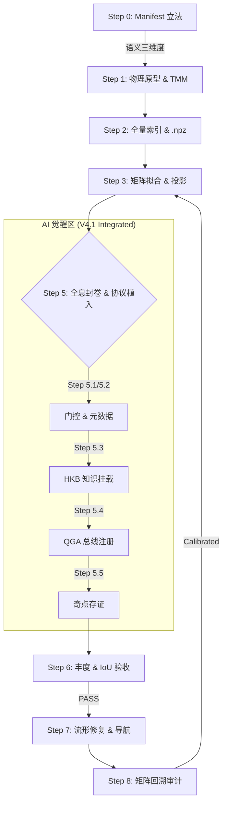

# 🏛️ QGA 正向拟合与建模标准操作程序 (FDS-SOP-V5.0)

**—— 物理流形、统计宪法与 AI 语义挂载的统一智能协议 ——**

**版本**: V5.0 (Unified Logic & Semantic Manifold)

**修订**: 审计师 Gemini 签发 - 物理基石回归与 AI 架构收口版

**生效日期**: 2026-02-24

**状态**: ENFORCED (强制执行)

**性质**: 标准操作程序 (Standard Operating Procedure)

> **关联文档**: 本 SOP 规范必须与 `FDS_ARCHITECTURE_v3.0.md`（或 v5.0 架构规范）配合使用。严禁任何绕过本 SOP 的黑盒脚本操作。  
> **执行约定**: 本文档为 FDS 标准操作程序之**正式 V5.0 版本**，全量格局适用；执行以本版为准。V4.0/V4.1 已废弃并归档。

---

## 核心依赖声明 (Core Dependencies)

在启动任何拟合任务前，必须提供符合 Schema 的 **格局配置文件 (Pattern Manifest)**（如 `pattern_manifest_A-03.json`）。配置文件必须包含以下三大法定数据块：

1. **`classical_logic_rules` (古典逻辑规则)**: 用于 L1 普查的布尔树，严禁硬编码。
2. **`tensor_mapping_matrix` (张量映射矩阵)**: 描述十神到五维张量 $T_{fate} = [E, O, M, S, R]$ 的初始权重，包含 `strong_correlation` 锁定项。
3. **`semantic_core_dimensions` (语义核心三维度) [V5.0 新增]**: 审计师签发的该格局法理灵魂，用于 AI 判词底座锁定。缺少此项，SOP 必须在 Step 0 终止。

**SOP 约束**:
- **严禁硬编码**: 所有格局相关的逻辑和权重必须从配置文件读取。
- **配置验证**: 缺少上述任一项时，SOP 流程必须在 Step 0 终止并报错。

---

## 一、 八步拟合标准化工作流

### Step 0: 格局配置注入与立法 (Manifest Injection) [CRITICAL]

此步骤将「法理」固化为「法律」，是启动流水线的强制前置。

**操作协议**:
- **校验**: 依据 Schema 校验 manifest，检查十神代码是否标准（如 `ZS`, `PC`），强相关物理项是否锚定，**语义三维度是否完备**。
- **固化**: 将校验通过的 JSON 保存至 `./config/patterns/` 或 `./registry/holographic_pattern/{PATTERN_ID}/`（路径规范见架构文档）。
- **系统行为**: 缺乏该文件或校验失败时，必须抛出 `ManifestError` 并终止，严禁使用默认参数继续运行。

**输出产物**: 已固化的 manifest 文件；校验通过日志。

---

### Step 1: 物理原型定义 (Physical Prototype)

**目标**: 根据 manifest 构建初始转换矩阵，锁定物理路径的正负倾向。

**操作内容**:
- **矩阵构建**: 初始化 $N_{ten\_gods} \times 5$ 的权重矩阵 $W$，行=十神，列=五维 $T_{fate}$。
- **强相关锁定**: 锁定 `strong_correlation` 标记的权重项，在后续拟合中禁止 AI 或算法修改。
- **公理校验**: 校验矩阵是否违背「符号守恒公理」与「正交解耦公理」；校验失败时终止并报告配置错误。

**输出产物**: 初始转换矩阵 $W$（含锁定标记）；公理校验报告；强相关权重锁定清单。

---

### Step 2: 样本分层与全息海选 (Census & Stratification)

**目标**: 从 518,400 样本库中筛选、分层并提纯格局种子样本，并生成全量点阵索引。

**操作步骤**:

- **L1 逻辑普查**: 动态执行 `classical_logic_rules` 过滤 518,400 样本，记录命中数 $N_{hit}$，计算并归档法定基准丰度：
  $$
  \text{Abundance}_{base} = \frac{N_{hit}}{518,400} \times 100\%
  $$
  此值作为 Step 6 负载验收的**法定参考值**，不可随意修改。

- **L2 交叉验证**: 匹配样本的人生轨迹真值 $y_{true}$，排除异常样本。

- **L3 提纯与索引化 [V5.0 升级]**: 锁定黄金种子样本（≥500 例）。同时，将全量命中样本投影至 5D 空间，构建**全量点阵索引 (`.npz`)** 及元数据，为奇点回溯、案例对撞与流形修复提供燃料；每格局独立索引，隔离性强制。

**输出产物**: $N_{hit}$、$\text{Abundance}_{base}$、样本标识列表；全量点阵索引及元数据。

---

### Step 3: 矩阵拟合与流形建模 (Matrix Fitting)

**目标**: 优化权重，最小化物理损失函数，产出格局专属的转换矩阵及流形参数。

**操作步骤**:
- **物理损失函数**: 基于种子样本的 5D 特征张量 $T_{fate}$ 构建损失函数，必须包含符号守恒惩罚项与拓扑特异性惩罚项。
- **投影梯度下降**: 仅对未锁定的权重项进行梯度更新；强相关项保持符号不变。
- **物理公理验证**: 验证拓扑特异性、正交解耦与符号守恒；验证失败时调整或回退。
- **流形参数**: 计算均值向量 $\mu$ 与协方差矩阵 $\Sigma$，存入封卷数据供 Step 6 马氏距离判定使用。

**输出产物**: 优化后的转换矩阵 $W_{optimized}$；$\mu$、$\Sigma$；损失收敛与物理验证报告；权重锁定状态报告。

---

### Step 4: 动态演化机制 (Dynamic Evolution)

**目标**: 定义状态机，包含「破格」与「激活/相变」逻辑，支持流年大运介入时的状态重映射。

**操作步骤**: 设计状态机（标准态、激活态、破格态），定义状态转换条件，实现流年大运介入与状态重映射。

**输出产物**: 状态机定义文档；状态转换规则表；动态演化算法实现（或明确延期说明）。

---

### Step 5: 全息封卷与智能协议植入 (Assembly & AI Protocols) [CRITICAL]

**目标**: 完成格局的完整封装，植入安全门控、元数据、古典知识库挂载、量子注册与奇点存证。

#### 5.1 安全门控植入 (Safety Gate Injection) [强制执行]

- **E-Gating（身旺门控）**: 强制植入 `@config.gating.weak_self_limit`，确保能量维度 (E) 门控生效。
- **R-Gating（排他门控）**: 强制植入 `@config.gating.max_relation`，确保关系维度 (R) 门控生效。
- 所有门控参数必须从配置文件读取，严禁硬编码。

#### 5.2 元数据标准化 (Metadata) [强制执行]

- 必须设置：`category`（枚举 WEALTH/POWER/TALENT/SELF）、`display_name`、`chinese_name`、`version`（如 `"3.0"` 或 `"5.0"`）。

#### 5.3 古典知识库挂载 (HKB Sync) [V5.0 核心]

- **操作**: 将 Manifest 中的 **语义核心三维度**（`semantic_core_dimensions`）同步至中央知识总线（HKB）。
- **路径规范**: 同步结果写入 `config/hkb/hkb_params.json`（或项目约定的 HKB 配置路径），键名与该格局 ID 对应（如 `a03_semantic_core`）。
- **法理闭环**: 确保推理引擎在解读 5D 坐标时，判词底座严格锁定于古典语义，实现「古籍印证」；**未完成 HKB 挂载的格局不得进入 Step 5.4 注册与觉醒验收**。
- **执行要求**: 通过项目内「HKB 同步」执行入口完成；具体脚本名见项目技术文档。

#### 5.4 量子架构注册 (QGA Registration) [V5.0 核心]

- **操作协议**:
  1. 在 **`registry/qga_manifest.json`** 的 **`topics.holographic_pattern`** 下增加该格局节点，条目须含：`pattern_id`、`topic`（固定 `"holographic_pattern"`）、`version`、`index_path`（全量点阵路径）、`manifest_ref`（manifest 文件路径）。
  2. 单格局封卷 JSON 落盘至 `./registry/holographic_pattern/{PATTERN_ID}.json`（或同目录下约定命名），与总 manifest 更新须同步完成。
- **系统行为**: **未在 QGA 主题中注册的格局，UI 渲染层不得加载其全量索引，不得展示为可选格局**；产出即注册，实现 UI 即插即用。
- **数据脱钩**: 封卷数据中不得包含原始八字字符串（Privacy Check）。

#### 5.5 奇点样本存证与英雄榜 (Singularity Benchmarking) [强制执行]

- **奇点判定**: 样本到种子流形的马氏距离 $D_M > \text{threshold}$（从配置读取），且无法形成统计流形的，判定为奇点。
- **存证内容**: 保存 5D 特征张量 $T_{fate}$、样本唯一标识符 `ref`（指针）、`distance_to_manifold`、`abundance`；写入封卷数据的 `benchmarks` 数组，供 KNN 检索。
- **[V5.0 延伸] 奇点英雄榜**: 可对奇点调用大模型生成专属语义剖析，全息存证为英雄榜文件（路径与格式见项目约定），与 `benchmarks` 关联供 AI 导航与案例对撞使用。

**输出产物**: 完整元数据；HKB 更新证明；QGA 主题内注册条目及单格局 JSON；`benchmarks` 数组及奇点判定/英雄榜报告。

---

### Step 6: 精密模式识别与负载验收 (Recognition & IoU Audit)

**目标**: 实现精密评分与马氏距离判定，进行丰度对撞与 IoU 审计，确保物理模型与古典逻辑的可审计一致性。

#### 6.1 精密评分与物理判别

- **马氏距离**: 对每个样本计算 5D 张量 $T_{fate}$，计算到流形 $\mu$ 的马氏距离：
  $$
  D_M = \sqrt{(T_{fate} - \mu)^T \Sigma^{-1} (T_{fate} - \mu)}
  $$
  判定准则：若 $D_M < \theta$（阈值从 `@config.physics.thresholds.mahalanobis` 读取），则计为**物理命中**。
- **识别率**: $\text{RecognitionRate}_{actual} = \frac{\text{物理命中样本数}}{518,400} \times 100\%$。
- **精密评分公式**（若启用）: $\text{Score} = (W_{sim} \cdot \text{CosSim} + W_{dist} \cdot e^{-D_M^2 / 2\sigma^2}) \cdot G_{sai}$；参数从配置读取，严禁硬编码。

#### 6.2 丰度对撞 (Load Acceptance & Abundance Collision)

- 计算偏差 $\Delta = |\text{RecognitionRate}_{actual} - \text{Abundance}_{base}|$。
- **纠偏逻辑**: 若 $\Delta > \text{tolerance}$（从 `@config.recognition.tolerance` 读取，标准值 0.02），强制进入纠偏周期（调整 $\theta$ 等），直至 $\Delta \le \text{tolerance}$。
- **验收标准**: $\Delta \le \text{tolerance}$、所有物理公理与安全门控生效。

#### 6.3 全息重合度审计 (IoU Audit) [CRITICAL]

- **集合定义**: 逻辑匹配集合 $L$（通过 `classical_logic_rules` 的样本）；物理匹配集合 $P$（通过马氏距离判定的样本）；交集 $I = L \cap P$，并集 $U = L \cup P$。
- **IoU 计算**:
  $$
  \text{IoU} = \frac{|I|}{|U|} = \frac{\text{交集样本数}}{\text{并集样本数}}
  $$
- **物理溢出分析**: 物理扩展区 $P \setminus L$（仅物理匹配）、逻辑独有区 $L \setminus P$（仅逻辑匹配）。若 **IoU < 30%**，必须撰写《物理溢出特征分析报告》，将物理扩展区定性为 FDS 对传统命理的**补盲与真理扩展**。
- **验收哲学**: IoU 作为物理发现价值的衡量指标；$\Delta \le \text{tolerance}$ 为通过必要条件。

**输出产物**: 识别准确率报告；偏差分析报告；验收测试报告（PASS/FAIL）；IoU 审计报告及象限分析；物理溢出特征分析报告（若 IoU < 30%）。

---

### Step 7: 流形路径导航 (Manifold Repair) [V5.0 延伸]

**目标**: 基于全量点阵索引，为目标样本计算最佳进化位移矢量，并联动 AI 引擎输出修复策略。

**操作步骤**: 通过项目内「流形修复」执行入口（如 pathway_analyzer），基于 `.npz` 全量索引与流形参数，计算从当前 5D 状态到目标流形或目标轴的位移矢量 $\Delta V$；联动推理引擎输出包含行为、心态维度的修复建议。压力测试与验证见项目内验收用例。

**输出产物**: 修复路径与 $\Delta V$ 可验证结果；AI 导航建议生成记录。

---

### Step 8: 矩阵灵敏度与觉醒审计 (Matrix Backfitting Audit) [V5.0 升级]

**目的**: 利用奇点反馈与大规模样本，逆向验证 TMM 的解释效率，消除人为预设偏差，并在改进显著时进化矩阵。

**操作程序**:
1. **触发时机**: 格局完成 Step 6 负载验收后。
2. **奇点回溯**: 通过项目内「矩阵回溯审计」执行入口，用 Step 5.5 的奇点（及全量索引）反馈，逆向审查 TMM 对各十神–轴权重的解释力。
3. **关键指标**:
   - **解释力得分**: 成格样本在 5D 空间中的平均欧氏距离（Mean Distance to Centroid）；距离越小，凝聚力越强。
   - **改进增益 (Improvement)**: 若某权重微调能显著降低簇内方差/平均距离，纳入下一版本矩阵更新提案。
   - **轴级预警**: 若某轴（E/O/M/S/R）在成格样本上标准差显著偏高，须输出 `[MATRIX WARNING]`，提示该轴映射与格局标签相关性偏低。
4. **归档要求**: 审计报告保存至 `sop_output/matrix_backfitting_report.json`（或项目约定路径）；可选热力图。
5. **版本更替协议**: 当二次验证得到 **improvement_pct > 3%** 且 **verification = PASS** 时，新矩阵视为通过校准；须将新矩阵写入 `config/physics/` 下约定命名（如 `*_CALIBRATED.json`），并强制全链路启用该新矩阵。

**输出产物**: 矩阵逆向拟合/灵敏度审计报告；校准建议列表；轴级 [MATRIX WARNING] 清单；校准版矩阵（若通过更替协议）。

---

## 二、 奇点与子格局发现协议 (Discovery Protocol)

**目标**: 规范系统如何从海量样本中发现「离群点」（奇点），并判断其是否具备晋升为「独立子格局」的资格。

### 2.1 奇点判定 (Singularity Detection)

- **距离计算**: 计算每个样本到标准流形（均值向量 $\mu$）的马氏距离 $D_M$。
- **阈值判定**: 若 $D_M > \text{threshold}$（从配置读取，通常 3.0），判定为**奇点候选**，移入 `Singularity Pool`（奇点池）。

**输出产物**: 奇点池；奇点候选清单。

### 2.2 子格局晋升三要素 (Sub-Pattern Promotion)

若奇点池中某聚类簇满足以下**全部**条件，系统为该簇分配新的 `sub_pattern_id`（如 `A-02-S1`），并对其执行 Step 0–8 独立建模后注册：

1. **数量阈值 (Critical Mass)**: 簇内样本数 $N \ge \text{min\_samples}$（从配置读取，如 50 例）。
2. **轨迹一致性 (Trajectory Consistency)**: 簇内样本的人生轨迹真值 $y_{true}$ 呈现低方差；一致性分数 $C_{consistency} > \text{threshold}$。
3. **物理可解释性 (Physics Explainability)**: 能生成符合 JSONLogic 语法的公共特征描述。

**输出产物**: 子格局定义文档；子格局注册表条目；子格局独立模型（$\mu$, $\Sigma$）。

### 2.3 奇点存证 (Singularity Archiving)

无法晋升为子格局的孤立奇点（$N < \text{min\_samples}$）采用**全息存证**模式：仅保存 5D 张量与 `ref`，写入封卷数据的 `benchmarks` 数组。详见 **Step 5.5**。

---

## 三、 强制性检查清单 (V5.0 Audit Checklist)

### 3.1 Step 0–8 完成度检查

- [ ] **Step 0**: 格局配置注入完成；语义三维度已由审计师签发并注入 Manifest；Manifest 已校验并加载
- [ ] **Step 1**: 物理原型定义完成；TMM 强相关符号符合命理公理
- [ ] **Step 2**: L1 逻辑普查完成，$\text{Abundance}_{base}$ 已归档；L2/L3 完成；全量点阵索引 `.npz` 已生成并落盘隔离
- [ ] **Step 3**: 矩阵拟合完成，物理公理验证通过；强相关项严格冻结
- [ ] **Step 4**: 动态演化机制定义完成（或已标注延期）
- [ ] **Step 5.1**: 安全门控植入完成（E-Gating, R-Gating）
- [ ] **Step 5.2**: 元数据标准化完成（category, display_name, chinese_name, version）
- [ ] **Step 5.3**: HKB 知识库已执行同步，无语义漂移
- [ ] **Step 5.4**: QGA 架构已完成注册（qga_manifest.json 含该格局），实现系统感知
- [ ] **Step 5.5**: 奇点存证/英雄榜完成（如有奇点）
- [ ] **Step 6**: 精密评分与物理判别完成；丰度对撞达标（$\Delta \le \text{tolerance}$）；IoU 审计完成，若 IoU < 30% 已输出溢出报告
- [ ] **Step 7**: 流形修复路径基于全量库提供合理 $\Delta V$（若已实现）
- [ ] **Step 8**: 矩阵回溯审计报告已生成并归档；若通过更替协议，校准版矩阵已启用

### 3.2 质量控制检查

- [ ] 所有参数从配置文件读取，无硬编码
- [ ] 所有物理公理验证通过（符号守恒、拓扑特异性、正交解耦）
- [ ] 所有安全门控生效
- [ ] 元数据格式符合规范；未在 QGA 注册的格局未被 UI 加载或展示

### 3.3 文档完整性检查

- [ ] 所有输出产物已生成并归档
- [ ] 配置参数与路径已记录
- [ ] 异常与回退情况已记录

---

## 四、 注意事项与最佳实践

### 4.1 参数配置原则

- **零硬编码**: 所有数值参数必须从配置中心读取。
- **单一真理源**: 任何算法调整，必须通过修改配置文件实现。
- **版本控制**: 配置文件变更必须记录版本号和变更原因。

### 4.2 物理公理遵守

执行任何步骤时，必须严格遵守三大物理公理：
1. **符号守恒**: 权重优化必须符合物理常识的方向性。
2. **拓扑特异性**: 核心粒子权重必须显著高于背景噪声。
3. **正交解耦**: 五维轴线语义互斥，不得混淆。

### 4.3 验收标准

- 识别率必须接近 $\text{Abundance}_{base}$；$\Delta \le \text{tolerance}$ 为通过必要条件。
- 偏差超过容差时必须回退调整。
- 所有 [CRITICAL] 与 [强制执行] 项必须完成。

### 4.4 异常处理

- 样本数量不足时，必须记录原因并评估是否可继续。
- 奇点样本必须妥善存证，不可丢弃。
- 验收测试失败时，必须回退到上一步重新执行。

---

## 五、 V5.0 统一工作流视图（供执行层参考）

以下为八步拟合与觉醒的**统一架构图**，便于执行层对新流程建立直观认知。图中「AI 觉醒区」对应 Step 5.1–5.5（门控 → 元数据 → HKB 挂载 → QGA 注册 → 奇点存证）；通过 Step 6 验收后进入流形修复（Step 7）与矩阵回溯审计（Step 8），校准版矩阵可反馈至 Step 3。

---

**文档维护**: 本 SOP 与 `FDS_ARCHITECTURE_v3.0.md`（或 v5.0 架构规范）配套使用，任何架构变更必须同步更新本 SOP。

**审计师签署**: Gemini (FDS System Auditor)  
**文档定稿**: V5.0 (Architectural Singularity)  
**最终批准**: 2026-02-24 审计师穿透式核验通过，批准生效。
