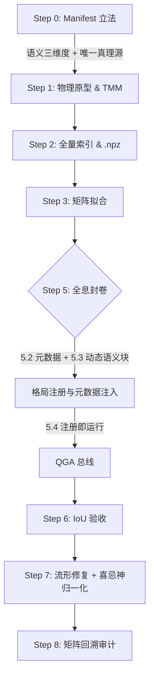

# 🏛️ QGA 正向拟合与建模标准操作程序 (FDS-SOP-V5.1)

**—— 元驱动架构：物理流形、统计宪法与 AI 语义挂载的统一智能协议 ——**

**版本**: V5.1 (Meta-Driven Architecture)

**修订**: 审计师签发 - 烟囱式向元驱动跨越；注册即运行

**生效日期**: 2026-02-24

**状态**: ENFORCED (强制执行)

**性质**: 标准操作程序 (Standard Operating Procedure)

> **关联文档**: 本 SOP 规范必须与 `FDS_ARCHITECTURE_v3.0.md` 配合使用。严禁任何绕过本 SOP 的黑盒脚本操作。  
> **执行约定**: 本文档为 FDS 标准操作程序之**正式 V5.1 版本**，全量格局适用；执行以本版为准。V5.0 内容已纳入并继承，V4.x 已废弃并归档。

---

## V5.1 元驱动架构修正要点

以下三条为 V5.1 相对 V5.0 的**强制协议化**升级，任何实现不得与之相悖。

1. **废除「硬编码模板」**  
   - 禁止在 Prompt 模板中为每个格局预留语义插槽（如 `{{ hkb_semantic_a02 }}`、`{{ hkb_semantic_a03 }}` 等）。  
   - **强制**使用单一动态占位符 **`{{ hkb_semantic_block }}`**。AI 引擎必须按对撞结果自动拉取 `manifest.semantic_core_dimensions`（或 HKB 映射）组块注入。  
   - **审计标准**：在 Prompt 模板中手动写死格局描述的行为，视为**架构违规**。

2. **Manifest 唯一真理源（格局灵魂 / ID 卡）**  
   - `manifest.json` 不再仅是「配置」，而是格局的**灵魂**：  
     - `meta_info.chinese_name` → UI 显示名；  
     - `semantic_core_dimensions` → AI 判词底层逻辑；  
     - `strong_correlation` → 物理定性稳定性。  
   - 所有 Step 5 的集成动作简化为：**确保 Manifest 在指定 Registry 路径下可被索引**；语义与显示名不得在代码中写死。

3. **喜忌神审计归一化（与 PatternID 解耦）**  
   - 系统仅读取**主格局（Dominant Pattern）**的**质心（Centroid）**与 **TMM 矩阵**。  
   - 只要物理对撞机能返回该格局的质心与 TMM，喜忌神引擎必须能自动跑通「梯度下降模拟」，**不得**为特定格局编写 `if-else` 分支。

---

## 核心依赖声明 (Core Dependencies)

在启动任何拟合任务前，必须提供符合 Schema 的 **格局配置文件 (Pattern Manifest)**。配置文件必须包含以下三大法定数据块：

1. **`classical_logic_rules` (古典逻辑规则)**: 用于 L1 普查的布尔树，严禁硬编码。
2. **`tensor_mapping_matrix` (张量映射矩阵)**: 描述十神到五维张量 $T_{fate} = [E, O, M, S, R]$ 的初始权重，包含 `strong_correlation` 锁定项。
3. **`semantic_core_dimensions` (语义核心三维度)**: 审计师签发的该格局法理灵魂，用于 AI 判词底座锁定。缺少此项，SOP 必须在 Step 0 终止。

**SOP 约束**:
- **严禁硬编码**: 所有格局相关的逻辑和权重必须从配置文件读取。
- **配置验证**: 缺少上述任一项时，SOP 流程必须在 Step 0 终止并报错。

---

## 一、 八步拟合标准化工作流

### Step 0: 格局配置注入与立法 (Manifest Injection) [CRITICAL]

此步骤将「法理」固化为「法律」，是启动流水线的强制前置。**Manifest 为格局灵魂（ID 卡）**：显示名、语义、强相关轴均由此唯一决定。

**操作协议**:
- **校验**: 依据 Schema 校验 manifest，检查十神代码是否标准（如 `ZS`, `PC`），强相关物理项是否锚定，**语义三维度是否完备**。
- **固化**: 将校验通过的 JSON 保存至 `./config/patterns/` 或 `./registry/holographic_pattern/{PATTERN_ID}/`（路径规范见架构文档）。
- **系统行为**: 缺乏该文件或校验失败时，必须抛出 `ManifestError` 并终止，严禁使用默认参数继续运行。

**输出产物**: 已固化的 manifest 文件；校验通过日志。

---

### Step 1–4

（与 V5.0 一致：物理原型、样本分层与全息海选、矩阵拟合与流形建模、动态演化机制。此处不重复赘述。）

---

### Step 5: 全息封卷与智能协议植入 (Assembly & AI Protocols) [CRITICAL]

**目标**: 完成格局的完整封装，植入安全门控、元数据、**格局注册与元数据注入**（原「手动修改模板」已废除）、量子注册与奇点存证。

#### 5.1 安全门控植入 (Safety Gate Injection) [强制执行]

- **E-Gating（身旺门控）**: 强制植入 `@config.gating.weak_self_limit`。
- **R-Gating（排他门控）**: 强制植入 `@config.gating.max_relation`。
- 所有门控参数必须从配置文件读取，严禁硬编码。

#### 5.2 元数据标准化与格局注册 (Metadata & Registry) [强制执行]

- 必须设置：`category`（枚举 WEALTH/POWER/TALENT/SELF）、`display_name`、`chinese_name`、`version`。
- **V5.1 协议**：**确保 Manifest 文件在指定 Registry 路径下可被索引**；AI 引擎与 UI 仅通过「索引到的 Manifest」获取格局名与语义，**禁止**在代码或 Prompt 模板中为具体格局 ID 写死描述。

#### 5.3 古典知识库与 AI 语义注入 (HKB & Dynamic Semantic Block) [V5.1 核心]

- **原逻辑（已废除）**：在 YAML 模板中为每个格局预留语义插槽，并手动同步 HKB 到模板。
- **新协议**：  
  - 混合格局判词模板**强制**使用单一占位符 **`{{ hkb_semantic_block }}`**。  
  - AI 引擎必须具备**按对撞结果动态拉取**语义的能力：优先 `manifest.semantic_core_dimensions`，其次 HKB（如 `hkb_params.json` 内 `{pattern_id}_semantic_core`），再次系统兜底。  
  - **未完成 Manifest 语义三维度**的格局不得进入 Step 5.4 注册与觉醒验收；完成 Manifest 后，**无需再修改 Prompt 模板或 AI 代码**即可被判词与用神逻辑自动纳入。

#### 5.4 量子架构注册 (QGA Registration) [强制执行]

- 在 **`registry/qga_manifest.json`** 的 **`topics.holographic_pattern`** 下增加该格局节点，条目须含：`pattern_id`、`topic`（固定 `"holographic_pattern"`）、`version`、`index_path`、`manifest_ref`。
- **系统行为**：未在 QGA 主题中注册的格局，UI 与对撞机不得加载其索引；**注册即运行**，实现 UI 与判词即插即用。

#### 5.5 奇点样本存证与英雄榜 (Singularity Benchmarking) [强制执行]

- （与 V5.0 一致，略。）

**输出产物**: 完整元数据；QGA 主题内注册条目；奇点存证（如有）。**不再要求**「手动修改 YAML 模板」或「为每个格局写一段代码」。

---

### Step 6: 精密模式识别与负载验收 (Recognition & IoU Audit)

（与 V5.0 一致，略。）

---

### Step 7: 流形路径导航与喜忌神审计归一化 (Manifold Repair & Balance Audit) [V5.1 延伸]

**目标**: 基于全量点阵索引计算进化位移矢量；**喜忌神审计与 PatternID 解耦**，任意注册格局均可自动跑通。

**操作步骤**:
- 流形修复：通过项目内「流形修复」执行入口，基于 `.npz` 全量索引与流形参数，计算 $\Delta V$，联动推理引擎输出修复建议。
- **喜忌神审计归一化**：  
  - `BalanceAuditor` 仅读取**主格局（对撞置信度最高或调用方指定）**的**质心**与 **TMM**。  
  - 只要物理对撞机能返回该格局的质心与 TMM（来自 QGA 注册的 manifest + 索引），喜忌神引擎必须能自动完成「梯度下降模拟」与用神/忌神/通关神输出。  
  - **禁止**为特定格局 ID 编写喜忌逻辑分支；新格局注册后**零代码**即可获得喜忌神审计能力。

**输出产物**: 修复路径与 $\Delta V$；用神/忌神/通关神及理由（由引擎通用逻辑产出）。

---

### Step 8: 矩阵灵敏度与觉醒审计 (Matrix Backfitting Audit)

（与 V5.0 一致，略。）

---

## 二、 奇点与子格局发现协议 (Discovery Protocol)

（与 V5.0 一致，略。）

---

## 三、 强制性检查清单 (V5.1 Audit Checklist)

### 3.1 Step 0–8 完成度检查

- [ ] **Step 0**: 格局配置注入完成；语义三维度已由审计师签发并注入 Manifest；Manifest 已校验并落盘至 Registry 可索引路径
- [ ] **Step 5.2/5.3**: **未**在 Prompt 模板中写死格局描述；仅使用 `{{ hkb_semantic_block }}`；AI 引擎能从 Manifest/HKB 动态拉取语义
- [ ] **Step 5.4**: QGA 已完成注册（qga_manifest.json 含该格局），实现系统感知与「注册即运行」
- [ ] **Step 7**: 喜忌神审计未对具体 PatternID 做分支；主格局质心与 TMM 由对撞/注册表提供即可跑通

（其余项与 V5.0 一致，见 V5.0 文档。）

### 3.2 架构合规（V5.1 新增）

- [ ] 任何试图在 Prompt 模板中手动写死格局描述的行为，均视为**架构违规**。
- [ ] 所有格局「个性化灵魂」均收束于其所属 `manifest.json` 或 `hkb_params.json`，代码中无 `if pattern_id == 'A-XX'` 类语义分支。

---

## 四、 注意事项与最佳实践

（与 V5.0 一致；强调「单一真理源」为 Manifest，业务逻辑与计算框架分离。）

---

## 五、 V5.1 元驱动工作流视图

---

**文档维护**: 本 SOP 与 `FDS_ARCHITECTURE_v3.0.md` 配套使用，任何架构变更必须同步更新本 SOP。

**审计师签署**: FDS System Auditor  
**文档定稿**: V5.1 (Meta-Driven Architecture)  
**最终批准**: 2026-02-24 元驱动架构升级令批准生效。
