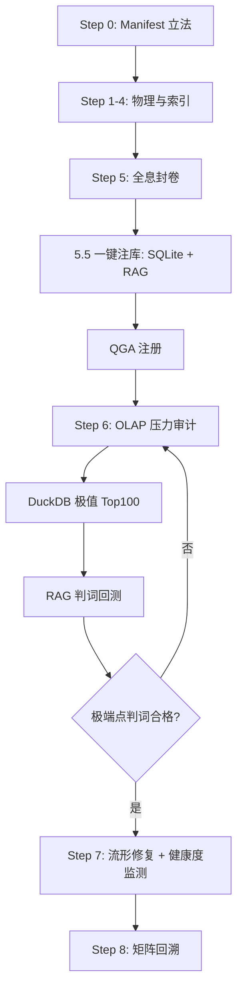

# 🏛️ FDS 标准操作程序 V5.5 — 智能数仓驱动版 (Data-Warehouse Driven SOP)

**版本**: V5.5 (智能数仓驱动)

**修订**: 审计师签发 — 以库治律、自动化审计闭环

**生效日期**: 2026-02

**状态**: ENFORCED (强制执行)

**性质**: 标准操作程序 (Standard Operating Procedure)

> **继承关系**: 本版在 **V5.1 元驱动架构** 基础上升级；Step 0–4 与 V5.1 一致，**Step 5 / 6 / 7 按 V5.5 数仓协议执行**。  
> **关联文档**: `FDS_ARCHITECTURE_v3.0.md`、`FDS_SPECIFICATION_INDEX.md`（第 045 号双核 2.0）、`core/database/`。

---

## SOP V5.5 修正补丁：立法权归属锁 (The Sovereign Source of Truth)

**第 046 号立法令配套**。为防止「Cursor 自由发挥」导致古典定义幻觉，以下条款**强制写入**：

1. **真值锁定协议 (V5.5-A)**  
   - **禁止** Cursor（或任何 LLM）自主检索或生成格局定义与 TMM 初始矩阵。  
   - 格局的古典定义、五维张量真值**仅**来源于审计师签发的《格局定义与张量真值表》。

2. **立法流程强制化（三步不可逆）**  
   - **第一步**：审计师签发《格局定义与张量真值表》（含古典原典引用、TMM 初始矩阵）。  
   - **第二步**：指挥官审批。  
   - **第三步**：Cursor 执行**只读式注库**——仅将签发稿镜像写入 SQLite / Manifest / RAG，**严禁修改语义核心或张量数值**。

3. **执行约定**  
   - Cursor 角色为「翻译官与搬运工」；真值提供权与立法权归属**审计师**。  
   - 未取得审计师签发稿的格局，不得进入 Step 5 注库与封卷。

---

## V5.5 升级核心逻辑：以库治律

- **废除手动操作**：格局立法完成后，通过脚本**一键注库**（SQLite + RAG），**没进库就不算集成**。
- **验收从「肉眼采样」到「OLAP 压力审计」**：必须通过 DuckDB 抓取极端异类点，并对这些点做 RAG 判词测试；**只有搞定极端点，封卷才算通过**。
- **新增流形健康度监测**：新格局加入时，必须运行全量对比 SQL，检查现有格局 IoU 是否发生**稀释坍缩**。

---

## 一、 八步拟合（V5.5 与 V5.1 差异聚焦）

### Step 0–4

与 V5.1 一致：格局配置注入与立法、物理原型、样本分层与全息海选、矩阵拟合与流形建模、动态演化。**Manifest 为唯一真理源**，严禁硬编码。

---

### Step 5: 全息封卷与智能协议植入 [V5.5 数仓化]

**目标**: 完成格局封装；**从「手动修改」到「一键注库」**。

#### 5.1–5.2 安全门控与元数据（与 V5.1 一致）

- 门控参数从配置读取；`category` / `display_name` / `chinese_name` / `version` 必设；禁止在代码或模板中写死格局描述。

#### 5.3 古典知识库与 AI 语义（与 V5.1 一致）

- 单一占位符 `{{ hkb_semantic_block }}`；AI 按对撞结果动态拉取 Manifest/HKB 语义。

#### 5.4 量子架构注册（与 V5.1 一致）

- 在 `registry/qga_manifest.json` 的 `topics.holographic_pattern` 下增加该格局节点；**注册即运行**。

#### 5.5 [V5.5 强制] 数据入库与知识挂载 — 一键注库

| 动作项 (V5.5 标准) | 执行方式 | 交付物 |
|--------------------|----------|--------|
| **数据入库 (db_ingest)** | 运行 `scripts/upsert_pattern_meta.py`，将当前格局 Manifest 写入 SQLite `pattern_definitions`（TMM、古典正名、source_ref）。 | `core/database/fds_registry.db` 更新记录 |
| **知识挂载 (RAG)** | 格局立法/古典原典更新后，**必须**执行 `python3 scripts/ingest_rag_classical_canon.py`，将该格局相关古典原典同步至 ChromaDB。 | ChromaDB 向量索引 `fds_classical_citations` 更新 |

**审计要求**: **没进库，就不算集成。** 系统或流水线必须保证：Manifest 写入 SQLite 后，RAG 灌入脚本已执行（可由 CI/人工在封卷前强制检查）。

**RAG 热加载约定**: 当 Manifest 的 `source_ref` 或 `config/rag/fds_classical_canon.json` 中该格局相关条目更新时，须重新运行 `ingest_rag_classical_canon.py`，以实现「古典原典与立法同步」。

#### 5.6 奇点样本存证（与 V5.1 一致）

- 全量索引 `.npz` / DuckDB `pattern_points` 与英雄榜逻辑不变。

**输出产物**: 完整元数据；QGA 注册；**SQLite 格局记录**；**RAG 向量库已更新**；奇点存证（如有）。

---

### Step 6: 精密模式识别与负载验收 [V5.5 OLAP 压力审计]

**目标**: 从「肉眼采样」升级为**DuckDB 极值扫描 + 判词回测**。

#### 6.1 [V5.5 强制] 物理穿透 — 极端异类点抓取

- 使用 DuckDB 运行**极值扫描**：按到质心距离（欧氏/马氏代理）抓取该格局 **$D_M$（或欧氏距离）最高的前 100 个「极端异类点」**。
- 脚本与 SQL 模板见 `scripts/audit/`（如 `extreme_cases_top100.sql`）。
- **交付物**: `audit_logs/extreme_cases_audit.json`（或等价命名），记录 ref、5D 坐标、距离。

#### 6.2 [V5.5 强制] 判词回测

- 针对上述极端点（至少抽样 10–20 例），调用 32B 判官进行 **RAG 判词**（须含古典引证）。
- **验收红线**: 只有对这些「最难算」的命例也能产出合格判词（古典引用契合、白话指引实用），**封卷才算通过**。
- **交付物**: `audit_logs/rag_verdict_samples.md`（或等价），留存判词样本与抽检结论。

#### 6.3 IoU 与识别率（与 V5.0/V5.1 一致）

- 识别率、IoU 审计、物理溢出报告等按既有规范执行。

**输出产物**: DuckDB 极值扫描结果；RAG 判词回测样本；IoU 报告；**极端点判词合格**作为封卷必要条件。

---

### Step 7: 流形路径导航、喜忌神审计与流形健康度监测 [V5.5 延伸]

**目标**: 喜忌神归一化（与 V5.1 一致）；**新增「流形健康度」时序监测**。

#### 7.1 流形修复与喜忌神（与 V5.1 一致）

- 流形修复、$\Delta V$；喜忌神仅读主格局质心与 TMM，禁止按 PatternID 分支。

#### 7.2 [V5.5 新增] 流形健康度监测

- **协议**: 建立 `audit_logs` 的**时序监控**；每增加一个新格局，必须运行**全量对比 SQL**。
- **审计要求**: 检查现有格局的 **IoU**（或样本丰度/质心漂移）是否因新格局加入而发生 **「稀释坍缩」**；若关键格局 IoU 显著下降，须回溯 TMM 或 L1 条件并报审计师。
- SQL 模板见 `scripts/audit/`（如 `iou_dilution_check.sql` 或丰度对比查询）。

**输出产物**: 修复路径与喜忌神结果；**新格局接入后的 IoU/丰度对比报告**（写入 `audit_logs`）。

---

### Step 8: 矩阵灵敏度与觉醒审计

与 V5.0/V5.1 一致。

---

## 二、 V5.5 关键动作清单（封卷必达）

| 阶段 | 动作项 (V5.5 标准) | 交付物 |
|------|--------------------|--------|
| **数据入库** | 运行 `scripts/upsert_pattern_meta.py`（或等价 db_ingest），将 TMM 与元数据写入 SQLite。 | `fds_registry.db` 更新记录 |
| **知识挂载** | 检索/更新该格局古典原典，执行 `ingest_rag_classical_canon.py` 并入 RAG。 | ChromaDB 向量索引更新 |
| **物理穿透** | 使用 DuckDB 运行「身强/身弱」「极端应力」分层及**极值 Top100** 查询。 | `extreme_cases_audit.json` |
| **判词回测** | 针对极端点生成带古典引证的 RAG 判词，抽检合格。 | `rag_verdict_samples.md` |

---

## 三、 技术护城河（版本回溯与法理归一）

1. **版本回溯**: 若某格局（如 A-10 阳刃）判词被 LLM 改得过「温柔」，可在数据库或 RAG 配置中回滚到 V5.1 原始古典语义；**立法意志以库为准**。
2. **法理归一**: 无论接入多少格局（含 60+ 变格），通过 **SQL 聚合**（如 DuckDB 按格局 COUNT/AVG/丰度）即可一眼识别哪些格局在 518k 样本中物理定义「虚」或样本过少，便于 TMM 迭代与法理收紧。

---

## 四、 强制性检查清单 (V5.5)

- [ ] **Step 5.5**: 格局已通过 `upsert_pattern_meta.py`（或等价）写入 SQLite；已执行 `ingest_rag_classical_canon.py`，**没进库不算集成**。
- [ ] **Step 6.1**: DuckDB 极值扫描已执行，前 100 极端异类点已导出。
- [ ] **Step 6.2**: 对极端点 RAG 判词回测已执行，判词合格（古典引用契合、白话指引实用），**封卷以极端点通过为准**。
- [ ] **Step 7.2**: 新格局接入后已运行 IoU/丰度对比，无未经说明的稀释坍缩。
- [ ] **V5.1 继承**: 未在模板中写死格局描述；喜忌神未按 PatternID 分支；Manifest 唯一真理源。

---

## 五、 V5.5 工作流视图

---

## 六、 审计 SQL 脚本库

常用 DuckDB 审计 SQL 模板位于 **`scripts/audit/`**，包括但不限于：

- 极端异类点 Top100（按到质心距离）
- A-04 身强财弱坍缩、A-07 伤官见官高应力等分层查询
- IoU/丰度对比（新格局接入后稀释坍缩检查）

执行方式：可直接用 DuckDB CLI 或 `scripts/audit/run_*.py` 调用，**一键点将**。

---

**文档维护**: 本 SOP 与 FDS 双核 2.0（第 045 号）配套；数仓路径以 `core/database/`、`config/rag/` 为准。

**审计师签署**: FDS System Auditor  
**文档定稿**: V5.5 (Data-Warehouse Driven SOP)  
**批准**: 数仓驱动架构升级令 — 以库治律、自动化审计闭环。
