# V19 Synthetic Evolution Framework

Date: 2026-04-29

This framework defines how V19 should "learn" and evolve without turning user feedback or LLM output into automatic runtime behavior.

## Decision

V19 self-evolution is centered on:

- Knowledge Base evolution
- Rule DB evolution
- Synthetic collision validation
- Analyst-approved promotion

It is not centered on training a black-box prediction model.

The current mature pattern is a governed evaluation loop:

```mermaid
flowchart LR
  A["Synthetic case matrix"] --> B["Question recommendation"]
  B --> C["Fact and knowledge retrieval"]
  C --> D["Answer composition"]
  D --> E["Quality and collision checks"]
  E --> F["Failure attribution"]
  F --> G["Knowledge or rule draft proposal"]
  G --> H["Synthetic regression validation"]
  H --> I["Analyst/admin review"]
  I --> J["Versioned active record"]
```

## Why Not Real Bazi As The Main Test Set

Real birth data is too noisy for this phase. It mixes structural correctness with claims about practical accuracy, interpretation style, calendar ambiguity, and user expectations.

P10 and P11 need controlled collision cases instead:

- one case for month-command boundary
- one case for visible vs hidden Ten God evidence
- one case for complete hidden-stem mapping
- one case for penalty / harm / break relations
- one case for three-meeting boundary
- one case for timing-layer relation boundaries
- one case for vault and hidden-stem reading
- one case for income-structure wording and internal-term cleanup

These cases prove chain behavior, not real-world accuracy.

## What Can Be Automated

The system can automatically:

- run synthetic collision cases
- detect missing recommendations
- detect missing retrieved knowledge
- detect wrong source-signal category
- detect missing relation types
- detect answer text gaps
- detect internal/debug wording leaks
- group failures into evolution candidates
- draft knowledge/rule review suggestions

## What Requires Analyst Review

Analyst review is required when a change would alter meaning:

- approving a new knowledge unit
- marking a draft as proposal-ready
- approving a Rule DB proposal
- changing relation semantics
- changing Ten God interpretation boundaries
- changing income-structure rule behavior
- promoting a synthetic failure fix into an active version record

Analyst review is not required for purely mechanical checks, such as syntax validation, JSON schema validation, or detecting `rule_id` in user-facing text.

## Current Implementation

Code entry points:

- `v19.synthetic_validation.P10_GUIDED_SYNTHETIC_CASES`
- `v19.synthetic_validation.run_guided_synthetic_collision`
- `v19.synthetic_validation.run_synthetic_validation`

The guided collision runner checks:

- recommended question presence
- wealth-oriented recommendation presence
- answer kind
- source signal category
- applied knowledge IDs
- retrieved relation types
- expected answer text
- forbidden user-facing text
- baseline vs knowledge-augmented routing stability
- evidence delta from knowledge augmentation

The default Lab validation cases now use explicit synthetic pillars with `NO_BIRTHDATE`, instead of real-looking birth inputs.

## Boundary

The evolution loop may create proposals, not live mutations.

Allowed:

- failure report
- draft proposal
- validation run
- analyst/admin approval record
- versioned active record

Not allowed:

- automatic rule activation
- automatic question-ranking mutation
- automatic knowledge promotion
- LLM-generated facts
- treating synthetic pass as proof of real-world accuracy

## Next Direction

P11 should build on this by expanding the synthetic matrix before expanding runtime inference:

- more branch relation collisions: clash + harm, combination + break, three harmony + three meeting
- more Ten God visibility collisions: visible only, hidden only, mixed
- month-command edge cases: season support, drain/control, neutral
- income-structure cases: no wealth element, wealth visible, wealth disrupted, wealth bound, mixed
- answer-quality variants: concise, non-template, no fixed disclaimer chrome
