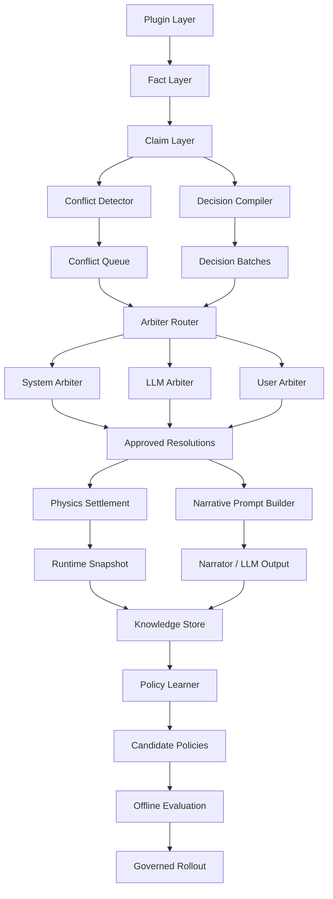

# V17 Brain Architecture v1

## 1. 文档目标

本文定义 V17 从“插件流水线”演进为“智能大脑系统”的总体架构。

目标不是引入一个更强的单点 LLM，而是建立一套可观察、可仲裁、可学习、可升级的系统宪法，使 V17 具备以下能力：

1. 统一感知插件、物理、用户输入、历史裁决。
2. 自动发现冲突、聚合决策、分流裁决。
3. 让 LLM 从“单条提示生成器”升级为“批量上下文理解器”和“高歧义仲裁器”。
4. 让系统从历史执行结果中学习偏好与策略。
5. 将“学习”和“生产结算”隔离，避免失控自我修改。

---

## 2. 设计原则

### 2.1 先建语言，再谈智能

系统必须先拥有统一内部表示，才能拥有稳定的智能能力。

V17 的统一内部表示应当从低到高依次为：

`Fact -> Claim -> Conflict -> Decision -> DecisionBatch -> Resolution -> Settlement`

### 2.2 学习不能直接改世界

任何学习结果不得直接修改物理主张量、核心公式或结算结果。

学习结果只能先表现为：

1. 权重建议
2. 路由建议
3. prompt 组织建议
4. 裁决建议

只有经过离线评估和人工批准，才能升级成生产策略。

### 2.3 单一结算链

所有自动化智能都必须服务于单一结算链，而不是绕过结算链。

即：

`Monitor -> Analyze -> Plan -> Resolve -> Settle`

不允许任何学习模块、LLM 模块或插件模块直接跳过仲裁层改写 `E_runtime`。

### 2.4 结构化优先，生成式兜底

规则系统负责发现和分流；
LLM 负责高歧义解释和语义裁决；
用户负责架构级、高风险定调。

---

## 3. 总体架构

V17 Brain v1 采用三种成熟思想的组合：

1. `MAPE-K`
   Monitor / Analyze / Plan / Execute / Knowledge
2. `Blackboard Architecture`
   所有插件和仲裁器围绕共享黑板协作
3. `Policy Learning`
   从历史裁决与执行后果中学习权重和路由策略

### 3.1 架构总览



---

## 4. 六层智能大脑

## 4.1 感知层 Perception

职责：

1. 接收插件输出、物理快照、用户输入、执行账本。
2. 将多源信号标准化。

核心对象：

1. `facts`
2. `plugin_rows`
3. `manual_decisions`
4. `auto_resolutions`
5. `llm_arbitration_context`

现状：

V17 已具备基础感知层，但仍有部分输出停留在文本级而非主张级。

下一目标：

所有进入智能层的插件输出必须能落成 `Claim`。

## 4.2 世界模型层 World Model

职责：

1. 持有系统对自身当前状态的统一理解。
2. 隔离物理真相、运行态和叙事镜头。

核心对象：

1. `ten_gods_base_l0`
2. `ten_gods_runtime`
3. `ten_gods_narrative`
4. `plugin_claims`
5. `plugin_conflicts`
6. `decision_batches`
7. `evolution_ledger`

这层相当于 V17 的内在地图。

## 4.3 认知层 Cognition

职责：

1. 从 Claims 中发现语义冲突和结构冲突。
2. 将散乱决策归并成批次。
3. 推荐裁决人和裁决方式。

核心对象：

1. `ConflictDetector`
2. `DecisionBatchBuilder`
3. `ArbiterRouter`

这是 V17 从“规则引擎”进化成“会思考的系统”的核心层。

## 4.4 仲裁与规划层 Planning

职责：

1. 判断由谁来裁决。
2. 决定哪些主张进入 prompt，哪些进入 manual/system/llm。
3. 决定哪些主张可静默合并，哪些必须升级冲突。

推荐路由矩阵：

| 等级 | 类型 | 典型特征 | 裁决人 |
| --- | --- | --- | --- |
| P3 | 琐碎冲突 | 重复解释、微小差异、同源重复 | System |
| P2 | 逻辑冲突 | 同目标相反主张、依赖关系冲突 | LLM |
| P1 | 架构冲突 | 跨层覆盖、格局定性冲突 | User |

## 4.5 执行层 Execution

职责：

1. 对批准后的主张进行统一 settlement。
2. 输出 narrator prompt 与最终叙事。

约束：

只有 `approved resolutions` 能进入 `PhysicsKernel`。

## 4.6 记忆与学习层 Memory + Learning

职责：

1. 从历史裁决、用户偏好、叙事结果、物理后果中提炼规律。
2. 生成候选策略。

记忆类型：

1. `Episodic Memory`
   单轮发生了什么。
2. `Semantic Memory`
   哪些插件、哪些冲突类型通常如何被解释。
3. `Policy Memory`
   哪些路由、哪些 batch、哪些 prompt 结构通常更优。

---

## 5. 核心对象协议

## 5.1 Claim

Claim 是系统内部的最小主张单元。

建议结构：

```json
{
  "claim_id": "l1.physics.op_branch_liupo_claim_0",
  "plugin_id": "l1.physics.op_branch_liupo",
  "claim_text": "子卯刑压制食神。",
  "claim_type": "weaken",
  "entity_scope": "ten_god",
  "logic_level": "L1",
  "source_event": "liupo(子卯)",
  "exclusivity_key": "liupo(子卯)",
  "target_god": "食神",
  "arbiter_type": "user",
  "intent_vector": {
    "食神": -0.08
  },
  "priority": 0.9,
  "confidence": 0.8
}
```

关键原则：

1. Claim 必须可比较。
2. Claim 必须携带物理意图。
3. Claim 必须能被路由和分流。

## 5.2 Conflict

Conflict 是可审理的冲突对象，而不是单纯日志。

建议结构：

```json
{
  "conflict_id": "same_target_opposite_sign:claim_a|claim_b",
  "conflict_type": "same_target_opposite_sign",
  "severity": "P2",
  "claims": ["claim_a", "claim_b"],
  "plugins": ["l1.xxx", "l2.xxx"],
  "target_god": "食神",
  "why_conflict": "同一目标神在同轮内收到相反位移主张。",
  "recommended_arbiter": "llm"
}
```

## 5.3 DecisionBatch

DecisionBatch 不是单条决策，而是系统理解问题的最小“问题包”。

建议结构：

```json
{
  "batch_id": "llm:食神:l1.physics.op_branch:liupo(子卯)",
  "bucket": "llm",
  "target_god": "食神",
  "source_anchor": "liupo(子卯)",
  "source_families": ["l1.physics.op_branch"],
  "decision_ids": ["d1", "d2", "d3"],
  "decision_count": 3,
  "net_impact_ratio": -0.18,
  "max_priority": 0.9,
  "labels": ["子卯刑压制食神", "子卯刑再次压制食神"],
  "prompt_line": "决策批次[LLM]：围绕 食神 聚合 3 条主张，净效应抑制 18.0%。"
}
```

设计目标：

1. 让 LLM 一次理解一组问题。
2. 让系统从“单条收件箱”升级为“批量理解器”。

---

## 6. 冲突发现机制

## 6.1 第一阶段：规则发现

优先用规则系统发现冲突，而不是直接交给 LLM 猜。

首批规则：

1. `same_event_duplicate`
   同一 `source_event` 被多个插件重复解释。
2. `same_target_opposite_sign`
   同一 `target_god` 同轮出现正负相反主张。
3. `cross_layer_override`
   不同 `logic_level` 对同一对象争夺解释权。
4. `shared_exclusivity_key`
   同一互斥锚点出现多个互斥结论。
5. `causal_loop`
   前提链被后续主张推翻。

## 6.2 第二阶段：结构聚类

在冲突检测后，将相近问题聚合为簇：

1. 同目标聚类
2. 同事件聚类
3. 同 source family 聚类
4. 同 bucket 聚类
5. 同冲突类型聚类

## 6.3 第三阶段：批量裁决

冲突簇作为系统真正的审理单元。

目标不是“裁一条”，而是：

1. 一次裁掉一组重复主张
2. 一次理解一组相关上下文
3. 降低 prompt 碎片化

---

## 7. 仲裁架构

## 7.1 Arbiter Router

`ArbiterRouter` 决定问题去向：

1. `System Arbiter`
2. `LLM Arbiter`
3. `User Arbiter`

## 7.2 System Arbiter

适用范围：

1. P3 级重复解释
2. 同源重复命中
3. 微小数值差异
4. 可静默合并的批次

允许动作：

1. collapse duplicate
2. keep highest priority
3. merge same-direction claims
4. mark preview-only

禁止动作：

1. 不得跨层推翻 L1 原子结论
2. 不得绕过 settlement 直接改 runtime

## 7.3 LLM Arbiter

适用范围：

1. 语义歧义
2. 同目标相反主张
3. 风险解释与原子解释冲突
4. narrative 组织和语义优先级判断

输入单位：

不是单条 decision，而是 `conflict bundle` 或 `decision batch`。

输出应结构化：

```json
{
  "resolution_type": "merge",
  "winner_claim_ids": ["claim_a"],
  "dropped_claim_ids": ["claim_b"],
  "confidence": 0.74,
  "reason": "L1 原子层优先，L2 风险说明保留为叙事上下文。"
}
```

## 7.4 User Arbiter

适用范围：

1. 格局定性冲突
2. 跨层解释权冲突
3. 高影响批次
4. 系统低置信度裁决

用户不应面对散乱条目，而应面对已经整理好的：

1. 冲突说明
2. 双方主张摘要
3. 推荐裁决
4. 可选操作

---

## 8. Narrator 升级路线

当前 narrator 已开始接收 `decision_prompt_batches`，这是从“逐条碎片”到“批量语义”的第一步。

未来 narrator 的 prompt 结构建议为：

1. 物理核心事实
2. 决策批次摘要
3. 冲突批次摘要
4. 已批准主张
5. 用户意志与语气约束

推荐策略：

1. LLM 不再逐条复述 inbox
2. LLM 优先回应 `batch` 和 `conflict cluster`
3. narrator 只解释已批准结论，未裁决项只可描述为“待定”

---

## 9. 记忆与学习架构

## 9.1 Knowledge Store

需要新增的知识库对象：

1. `claim_history`
   某类 claim 被接受或拒绝的历史。
2. `conflict_history`
   某类冲突常由谁裁决、结果如何。
3. `batch_effectiveness`
   哪种 batch 结构更容易产生稳定 narrator。
4. `arbiter_preference`
   用户对不同裁决来源的长期偏好。
5. `policy_versions`
   系统每次策略调整的版本记录。

## 9.2 学习目标

第一阶段不做全量强化学习，只做有限可控学习：

1. 学习推荐裁决人
2. 学习推荐 batch 合并方式
3. 学习推荐 prompt 结构
4. 学习推荐冲突优先级

## 9.3 适合的算法

推荐顺序：

1. 统计学习
   频率、通过率、撤销率、人工推翻率
2. Contextual Bandit
   选择更优仲裁人和更优 batch 组织
3. Preference Learning
   从用户裁决中学习偏好
4. Case-Based Reasoning
   用历史类似案例推荐裁决

暂不建议：

1. 让模型在线自改公式
2. 让系统直接自动改物理常数
3. 让 agent 自由重写核心物理逻辑

---

## 10. 自我进化边界

## 10.1 允许自我进化的对象

1. `arbiter routing weights`
2. `batching policy`
3. `prompt templates`
4. `conflict severity heuristics`
5. `recommended_arbiter model`

## 10.2 禁止自我进化的对象

1. `PhysicsKernel` 核心公式
2. `E_base / E_runtime / E_narrative` 分层协议
3. `ENERGY_MIN / ENERGY_MAX` 与熔断边界
4. settlement 单一入口规则

## 10.3 受控升级流程


核心原则：

1. 在线系统只产生日志和候选建议。
2. 离线学习生成候选策略。
3. 候选策略必须通过回放评估。
4. 核心升级必须人工批准。

---

## 11. 分阶段实施路线图

## Phase 1：统一内部语言

目标：

1. Claims 全面覆盖插件输出
2. Conflicts 成为正式对象
3. Decision Batches 接入 narrator

现状：

已部分落地。

## Phase 2：冲突层成形

目标：

1. `ConflictQueue`
2. `recommended_arbiter`
3. `System / LLM / User` 裁决入口
4. `P3` 自动归并正式上线

## Phase 3：知识层成形

目标：

1. `Knowledge Store`
2. `claim_history`
3. `conflict_history`
4. `arbiter_preference`

## Phase 4：策略学习

目标：

1. 推荐裁决人模型
2. 推荐 batch 合并模型
3. prompt 组织策略学习

## Phase 5：受控自我进化

目标：

1. policy candidate generation
2. replay evaluation
3. governed rollout

---

## 12. 当前代码映射

现阶段可直接映射到现有代码的模块：

1. `l1_meta_hydration.py`
   Facts / Claims / Conflicts 的入口
2. `claim_protocol.py`
   主张协议
3. `conflict_detector.py`
   冲突发现与 system resolution suggestion
4. `decision_compiler.py`
   决策分流
5. `decision_batches.py`
   决策批处理层
6. `verdict_orchestrator.py`
   narrator 前的批次摘要装配
7. `physics_kernel.py`
   统一结算执行层
8. `TracePanel / Admin`
   冲突可视化与裁决入口

---

## 13. 对 V17 的最终定义

V17 不应再被定义为：

“一个能把插件结果喂给 LLM 的命理系统”

而应被定义为：

“一个拥有世界模型、冲突发现、批量认知、分层仲裁、受控学习能力的智能大脑系统”

其核心口号应为：

1. 物理层负责真相
2. 认知层负责理解
3. 仲裁层负责选择
4. 学习层负责进化
5. 宪法层负责边界

---

## 14. 批准建议

建议批准以下事项进入实施：

1. `Knowledge Store v1` 设计与落库
2. `Arbiter Router v1` 的正式实现
3. `System 裁 / LLM 裁 / 用户裁` 三种裁决闭环
4. `batch + conflict cluster` 共同进入 narrator prompt
5. `offline policy learner` 的历史回放框架

不建议当前批准：

1. 自动修改核心物理公式
2. 自动更新物理常数
3. 无人工审批的自我升级

---

## 15. 结论

V17 的真正升级方向，不是堆更多插件，也不是换更大的模型，而是建立一套“大脑架构”：

1. 用 `Claim` 统一语言
2. 用 `Conflict` 建立审理对象
3. 用 `DecisionBatch` 建立批量理解能力
4. 用 `Arbiter Router` 建立分层裁决能力
5. 用 `Knowledge Store + Policy Learner` 建立学习和自我进化能力

这套体系落地后，V17 才会从一个“会跑规则和提示词的系统”，成长为一个“能感知、会判断、能学习、可演化”的智能大脑。
