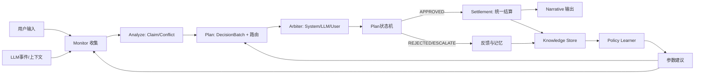

# V17 大脑重构方案 V2.0（交互进化版）

版本：2026-04-20  
作者：Codex + Antigravity 联合评审  
范围：`v17_rebirth`

本文件将当前 V17 的现状与“智能化目标”统一为一套可执行的工程协议，目的是从“规则流水线+LLM输出”升级为“可学习、可仲裁、可演进的智能三方对话系统”。

---

## 0. 目标与验收标准

### 0.1 目标

1. 建立可执行的三方对话闭环：**用户（User）- 系统（System）- LLM（LLM）**。  
2. 防止任何外部模块直接篡改 `ten_gods_runtime`。  
3. 提升冲突处理能力：从“逐条决策”升级为“批次决策 + 冲突仲裁 + 批量提交”。  
4. 所有执行结果可追溯：每条输出都能回到 `claim -> conflict -> plan -> settlement -> residual`。  
5. 为后续学习层打底：让反馈以统一指标入库（LLM评分、人工否决率、冲突残差）。

### 0.2 验收指标（第一轮）

- `snapshot` 输出中必须出现以下字段：`claim_batches`、`conflict_frames`、`plans`。  
- `/v17/action` 的执行路径不再直接调用 `PhysicsKernel.dispatch_perturbation`，只可提交 `PLAN_*` 事件。  
- 同一轮 LLM 反馈不再形成数值爆炸路径；出现异常时应在执行前降级为“上下文模式”。  
- 一条冲突至少有三条可验证信息：`severity`、`routing`、`resolution_state`。  

---

## 1. 当前问题回顾（为什么要重构）

现状已具备一定认知基础（`claim_protocol`、`conflict_detector`、`arbiter_router`、`llm_conflict_arbiter`、`brain_action_router`），但仍有核心缺口：

1. **执行控制权不稳定**：LLM 与用户动作仍可快速通道改世界，缺少统一 Plan 层。  
2. **Plan 缺失**：`claim/conflict` 在快照中存在，但未成为统一会话状态。  
3. **决策粒度过细**：逐条展示/逐条采纳导致同类场景重复处理。  
4. **学习反馈没进入决策核心**：反馈主要落在日志和 admin 侧，未实时反馈给主仲裁路径。  

---

## 2. V2.0 目标架构（MAPE-K + 状态图）



### 2.1 职责边界

- **World Model（世界模型）**  
  物理真值、运行值、叙事值分层读写，绝不被 LLM 直接修改。  
- **Cognition（认知）**  
  冲突检测、冲突分流、批次聚合、候选裁决。  
- **Arbitration（仲裁）**  
  决定 `system` / `llm` / `user` 路由。  
- **Execution（执行）**  
  仅处理 `APPROVED` Plan。  
- **Learning（学习）**  
  只学习策略与路由，不学习直接改变量。  

---

## 3. 数据协议（第一版）

### 3.1 Claim（已存在，补充字段）

- `claim_id: str`
- `plugin_id: str`
- `claim_text: str`
- `claim_type: str`
- `target_god: str`
- `intent_vector: dict[str, float]`
- `priority: float`
- `confidence: float`
- `exclusivity_key: str`
- `severity_hint?: "low" | "mid" | "high"`（新增）

### 3.2 Conflict（已有）

- `conflict_id: str`
- `severity: "P3"|"P2"|"P1"`
- `conflict_type: str`
- `claims: list[str]`
- `recommended_arbiter: "system"|"llm"|"user"`
- `resolution_status: "open"|"resolved_system"|"queued_llm"|"queued_user"`

### 3.3 新增：DecisionBatch（聚合决策单元）

`DecisionBatch` 代表一组可讨论的主张，作为计划输入单元。

- `batch_id: str`
- `bucket: "system"|"llm"|"manual"`
- `target_god: str`
- `source_anchor: str`（如 `exclusivity_key`）
- `source_families: str[]`
- `decision_ids: str[]`
- `net_impact_ratio: float`
- `max_priority: float`
- `prompt_line: str`
- `labels: str[]`
- `routing_hint: "system"|"llm"|"user"`（可覆盖）

### 3.4 新增：DecisionBrainPlan（主脑计划）

- `plan_id: str`
- `session_id: str`
- `anchor: str`
- `batch_ids: str[]`
- `routing: "system"|"llm"|"user"`
- `status: "DRAFT"|"AWAIT_REVIEW"|"APPROVED"|"REJECTED"|"COMMITTED"|"FAILED"`
- `creator: "system"|"llm"|"user"`
- `impact_summary: dict`（按十神聚合）
- `created_at: str`
- `updated_at: str`
- `residual_estimate: float`
- `meta: dict`

---

## 4. 状态机（核心）

### 4.1 Plan 生命周期

```text
COLLECT -> ROUTE -> PLAN_GENERATED -> REVIEW -> APPROVE / REJECT -> COMMIT -> SETTLED
                             \-> ESCALATE_TO_USER / ESCALATE_TO_LLM
```

### 4.2 事件类型（/v17/action）

- `PLAN_SUBMIT`：前端/系统提交 plan 变更（含 batch_id 或 plan_id）。  
- `PLAN_APPROVE`：用户确认一组 plan。  
- `PLAN_REJECT`：用户否决一组 plan。  
- `PLAN_ESCALATE`：将冲突计划升级至高级路由。  

> 当前暂不直接移除现有 `ACTION_TAKEN` 兼容，作为降级路径保留，后续版本清理。

---

## 5. 安全护栏（第一阶段必做）

1. **计算隔离**
   - 插件与 LLM 只产出 `proposal`，不得直接写 `ten_gods_runtime`。  
2. **统一结算链**
   - 一轮只提交 `Plan`，在执行层一次结算。  
3. **数值约束**
   - 结算前执行 `proposal 聚合`，`log-space` 或 `clip+projection`，再回映射。  
4. **异常级联保护**
   - 连续3轮剧烈波动自动降权（damping + 冲突冻结）。  
5. **日志可追溯**
   - 每次执行必须保留 `plan_id` 与 `conflict_id` 关联。

---

## 6. 第一阶段实施清单（本轮开始）

### Phase A：协议先行（本回合）
1. 新建 `DecisionBrainPlan` 与 `DecisionBatch` 的统一 schema 文档化。  
2. `snapshot` 增加 `decision_brain_state`、`plan_queue`、`conflict_frames` 的展示入口。  
3. `/v17/action` 引入 `action_plan` 兼容字段与路由分支（仍保留旧路径）。  

### Phase B：执行解耦（紧随其后）
1. 旧 `ACTION_TAKEN` 改为默认提交 `PLAN_SUBMIT`。  
2. `PLAN_APPROVE` 触发统一结算入口（单次批量）。  
3. `PLAN_REJECT` 仅更新状态并记录 `user_feedback`.  

### Phase C：学习闭环（V2.1）
1. 把 `conflict_resolution` 与 `decision_feedback` 落入同一 `knowledge_store`。  
2. 根据决策残差更新 `arbiter_router` 的推荐优先级。  
3. 输出“推荐路由置信度曲线”供管理面展示。  

---

## 7. 测试与验收

### 7.1 单元测试

- 生成式：`claim -> batch -> conflict -> plan -> status` 生命周期完整性。  
- 保护：并发提交同一批计划不得双提交/双结算。  
- 回退：非法 `plan` payload 时返回失败 + 仍可流转到叙事。  

### 7.1.1 智能提交补充

- `PLAN_SUBMIT` 在 `routing=system` 时直接执行一次批量 `PLAN_APPROVE`，并写入 `COMMITTED`。
- 其余 `routing`（`llm`/`user`）保持审阅态，写 `AWAIT_REVIEW`，由用户或模型裁决后再执行。
- 每个 `PLAN_SUBMIT` 持久化 `routing_reason/routing_policy/routing_features`，作为智能裁决可解释性输入。

### 7.2 集成测试

- `stream_v17 -> snapshot -> decision inbox -> plan approve -> commit` 一条链路。  
- LLM 反馈含冲突时不直接改 runtime。  
- `ActionInterruptDuringStream` 不得丢失 plan 锁定状态。  

---

## 8. 里程碑

- **Sprint 1（本回合）**：文档统一 + action plan 协议兼容接入。  
- **Sprint 2**：plan 执行改造，完成单轮自动批次提交。  
- **Sprint 3**：冲突仲裁路由权重反馈闭环，逐步弃用高风险直接行动。  

---

## 9. 风险清单

1. 前端与后端信号名切换可能导致锁定机制抖动。  
2. 批次分组规则变化影响现有 UI 预期。  
3. 过早上 production 的新路由会导致吞吐抖动。  

应对策略：第一阶段开启灰度，保留 `ACTION_TAKEN` 旁路，但标记为降级路径。
