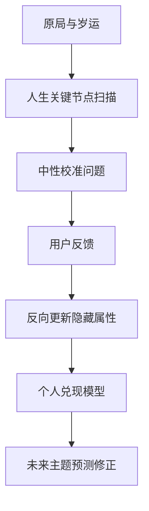

# V17 隐藏属性与人生节点校准设计

Date: 2026-04-26
Status: Design Draft

上位约束：

- [V17 Evidence Chain Learning System](V17_EVIDENCE_CHAIN_LEARNING_SYSTEM_2026-04-25.md)
- [V17 LLM Collaboration Layer](V17_LLM_COLLABORATION_LAYER_2026-04-25.md)
- [V17 财富密码插件设计](V17_WEALTH_CODE_PLUGIN_2026-04-26.md)

## 1. 核心判断

八字和岁运可以给出路径、触发点和概率，但不能完全决定现实如何兑现。

同样一个财富触发年份，两个人的结构置信度可能都是 60%，但现实结果可能完全不同：

- 一个人遇到贵人、订单、平台机会。
- 一个人遇到投入、拖款、合作消耗。
- 一个人机会和风险同时放大。
- 一个人几乎没有明显变化。

这就是同盘异命问题。V17 需要新增“隐藏属性层”解释：

```text
同样的命理信号，为什么这个人更容易向好兑现、向坏兑现、放大，或被压平。
```

## 2. 插件定位

新增两个插件：

```text
v17.life_event_node_scan.v1
v17.latent.personal_modifier.v1
```

以及一个对话合同：

```text
v17.latent.calibration_dialogue.v1
```

链路：



## 3. 隐藏属性字段

第一版字段：

| 字段 | 中文名 | 含义 | 初始值 |
|---|---|---|---|
| `base_luck_index` | 基础顺势值 | 同样信号下，更容易向机会侧还是风险侧兑现 | 50 |
| `positive_amplification` | 机会放大系数 | 好机会出现后能否明显放大 | 1.0 |
| `negative_amplification` | 风险放大系数 | 风险出现后是否容易滚大 | 1.0 |
| `event_volatility` | 事件波动值 | 人生变化是大起大落还是平缓推进 | medium |
| `topic_bias` | 主题兑现偏向 | 财富、事业、感情、家庭、迁移、健康管理哪个领域更容易兑现 | neutral |
| `carrying_capacity` | 承接力 | 机会来了以后是否接得住 | 0.5 |
| `recovery_capacity` | 修复力 | 风险发生后是否能恢复 | 0.5 |

这些值不代表“命好/命坏”，只代表历史上命理信号进入现实后的兑现倾向。

## 4. 人生关键节点扫描

`v17.life_event_node_scan.v1` 负责扫描过去和未来的重要节点。

它读取：

- 原局。
- 大运。
- 流年。
- L0 象义。
- 十神路径。
- 体用状态。
- 格局、盲派、象法、调候。
- 宏观主题层。
- 财富、事业、感情、性格等专题画像。

它输出：

```json
{
  "contract": "v17.life_event_node_scan.v1",
  "nodes": [
    {
      "year": 2019,
      "window": "2018-2019",
      "themes": ["wealth", "career"],
      "macro_image": "平台任务、收入机会、合作压力",
      "direction": "opportunity | risk | double_edged | structural_change",
      "strength": 0.0,
      "confidence": 0.0,
      "trigger_sources": ["luck", "flow", "wealth_path", "vault"],
      "question_candidate": "string",
      "evidence": []
    }
  ]
}
```

重要边界：

- 健康只能表达为健康管理、压力、作息、体力负荷、恢复能力。
- 不做医疗诊断。
- 不用恐吓式问题诱导用户。

## 5. 校准对话设计

系统不直接问：

```text
你是不是那年破财？
```

而是中性提问：

```text
系统看到 2018-2019 附近有事业/财富变化信号。
这段时间你更接近哪一种？

A. 收入、职位、项目机会明显变好
B. 有机会，但伴随压力、投入或反复
C. 明显破耗、合作问题或现金流压力
D. 没有明显变化
E. 记不清 / 不方便回答
```

对话原则：

- 每次只问一个节点。
- 每个节点最多 3 个追问。
- 用户可以跳过。
- 不把用户反馈包装成命理定论。
- 不让 LLM 根据用户反馈自由改八字规则。

## 6. 反向更新逻辑

第一版不需要复杂机器学习，可以使用可解释贝叶斯更新。

示例规则：

| 系统原始信号 | 用户反馈 | 更新方向 |
|---|---|---|
| 机会强 | 明显变好 | `base_luck_index` 上调，`positive_amplification` 上调 |
| 机会强 | 有机会但没接住 | `carrying_capacity` 下调，保留机会识别 |
| 机会强 | 明显破耗 | `base_luck_index` 下调，`negative_amplification` 上调 |
| 风险强 | 无明显坏事 | `negative_amplification` 下调，`recovery_capacity` 上调 |
| 双刃强 | 先坏后好 | `event_volatility` 上调，`recovery_capacity` 上调 |
| 强信号 | 完全没事 | `event_volatility` 下调，或标记出生时辰/规则需复核 |

内部保留每次更新的证据：

```json
{
  "calibration_event_id": "string",
  "before": {},
  "after": {},
  "delta": {},
  "reason": "用户反馈 2018-2019 事业财富节点明显向好兑现",
  "confidence": 0.0,
  "manual_review_required": false
}
```

## 7. 输出合同草案

```json
{
  "contract": "v17.latent.personal_modifier.v1",
  "chart_fingerprint": "string",
  "calibration_state": "uncalibrated | weak | moderate | strong",
  "sample_count": 0,
  "base_luck_index": {
    "value": 50,
    "confidence": 0.0,
    "evidence": []
  },
  "positive_amplification": {
    "value": 1.0,
    "confidence": 0.0,
    "evidence": []
  },
  "negative_amplification": {
    "value": 1.0,
    "confidence": 0.0,
    "evidence": []
  },
  "event_volatility": {
    "value": "low | medium | high",
    "confidence": 0.0,
    "evidence": []
  },
  "topic_bias": {
    "wealth": 0.0,
    "career": 0.0,
    "relationship": 0.0,
    "health_management": 0.0
  },
  "carrying_capacity": {
    "value": 0.5,
    "confidence": 0.0
  },
  "recovery_capacity": {
    "value": 0.5,
    "confidence": 0.0
  },
  "guardrails": [
    "personal_modifier_does_not_modify_chart_rules",
    "user_feedback_updates_only_this_user",
    "do_not_label_user_as_lucky_or_unlucky"
  ]
}
```

## 8. 对财富预测的影响

原始财富判断：

```text
2029 年财富路径被触发，偏机会，同时伴随合作和现金流风险。
```

加入隐藏属性后：

```text
结合你的历史校准，你在类似年份里机会兑现率偏高，但风险也容易被放大。
所以 2029 年不适合当作普通年份处理：机会可能更大，但合同、账期、合作分配必须提前做清楚。
```

如果校准不足，则必须说明：

```text
目前你的历史校准样本还不够，这一年只能按命理结构给出参考，暂不做个人放大修正。
```

## 9. 隐私与治理

用户反馈属于个人校准数据。

必须遵守：

- 只更新该用户的 `personal_modifier`。
- 默认不进入全局规则。
- 若要作为命理案例，需要用户授权或匿名化。
- ChatGPT 5.5 等外部分析师模型只能使用匿名、脱敏、摘要后的案例。
- 本地 LLM 可用于对话生成，但仍需结构化校验。

## 10. 验收标准

第一版验收：

- 可以扫描过去 10-20 年关键节点。
- 可以生成中性、非诱导的校准问题。
- 可以记录用户反馈。
- 可以基于反馈更新隐藏属性。
- 未来财富预测可以读取隐藏属性，但在样本不足时保持中性。

长期验收：

- 能解释同盘异命的部分差异。
- 能让系统预测从“固定断语”升级为“结构概率 + 个人兑现倾向”。
- 命理师能审计每次隐藏属性更新的来源和理由。
