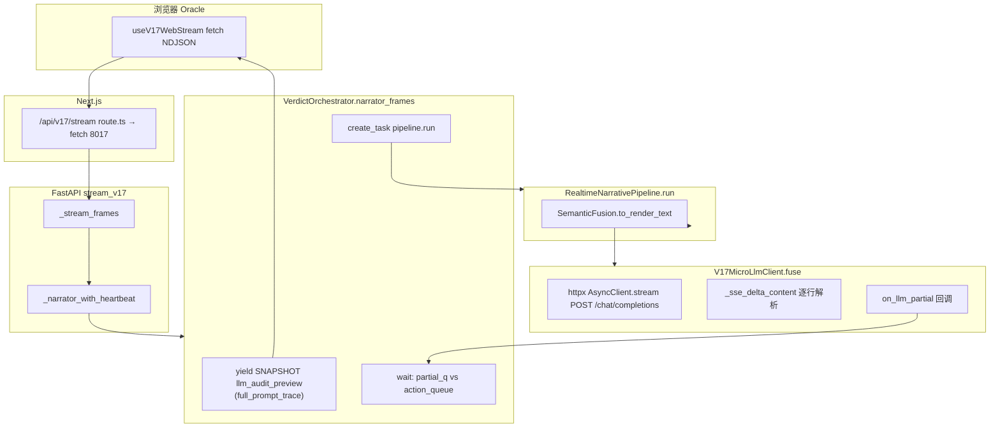

# V17 Oracle：LLM「无返回」深度审查报告

**文档版本**：2026-04-17  
**审查范围**：`v17_rebirth` 内从浏览器到 `fuse()` 的完整叙事链路（含 Next 代理、FastAPI NDJSON、编排器、Pipeline、SemanticFusion、Httpx 流式解析）。  
**结论摘要**：界面上的 **System/User 与 `full_prompt_trace` 可以完整**，而 **「模型正文 / Raw SSE」长期为空**——二者在架构上 **并非同一数据源**；无返回多数情况下是 **上游 LLM 未就绪、超时熔断、流格式解析未命中、或编排层丢弃空串**，而非「前端没接到流」。

---

## 1. 执行摘要

| 现象 | 技术含义 |
|------|-----------|
| 六柱、插件、SNAPSHOT 正常 | 物理核与 `snapshot_frame` 正常；与 LLM 无关。 |
| 因果面板里已有 System/User | 来自 **`SNAPSHOT` / `llm_audit_preview`**（`compute_llm_audit_preview`），在 **`pipeline.run()` 之前** 即下发，**不依赖 LLM HTTP**。 |
| 「正在连接叙事引擎」很久 | 历史上 `NARRATOR` 依赖 **`on_llm_partial` → partial_q`** 或终帧；首字前若无 partial，UI 会长期停在连接态。**V17.18+**：`fuse()` 在 **`raise_for_status()` 之后** 会先发一条占位 partial（「织造已启封…」），便于立刻退出纯「连接中」。 |
| `llm_reply` / Raw 为空 | **`fuse()` 未成功累积可解析的增量文本**，或失败路径里 `llm_reply` 故意留空、或编排层对空 `render_text` 未再下发说明帧（历史问题，见 §6）。 |

**最可能根因（现场优先级）**：

1. **Ollama / OpenAI 兼容端未监听或模型未拉取**（默认 `http://127.0.0.1:11434/v1` + `llm_node.json` / 环境变量中的 `model`）。  
2. **首字 TTFT 或行间空闲熔断**（默认首包预算 **`QIAZHI_V17_LLM_TTFT_SEC`≈20s**；行间读行上限 **`QIAZHI_V17_SSE_STALL_SEC` 默认 30s**），慢机/大模型仍可能触顶；若 **`QIAZHI_V17_FUSE_HARD_SEC`** 过小会与外层 `outer_fuse_sec` 叠加误杀（代码侧已与 TTFT 对齐下限）。  
3. **流式 JSON 形态与解析器不一致**（仅当 `delta.content` / 已扩展字段均无时，表现为「有 HTTP 200 与行，但 acc 始终为空」）。  
4. **Next 代理 `V17_BACKEND_INTERNAL_URL` 错误** → 流未建立；前端若未提示 HTTP 错误，会表现为「只有缓存或旧帧」类困惑（已在 `useV17WebStream` 增强 HTTP 失败提示）。

---

## 2. 端到端调用链（深度）

### 2.1 数据面分层



**要点**：`AUD` 与 `HTTP` 是 **并行语义上的先后**——审计帧 **保证早于** `pipeline.run()` 内对 `fuse()` 的调用，因此 **审计区「有字」不能推出 LLM 已成功**。

### 2.2 关键文件与符号

| 环节 | 路径 | 职责 |
|------|------|------|
| 前端拉流 | `frontend/hooks/useV17WebStream.ts` | `fetch` NDJSON；过滤 `HEARTBEAT`；HTTP 失败时追加说明 `NARRATOR`（近期增强）。 |
| Next 代理 | `frontend/app/api/v17/stream/route.ts` | 转发至 `V17_BACKEND_INTERNAL_URL`（默认 `http://127.0.0.1:8017`）；`force-dynamic`；`X-Accel-Buffering: no`。 |
| 路由与泵 | `backend/api/stream_v17.py` | `_stream_frames`：物理 `SNAPSHOT` + `narrator_frames`；`ActionInterruptDuringStream` 重启循环。 |
| 编排 | `backend/services/verdict_orchestrator.py` | 预发审计帧；`create_task(pipeline.run)`；`partial_q` 与 `action_queue` 竞态；**`pipeline.run(..., action_queue=None)`** 避免与 fuse 双消费队列。 |
| 融合 | `backend/narrative/semantic_fusion.py` | `clean_fragments` 为空则 **直接 `("", {})`**，**不会调用** `fuse()`。 |
| LLM | `infrastructure/llm_micro_client.py` | `fuse()`：Httpx 流式、`wait_for` 熔断、`_sse_delta_content` 解析、`_pack_llm_meta` / `transport_safe_llm_meta`。 |
| 配置 | `infrastructure/llm_bridge.py` | `resolve()`：`base_url`、`model`、`http_timeout_sec`、`fuse_wait_timeout_sec` 等。 |
| 运行时配置 | `v17_rebirth/.runtime/llm_node.json` | 覆盖默认 Ollama 地址与模型名。 |

---

## 3. `fuse()` 内部：何时算「有返回」、何时算「失败」

### 3.1 成功路径

1. `httpx` 可用：`POST {base_url}/chat/completions`，`stream: true`。  
2. `resp.raise_for_status()` 通过。  
3. **占位 partial**：若提供 `on_llm_partial`，立即 `await on_llm_partial("「织造」已启封，候引擎吐字…")`（不计入 `acc`，仅改善连接态 UX）。  
4. `aiter_lines()` 每次读行受 **`asyncio.wait_for(..., timeout=...)`** 约束（`stall = _sse_line_idle_sec()`，默认 **30s**，可由 **`QIAZHI_V17_SSE_STALL_SEC`** 覆盖，范围 5–120）：  
   - 首字前：单次等待 `min(剩余 TTFT 预算, stall)`。  
   - 首字后：每行最长 **stall**。  
5. `_sse_delta_content(line)` 返回非空片段 → 追加 `acc` → 调 `on_llm_partial`（驱动前端流式 `NARRATOR`）。  
6. 流结束 → `"".join(acc).strip()` 非空 → 返回 `ok: true` 的 `llm_meta`（含 `llm_reply`、截断后的 `raw_json`）。

### 3.2 失败但仍「有字典返回」（易误判为「无返回」）

- **HTTP 4xx/5xx**：`raise_for_status()` 抛错 → 进入 `except`，返回 **`text` 为 `[叙事引擎重连中][ERROR_ID] ...`**，`ok: false`，**`llm_reply` 可能为空字符串**（见 `_pack_llm_meta` 调用处传 `llm_reply=""`）。  
- **`asyncio.wait_for` 外层**：`outer_fuse_sec = min(120, max(max(_fuse_hard_sec(), ttft+2), ttft+15, 45))` → 默认整段 fuse 约 **45s** 量级起跳（仍受 `QIAZHI_V17_FUSE_HARD_SEC` 与 TTFT 影响）；勿再按旧文档「恒 10s」理解。  
- **TimeoutError（首字 / 行间）**：`llm_meta.extras` 中带 `ttft_break` 或 `sse_line_idle_sec`。  
- **流结束但 `acc` 全空**：走 **`_fuse_urllib_fallback`**（非流式），若仍空则上层 `render_text` 可能为空。

### 3.3 解析层：为何「有 SSE 行」却拼不出正文

解析入口：`_sse_delta_content` → `_chunk_text_from_chat_blob`。

当前逻辑（审查时点）会从 OpenAI 兼容结构中依次尝试：

- `choices[0].delta.content`  
- `choices[0].delta.reasoning_content` / `reasoning`  
- `choices[0].message.content`  
- 顶层 `response`（偏 Ollama 原生 NDJSON 形态）

若上游 **既不换行又长期不闭合**、或使用 **非 JSON 行协议**，`aiter_lines()` 会在单行上阻塞直至 **stall（默认 30s）** 空闲熔断或连接错误——表现为间歇性失败或超时。

---

## 4. 编排层：`render_text` 为空时的历史行为与风险

`SemanticFusion.to_render_text`：

- `clean_fragments` 过滤后若无行 → **`("", {})`**，`fuse` **不被调用**。原因：插件事实经 `NarrativeSanitizer` 后全部被剔除（极少见）。

`VerdictOrchestrator.narrator_frames`（审查结论）：

- 若 `pipeline.run()` 返回帧中 **`render_text.strip()` 为空**，历史上曾 **`return` 且不 `yield` 任何 `NARRATOR`** → 前端长期 **`!narratorHasChunk`**，与「LLM 无返回」观感一致。  
- **已修复方向**：对空串改为 **`yield` 一条说明性 `NARRATOR`**，并带 `llm_meta.empty_pipeline_render` 等标记，便于区分「真无模型」与「连接中」。

---

## 5. 超时与熔断参数矩阵（运维必读）

| 参数 / 常量 | 默认值（代码或 env） | 作用 |
|-------------|---------------------|------|
| `QIAZHI_V17_LLM_TTFT_SEC` | `20.0` | 首字（首段可解析正文增量）总预算。 |
| `QIAZHI_V17_SSE_STALL_SEC` | `30` | 相邻两行 SSE 读间隔上限（`_sse_line_idle_sec()`，范围 5–120）。 |
| `QIAZHI_V17_FUSE_MAX_TOKENS` | `512` | 叙事织造请求体 `max_tokens` 默认；可用 env 上调/下调。 |
| `QIAZHI_V17_FUSE_HARD_SEC` | `10.0` | 与 `ttft+2` 取 max 参与 **`outer_fuse_sec`** 下限堆叠（实现为 `max(hard, ttft+15, 45)` 等与 TTFT 对齐，避免 TTFT=20 仍被 10s 外层掐死）。 |
| `http_timeout_sec`（`llm_node.json`） | 默认桥接 `15` | Httpx `Timeout` 读写侧上限之一。 |
| `fuse_wait_timeout_sec` | 默认 `30` | 与非 httpx 路径等相关，参与 meta。 |

**叠加效应**：冷启动大模型时，**首字超过 TTFT 预算** 或 **两行之间超过 stall 无新行**，都会触发熔断并走「重连中」文案；编排层对空 `render_text` 应始终有说明性 `NARRATOR`（见 §4）。

---

## 6. 客户端可见 `llm_meta` 与「脱敏」

`transport_safe_llm_meta`：若整包 meta 的 JSON 被判定 **疑似含密钥**（正则匹配 `sk-`、`Bearer ` 等），则 **`llm_raw_response_json` 可被替换为 `[REDACTED: ...]`**，部分字段收缩。  

**症状**：「Raw 为空或被 REDACTED」不一定等于「没打到模型」，需结合 **`error` / `error_id` / `engine_state` / `ok`**。

---

## 7. 复现与排查清单（按顺序执行）

1. **直连后端健康**  
   `curl -sS -m 3 http://127.0.0.1:8017/health`

2. **直连 Ollama OpenAI 兼容**  
   `curl -sS http://127.0.0.1:11434/v1/models`  
   确认目标 **`model`** 已在列表或可被 `pull`。

3. **最小 chat 请求**（替换 `MODEL`）  
   ```bash
   curl -sS http://127.0.0.1:11434/v1/chat/completions \
     -H "Content-Type: application/json" \
     -d '{"model":"MODEL","messages":[{"role":"user","content":"hi"}],"stream":true,"max_tokens":16}'
   ```
   观察是否 **`data:`** 行、`choices[0].delta.content` 是否递增。

4. **核对运行时配置**  
   读取 `qiazhi/v17_rebirth/.runtime/llm_node.json` 中的 `base_url`、`model` 是否与步骤 2–3 一致。

5. **Next 生产/本地双端**  
   若前端走 `/api/v17/stream`，检查环境变量 **`V17_BACKEND_INTERNAL_URL`** 是否指向 **实际监听 8017 的主机**（Docker / 局域网常见踩坑）。

6. **后端日志**  
   `fuse` 入口会 `[V17-WILL] ... Dispatching to <model>`（`llm_micro_client._log_will_dispatch`）；无此行则未进入 httpx 主路径或进程非预期。

---

## 8. 根因归纳表（面向排障）

| 根因 | 典型信号 | 验证 |
|------|-----------|------|
| Ollama 未起 / 端口错 | `connect` 超时、`raise_for_status` 失败 | `curl` models |
| 模型名错误 / 未 pull | HTTP 4xx，错误 JSON | `ollama pull` / API 返回 body |
| TTFT 过长 | `ttft_break`、`ok:false`、短耗时后失败 | 调大 `QIAZHI_V17_LLM_TTFT_SEC` 或换小模型 |
| 行间生成间隔 > stall 无换行 | `sse_line_idle_sec` 相关 meta | 调大 **`QIAZHI_V17_SSE_STALL_SEC`** 或换流式更「碎」的提供商 |
| 整段 fuse > outer | `fuse_hard_circuit` 文案 | 调大 `QIAZHI_V17_FUSE_HARD_SEC` 或优化上游速度 |
| 解析形态不匹配 | HTTP 200、Raw 有行但 `acc` 仍空 | 抓一条 SSE 行对照 `_chunk_text_from_chat_blob` |
| `clean_fragments` 全空 | 无 `fuse` 调用 | 检查 sanitizer 与插件输出 |
| 编排空串直接 return（历史） | 仅有审计 SNAPSHOT，无 `NARRATOR` | 升级含「空串说明 `NARRATOR`」的版本 |
| Next 代理指错后端 | HTTP 502/000；前端有错误 `NARRATOR`（增强后） | 环境变量与端口 |

---

## 9. 建议（短中期）

1. **可观测性**：在 `fuse` 失败返回中 **保证** `error` 为人类可读摘要（脱敏前提下），并在 orchestrator 空串分支 **始终** 下发 `NARRATOR`（已实现方向）。  
2. **配置**：文档化 **`llm_node.json` 与 env 的优先级**（见 `V17LlmBridge.resolve`）。  
3. **超时**：**`QIAZHI_V17_SSE_STALL_SEC`** 已接入；`outer_fuse_sec` 与 TTFT/硬熔断在代码中对齐，可按机器再调 **`QIAZHI_V17_FUSE_HARD_SEC` / `QIAZHI_V17_LLM_TTFT_SEC`**。  
4. **集成测试**：CI 中对 `11434` mock 一段最小 SSE，断言 `acc` 非空与首帧审计顺序。

---

## 10. 附录：相关符号速查

- `qiazhi/v17_rebirth/infrastructure/llm_micro_client.py`：`fuse`, `_stream_once`, `_sse_delta_content`, `_chunk_text_from_chat_blob`, `_fuse_ttft_sec`, `_fuse_hard_sec`, `_sse_line_idle_sec`, `_fuse_max_tokens_default`  
- `qiazhi/v17_rebirth/backend/services/verdict_orchestrator.py`：`narrator_frames`, `compute_llm_audit_preview`（经 pipeline）  
- `qiazhi/v17_rebirth/backend/narrative/pipeline.py`：`run`, `compute_llm_audit_preview`  
- `qiazhi/v17_rebirth/backend/narrative/semantic_fusion.py`：`to_render_text`  
- `qiazhi/v17_rebirth/backend/api/stream_v17.py`：`_stream_frames`, `_narrator_with_heartbeat`

---

**报告结束。** 若需把某一类失败（仅 TTFT、仅解析、仅代理）做成自动化探针脚本，可在后续迭代中单独立项。
