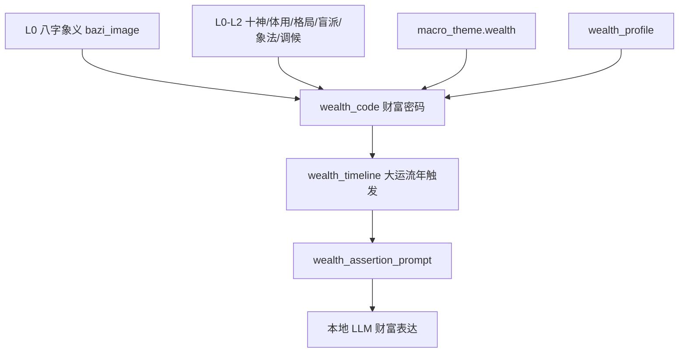

# V17 财富密码插件设计

Date: 2026-04-26
Status: Design Draft

上位约束：

- [V17 主题解码器与财富画像合同](V17_TOPIC_DECODER_AND_WEALTH_PROFILE_2026-04-26.md)
- [V17 L0 八字象义层设计](V17_SYMBOLIC_BAZI_IMAGE_LAYER_2026-04-26.md)
- [V17 Evidence Chain Learning System](V17_EVIDENCE_CHAIN_LEARNING_SYSTEM_2026-04-25.md)
- [V17 LLM Collaboration Layer](V17_LLM_COLLABORATION_LAYER_2026-04-25.md)

## 1. 核心判断

`wealth_profile` 已经能生成财富主题摘要，但它还不是“财富密码”。真正的财富判断不能停在“财星强弱”或“财富主题活跃”，而要回答：

```text
钱从哪里来？
谁把钱引出来？
靠什么变现？
谁接住钱？
哪里漏钱？
什么时候被触发？
```

因此新增专题插件：

```text
v17.topic.wealth_code.v1
```

它是财富专题的机制解码器，位于 `wealth_profile` 与最终财富断语之间。

## 2. 与现有层的关系



`wealth_profile` 的定位调整为“主题摘要层”；`wealth_code` 才负责找财富路径、变现链路、财库状态和关键年份。

## 3. 财富路径的基本公式

财富路径不等于财星强弱。第一版内部可采用可解释评分：

```text
path_score =
  财源信号
  × 转化链完整度
  × 可用性
  × 承载能力
  × 岁运触发
  - 漏财风险
```

字段解释：

| 因子 | 含义 |
|---|---|
| 财源信号 | 财星、财库、市场资源、项目资源是否存在 |
| 转化链完整度 | 是否有食伤、官杀、印、比劫等把资源转成收入 |
| 可用性 | 财是否在顺侧，是否需要桥接，是否被冲破或受阻 |
| 承载能力 | 日主、印、官、平台、规则、资产结构能否接住 |
| 岁运触发 | 当前大运/流年是否引动财源、变现器或财库 |
| 漏财风险 | 比劫、劫财、冲财、现金流波动、财破印、规则风险等 |

## 4. 第一批财富路径模板

| 路径 ID | 命理标签 | 机制解释 | 用户财富语言 |
|---|---|---|---|
| `direct_wealth` | 财星直取 | 财星显性，资源路径直接 | 直接收入、稳定客户、明确资源 |
| `output_to_wealth` | 食伤生财 | 先输出，再变现 | 靠技能、内容、产品、表达赚钱 |
| `output_controls_pressure` | 食伤制杀 | 用输出能力处理压力和难题 | 靠解决复杂问题、高压任务、难项目赚钱 |
| `wealth_officer_platform` | 财官相生 | 财进入规则、平台、职位 | 靠平台、职位、合同、组织资源获得收入 |
| `wealth_seal_asset` | 财印路径 | 财与知识、资质、IP、保护系统相连 | 靠知识、证书、方法论、长期资产赚钱 |
| `resource_integration` | 比劫合财 | 通过人脉、合伙、同辈资源引财 | 靠合作、团队、资源整合赚钱 |
| `wealth_vault` | 财库 | 财被收藏、沉淀或等待打开 | 资产沉淀、现金池、库存、项目蓄水 |
| `leakage_risk` | 比劫夺财/冲财/财破印 | 财被分走、冲动、消耗或牺牲长期价值 | 合作分账、现金流泄漏、利润被成本吃掉 |

## 5. 食伤制杀路径

内部标签：

```text
output_controls_pressure
classic_label: 食伤制杀
```

识别重点：

- 是否有食伤作为输出、技术、产品、表达能力。
- 是否有官杀作为压力、规则、平台、难题、竞争、风险。
- 食伤是否能有效处理官杀，而不是单纯冲撞规则。
- 财是否能从“解决压力”之后出现。
- 岁运是否引动输出、压力、平台或财源。

用户语言：

```text
你的钱不一定来自轻松机会，更像来自解决别人解决不了的问题。
越是有门槛、有压力、有复杂交付的任务，越可能转成收入。
但这条路不能只靠硬扛，需要把能力做成方法、产品、流程或可复制交付。
```

风险语言：

```text
如果规则、合同、边界没有建好，这类机会容易变成高压消耗。
看起来收入变大，但利润、精力和现金流可能被交付成本吃掉。
```

## 6. 财库模块

财库必须单独建模，不能简单断“有财库就是发财”。

```text
v17.topic.wealth_vault.v1
```

财库输出：

| 字段 | 含义 |
|---|---|
| `has_vault_signal` | 是否存在财库信号 |
| `vault_location` | 原局 / 大运 / 流年 / 宫位 |
| `vault_material` | 库里是什么财或资源 |
| `vault_state` | 静库 / 动库 / 开库 / 合住 / 冲破 / 弱信号 |
| `activation_type` | 进财 / 出财 / 资产转换 / 回款 / 投入 / 现金流波动 |
| `risk_notes` | 开库不是必发财，可能是资金结构变化 |

示例用户语言：

```text
这一年更像资金和资产结构被打开。它可能带来回款、项目启动或资产转换，
但也可能先表现为投入、周转压力或账期变化，不能简单理解成“必进财”。
```

## 7. 大运流年触发

`wealth_code` 需要把大运流年从“分数变化”升级为“路径部件被触发”。

每个年份应标记：

- 是否触发财源。
- 是否触发变现器。
- 是否触发平台/规则。
- 是否触发财库。
- 是否触发漏财点。
- 是否触发承接条件。
- 触发后更像机会、风险、双刃，还是结构变化。

示例：

```json
{
  "year": 2029,
  "triggered_components": [
    "monetization_engine",
    "platform_pressure",
    "cashflow_risk"
  ],
  "plain_summary": "这一年更容易因为复杂项目、平台任务或高门槛客户而带来收入机会，同时要注意合同、账期和交付压力。",
  "confidence": 0.64,
  "risk": 0.46
}
```

## 8. 输出合同草案

```json
{
  "contract": "v17.topic.wealth_code.v1",
  "topic": "wealth",
  "chart_fingerprint": "string",
  "primary_wealth_path": {
    "id": "output_controls_pressure",
    "classic_label": "食伤制杀",
    "score": 0.0,
    "confidence": 0.0,
    "risk": 0.0,
    "plain_name": "靠解决难题赚钱",
    "plain_summary": "string",
    "evidence": []
  },
  "secondary_paths": [],
  "wealth_source": {
    "material": "甲木",
    "plain_source": "长期项目、组织资源、成长型业务",
    "visibility": "exposed | hidden | indirect | weak",
    "location": "year | month | day | hour | luck | flow"
  },
  "monetization_engine": {
    "driver": "output | authority | seal | peer | vault | mixed",
    "plain_driver": "技能输出 / 平台任务 / 知识资产 / 资源整合",
    "chain_integrity": 0.0
  },
  "carrier": {
    "type": "self_capacity | platform | contract | asset | knowledge | team",
    "score": 0.0,
    "requirements": []
  },
  "wealth_vault": {
    "has_vault_signal": false,
    "vault_state": "none | static | activated | locked | broken | weak",
    "activation_type": "none | inflow | outflow | asset_conversion | cashflow_volatility",
    "plain_summary": ""
  },
  "leakage_points": [
    {
      "id": "peer_split",
      "plain_name": "合作分账",
      "risk": 0.0,
      "evidence": []
    }
  ],
  "decade_path_trends": [],
  "flow_year_watchlist": [],
  "evidence_graph": {
    "nodes": [],
    "edges": []
  },
  "llm_boundary": {
    "allowed_inputs": ["wealth_code", "wealth_profile", "wealth_timeline"],
    "forbidden_inputs": ["raw_bazi_free_read"],
    "must_avoid": ["必发财", "无财", "确定金额", "确定年份断死"]
  }
}
```

## 9. 用户表达边界

内部可以保留：

- 食伤制杀。
- 食伤生财。
- 财官相生。
- 财印路径。
- 比劫夺财。
- 财库开合。

用户层默认翻译为：

| 内部术语 | 用户语言 |
|---|---|
| 食伤生财 | 靠技能、内容、产品或表达变现 |
| 食伤制杀 | 靠解决复杂问题和高压任务赚钱 |
| 财官相生 | 靠平台、职位、规则和组织资源赚钱 |
| 财印路径 | 靠知识、证书、方法论或长期资产赚钱 |
| 比劫夺财 | 合作分账、竞争消耗、利润被分走 |
| 财库 | 钱、资产、项目或回款被收藏起来，等待触发 |

## 10. 后台预览与审计

第一阶段不直接上正式 UI，只做后台预览：

- 展示 `primary_wealth_path`。
- 展示财源材质和变现器。
- 展示财库状态。
- 展示漏财点。
- 展示未来十年重点年份。
- 展示 evidence graph。
- 保存 prompt、输入合同、输出合同和模型结果。

普通用户 UI 后续只显示人话摘要：

```text
你的主要赚钱方式
钱从哪里来
靠什么接住
哪里容易漏
当前十年财富主线
未来值得关注的年份
```

## 11. 验收标准

第一版验收：

- 不再把财星强弱直接等同财富成败。
- 能识别至少 6 类财富路径。
- 能单独识别财库状态。
- 能输出未来十年重点年份及其触发部件。
- LLM 只消费 `wealth_code`，不自由读取原始八字。
- 所有判断都有 evidence。

长期验收：

- 命理师能从后台看懂系统为什么说“钱从哪里来”。
- 用户能听懂“自己的赚钱方式、风险和承接条件”。
- 与隐藏属性层结合后，能区分同样财富信号下的不同兑现方向。
