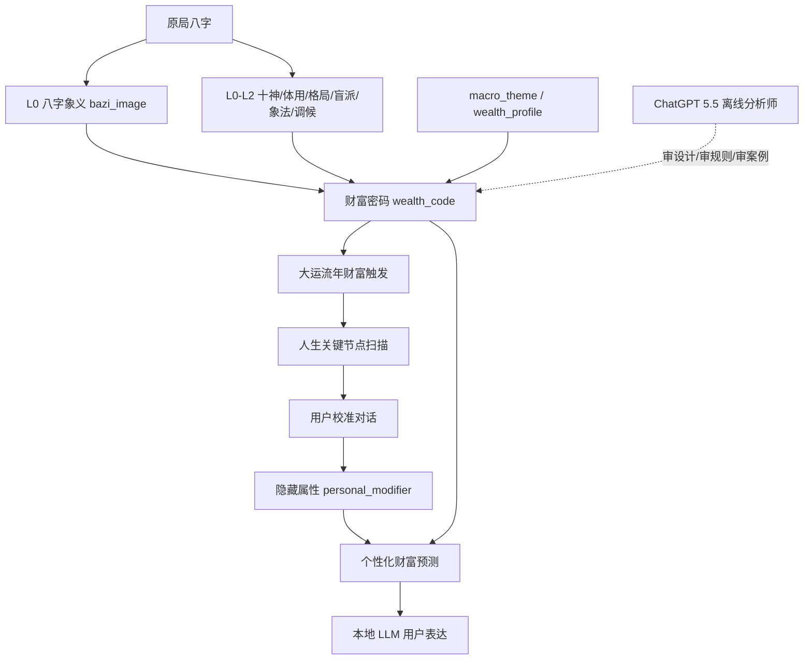

# V17 财富密码系统框架、模型选择与 Roadmap

Date: 2026-04-26
Status: Master Design Draft

相关设计：

- [V17 L0 八字象义层设计](V17_SYMBOLIC_BAZI_IMAGE_LAYER_2026-04-26.md)
- [V17 财富密码插件设计](V17_WEALTH_CODE_PLUGIN_2026-04-26.md)
- [V17 隐藏属性与人生节点校准设计](V17_LATENT_PERSONAL_MODIFIER_AND_CALIBRATION_2026-04-26.md)
- [V17 LLM Collaboration Layer](V17_LLM_COLLABORATION_LAYER_2026-04-25.md)

## 1. 总体目标

V17 财富系统不再只是“财富文案生成器”，而要成为可解释的财富机制推理系统。

目标链路：

```text
L0 八字象义
→ 十神路径与财富材质
→ 财富密码 wealth_code
→ 大运流年路径触发
→ 人生节点校准
→ 隐藏属性修正
→ 个性化财富预测
```

核心问题：

```text
钱从哪里来？
靠什么变现？
如何接住？
哪里漏钱？
什么时候被触发？
这个人历史上更容易向哪边兑现？
```

## 2. 系统总架构



## 3. 分层职责

| 层级 | 插件/模块 | 职责 |
|---|---|---|
| L0 象义 | `v17.symbolic.bazi_image.v1` | 把天干、地支、十神、宫位、藏透转成结构化象义事实 |
| L3 摘要 | `wealth_profile.v1` | 给出财富主题摘要、风险、优势、写作边界 |
| L3 机制 | `v17.topic.wealth_code.v1` | 找财富路径、财源材质、变现器、财库、漏财点 |
| 运流 | `wealth_timeline` | 判断大运流年触发了哪些财富路径部件 |
| 校准 | `v17.life_event_node_scan.v1` | 扫描过去关键节点，生成可询问问题 |
| 隐藏属性 | `v17.latent.personal_modifier.v1` | 反推基础顺势值、放大系数、承接力、恢复力 |
| 表达 | 本地 LLM | 把结构化合同写成用户能懂的财富语言 |
| 分析 | ChatGPT 5.5 | 作为设计师/分析师，辅助规则评审、案例归因、prompt 设计 |

## 4. 模型选择原则

### 4.1 生产主链路：本地 LLM 优先

按当前系统可用模型，生产链路主打：

```text
Gemma 4
Qwen 3.6
```

推荐分工：

| 任务 | 优先模型 | 理由 |
|---|---|---|
| 中文用户表达 | Qwen 3.6 | 中文语感、命理术语到白话转换更适合做主力 |
| 结构化对话追问 | Qwen 3.6 / Gemma 4 | 生成中性问题，按 JSON contract 返回 |
| 二次审校 | Gemma 4 | 检查是否过度承诺、是否冒出禁用术语 |
| 离线批量生成草稿 | 本地模型 | 不出网，成本可控 |

本地模型必须被合同约束：

- 输入只给 `wealth_code`、`wealth_profile`、`personal_modifier` 等结构化合同。
- 不给原始八字自由阅读权限。
- 输出必须经过 JSON Schema 或应用层校验。
- 校验失败时 retry 或降级到模板表达。

### 4.2 ChatGPT 5.5：外部分析师，不做生产裁决

ChatGPT 5.5 可作为“系统设计分析师”使用：

- 审查财富路径模板是否遗漏。
- 帮助整理不同命理派别的规则差异。
- 审阅匿名案例，归因错判原因。
- 优化 prompt 合同和用户语言。
- 生成设计草案、测试样本、命理师审阅清单。

禁止：

- 不直接处理用户原始隐私数据。
- 不直接进入线上断语链路。
- 不直接修改参数、体用、格局、规则权重。
- 不用它的回答证明系统规则正确。

备注：OpenAI 2026-04-24 更新称 GPT-5.5 / GPT-5.5 Pro 已进入 API，并强调复杂真实任务、长程工具工作和分析能力。V17 可把它作为高阶外脑，但生产链路仍优先本地化。

参考：

- [OpenAI GPT-5.5 发布说明](https://openai.com/index/introducing-gpt-5-5/)
- [OpenAI Structured Outputs](https://developers.openai.com/api/docs/guides/structured-outputs)

### 4.3 知识库与检索

命理知识不应让 LLM 临场发挥，应进入版本化知识库：

```text
v17.knowledge.bazi_symbolic_primitives.v1
v17.knowledge.ten_god_semantics.v1
v17.knowledge.wealth_path_templates.v1
v17.knowledge.event_node_patterns.v1
```

检索建议：

| 场景 | 方案 |
|---|---|
| 生产规则匹配 | 结构化规则库，确定性执行 |
| 命理师后台搜索 | 关键词 + 向量混合检索 |
| 本地隐私优先 | 本地 embedding / 本地向量库 |
| 高质量离线研究 | 可选 OpenAI `text-embedding-3-large` 处理脱敏资料 |

OpenAI 官方说明 `text-embedding-3-large` 是其最强 embedding 模型，并支持英文和非英文任务；但生产隐私链路仍建议优先本地检索。

参考：

- [OpenAI text-embedding-3-large](https://developers.openai.com/api/docs/models/text-embedding-3-large)

## 5. 可行性分析

### 5.1 架构可行

当前 V17 已具备基础：

- L0-L3 分层。
- 插件治理。
- evidence bundle。
- snapshot。
- canonical prompt。
- public meta。
- learning family。
- wealth_profile。
- wealth_assertion prompt。
- wealth timeline preview。

新增设计可以在现有结构上增量落地，不需要推翻现有系统。

### 5.2 算法可行

财富密码第一版不需要黑盒机器学习，可以先做可解释规则评分：

```text
路径识别：规则模板
路径评分：可解释加权
财库状态：结构规则
流年触发：路径部件触发
隐藏属性：贝叶斯/计分更新
用户表达：LLM + contract
```

后期再考虑：

- 案例样本足够后训练校准模型。
- 不同命理师风格做 profile。
- topic-specific ranking model。

### 5.3 产品可行

用户最终不需要看术语，只需要看：

```text
你的主要赚钱方式
钱从哪里来
靠什么接住
哪里容易漏
当前十年财富主线
未来值得关注的年份
为什么同样机会你更容易这样兑现
```

命理师后台可以看：

```text
食伤制杀
财库状态
财官/财印/比劫路径
证据图
节点校准
隐藏属性更新记录
```

### 5.4 主要风险

| 风险 | 解决方式 |
|---|---|
| 命理派别差异 | 规则版本化，保留 school_notes |
| LLM 幻觉 | 只给结构化合同，不给原始八字自由读 |
| 用户被诱导反馈 | 校准问题保持中性，不问封闭式断语 |
| 隐藏属性被误解成命好命坏 | 命名为顺势值、放大系数、承接力，不说幸运/倒霉标签 |
| 健康主题高风险 | 只说健康管理、压力、作息、恢复，不做诊断 |
| 过度确定年份 | 输出关注窗口和触发部件，不写绝对事件 |
| 隐私风险 | 本地 LLM 优先，外部分析只用脱敏摘要 |

## 6. Roadmap

### Phase 0：设计固化

目标：

- 落地三份设计文档。
- 对齐 L0 象义、财富密码、隐藏属性边界。
- 明确本地 LLM 与 ChatGPT 5.5 分工。

产物：

- `V17_SYMBOLIC_BAZI_IMAGE_LAYER_2026-04-26.md`
- `V17_WEALTH_CODE_PLUGIN_2026-04-26.md`
- `V17_LATENT_PERSONAL_MODIFIER_AND_CALIBRATION_2026-04-26.md`
- `V17_WEALTH_CODE_SYSTEM_ROADMAP_2026-04-26.md`

### Phase 1：L0 八字象义插件

实现：

```text
v17.symbolic.bazi_image.v1
```

范围：

- 天干象义。
- 地支象义。
- 十神角色 + 天干材质组合。
- 宫位场景。
- 藏透状态。
- 证据输出。

不做：

- 不断吉凶。
- 不接普通用户 UI。
- 不改参数。

### Phase 2：财富路径知识库

实现：

```text
v17.knowledge.wealth_path_templates.v1
```

第一批模板：

- 财星直取。
- 食伤生财。
- 食伤制杀。
- 财官相生。
- 财印路径。
- 比劫合财。
- 比劫夺财。
- 财库路径。
- 财破印。

### Phase 3：wealth_code 后台预览

实现：

```text
v17.topic.wealth_code.v1
```

输出：

- 主财富路径。
- 次财富路径。
- 财源材质。
- 变现器。
- 承接条件。
- 财库状态。
- 漏财点。
- 未来十年触发部件。
- evidence graph。

### Phase 4：大运流年路径触发升级

升级现有 `wealth_timeline`：

- 从“年份分数”升级为“路径部件触发”。
- 每年说明触发了财源、变现器、财库、漏财点还是平台压力。
- 不写绝对金额和死年份。

### Phase 5：人生节点扫描

实现：

```text
v17.life_event_node_scan.v1
```

范围：

- 过去 10-20 年节点。
- 财富、事业、感情、家庭、迁移、健康管理等宏观主题。
- 每个节点生成中性问题。

### Phase 6：隐藏属性校准

实现：

```text
v17.latent.calibration_dialogue.v1
v17.latent.personal_modifier.v1
```

范围：

- 用户反馈采集。
- 反向更新基础顺势值。
- 更新机会/风险放大系数。
- 更新承接力和恢复力。
- 保存每次更新证据。

### Phase 7：用户侧财富体验升级

在命盘主页面财富模块中展示：

- 你的主要赚钱方式。
- 钱从哪里来。
- 靠什么接住。
- 哪里容易漏。
- 当前十年财富主线。
- 未来值得关注的年份。
- 历史校准不足时明确提示“仅按结构参考”。

### Phase 8：学习治理与案例库

将命理师反馈和用户授权案例进入：

- benchmark candidate。
- counterexample。
- boundary case。
- shadow run。
- scorecard。

但仍保持：

```text
反馈不直接改参数。
案例不直接改规则。
LLM 不直接发布配置。
```

## 7. 建议下一步

下一步建议先实现 Phase 1：

```text
v17.symbolic.bazi_image.v1
```

原因：

- 它是财富密码、事业路径、感情路径的共同底座。
- 不碰体用，不碰参数，风险低。
- 能马上改善财富插件“只见十神、不见象”的问题。
- 后续所有专题插件都能复用。

Phase 1 完成后，再进入财富路径知识库和 `wealth_code` 后台预览。
