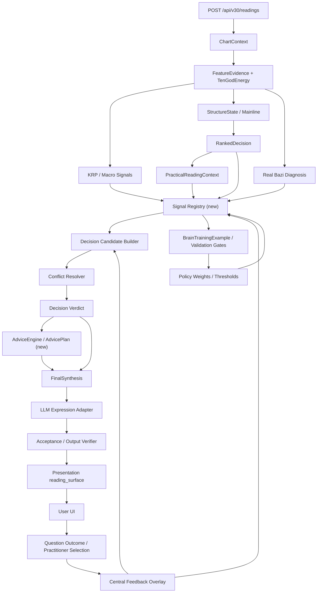

# V30 ChatGPT 交接包：Production Orchestrator 与模块产出审计

更新时间：2026-06-29

## 这份文档的用途

这份文档用于把我们和 ChatGPT 讨论的“产出编排层 / Production Orchestrator”问题，落到 V30 当前真实代码和框架上。

ChatGPT 给出的方向是对的：V30 不是缺模块，而是大量模块还没有被稳定组织成用户侧可消费的 `Verdict / Advice / Explanation`。但 ChatGPT 不了解当前 V30 已经完成的 Decision-Centered Architecture、Central Brain V2、StagePoint、Text-to-Option、训练和 518K 验证，所以后续讨论必须基于本审计，而不是重新设计一个抽象系统。

本文件回答七个问题：

- 当前一次八字测算到底从哪里进入 runtime。
- 用户最终看到的结论和建议来自哪些模块。
- LLM、中枢大脑、Decision Engine 各自负责什么。
- 哪些模块已经进入 runtime 产出链路，哪些只是训练、验证、调试或候选。
- 当前是否已经存在 `Signal Registry / DecisionContract / AdviceEngine`。
- 下一步应如何最小重构，避免重写和打补丁。
- 需要把哪些信息交给 ChatGPT 继续推演。

## 给 ChatGPT 的一句重点

请基于以下真实现状继续讨论，不要从零设计：

```text
V30 已经有 ChartContext、FeatureEvidence、DiagnosisClaim、DecisionCandidate、DecisionVerdict、FinalSynthesis、LLM expression boundary、BrainTrainingExample、StagePoint、Text-to-Option 和 518K 验证。

当前瓶颈不是“没有中枢大脑”，也不是“没有规则/画像/路径模块”，而是缺一个明确的 Production Orchestrator + Signal Registry，把所有模块产出的异构素材统一注册、裁决、建议化、解释化，并保证最终用户看到的内容一定能追溯到 Verdict / Advice / Evidence。
```

## 当前测算主链路

真实入口在 `v30/api/app.py`：

- `POST /api/v30/readings` 创建测算。
- `GET /api/v30/readings/{reading_id}/view` 生成用户侧页面模型。
- `GET /api/v30/readings/{reading_id}/thinking` 生成步骤页 / thinking projection。
- `POST /api/v30/readings/{reading_id}/questions/{question_id}/answer` 提交用户回答。
- `POST /api/v30/readings/{reading_id}/questions/{question_id}/answer/llm` 对一轮问答调用 LLM 表达增强。
- `POST /api/v30/readings/{reading_id}/practitioner/selections` 命理师选择分支、降权、待问、备注。

核心 runtime 在 `v30/runtime.py`：

```text
BirthInput / smoke input
-> build_chart_context_from_birth_input / build_chart_context_from_displays
-> create_runtime_from_context
-> FeatureEvidence
-> TenGodEnergyModel
-> KnowledgeRulePortraitSignal / MacroDimensionSignal
-> StructureState / MainlineState
-> RankedDecision
-> PracticalReadingContext
-> RealBaziDiagnosis
-> Question recommendation / dialogue graph
-> CentralReadingState
-> DecisionEngineResult
-> FinalSynthesis
-> AnswerContext / AnswerResult
-> Presentation reading_surface
```

轻量 runtime probe 当前观察结果：

| 输出项 | 当前 smoke runtime 观察 |
|---|---:|
| `FeatureEvidence` | 33 |
| `MacroDimensionSignal` | 7 |
| `MatchedRule` | 47 |
| `DiagnosisFeature` | 33 |
| `DiagnosisPath` | 12 |
| `DiagnosisPortrait` | 64 |
| `DiagnosisClaim` | 80 |
| `DiagnosisGraph.nodes` | 269 |
| `claim_scores` | 18 |
| `DecisionVerdict` | 9 |
| `FinalSynthesis` | ready keys 完整 |
| `reading_surface.final_synthesis` | 已投影到用户侧 |
| `answer_result.source` | 默认可为 `rule_bound_llm_deferred` |

这说明：模块不是空的，问题是产出编排还没有成为第一等架构层。

## 当前谁负责最终断语

当前 V30 已经初步转向 Decision-Centered Architecture：

```text
DiagnosisClaim + claim_scores
-> DecisionCandidate
-> DecisionConflict
-> DecisionVerdict
-> FinalSynthesis
-> LLM expression
-> reading_surface
```

### Decision Engine

代码：`v30/brain/decision_engine.py`

职责：

- 把 `DiagnosisClaim + claim_scores` 转成 `DecisionCandidate`。
- 对同领域候选做冲突检测。
- 生成 `DecisionVerdict`。
- 给出 `assertion_level`：`confirmed / supported / mixed / weak_candidate / blocked`。
- 记录 `allowed_assertions / forbidden_assertions / advice_points / next_question_slots`。
- 输出 feedback recalculation summary。

关键边界：

```text
LLM can rewrite expression only.
LLM cannot create chart facts.
LLM cannot override verdict.
```

### Final Synthesis

代码：`v30/brain/final_synthesis.py`

职责：

- 优先消费 `DecisionVerdict`，而不是直接消费 LLM 长文。
- 生成 `conclusion / advice / customer_summary`。
- 生成 `synthesis_blueprint`：主断语、判断焦点、证据抓手、行动步骤、风险边界。
- 生成 `visual_hint` 和训练信号。

当前用户侧 `reading_surface.final_synthesis` 已包含：

- `conclusion`
- `advice`
- `customer_summary`
- `decision_engine`
- `decision_verdicts`
- `decision_focus`
- `assertion_level`
- `allowed_assertions`
- `action_steps`
- `risk_boundary`
- `evidence_chain`
- `visual_hint`
- `quality_contract`

### LLM

代码：

- `v30/llm/bazi_context.py`
- `v30/llm/client.py`
- `v30/llm/acceptance.py`
- `v30/llm/prompt_registry.py`

职责：

- 读取 role/task 约束后的上下文包。
- 生成用户可读表达。
- thinking mode 可捕获 provider thinking trace，但产品层只展示可控摘要或已验收的推演内容。
- 通过 drift check 和 acceptance gate。

边界：

- 不允许变更排盘事实。
- 不允许把 LLM 文本当事实源。
- 不允许覆盖 Decision Verdict。
- LLM 适合最终表达、解释和对话措辞，不适合最终命理裁决。

### 中枢智能大脑

代码：

- `v30/brain/orchestrator.py`
- `v30/brain/reading_engine.py`
- `v30/brain/dialogue_planner.py`
- `v30/brain/final_synthesis.py`
- `v30/brain/central_feedback_overlay.py`
- `v30/brain/feedback_weight_updater.py`

当前角色：

- 协调 runtime 状态、角色、会话、反馈和训练路由。
- 生成 `CentralReadingState`。
- 维护 evidence graph snapshot、belief state、claim score、VOI dialogue、training example。
- 让用户回答和命理师选择进入权重层，不改命盘事实。
- 触发 final synthesis 和 dialogue plan。

重要结论：

中枢大脑不应该直接凭空下最终命理断语。它应当成为产出编排、状态协调、反馈校准和训练闭环的大脑；最终可消费断语必须经过 `DecisionVerdict`。

## 当前模块到产出的映射表

状态标签说明：

- `output_bound`：已经绑定到用户结果或最终断语链路。
- `runtime_used`：真实测算 runtime 已使用，但不一定直接用户可见。
- `candidate`：有价值，但当前缺少统一产出注册或消费路径不够直接。
- `train_only`：训练链路使用。
- `test_only`：测试 / 验证链路使用。
- `debug_only`：调试 / Admin / trace 使用。
- `partial_orphan`：有代码或输出，但产出责任不清，需要自动扫描确认。

| 模块 | 主要文件 | 当前产出 | 下游消费者 | 用户侧影响 | 状态 | 缺口 |
|---|---|---|---|---|---|---|
| 排盘事实层 | `v30/core/chart_context.py`, `v30/contracts.py` | `ChartContext` | runtime 全链路 | 四柱、日主、时间层边界 | `output_bound` | 已是事实源，不可训练改写 |
| 特征证据编译 | `v30/evidence/compiler.py` | `FeatureEvidence` | rules, diagnosis, KRP, macro, ranked decision | 基础证据、边栏素材、诊断依据 | `output_bound` | 需要进入统一 `BaziSignal` |
| 十神能量模型 | `v30/core/ten_god_energy.py` | `TenGodEnergyModel` | evidence, ranked decision, LLM context | 十神强弱和波动排序 | `runtime_used` | 需要明确转成 signal 和 verdict 权重 |
| 知识/规则/画像 seed | `v30/knowledge/seed_registry.py` | `KnowledgeRulePortraitSignal` | runtime policy_effect | 边界、知识约束 | `candidate` | smoke 里可能为 0，需确认触发覆盖 |
| 宏观领域知识包 | `v30/knowledge/loaders/macro_pack.py` | `MacroDimensionSignal` | portrait, answer, question | 财富/事业/关系等领域映射 | `runtime_used` | 未直接进入 DecisionCandidate |
| 结构与主线选择 | `v30/structure`, `v30/mainline` | `StructureState`, `MainlineState` | ranked decision, diagnosis, UI | 结构主线和路径基础 | `output_bound` | 需要更清楚绑定用神/忌神 signal |
| Ranked Decisions | `v30/practical.py` | strength / structure_pattern / useful_god 候选 | practical, LLM context, central brain | 旺衰、格局、用神候选 | `output_bound` | 当前是候选决策，不是最终 verdict |
| Practical Reading | `v30/practical.py` | `PracticalReadingContext`, domain readings | final synthesis, questions, UI | 领域建议和问题缺口 | `output_bound` | AdviceEngine 尚未独立 |
| 真实八字规则匹配 | `v30/diagnosis/rule_matcher.py` | `MatchedRule` | diagnosis claims, graph | 规则证据和可生成 claim 边界 | `runtime_used` | 未统一注册为 signal |
| 诊断特征抽取 | `v30/diagnosis/feature_engine.py` | `DiagnosisFeature` | claim generator, graph | 可读特征和证据链 | `runtime_used` | 作为中间层，需 signal 化 |
| 做功路径引擎 | `v30/diagnosis/path_engine.py` | `DiagnosisPath` | claim generator, portrait, graph | 做功路径、领域机制 | `runtime_used` | 应成为 Signal Registry 一等源 |
| 画像引擎 | `v30/diagnosis/portrait_engine.py` | `DiagnosisPortrait` | claim generator, graph | 画像、性格/行为/领域倾向 | `runtime_used` | 当前容易变长，需只产候选素材 |
| Claim Generator | `v30/diagnosis/claim_generator.py` | `DiagnosisClaim` | central reading, decision engine | 候选断语素材 | `output_bound` | 当前是 Decision Engine 主要入口，但来源还未统一 |
| Diagnosis Graph | `v30/diagnosis/graph.py` | `DiagnosisGraph` | central reading snapshot, scoring | 证据追踪、路径连贯度 | `runtime_used` | UI 审计可增强 |
| Central Reading Engine | `v30/brain/reading_engine.py` | `CentralReadingState`, claim_scores, final_synthesis | presentation, training, dialogue | 中枢状态和用户结果 | `output_bound` | 需要外接 Production Orchestrator 边界 |
| Decision Engine | `v30/brain/decision_engine.py` | `DecisionInputBundle`, `DecisionVerdict` | final synthesis, LLM context, UI | 最终断语来源 | `output_bound` | 需从 claim-only 扩展到 full Signal Registry |
| Final Synthesis | `v30/brain/final_synthesis.py` | conclusion/advice/blueprint/visual_hint | presentation | 用户结论和建议 | `output_bound` | AdviceEngine 可独立化 |
| Presentation Surface | `v30/presentation/client_model.py` | `reading_surface` | frontend | 页面展示、当前对话、边栏素材 | `output_bound` | UI 需要从素材和 verdict 做简洁投影 |
| Thinking Projection | `v30/presentation/thinking.py` | 7 阶段 journey, sidebar_memory, stage points | UI | 步骤页素材与推演过程 | `output_bound` | 不应混入智能对话导航 |
| StagePoint | `v30/brain/stage_points.py` | 页面要点、证据、建议、训练信号 | thinking, sidebar, TOI | 页面素材列表 | `runtime_used` | 要和 Signal Registry 对齐 |
| Text-to-Option | `v30/brain/text_options.py` | `TextSemanticUnit`, `OptionSet` | practitioner interaction, UI | 命理师选择、用户点击回答 | `runtime_used` | 应消费 signal/verdict，而非任意长文 |
| Practitioner Interaction | `v30/brain/practitioner_interaction.py` | `PractitionerSelection`, overlay | central feedback, Admin replay | 命理师可选分支反馈 | `runtime_used` | 需进入 Decision feedback diff |
| Dialogue Planner | `v30/brain/dialogue_planner.py` | current question, next_action, VOI | reading_surface | 智能追问 | `output_bound` | 应只由 `next_question_slots` 和 VOI 触发 |
| Answer Composer | `v30/answer/composer.py` | `AnswerContext`, rule-bound answer | LLM, presentation | 问答回复 | `output_bound` | 需继续剥离模板化 fallback |
| LLM Context/Client | `v30/llm/*` | context pack, LLM answer draft, thinking summary | answer, stage summary | 用户语言表达 | `runtime_used` | 只能表达，不做事实和最终裁决 |
| LLM Acceptance | `v30/llm/acceptance.py` | acceptance report | LLM output gate | 防漂移、边界控制 | `runtime_used` | 目前对不确定词有边界，需保留证据绑定分支 |
| Training Example | `v30/brain/training_examples.py` | `BrainTrainingExample` | optimizer, store, replay | 不直接用户可见 | `train_only` | 必须明确如何反哺权重 |
| Policy Optimizer | `v30/brain/policy_optimizer.py` | 权重候选策略 | Admin/training | 间接影响 claim scoring | `train_only` | 需要更强质量 diff 和线上追踪 |
| Synthetic Validation | `v30/validation/synthetic_case.py` | suite result | CI/Admin/训练门禁 | 不直接用户可见 | `test_only` | 是质量门，不是产出模块 |
| 518K Validation | `v30/validation/corpus_518k.py` | distribution result/artifact | Admin/gate | 不直接用户可见 | `test_only` | 需要把失败簇映射到模块责任 |
| Admin Diagnostics | `v30/ops`, `v30/api/app.py` admin routes | readiness/status/history | Admin UI | 管理员观察 | `debug_only` | 不应混入用户测算 UI |
| 历史 release/monitoring 模块 | 多个已删除或归档脚本 | release/monitoring 状态 | 无或历史测试 | 无 | `partial_orphan` | 已有清理动作，仍需自动 consumer scan |

## 当前已有概念与缺口

| 概念 | 当前是否存在 | 当前实现 | 判断 |
|---|---|---|---|
| `BaziSignal` | 是 | `v30.production.contracts.BaziSignal` | DCA-14 已有统一信号契约 |
| `Signal Registry` | 是 | `v30.production.signal_registry` + runtime production sidecar | DCA-14 已接入旁路审计和 decision-facing registry |
| `DecisionContract` | 部分存在 | `DecisionInputBundle + DecisionEngineResult` | 需要扩展为 Production Contract |
| `Verdict` | 是 | `DecisionVerdict` | 已是最终断语来源 |
| `Evidence` | 是 | `FeatureEvidence`, Diagnosis graph, evidence refs | 已有，但来源不统一 |
| `AssertionLevel` | 是 | `DecisionAssertionLevel` | 已支持 mixed/weak/blocked |
| `ConflictResolver` | 是 | `v30.brain.conflict_resolver` + `conflict_resolver_summary / conflict_resolver_audit` | DCA-15 已完成兼容模式独立化，DCA-16 接训练权重和质量 diff |
| `AdviceEngine` | 部分存在 | `PracticalReadingContext`, FinalSynthesis advice | 需要从 Verdict 独立生成 AdvicePlan |
| `OutputVerifier` | 部分存在 | LLM acceptance, brain judge, final synthesis quality contract | 需要对最终输出做统一验收 |
| `RuleQualityScore` | 部分存在 | validation/training signals | 需要映射到 runtime 权重 |
| `SyntheticChartGenerator` | 部分存在 | smoke runtime, synthetic cases, 518K generated cases | 需要区分生成器和验证器 |
| `RegressionTestRunner` | 是 | synthetic validation, 518K, readiness tests | 已有，但需模块责任聚合 |

## 当前最大架构缺口

### 1. 缺统一 Signal Registry

现在模块各自产出：

```text
FeatureEvidence
KnowledgeRulePortraitSignal
MacroDimensionSignal
RankedDecision
MatchedRule
DiagnosisFeature
DiagnosisPath
DiagnosisPortrait
DiagnosisClaim
StagePoint
TextSemanticUnit
OptionSet
```

这些都像 signal，但没有统一注册、去重、评分、冲突处理和消费记录。

建议新增：

```python
class BaziSignal:
    signal_id: str
    source_module: str
    source_type: str
    topic: str
    domain: str
    claim: str
    polarity: str
    strength: float
    confidence: float
    probability: float | None
    evidence_refs: list[str]
    counter_evidence_refs: list[str]
    assertion_level_hint: str
    branch_group_id: str
    role_visibility: list[str]
    runtime_used: bool
    user_output_bound: bool
    training_targets: list[str]
    boundary: str
```

所有模块先不重写，只加 adapters：

```text
FeatureEvidence -> BaziSignal
MatchedRule -> BaziSignal
DiagnosisPath -> BaziSignal
DiagnosisPortrait -> BaziSignal
RankedDecision -> BaziSignal
MacroDimensionSignal -> BaziSignal
StagePoint -> BaziSignal
PractitionerSelection -> feedback signal
```

### 2. Decision Engine 现在主要消费 DiagnosisClaim

当前 `DecisionEngine` 的主要入口是：

```text
diagnosis.claims + claim_scores
```

这已经能工作，但它没有直接看到完整的规则、画像、路径、用神、文本选项和命理师选择，只能通过 claim_scores 的摘要间接消费。

下一步应改成：

```text
Signal Registry
-> Candidate Builder
-> Conflict Resolver
-> Decision Input Bundle
-> Decision Verdict
```

### 3. Advice 没有第一等模型

现在建议来自：

- `PracticalReadingContext.domain_readings`
- `DecisionVerdict.advice_points`
- `FinalSynthesis.synthesis_blueprint.action_steps`
- LLM expression

建议新增：

```python
class AdvicePlan:
    advice_id: str
    source_verdict_id: str
    domain: str
    priority: int
    action: str
    avoid: str
    timing_condition: str
    evidence_refs: list[str]
    user_role_visibility: list[str]
    measurable_followup: str
```

这样用户看到的建议、边栏建议、智能追问和训练反馈都能绑定同一份 AdvicePlan。

### 4. 训练/验证结果还没有稳定变成产出权重

训练和验证已经很多：

- `BrainTrainingExample`
- `PolicyOptimizer`
- `Synthetic Replay Gate`
- `518K Distribution Gate`
- Admin training orchestrator

但每个训练结果必须回答：

```text
它调了哪个权重？
这个权重进入了哪个 runtime scorer？
它影响了哪个 Verdict / Advice / Next Question？
用户侧能否审计这个影响？
```

否则就是“训练了，但用户产出没有变聪明”。

### 5. LLM acceptance 对不确定表达要重新校准

当前 acceptance 已经允许“有证据绑定的不确定表达”，但仍有历史倾向：过度清理“可能、候选、分支”等词。

新的原则：

```text
无证据的不确定词要拦截。
有证据、概率、反证、复核条件的分支要保留。
普通用户看到主分支和必要分支。
命理师看到可选分支、概率和反馈入口。
```

## Production Orchestrator 建议位置

建议新增一层，不替代现有中枢大脑：

```text
v30/production/
  signal_registry.py
  adapters.py
  orchestrator.py
  advice_engine.py
  output_contract.py
  module_audit.py
```

职责：

- 统一收集所有 runtime 模块产出。
- 给每条 signal 标记来源、证据、置信度、分支、角色、下游消费者。
- 生成 `DecisionInputBundle` 的输入。
- 生成 `AdvicePlan` 的输入。
- 生成可审计的 `OutputContract`。
- 记录每个模块是否真正影响了用户结果。

建议最小接入，不重写现有模块：

```text
create_runtime_from_context
-> collect_runtime_signals(runtime payload)
-> build_signal_registry(signals)
-> build_decision_contract_from_registry(registry)
-> build_decision_result(contract)
-> build_advice_plan(verdicts, practical_context)
-> build_final_synthesis(verdicts, advice_plan)
-> build_presentation_model
```

## 建议的下一阶段主线任务

### DCA-13 模块产出责任自动审计

目标：

- 自动扫描 runtime policy_effect、diagnosis payload、central_reading_state、presentation surface。
- 输出“模块 -> 产出 -> 下游消费者 -> 用户侧影响”映射。
- 标记 `runtime_used / test_only / train_only / debug_only / orphan / output_bound`。

产物：

- `v30/production/module_audit.py`
- Admin 只读页面或 JSON endpoint。
- 文档更新到本文件和主线状态。

### DCA-14 Signal Registry V1

目标：

- 新增 `BaziSignal` contract。
- 为 `FeatureEvidence / MatchedRule / DiagnosisPath / DiagnosisPortrait / DiagnosisClaim / RankedDecision / MacroDimensionSignal` 加 adapter。
- 保留原有模块逻辑，不重写。

验收：

- 每次 runtime 至少生成可追踪 signal registry。
- 每条 signal 有 source、domain、claim、confidence、evidence_refs、boundary。

### DCA-15 Decision Engine 改为消费 Signal Registry

目标：

- `DecisionCandidate` 不再只从 `DiagnosisClaim` 生成。
- 引入 candidate builder。
- 把 `ConflictResolver` 从 decision_engine 内部抽出来。
- `mixed` 分支、概率、命理师可选项进入一等模型。

验收：

- Verdict 仍是唯一用户断语来源。
- LLM 仍不能 override verdict。
- 普通用户和命理师看到不同投影。

### DCA-16 AdviceEngine V1

目标：

- 从 `DecisionVerdict + PracticalReadingContext + Signal Registry` 生成 `AdvicePlan`。
- 将建议拆成 action / avoid / condition / evidence / followup。
- FinalSynthesis 消费 AdvicePlan，不再自己散装拼 advice。

验收：

- 用户每条建议都能追溯到 verdict 和 signal。
- 边栏可以同步展示关键建议。
- 智能追问可以围绕 AdvicePlan 缺口触发。

### DCA-17 OutputContract 与 UI 投影

目标：

- 定义用户最终输出的统一合同：

```text
Verdict
AdvicePlan
Explanation
EvidenceSummary
QuestionSlot
VisualHint
RoleProjection
```

验收：

- 测算步骤页只显示素材和阶段要点。
- 最终页显示 verdict/advice/explanation。
- 智能对话作为独立 surface，可挂载在任何页面，但不能成为步骤导航。

### DCA-18 训练与验证影响追踪

目标：

- 每个训练结果必须映射到 runtime 权重、阈值或 gate。
- 每个权重变化必须能说明影响了哪些 signal/candidate/verdict/advice。
- 518K 和 synthetic 失败簇必须回写模块责任。

验收：

- Admin 可以看到“本次训练让哪些 verdict/advice 变了”。
- 训练不是只生成报告，而是真正影响产出。

## 给 ChatGPT 的问题清单

后续把这份文档给 ChatGPT 时，请重点让它回答这些问题：

1. 在我们已有 `FeatureEvidence / DiagnosisClaim / DecisionCandidate / DecisionVerdict` 的基础上，最小 `BaziSignal` schema 应该怎么设计？
2. Signal Registry 应该放在 `runtime.py` 之后，还是 `CentralReadingState` 之前？
3. `DecisionCandidate` 从 `DiagnosisClaim` 迁移到 Signal Registry 时，如何避免重写诊断引擎？
4. `ConflictResolver` 应该采用什么算法：简单阈值、Bayesian belief update、Dempster-Shafer、weighted evidence graph，还是分阶段混合？
5. `AdviceEngine` 的最小一等模型是什么？
6. 训练结果如何映射到 signal weight、candidate confidence、assertion threshold、advice priority？
7. 普通用户、命理师、admin 三种角色下，分支、概率和反证应该如何投影？
8. Text-to-Option 应该从 LLM 文本抽取，还是优先从 Signal Registry / Verdict / AdvicePlan 生成？
9. 518K 分布验证如何反哺“模块责任”，而不是只给通过/失败？
10. Production Orchestrator 是否应独立于 Central Brain，还是作为 Central Brain 的一个子层？

## 请 ChatGPT 不要建议的方向

以下方向和 V30 当前架构冲突：

- 不要让 LLM 做最终命理决策。
- 不要让中枢大脑绕过 Decision Engine 直接下断语。
- 不要把每个页面都改成 LLM 长篇解释。
- 不要把训练/验证 artifact 直接展示给用户。
- 不要重写现有规则、画像、路径模块。
- 不要把普通用户界面做成命理师调参台。
- 不要删除不确定性；要把不确定性变成证据绑定的分支、概率和复核条件。

## 推荐总流程图



## 当前结论

V30 当前不是“没有大脑”，而是已经有了多个大脑部件：

- Central Brain 负责状态、反馈、训练、对话和综合编排。
- Decision Engine 负责最终断语裁决。
- Final Synthesis 负责把 verdict 组织成结论、建议和用户摘要。
- LLM 负责表达和必要解释。
- Training/Validation 负责让权重和阈值逐步变聪明。

下一步真正要补的是产品级产出编排层：

```text
Signal Registry
-> DecisionContract
-> Verdict
-> AdvicePlan
-> Explanation
-> OutputContract
-> UI Projection
-> Feedback/Training Impact Trace
```

这条链路补上后，所有模块才会从“后台能力”变成“用户侧结果”。这就是下一阶段主线。
