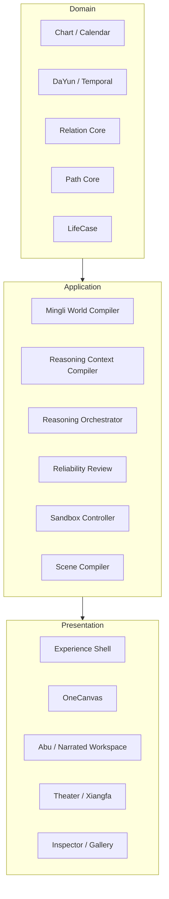

# DeepBazi V50 Current Architecture

> Canonical architecture entry point
>
> Updated: 2026-07-21

## 1. Product Identity

DeepBazi is a professional intelligent Mingli system with long-term LifeCase continuity.

```text
first understand the chart
→ then understand domains and timing
→ then support observation, verification and action
```

Abu is the guided explanation and interaction companion. Abu is not an independent source of Mingli facts and does not create a second judgment.

## 2. Cognitive Authority

```text
Deterministic fact engines
→ provide immutable chart, calendar and temporal facts

Mingli World and tools
→ provide relevant knowledge, structures and experimental candidates

LLM Mingli Reasoner
→ performs whole-chart pattern recognition, hypothesis comparison and domain reasoning

Reliability and epistemic review
→ checks facts, provenance, uncertainty and release eligibility

LifeCase
→ stores the committed case cognition and revision history
```

The LLM is the whole-chart cognitive reasoner. Deterministic modules define the world, calculate facts, expose tools, and enforce boundaries; they do not replace holistic Mingli reasoning.

## 3. Layered Architecture



Only downward dependencies are allowed. Presentation emits intents and renders role-filtered ViewModels. It may not calculate calendar legality, DaYun, relations, paths, epistemic status, or formal Diff semantics.

## 4. Formal Case Flow

```text
Birth Profile
→ Bazi and Ziwei fact engines
→ Chart World Instance
→ minimal sufficient Context
→ LLM whole-chart cognition
→ reliability and epistemic review
→ Formal Insight
→ LifeCase revision
→ on-demand domain and temporal reasoning
→ reality evidence and case revision
→ Abu / page / voice / Canvas projections
```

First-run cognition aims for one primary LLM call. Repair is limited to machine-identifiable structural issues. The page never waits for all future domains to be reasoned at once.

## 5. Data Authorities

| Data | Authority |
|---|---|
| four pillars and chart facts | ChartVersion and deterministic engines |
| legal pillar targets | `PillarTargetDraft → solve_chart_constraints → ChartResolution` |
| legal calendar candidates | strict Birth Calendar authority and `pillar_cycle` catalogs |
| DaYun and temporal snapshot | application-facing `CanonicalTemporalService` |
| whole-chart baseline | committed LifeCase baseline insight |
| domain cognition | committed LifeCase domain insight |
| formal relation and path history | LifeCase `RelationAssertion` / `PathAssertion` |
| relation and path logical identity | `NodeRef` / `RelationKey` / `PathKey` |
| reality feedback | LifeCase reality evidence |
| current task and navigation | Workspace / Journey state |
| user experiment | isolated Sandbox state |
| user-drawn path | PathDraft, never formal by default |
| role disclosure | server-side disclosure policy |

Legacy reports, page state, conversation history, frontend storage, and generated prose are not formal Mingli authorities.

## 6. Current Runtime Reality

The target layers above are partially implemented. The following current-state distinctions are mandatory:

- Graph v1, Path v1, Role v1, and estimated ablation are experimental advisory tools.
- Mechanism, unified state, and legacy timing research projections are not production judgment authorities.
- LifeCase is the formal case authority, but professional accuracy still requires human blind adjudication.
- C0 Canvas contracts are deterministic and tested.
- C1R and old C2A are archived proofs outside the runtime static tree.
- R1 OneCanvas under `experience/active/onecanvas-r1` is the only user-side Canvas candidate.
- Xiangfa Generation V1 is a retained, paused visual-validation route, not a cognitive owner.
- S0 V1.2 and the Abu motion gallery are internal tools, not product routes.
- Relation Atlas is a frozen design baseline; RA1 has not started.
- the legacy L5 shell still serves `/` and `/app` and is `active_retiring`.
- `/experience` is the new Experience Shell.
- production deployment of OneCanvas and Relation Atlas is blocked.
- `CanonicalSceneOwner` is the only formal case-to-scene application owner;
  OneCanvas, Abu, Theater, Xiangfa and Workspace are projections, not facts.
- LifeCase is the only formal owner of committed relation and path assertions.
  Graph/Path v1 remains an experimental candidate producer; it cannot promote
  its own output or rewrite historical committed identity.

Known consolidation defects and their gates are defined in
`V50_ARCHITECTURE_CONSOLIDATION_AUDIT_V2.md`. L2 has since closed the Chart and
Temporal authority defects: the server-owned global Solver returns zero, one
or many legal variants; `CanonicalTemporalService` owns application DaYun
facts; and browser-side Mingli derivation has been removed.

R1 V6 already exposes the existing `single_solution`, `multiple_solutions` and
`no_solution` contracts without reconstructing them in the browser. Its 20 files
remain immutable regression evidence; no human-review prerequisite is active.

### 6.1 Structural Chart Universe Boundary

The historical V30 `518K` name is a validation target contract, not a persisted
four-pillar entity corpus. V50 reconstructs it deterministically as
`60 year pillars x 12 legal solar months x 60 day pillars x 12 legal double-hours`.
All 518,400 unique ChartKeys are structurally valid under the current Five
Tigers and Five Rats rules, and all receive a calendar witness across the
audited four-Jiazi range. The expanded universe is reproducible evidence, not a
database or Git-tracked fact owner.

`CAL-01 Late-Zi Five-Rats Consistency` remains open: 4,019 sampled `23:xx`
resolutions expose a disagreement between the formal Sect 2 day pillar and the
dependency-provided hour stem. RA0 retained the raw evidence and did not change
the formal algorithm. Architecture Gate cannot pass until CAL-01 is resolved or
explicitly isolated; it does not alter the CAG-04 relation/path boundary.

## 7. OneCanvas Architecture

OneCanvas uses six semantic slots and twelve primary nodes as the single interaction space:

```text
year | month | day | hour | DaYun | annual
 stem and branch for each slot
```

```text
Li   = semantic structure
Xiang = visual mapping of the same semantic objects
Time  = deterministic playback of changes in the same scene
```

They are not three pages and must not create duplicate nodes or relations.

Formal chart and Sandbox experiment are separate. DaYun is derived and never freely edited. The annual observation is selected by Gregorian year. User PathDraft and system/formal paths coexist with distinct epistemic status.

## 8. Relation and Path Direction

Relation Core V2 and Path Core V2 remain blocked until CAG-05 and the
Architecture Consolidation Gate pass. CAG-04 has established identity,
provenance, lifecycle and historical stability without changing any Mingli
relation or path semantics.

```text
Graph / Path v1
→ candidate observations with deterministic candidate keys
→ Reasoner and reliability decision
→ LifeCase append-only RelationAssertion / PathAssertion
→ CanonicalScene role-filtered assertion projection
→ Canvas / Abu / Theater / Xiangfa / Workspace
```

An algorithm upgrade may issue a new candidate or superseding assertion. It may
not overwrite an earlier committed assertion. A historical path without exact
structured references remains `legacy_unresolved`; no label, score or nearby
Graph path may be used to guess a replacement.

```text
Relation Core V2
→ typed binary and hyper relations
→ temporal activation and context modifiers
→ provenance, school profile and ontology version

Path Core V2
→ ordered path candidates and assertions
→ segment eligibility and whole-path validation
→ typed evidence, blockers and temporal states
```

The LLM compares and synthesizes professionally meaningful hypotheses. Relation/Path Core guarantees structure, sources, and legal operations.

## 9. Hard Invariants

1. Experimental observations cannot enter the independent first look as production facts.
2. Frontend code cannot infer Mingli semantics.
3. Sandbox operations never write ChartVersion or LifeCase.
4. Role-filtered objects do not enter payload, client state, DOM, or fallback reconstruction.
5. Candidate, committed, blocked, hypothetical, and presentation-only states remain distinct.
6. DaYun is deterministic and cannot be manually fabricated.
7. Abu explains the current formal or Sandbox context; it does not invent a new chart.
8. Historical LifeCase cognition is versioned and never silently rewritten.
9. Machine tests, product review, professional review, and production release are independent gates.
10. A prototype cannot become a new authority by being visually persuasive.

## 10. Governing Documents

- `CURRENT_PRODUCT_BASELINE.md`
- `CURRENT_IMPLEMENTATION_ROADMAP.md`
- `V50_ARCHITECTURE_CONSOLIDATION_AUDIT_V2.md`
- `architecture/V50_CAG04_RELATION_PATH_PROVENANCE_CLOSEOUT_V1.md`
- `../reports/v50-lean-consolidation/ra0-518k-realizability-v1/RA0_518K_CHART_REALIZABILITY_AUDIT_V1.md`
- `DECISION_REGISTER.md`
- `config/data_authority_v1.json`
- `config/runtime_authority_v1.json`
- `config/legacy_register_v1.json`
- `config/artifact_retention_v1.json`
- `V50_DEEP_CLEANUP_AND_LARGE_FILE_GOVERNANCE_V1.md`
- `product/PRODUCT_CONSTITUTION_V1_1.md`
- `product/LIFE_CASE_AND_FORMAL_INSIGHT_V1.md`
- `product/V50_MINGLI_RELATION_ATLAS_CONSTITUTION_AND_ONECANVAS_LENS_V1.md`

When an older document conflicts with this file or the Decision Register, the newer current entry point and explicit supersession record control.
