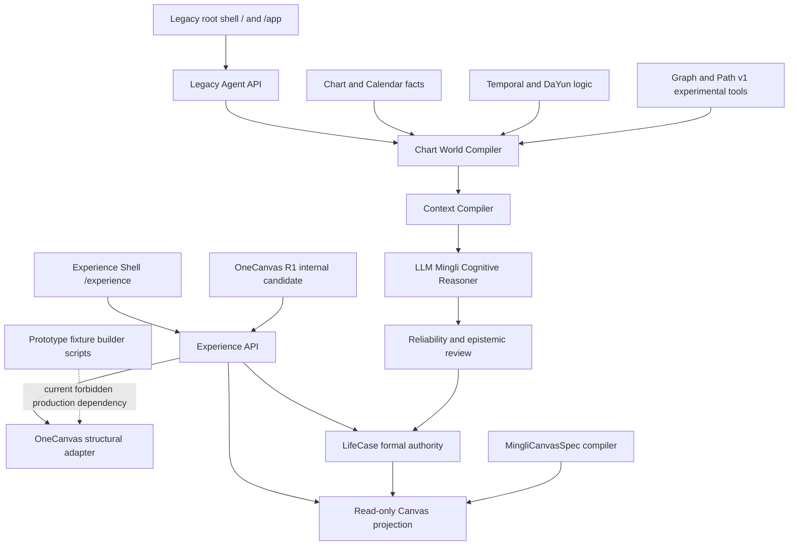
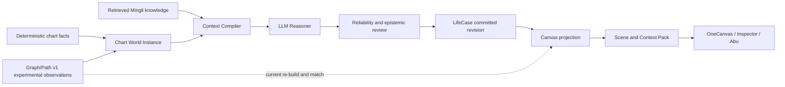
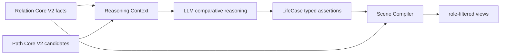

# V50 Architecture Consolidation Audit v1

> Superseded as current audit by
> [`V50_ARCHITECTURE_CONSOLIDATION_AUDIT_V2.md`](V50_ARCHITECTURE_CONSOLIDATION_AUDIT_V2.md).
> Retained as the historical record of the first read-only audit.

> Status: `READ_ONLY_AUDIT_COMPLETE`
>
> Decision: `SELECTIVE_CONSOLIDATION_REQUIRED`
>
> Rewrite from zero: `NO`
>
> Production release: `BLOCKED`

## 0. Executive Verdict

V50 does not need to be rebuilt from zero. Its strongest foundations are already real:

- deterministic chart and calendar facts;
- the LLM-centered Mingli cognition chain;
- LifeCase as the formal case authority;
- role-based disclosure and formal-state isolation;
- a tested Canvas contract;
- OneCanvas as the only current user-side interaction candidate.

The system does, however, need a deliberate consolidation gate before Relation Atlas implementation. The current risk is not simply code volume. It is authority drift caused by:

1. experimental Graph relations entering cognition as production facts;
2. production code importing prototype-building scripts;
3. two incompatible scene contracts evolving in parallel;
4. duplicated temporal and DaYun derivation logic;
5. formal paths being reconstructed indirectly from unstable Graph v1 edges;
6. the retiring legacy shell remaining the public root;
7. documentation no longer identifying one current architecture unambiguously.

The correct strategy is a strangler migration:

```text
preserve proven behavior
→ freeze prototype identities
→ close authority leaks
→ extract canonical domain services
→ introduce Relation Core V2 and Path Core V2 behind adapters
→ migrate one consumer at a time
→ retire legacy paths only after usage and parity evidence
```

No mass deletion, React migration, whole-system rewrite, or RA1 implementation is authorized by this audit.

## 1. Audit Scope

This audit inspected:

- production routes and legacy aliases;
- Python package dependencies and layer direction;
- Graph v1 and Path v1 behavior;
- the LLM Reasoner to LifeCase commit chain;
- MingliCanvasSpec and OneCanvas scene contracts;
- temporal, DaYun, pillar-selection, and structural-compile ownership;
- frontend state and component reuse;
- role disclosure and provenance boundaries;
- current tests, fixtures, configs, and Markdown authority.

This was a read-only architecture audit. It did not alter Runtime, Reasoner, LifeCase, UI, Mingli algorithms, production data, or deployment.

## 2. Current Architecture Map



There are no detected Python import cycles. The broad dependency direction is healthy: product code consumes core and experience packages, while core does not import the product layer. The main exception is production code importing a fixture-building script.

## 3. Findings

### F-01 — Experimental Graph Relations Can Enter the Independent First Look

Severity: `P0 AUTHORITY DEFECT`

Evidence:

- `config/runtime_authority_v1.json` defines Graph v1 as `experimental_tool_observation` and forbids experimental tools from the independent first look.
- `packages/core/mingli_agent/world.py` emits Graph edges as `graph_relation` facts with `authority="neutral_relation"`.
- `packages/core/mingli_agent/context.py` maps only `experimental_tool_observation` and `research_prior` away from production; every other authority becomes `production`.

Consequence:

```text
Graph v1 experimental edge
→ neutral_relation
→ authority_status production
→ eligible for baseline/pattern independent observation
```

This contradicts the frozen runtime authority contract. It must be closed before Relation Atlas or formal professional release. The fix must begin with a failing authority fixture; it must not be hidden in prompt wording.

### F-02 — Production OneCanvas Code Imports Prototype Script Internals

Severity: `P1 CONSOLIDATION BLOCKER`

`apps/product/onecanvas_structural.py` imports Jiazi, pillar dependencies, birth-year lookup, structural variants, and timing projection from `scripts/v50_build_mingli_onecanvas_c2ar_fixture.py`.

This reverses the intended ownership:

```text
production adapter → prototype fixture script
```

The code currently works and is tested, so it must not be deleted first. Its canonical deterministic parts should be extracted into domain/application services, then both the production adapter and fixture builder should consume those services.

### F-03 — Two Scene Contracts Exist

Severity: `P1 ARCHITECTURE SPLIT`

Current contracts:

1. `deepbazi.mingli_canvas_spec.v1` in `packages/experience/canvas.py`, consumed by the read-only Experience Canvas.
2. `deepbazi.mingli_onecanvas_c2ar_fixture.v1` in the OneCanvas R1 runtime, carrying a separate large fixture and state model.

C0/C1 proved deterministic Spec, Diff, ContextPack, disclosure filtering, and no formal writes. OneCanvas R1 proved direct manipulation and the current product direction. Neither proof should be discarded, but they cannot remain two permanent semantic worlds.

Required convergence:

```text
canonical Scene Compiler
├── Inspector projection adapter
└── OneCanvas interaction projection adapter
```

The Renderer must never become the bridge by inferring missing semantics.

### F-04 — Temporal and DaYun Ownership Is Duplicated

Severity: `P1 AUTHORITY DRIFT`

Equivalent or overlapping logic exists in:

- `packages/core/timing/personal.py`;
- `packages/core/mingli_agent/world.py`;
- `scripts/v50_build_mingli_onecanvas_c2ar_fixture.py`;
- `apps/product/onecanvas_structural.py` through script imports and reverse lookup.

Future canonical owner:

```text
Chart / Calendar Domain
        +
DaYun / Temporal Domain
```

World compilation, OneCanvas, fixtures, and LifeCase projections must consume versioned results from this owner.

### F-05 — Formal Path Provenance Is Indirect and Fragile

Severity: `P1 KNOWLEDGE CONTINUITY RISK`

The LLM Reasoner commits a work path with evidence references. Later Canvas projection:

1. reads those references;
2. finds `graph_relation` facts in the World;
3. rebuilds Graph v1;
4. matches labels, positions, and relation type back to a current edge;
5. hides the path if matching is not unique.

Historical formal cognition therefore depends on a future rebuild of an experimental Graph. A Graph builder change can make a previously committed path disappear without the LifeCase itself changing.

Path Core V2 needs typed, versioned provenance at commit time:

```text
PathAssertion
├── path_id and schema_version
├── ordered semantic node refs
├── ordered relation refs
├── relation ontology version
├── evidence and counter-evidence refs
├── epistemic status
└── source Reasoner and LifeCase revision
```

Historical LifeCases must remain readable through adapters; they must not be silently rewritten.

### F-06 — The Retiring Legacy Shell Is Still the Public Root

Severity: `P2 PRODUCT CONVERGENCE RISK`

`/` and `/app` still serve the legacy L5 shell. `/experience` serves the new Experience Shell. The legacy register correctly marks the root shell `active_retiring`, but the deployment topology still makes it the default experience.

Retirement requires usage evidence, functional parity, migration of critical actions, and an explicit route decision. It is not authorized as part of this audit.

### F-07 — Component Reuse Is Real but Local

Severity: `P2 MAINTAINABILITY`

OneCanvas Gallery and its prototype share `onecanvas-components.js`; this is genuine component reuse. The current OneCanvas orchestration still resides largely in a long prototype controller, while the read-only Experience Canvas uses a separate TypeScript renderer.

The Gallery proves OneCanvas component integrity, not whole-product component convergence. Future extraction should follow stable semantic responsibilities, not visual similarity alone.

### F-08 — Tests Protect Behavior Better Than Ontology Correctness

Severity: `P2 VALIDATION GAP`

Existing tests strongly protect:

- deterministic Spec/Diff output;
- role disclosure isolation;
- no Sandbox writes to formal state;
- unknown-gender DaYun blocking;
- cascading pillar candidates;
- OneCanvas undo/reset and interaction states;
- semantic reference continuity.

They do not prove that Graph v1 is a complete or professionally valid relation ontology. Graph v1 includes a single hard-coded triple combination and fixed path scoring; Path v1 treats broad edge categories as path eligible. These modules remain experimental, as the runtime authority manifest already states.

### F-09 — Documentation Has Multiple Plausible Entry Points

Severity: `P2 GOVERNANCE`

The repository contains many valuable design records, but `docs/README.md` and `docs/V50_CURRENT_ARCHITECTURE.md` no longer capture the current OneCanvas, Relation Atlas, runtime-authority, and consolidation state precisely. New contributors can select an old but plausible document and make locally reasonable, globally wrong changes.

This audit introduces four canonical current entry points and demotes older architecture summaries to compatibility references.

## 4. Source of Truth Matrix

| Concern | Current authority | Current consumers | Current risk | Target owner |
|---|---|---|---|---|
| Birth and four-pillar facts | `core.contracts`, Bazi engines, ChartVersion | World, LifeCase, product | low | Chart / Calendar Domain |
| Legal pillar dependencies | server-side structural compiler, currently sourced from fixture script | OneCanvas R1 | production-to-script dependency | Chart / Calendar Domain |
| DaYun sequence and active range | overlapping timing helpers | World, OneCanvas, fixtures | duplicated authority | DaYun / Temporal Domain |
| Basic relation facts | material engine and Graph v1 | World, Canvas | incomplete ontology; authority leak | Relation Core V2 |
| Candidate path discovery | Path v1 | World challenge pack | uncalibrated and sample-shaped | Path Core V2 candidate adapter |
| Whole-chart cognition | LLM Reasoner | Reliability review, LifeCase | professional blind gate pending | LLM Reasoner |
| Formal baseline and domains | LifeCase committed revisions | Experience, Abu, Canvas | provisional professional validity | LifeCase |
| Role disclosure | Canvas compiler and role policies | Experience clients | fallback regression previously fixed | Application disclosure policy |
| Read-only scene | `MingliCanvasSpec` | C1 Inspector | separated from OneCanvas | Scene Compiler projection |
| Interactive scene | OneCanvas fixture/runtime | R1 candidate | parallel contract | Scene Compiler + Sandbox Controller |
| UI state | Experience/OneCanvas local state models | browser | legacy root still separate | Experience application state |

## 5. Prototype Inventory and Retirement Policy

| Asset | Frozen identity | Product status | Future role |
|---|---|---|---|
| C0 Canvas contracts | deterministic contract proof | complete | retain as contract fixtures |
| C1 Read-only Canvas | internal Inspector | implementation complete | retain for disclosure and structure audit |
| C1R Li-Xiang-Time | shared semantic projection proof | technical spike complete | consume through future Scene Compiler |
| old C2A multi-panel lab | functional fixture | product shape rejected | retain only for regression evidence |
| C2A-R / R1 OneCanvas | only user-side product candidate | machine pass, human gate pending | continue after human product gate |
| legacy L5 root shell | active retiring product | still public root | migrate by usage and parity evidence |

Rules:

- Frozen proofs receive no new parallel product features.
- Fixture code may be simplified only after equivalent tests move to canonical services.
- Nothing is deleted solely because it is old.
- No deprecated surface may continue to define a new semantic contract.

## 6. State Flow Audit

The desired one-way flow is:

```text
user intent
→ application command
→ canonical domain service
→ formal or sandbox state
→ Scene Compiler
→ role-filtered ViewModel
→ Renderer
```

Current strengths:

- the frontend does not calculate Five Tigers, Five Rats, DaYun, Relation Graph, or formal paths;
- formal chart and LifeCase writes are isolated from OneCanvas experiments;
- role-filtered objects are tested as absent, not merely hidden by CSS;
- OneCanvas keeps selection, history, draft, and lens state in a coherent local model.

Current defects:

- OneCanvas production projection depends on fixture script code;
- C1 and R1 compile different scene contracts;
- user PathDraft completeness is a UI interaction state, not a Path Core validation result;
- the legacy shell maintains a separate storage and interaction world.

## 7. Formal Cognition and Provenance Flow



Target:



The LLM remains the whole-chart cognitive authority. Relation Core and Path Core provide deterministic or typed objects, not final Mingli judgment.

## 8. Relation Core V2 Compatibility

### Keep

- stable Chart node identity and position semantics;
- deterministic element and stem/branch facts;
- evidence/source references;
- Graph v1 output as a versioned experimental adapter;
- C0 disclosure and epistemic-status patterns.

### Replace or expand

- binary-only relation assumptions;
- one-off triple combination support;
- relation identity coupled to renderer labels;
- single-relation-per-pair behavior;
- missing school/profile provenance;
- ambiguous original/DaYun/annual stage ownership.

### Required V2 concepts

```text
RelationDefinition
BinaryRelation
HyperRelation
ContextModifier
TemporalActivation
RelationProvenance
school_profile
relation_type_id
ontology_version
epistemic_status
```

RA1 must begin with positive, negative, missing-condition, temporal-completion, temporal-destruction, and multi-relation coexistence fixtures. It must not begin with new UI lines.

## 9. Path Core V2 Compatibility

### Keep

- ordered node and relation representation;
- candidate versus committed separation;
- evidence references;
- no frontend path inference;
- user PathDraft as a separate sandbox object.

### Replace or quarantine

- fixed three-edge DFS as general Mingli path authority;
- universal path eligibility for storage and position edges;
- uncalibrated scalar path scores;
- sample-specific element preferences;
- path reconstruction from current Graph labels and positions.

### Required V2 concepts

```text
PathCandidate
PathAssertion
PathSegment
PathEligibility
PathProvenance
WholePathValidation
temporal_state
support_and_block_reasons
epistemic_status
schema_version
```

The LLM may compare and select professionally meaningful hypotheses, but cannot invent nodes or relations absent from the supplied world. Path Core validates structure and provenance; it does not replace whole-chart cognition.

## 10. Test and Fixture Protection Matrix

| Behavior | Existing protection | Migration requirement |
|---|---|---|
| deterministic Canvas Spec/Diff | C0 fixtures | retain unchanged through Scene Compiler adapter |
| role-hidden objects remain absent | C0/C1 disclosure tests | make cross-projection invariant |
| Sandbox does not write formal state | Canvas and OneCanvas tests | retain as release blocker |
| unknown gender does not expose DaYun | R1 authority tests | move to Temporal Domain fixtures |
| year/day independent; month/hour dependent | pillar-selection tests | move algorithm ownership, preserve API behavior |
| DaYun current state resolves from real calendar evidence | pillar-selection tests | preserve exact/not-resolved states |
| OneCanvas selection and PathDraft continuity | prototype tests | preserve through Scene adapter |
| Graph/Path v1 current results | graph/state/synthetic tests | freeze as legacy adapter compatibility, not professional truth |
| formal path survives ontology upgrade | insufficient | add versioned provenance fixtures before migration |
| experimental observations excluded from first look | contract exists, leak detected | add failing regression before any fix |

## 11. Keep / Extract / Adapt / Refactor / Retire

### Keep

- Chart facts and calendar engines;
- LLM Reasoner and minimal-context orchestration;
- Reliability review boundaries;
- LifeCase and revision ledger;
- C0 deterministic Canvas contracts and disclosure tests;
- OneCanvas R1 as the sole product candidate;
- Abu/Narrated Workspace as consumers of formal insight.

### Extract

- Jiazi and pillar dependency catalog from scripts;
- real-date reverse lookup;
- DaYun sequence/current-window calculation;
- structural variant compilation;
- shared semantic node identity and Scene projection helpers.

### Adapt

- Graph v1 to Relation Core V2 experimental input;
- Path v1 to Path Core V2 candidate input;
- historical LifeCase work paths to typed path provenance;
- C1 MingliCanvasSpec and R1 OneCanvas fixture into a shared Scene Compiler.

### Refactor After Gates

- split OneCanvas orchestration by command/state/projection responsibilities;
- move timing duplication to one domain owner;
- make authority mapping exhaustive rather than fallback-to-production;
- replace indirect path matching with versioned references;
- migrate new Experience reads away from legacy Agent API.

### Retire Only After Evidence

- legacy L5 public root;
- fixture script imports from production;
- old C2A and C1R product routes or independent evolution;
- duplicate timing helpers;
- Graph/Path v1 claims of general professional authority;
- superseded architecture entry points.

## 12. Architecture Consolidation Gate

RA1 is not authorized until all gate items below are satisfied.

### Gate A — R1 Product Truth

- analyst and first-time-user unguided review completed;
- no authority-boundary failure;
- no formal-state pollution;
- DaYun and linked-pillar behavior professionally confirmed;
- OneCanvas remains the only user product candidate.

### Gate B — Authority Closure

- failing fixture proves the Graph first-look authority leak;
- fix makes authority mapping exhaustive;
- Runtime Authority Audit and full regressions pass;
- no experimental relation is promoted by an unknown authority fallback.

### Gate C — Canonical Temporal Service

- structural and DaYun helpers no longer originate in `scripts/` for production use;
- World, OneCanvas, and fixtures consume one versioned temporal domain contract;
- changed / unchanged / unresolved outcomes remain explicit.

### Gate D — Scene Contract Convergence Plan

- one canonical semantic scene identity is selected;
- C1 and R1 adapters are specified;
- role filtering occurs before client delivery;
- Renderer inference remains forbidden;
- no mass UI rewrite is required.

### Gate E — Provenance Upgrade Plan

- Relation V2 and Path V2 IDs/versioning are frozen;
- historical LifeCase adapter behavior is specified;
- no silent data rewrite is allowed;
- formal path survival tests exist before migration.

### Gate F — Documentation and Ownership

- current architecture, product baseline, and roadmap are linked from `docs/README.md`;
- every active module has an owner and authority level;
- prototype identities are frozen;
- production release remains explicitly blocked until its own gate.

Gate result at this audit:

```yaml
R1_human_product_gate: PENDING
authority_closure: FAILED_BY_AUDIT
canonical_temporal_service: NOT_YET_EXTRACTED
scene_contract_convergence: DESIGN_REQUIRED
typed_path_provenance: DESIGN_REQUIRED
documentation_current_index: COMPLETE_BY_THIS_CHANGE
architecture_consolidation_gate: NOT_PASSED
RA1: BLOCKED
production: BLOCKED
```

## 13. Recommended Migration Order

```text
Now
├── complete R1 unguided human review
└── freeze this audit and current indices

Consolidation slice 1
├── authority-leak failure fixture and correction
├── extract Chart/Calendar and DaYun/Temporal services
└── remove production dependency on fixture scripts

Consolidation slice 2
├── freeze Scene Compiler adapter contract
├── make C1 Inspector and OneCanvas consume adapters
└── add formal path survival fixtures

Core V2
├── RA1 Relation ontology and provenance
├── RA2 temporal relation activation
└── RA3 Path Core V2 and whole-path validation

Migration and authority
├── RA4 World/Reasoner adapters
├── RA5 LifeCase provenance migration
└── RA6 legacy Graph/Path quarantine and usage audit

Product adoption
└── RA7 OneCanvas lenses, Theater, Xiangfa and Abu consume the shared scene
```

## 14. Final Decision

The current system is not too broken to save. It is mature enough that an indiscriminate rewrite would destroy more verified behavior than it would improve.

The necessary move is narrower and more demanding:

> Consolidate authority before expanding capability.

R1 human review continues. Relation Atlas remains a frozen design baseline. RA1, full C2, production deployment, and broad cleanup remain blocked until the Architecture Consolidation Gate passes.

## 15. Verification Record

Executed after the audit documents were written:

```yaml
experience_typescript_typecheck: PASS
focused_architecture_canvas_onecanvas_tests: 40_passed
full_python_regression: 376_passed
architecture_purification_audit: PASS
current_markdown_link_check: PASS
runtime_code_modified_by_this_audit: false
deployment_performed: false
```

The focused suite covered architecture purification, runtime authority,
MingliCanvas C0, read-only Canvas C1, OneCanvas pillar selection, and R1
authority behavior. These results establish regression stability; they do not
override the human product gate, professional Mingli gate, or consolidation
findings above.
