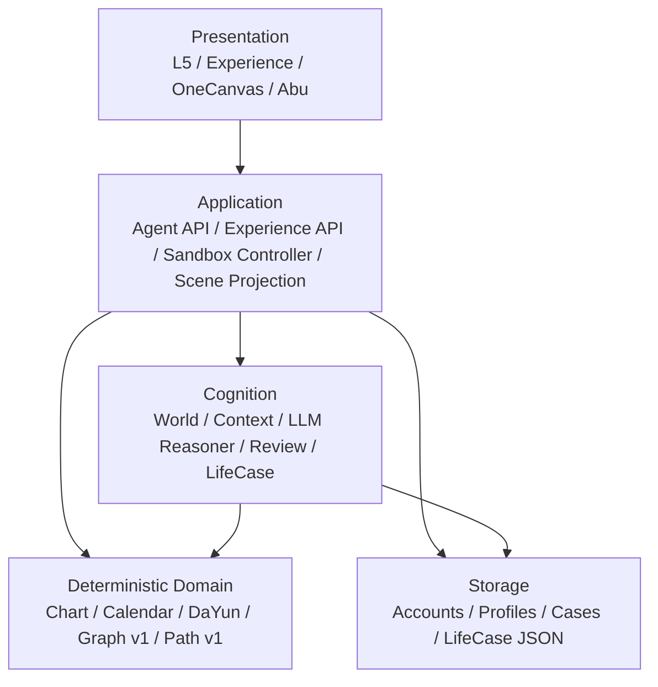
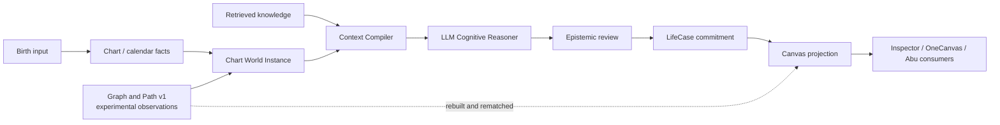
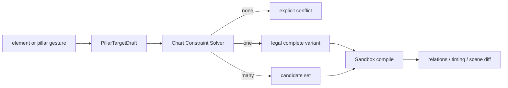

# V50 Architecture Consolidation Audit v2

> Status: `READ_ONLY_AUDIT_COMPLETE`
>
> Decision: `SELECTIVE_CONSOLIDATION_REQUIRED`
>
> Rewrite from zero: `NO`
>
> Runtime behavior changed by this audit: `NO`
>
> Architecture Consolidation Gate: `NOT_PASSED`
>
> RA1 / full C2 / production adoption: `BLOCKED`

## 0. Executive Verdict

V50 does not need a clean-room rewrite. The system already has several assets that would be expensive and risky to recreate:

- deterministic chart and calendar facts;
- the LLM-centered whole-chart cognition chain;
- LifeCase formal revisions and role disclosure;
- formal-state and Sandbox isolation;
- deterministic Canvas Spec, Diff, and Context Pack contracts;
- OneCanvas semantic identity and the current R1 interaction candidate;
- a substantial regression suite and frozen technical proofs.

The codebase nevertheless cannot safely absorb Relation Atlas, Path Core V2, Theater, Xiangfa, and deeper Abu integration by continuing to add local branches. The primary risk is no longer missing functionality. It is distributed authority:

```text
calendar legality
+ temporal derivation
+ relation facts
+ path hypotheses
+ formal commitments
+ scene projection
+ UI interaction policy
```

are not yet separated cleanly enough to evolve independently.

The correct strategy is:

```text
preserve proven behavior
→ freeze product and prototype identities
→ close authority and reachability defects
→ extract canonical services and schemas
→ introduce Relation Core V2 and Path Core V2 in parallel
→ dual-run and adjudicate differences
→ migrate one consumer at a time
→ retire legacy implementations only with evidence
```

Three areas require a versioned rebuild:

1. `Relation Core V2`;
2. `Path Core V2`;
3. a global `Chart Constraint Solver` for target four-pillar experiments.

Four areas require convergence rather than replacement:

1. Chart / Calendar and DaYun / Temporal ownership;
2. C0/C1 Canvas and OneCanvas scene contracts;
3. Reasoner → LifeCase → Canvas path provenance;
4. Python canonical contracts → generated TypeScript contracts.

The LLM remains the whole-chart cognitive authority. Deterministic cores provide facts, candidate structures, constraints, and validation. They do not replace professional synthesis.

## 1. Scope and Method

This audit reviewed the current implementation of:

- account, profile, case, and LifeCase persistence;
- birth calendar, pillar dependency, and DaYun calculation;
- Graph v1 and Path v1;
- Chart World, Context Compiler, LLM Reasoner, and formal review;
- LifeCase commitment and compatibility projection;
- C0/C1 Canvas contracts and product projection;
- OneCanvas structural compilation and R1 browser runtime;
- Abu command planning and case operations;
- the L5 shell, Experience Shell, prototypes, Gallery, schemas, tests, and current Markdown.

This is a read-only engineering audit. It does not implement RA1, alter Mingli behavior, change UI behavior, migrate data, or deploy.

## 2. Current Module and Dependency Map

### 2.1 Intended layer direction



The broad Python dependency direction remains usable: product code consumes core and experience packages, while core does not depend on the product UI.

### 2.2 Current cognition and scene flow



### 2.3 Current presentation surfaces

| Surface | Current role | Status |
|---|---|---|
| `/` and `/app` L5 shell | current public product root | active, retiring |
| `/experience` | newer typed Experience Shell | active internal/product convergence surface |
| C1 read-only Canvas | disclosure and structure Inspector | frozen technical proof |
| C1R | shared semantic projection proof | frozen technical spike |
| old C2A | multi-panel functional fixture | product shape rejected |
| C2A-R / R1 OneCanvas | only current user-side Canvas candidate | machine pass, human gate pending |
| Theater | scripted performance consumer | separate product experiment |

No historical prototype is authorized to create a new semantic contract.

## 3. Findings

### F-01 — The old Graph authority leak is closed

Status: `CLOSED SINCE V1`

Current evidence:

- `world.py` emits Graph, Path, Role, and estimated sensitivity as `experimental_tool_observation`;
- `context.py` excludes non-production observations from independent first look;
- unknown WorldFact authority now raises instead of defaulting to production.

This correction must remain a permanent regression invariant. V2 does not reopen it.

### F-02 — Production OneCanvas no longer depends on fixture-builder internals

Status: `CLOSED`

The structural and timing logic now lives in the product services consumed by OneCanvas.
The two fixture builders have moved to `tools/fixtures/` and are not importable as product
runtime owners:

```text
product.onecanvas_structural
product.structural_variant_compiler
product.onecanvas_timing_adapter
        ↑
tools/fixtures/* (offline consumers only)
```

No product module imports a fixture builder. Archived evidence remains reproducible without
participating in the production module graph.

### F-03 — Local pillar stepping cannot guarantee a target four-pillar chart

Severity: `P1 PRODUCT AND CONTRACT DEFECT`

The current R1 browser model edits one axis against the current snapshot:

```text
create local PillarEditIntent
→ derive candidates from current pillars
→ cascade year→month or day→hour
→ immediately compile and replace the current snapshot
```

Consequences:

- operation order changes the result;
- changing year can overwrite a previously selected month;
- changing day can overwrite a previously selected hour;
- repeated local plus/minus operations do not guarantee reachability of a desired complete chart;
- an old birth-year anchor can become incompatible after a pillar mutation;
- the UI cannot clearly distinguish desired target constraints from the latest legal compiled result.

The correct model is global and declarative:

```text
PillarTargetDraft
  desired year / month / day / hour
  optional gender
  optional real birth-year anchor
        ↓
Chart Constraint Solver
        ↓
0 / 1 / many legal complete variants
        ↓
explicit conflict or candidate selection
        ↓
compiled Sandbox snapshot
```

The user may still operate individual visible elements, but those gestures must edit the target draft, not destructively mutate the compiled chart. Intermediate draft state must never become a formal chart.

### F-04 — Supplied pillar validation is too weak

Severity: `P0 FACT AUTHORITY GAP`

`resolve_birth_input_pillars()` currently accepts supplied pillars without calendar derivation when every value has string length two. `_valid_pillar()` does not verify:

- stem membership;
- branch membership;
- yin/yang parity;
- Jiazi membership;
- Five Tigers month dependency;
- Five Rats hour dependency;
- consistency with supplied date/time.

This means malformed two-character values can bypass the calendar engine. The future fix must begin with failing fixtures and must distinguish:

```text
calendar-derived formal pillars
user-supplied but calendar-verified pillars
structurally legal hypothetical pillars
unverified legacy pillars
```

It must not be repaired by silently rewriting user input.

### F-05 — DaYun ownership is partially duplicated

Severity: `P1 AUTHORITY DRIFT`

The core already contains canonical functions for:

- direction from year polarity and gender;
- structural DaYun sequence without an exact date;
- exact DaYun sequence from birth datetime;
- current timing material.

OneCanvas nevertheless contains a local `_luck_direction()` and fixture-oriented timing projection. Structural sequence and exact current DaYun are also mixed in one UI response.

The system must expose three explicit resolution levels:

```text
structural_valid
  legal four-pillar structure; no claim of real birth datetime

calendar_resolved
  one or more real calendar candidates resolved

active_dayun_resolved
  gender, real time anchor, sequence, and current period resolved
```

A structural chart can determine direction and sequence order when gender is known. It cannot determine exact starting age or the active DaYun in a target year without a real calendar anchor.

### F-06 — Graph v1 is an experimental binary approximation, not Relation Atlas

Severity: `P1 CORE LIMITATION`

Graph v1 currently:

- models visible and hidden stem nodes;
- emits element generation/control/support edges;
- assigns fixed scalar strengths;
- contains only one hard-coded triple combination (`巳酉丑`);
- flattens that multi-node relation into binary edges toward a selected bridge node;
- lacks ontology version, school profile, native HyperRelation, context modifier, and temporal activation provenance.

Graph v1 is useful as an experimental observation generator and compatibility baseline. It is not a safe foundation for incrementally adding the complete Relation Atlas.

### F-07 — Path v1 is a heuristic candidate explorer, not Path Core authority

Severity: `P1 CORE LIMITATION`

Path v1 currently:

- permits a broad set of relation types as path edges, including storage and position links;
- walks at most three edges by default;
- ranks only the top 80 candidates;
- uses fixed, uncalibrated scalar weights;
- contains element-specific seasonal preferences;
- has no typed whole-path continuity, closure, contradiction, or temporal validation;
- may traverse symmetric copies while later resolving original edge identities, requiring explicit direction-provenance fixtures.

It must remain `legacy_unvalidated` / experimental. A high score must not be exposed as energy, probability, or professional truth.

### F-08 — Formal path provenance is lossy and future-Graph-dependent

Severity: `P1 KNOWLEDGE CONTINUITY RISK`

The Reasoner produces a professional work-path narrative and evidence references. LifeCase stores free-text reasoning steps and a projection payload. Canvas later:

1. rebuilds the current Graph;
2. finds World `graph_relation` facts referenced by the cognitive record;
3. rematches those facts to current edges by relation type, positions, and labels;
4. returns no committed path if a match is missing or ambiguous.

Therefore a Graph implementation change can make a historical committed path disappear even when the LifeCase revision has not changed.

LifeCase V2 provenance needs ordered, typed, versioned path assertions at commit time. Historical records must remain immutable and replayable through adapters.

### F-09 — Formal projection still has a legacy fallback authority

Severity: `P2 MIGRATION RISK`

`formal_projection_record()` correctly prefers the committed LifeCase projection, but falls back to the legacy cognitive record when the payload is absent or malformed. This is necessary for compatibility, but means visible authority is not yet exclusively LifeCase for all historical cases.

The fallback must be explicit in output metadata:

```text
projection_source = life_case_committed | legacy_read_only_fallback
```

New writes must never create the fallback state. Migration must not silently claim that old content has been professionally recommitted.

### F-10 — Two scene contracts and three frontend strata remain

Severity: `P1 CONVERGENCE RISK`

Current semantic/presentation worlds:

1. `MingliCanvasSpec` / `CanvasDiffSpec` / `CanvasContextPack`;
2. the large OneCanvas R1 fixture and runtime state;
3. the legacy L5 page model.

The solution is not a whole frontend rewrite. It is one canonical Scene Compiler with adapters:

```text
canonical semantic scene
├── Inspector projection
├── OneCanvas interaction projection
├── Abu context projection
├── Theater cue projection
└── Xiangfa render profile
```

The Renderer must not infer missing domain semantics.

### F-11 — Python and TypeScript contracts are maintained manually

Severity: `P2 CONTRACT DRIFT`

The repository exports selected Pydantic schemas for Theater, but Canvas and other Experience contracts are manually recreated in `contracts.ts`. No general schema-to-TypeScript generation and drift gate exists.

This is manageable today but unsafe for Relation Core V2, Path Core V2, provenance, and Scene State.

### F-12 — Several files are responsibility monoliths

Severity: `P2 MAINTAINABILITY`

Current large files include:

| File | Approximate lines | Mixed responsibilities |
|---|---:|---|
| `static/l5/app.js` | 3425 | shell, auth, profiles, Abu, cases, narration, motion, rendering |
| `static/l5/styles.css` | 2996 | global shell and multiple product surfaces |
| `mingli_agent/reasoner.py` | 2837 | prompts, stages, transport, repair, review, projection |
| `agent_api.py` | 2010 | request models, commands, jobs, projection, streaming |
| `life_case/service.py` | 1148 | commits, revisions, evidence, projections, compatibility |
| `state/contracts.py` | 1132 | several state domains |
| OneCanvas `prototype.js` | 1089 | controller, history, compile client, drawing, playback, rendering |
| `experience/canvas.py` | 1043 | contracts, compile, diff, disclosure, context |
| `canvas_projection.py` | 852 | world reconstruction, graph/path projection, role views |

Line count alone is not a reason to split. These files should be divided only after behavior is frozen, by stable ownership boundaries described in Section 14.

## 4. Domain Source-of-Truth Matrix

| Information | Current authority | Current problem | Target authority |
|---|---|---|---|
| user account and session | `ProductStore` | none material | Account Domain |
| birth profile CRUD | `ProductStore` profile JSON | profile vs case linkage needs one API contract | Profile Domain |
| formal birth datetime | `BirthInputCanonical` / profile | legacy or supplied pillars may bypass strong validation | Chart / Calendar Core |
| formal four pillars | calendar engine / ChartVersion | supplied value validation too weak | Chart / Calendar Core |
| hypothetical four-pillar target | OneCanvas local intent and structural compiler | destructive local cascade; target not globally reachable | Chart Constraint Solver |
| month/hour legal dependencies | `pillar_cycle.py` | browser applies cascade policy | Chart Constraint Solver consumes Calendar Core |
| DaYun direction and sequence | core DaYun plus OneCanvas helpers | duplicate direction/projection | DaYun / Temporal Core |
| active DaYun range | real birth datetime calculation | structural mode can be confused with exact mode | DaYun / Temporal Core |
| annual pillar | core DaYun/calendar helper | low risk | Temporal Core |
| deterministic relation facts | Graph v1 | incomplete binary ontology | Relation Core V2 |
| candidate path generation | Path v1 | heuristic and uncalibrated | Path Core V2 candidate generator |
| whole-chart Pattern and professional synthesis | LLM Reasoner | professional blind gate pending | LLM Cognitive Reasoner |
| formal baseline/domain cognition | LifeCase | legacy fallback and lossy typed path | LifeCase Commitment |
| case reality evidence and belief revision | LifeCase / CaseBeliefState | compatibility workspace projections remain | Case Memory / LifeCase |
| Sandbox experiment | OneCanvas local + structural endpoint | no global target draft contract | Sandbox Controller |
| role disclosure | server-side Canvas/application policy | must remain data absence, not CSS hiding | Disclosure Policy |
| semantic scene | C0 Canvas plus OneCanvas fixture | parallel contracts | Scene Compiler |
| visual layout and animation | frontend renderers | must not create semantics | Presentation |
| Abu navigation and commands | `abu_runtime` command planner | Canvas grounding not unified across all commands | Abu Application Interface |
| Abu professional explanation | formal insight / Context Pack + LLM | must remain scoped to disclosed context | LLM expression over approved context |

## 5. Python / TypeScript Duplicate Mingli Logic

### 5.1 True duplicate or leaked domain policy

| Logic | Python owner | Browser copy | Decision |
|---|---|---|---|
| year/day candidate universe | `pillar_cycle.JIAZI` | serialized catalog consumed by JS | allowed as data, not logic |
| month from year | `month_pillar_options()` | JS chooses `month_by_year` and applies cascade | move cascade decision to solver response |
| hour from day | `hour_pillar_options()` | JS chooses `hour_by_day` and applies cascade | move cascade decision to solver response |
| local pillar mutation | structural compiler validates full result | JS `cascadedPillars()` mutates linked slots | remove as domain policy after solver exists |
| DaYun direction | `dayun_direction()` | Python OneCanvas `_luck_direction()` | deduplicate into core |
| relation labels/layers | Graph/Canvas projection | browser renderer maps presentation labels | keep only presentation labels in browser; IDs canonical |
| contract shapes | Pydantic models | hand-written TS interfaces | generate TS from canonical schemas |

### 5.2 Important non-duplicates to preserve

The browser does not currently calculate:

- Five Tigers or Five Rats from raw stems;
- exact calendar pillars;
- DaYun sequence or current period;
- Graph relations;
- formal paths;
- LifeCase commitments.

This is a healthy boundary. It must not be weakened while simplifying R1.

### 5.3 Browser-local state that is legitimate

The following belong in presentation/application state and may remain local:

- selected object;
- open layer;
- viewport and visual anchors;
- animation/playback position;
- undo/redo of uncommitted UI commands;
- PathDraft gestures, provided validation remains server/domain-owned;
- pending target constraints, provided they are clearly uncompiled.

## 6. Required State Flow

### 6.1 Target flow


Forbidden reverse paths:

```text
DOM → formal state
Renderer → relation inference
component → Spec mutation
browser → DaYun calculation
fallback → reintroduce role-filtered objects
prototype fixture → production domain authority
```

### 6.2 Target four-pillar edit flow



Required invariants:

- desired target and compiled snapshot are separate objects;
- changing one constraint may invalidate, not silently preserve, a birth-year anchor;
- all legal variants are server-produced;
- a real-date claim requires calendar resolution;
- exact active DaYun requires enough real temporal evidence;
- formal ChartVersion and LifeCase are never written by this flow.

## 7. Graph → Reasoner → LifeCase → Canvas → Abu Provenance

| Stage | Created or retained | Lost or weakened today | V2 requirement |
|---|---|---|---|
| Graph v1 | node/edge IDs, material refs, evidence refs, scalar strength | ontology version, school, HyperRelation, temporal source, full conditions | RelationProvenance |
| Chart World | WorldFact ID, category, payload, authority | relation identity remains Graph-v1-shaped | typed relation refs and authority manifest |
| Context Compiler | selected facts, phase, authority status, attention | omitted facts are not always represented as explicit exclusions | context receipt with inclusion/exclusion reasons |
| LLM Reasoner | whole-chart hypotheses, work-path prose, evidence, counter-evidence | path objects are not committed as stable typed segments | typed assertion graph and path assertion |
| Review | epistemic state, issue codes, traceability checks | no typed whole-path continuity/closure review | peer-review receipt against Relation/Path versions |
| LifeCase | claim, free-text reasoning, source refs, revision history, projection payload | ordered relation identity, ontology/path versions, review identity | immutable typed provenance bundle |
| Canvas projection | current nodes/relations, role-filtered scene | committed path is rematched against current Graph and may disappear | consume committed typed path directly |
| Canvas Context Pack | disclosed selected refs, uncertainty, must-not-say | not yet the universal Abu explanation input | one role-filtered Abu Canvas context contract |
| Abu | command intent, executor, next action | current commands can operate without unified Canvas grounding | command planner remains separate; explanations bind to Context Pack |

Target chain:

```text
Relation Core V2 facts
+ Path Core V2 candidates
+ retrieved world knowledge
        ↓
Reasoning Context Receipt
        ↓
LLM comparative Mingli reasoning
        ↓
Epistemic Review Receipt
        ↓
LifeCase typed assertion and path commitment
        ↓
Scene Compiler
        ↓
role-filtered CanvasContextPack
        ↓
Abu explanation / Theater / Xiangfa
```

Abu remains the navigator, command planner, and expression layer. It does not become a second untracked Mingli Reasoner.

## 8. Prototype Roles and Retirement Plan

| Asset | Frozen identity | May evolve? | Retirement condition |
|---|---|---:|---|
| C0 contracts | deterministic contract fixtures | only for proven contract defects | never removed while Canvas v1 is supported |
| C1 read-only Canvas | internal Inspector | audit features only | after equivalent V2 Inspector exists |
| C1R | shared semantic projection proof | no product features | archive after OneCanvas adopts equivalent projections |
| old C2A | functional regression fixture | no product features | archive route after tests migrate |
| C2A-R / R1 | sole Canvas product candidate | yes, after product gate | replaced only by explicit OneCanvas version |
| L5 root | active retiring shell | critical fixes only | route parity, usage audit, migration decision |
| Theater prototypes | product experiment / consumer | only through approved scene contracts | superseded by shared Theater consumer |

Rules:

1. no parallel feature synchronization across prototypes;
2. old routes are inventory, not architecture authority;
3. no deletion before usage, parity, and test ownership are known;
4. generated fixtures must not become hand-maintained source files;
5. any semantic discovery from a prototype enters core only through the knowledge promotion protocol.

## 9. OneCanvas and Component Gallery Reuse Audit

Current result: `REAL_BUT_LOCAL`

Evidence:

- Gallery and R1 prototype both import `onecanvas-components.js`;
- OneCanvas has shared visual tokens and component render helpers;
- the Experience Shell uses separate TypeScript components;
- L5 remains a separate large shell;
- OneCanvas orchestration, state, server calls, path drawing, and playback still live largely in `prototype.js`.

Therefore the Gallery demonstrates reuse inside the OneCanvas prototype family. It does not prove whole-product component convergence.

Future extraction order:

```text
semantic component contract
→ pure renderer component
→ interaction command adapter
→ product composition
```

Do not unify components merely because they look similar. Reuse should follow shared semantic responsibility.

## 10. Relation Core V2 Compatibility

### 10.1 Preserve from v1

- stable chart slot and node identities;
- deterministic stem/branch/element facts;
- material and evidence references;
- explicit authority status;
- role disclosure and epistemic state concepts;
- Graph v1 output as a frozen legacy adapter.

### 10.2 Rebuild in V2

```text
RelationDefinition
BinaryRelation
HyperRelation
ContextModifier
TemporalActivation
RelationProvenance
SchoolProfile
RelationOntologyVersion
```

### 10.3 Compatibility model

```text
Legacy Graph edge
→ LegacyRelationAdapter
→ RelationObservationV2
   source = legacy_graph_v1
   epistemic_status = experimental
   compatibility_status = exact | lossy | unmappable
```

A flattened triple-combination edge cannot be presented as a lossless HyperRelation migration. It must be marked `lossy` until V2 recomputes the relation from canonical chart facts.

### 10.4 RA1 fixture minimum

- minimal positive case;
- minimal negative case;
- one missing condition;
- temporal completion;
- temporal weakening or destruction;
- removal and restoration;
- multiple relations on the same node set;
- school-profile difference;
- provenance and source-stage assertions.

No new ordinary-user UI is part of RA1.

## 11. Path Core V2 Compatibility

### 11.1 Preserve

- ordered semantic nodes and relations;
- candidate versus committed distinction;
- evidence and counter-evidence;
- separate user PathDraft;
- LLM comparative reasoning as final professional synthesis.

### 11.2 Rebuild

```text
PathTransitionPolicy
CandidatePathGenerator
PathSegment
PathEligibility
WholePathValidator
PathEvidenceVector
PathProvenance
TemporalPathState
```

### 11.3 Whole-path review states

Historical and new paths need explicit review results:

```text
complete
partial
broken
unmappable
school_disputed
```

This result is a review of a versioned assertion, not a silent mutation of the assertion itself.

### 11.4 LLM boundary

The deterministic Path Core may:

- enumerate structurally eligible candidates;
- verify segment existence and direction;
- test continuity, required conditions, temporal activation, and blockers;
- produce evidence vectors and competing candidates.

The LLM may:

- decide which candidate best explains the whole chart;
- compare alternative mechanisms;
- integrate body/use, climate, strength, imagery, timing, and reality evidence;
- commit a professional hypothesis with conditions and uncertainty.

Neither side may invent chart facts or relations outside the versioned World context.

## 12. Legacy / V2 Dual-run and Difference Audit

### 12.1 Frozen inputs

For every dual-run case, store:

```text
ChartVersion hash
TemporalSnapshot hash
school_profile
Legacy engine version
V2 engine version
fixture version
```

### 12.2 Relation dual-run

```text
same canonical chart and time snapshot
├── Graph v1
└── Relation Core V2
        ↓
normalized semantic diff
```

Every difference must be classified:

```text
exact_equivalent
expected_expansion
expected_correction
legacy_information_loss
v2_regression
school_profile_difference
unresolved
```

### 12.3 Path dual-run

Do not compare only scalar scores. Compare:

- candidate reachability;
- ordered relation continuity;
- source and target roles;
- required conditions;
- temporal state;
- blockers and counter-evidence;
- whole-path review result;
- whether the Reasoner selected or rejected the candidate.

### 12.4 Historical LifeCase handling

```text
old committed path
→ immutable legacy assertion
→ V2 review receipt
→ complete / partial / broken / unmappable / disputed
```

Never overwrite the old claim, evidence, or provenance. If a new professional revision is approved, append a new LifeCase revision linked to the old one.

### 12.5 Migration control

- feature flags select the relation/path provider per consumer;
- shadow mode writes no user-visible V2 result;
- dual-run failures never fall back silently;
- rollback switches the consumer back without deleting V2 evidence;
- analyst adjudications are locked and hashed before tuning;
- a consumer migrates only after its own parity and authority gate.

## 13. Canonical Schema → TypeScript Generation

### 13.1 Canonical ownership

Python Pydantic contracts remain canonical for server-owned domain DTOs:

```text
ChartResolution
TemporalResolution
RelationGraphSpec
PathEvaluationSpec
LifeCaseProvenance
SceneState
CanvasContextPack
SandboxVariant
```

### 13.2 Build pipeline

```text
Pydantic models
→ versioned JSON Schema registry
→ deterministic TypeScript generation
→ formatting
→ committed generated files
→ CI drift check
```

Generated files must contain:

```text
DO NOT EDIT
source schema path
schema version
generator version
content hash
```

### 13.3 Hand-written TypeScript boundary

Keep these hand-written:

- UI ViewModels;
- renderer props;
- browser command types;
- local presentation state;
- accessibility and motion policy.

Do not generate product-specific component state from domain schemas. Domain DTOs and ViewModels are separate layers.

### 13.4 Gate

CI must fail when regeneration changes committed TypeScript or JSON Schema output. Schema evolution requires an explicit version or a reviewed backward-compatible change.

## 14. Large-file Split Plan

Splitting is authorized only after the relevant behavior gate. The objective is ownership clarity, not smaller files for its own sake.

### 14.1 `reasoner.py`

Extract:

```text
model_transport
stage_orchestration
prompt_protocols
output_normalization_and_local_repair
epistemic_review_adapter
domain_reasoning
```

Keep one public Reasoner facade and preserve stage receipts.

### 14.2 `agent_api.py`

Extract:

```text
request_models
auth_and_case_dependencies
case_commands
streaming_job_orchestration
formal_projection_routes
profile_routes
```

Routers call application services; they do not own LifeCase or Mingli logic.

### 14.3 `life_case/service.py`

Extract:

```text
baseline_commit_service
domain_commit_service
reality_evidence_service
revision_service
projection_adapter
legacy_read_adapter
```

### 14.4 `experience/canvas.py`

Extract:

```text
contracts
compiler
diff_compiler
disclosure_policy
context_pack_compiler
```

### 14.5 OneCanvas `prototype.js`

Extract after R1 behavior is frozen:

```text
controller_commands
scene_state_and_history
structural_compile_client
target_draft_client
path_draft_interaction
temporal_playback
pure_renderer
```

### 14.6 L5 shell

Do not perform a cosmetic split while it is retiring. First decide which capabilities migrate to the Experience Shell. Extract only shared, still-needed services such as authentication, profile management, Abu conversation, narration, and media orchestration.

### 14.7 Generated fixtures

Large one-line fixture JSON must be treated as generated/cache output:

- reproducible from canonical inputs;
- not manually edited;
- schema/hash checked;
- excluded from semantic ownership;
- split or compressed only for delivery/performance, not as source design.

## 15. Preserve / Extract / Adapt / Rebuild / Retire

### Preserve

- account/profile/case persistence boundaries;
- Chart and calendar engines, after stronger supplied-pillar validation;
- LLM Reasoner as whole-chart cognitive authority;
- formal review and LifeCase revision ledger;
- formal/Sandbox isolation;
- C0 deterministic Spec/Diff/Context and disclosure invariants;
- OneCanvas semantic node identity and R1 behavior baseline;
- Abu command planner contracts;
- regression tests and locked analyst review material.

### Extract

- canonical Chart Constraint Solver;
- canonical Temporal / DaYun service;
- structural variant compilation;
- Scene Compiler and projection adapters;
- typed provenance receipts;
- schema registry and TS generation;
- pure OneCanvas components and commands.

### Adapt

- Graph v1 into Relation V2 observations;
- Path v1 into legacy candidate observations;
- old LifeCase paths into immutable typed legacy assertions;
- C1 and R1 scenes into canonical Scene projections;
- Abu explanations to role-filtered Context Packs;
- Theater and Xiangfa to Scene consumers.

### Rebuild V2

- Relation Core;
- Path Core;
- global target-four-pillar constraint solving;
- typed formal path provenance.

### Retire after evidence

- private fixture-builder dependencies from production;
- local `_luck_direction()` duplication;
- destructive `cascadedPillars()` domain policy;
- independently evolving C1R and old C2A product routes;
- manual TS copies of server contracts;
- Graph/Path v1 claims of general professional authority;
- legacy L5 public root after route and capability migration.

## 16. Architecture Consolidation Gate

### Gate A — R1 product truth

- analyst and first-time-user review completed;
- target four-pillar creation is possible without order-dependent corruption;
- formal and Sandbox authority is understood;
- no formal-state write occurs;
- gender, birth-year anchor, exact calendar resolution, and DaYun states are understood;
- desktop and 390px core tasks pass.

### Gate B — Chart and calendar authority

- malformed supplied pillars fail fixtures;
- hypothetical legal structure and formal calendar chart are distinct contracts;
- target draft and compiled snapshot are separate;
- global solver produces 0/1/many explicit outcomes;
- year-anchor invalidation and candidate ambiguity are explicit.

### Gate C — Canonical temporal authority

- OneCanvas no longer duplicates direction logic;
- production code no longer depends on fixture-builder private timing functions;
- structural, calendar-resolved, and active-Dayun-resolved states are distinct;
- changed, unchanged, and unresolved outcomes remain explicit.

### Gate D — Scene convergence

- one semantic Scene identity is selected;
- Inspector, OneCanvas, Abu, Theater, and Xiangfa adapters are specified;
- role filtering occurs before delivery;
- Renderer inference remains forbidden;
- no whole-frontend migration is required.

### Gate E — Relation/Path and provenance plan

- Relation and Path V2 IDs, versions, and provenance are frozen;
- dual-run fixtures and diff categories exist;
- historical LifeCase adapter behavior is specified;
- no silent rewrite is allowed;
- typed path survival tests exist.

### Gate F — Schema and ownership

- canonical schema registry is selected;
- generated TS drift gate is designed;
- module owner and authority level are documented;
- prototype identities are frozen;
- large-file splits have behavior gates and public facades.

Current result:

```yaml
R1_machine_gate: PASS
R1_human_product_gate: PENDING
target_four_pillar_reachability: DEFECT_FOUND
supplied_pillar_fact_validation: DEFECT_FOUND
runtime_authority_leak_from_v1: CLOSED
canonical_temporal_service: PARTIAL
scene_contract_convergence: DESIGN_REQUIRED
typed_path_provenance: DESIGN_REQUIRED
schema_to_typescript_generation: NOT_IMPLEMENTED
architecture_consolidation_gate: NOT_PASSED
RA1: BLOCKED
full_C2: BLOCKED
production_adoption: BLOCKED
```

## 17. Recommended Execution Order

```text
Now, in parallel
├── Product: R1 unguided review preparation
└── Engineering: freeze this audit and current ownership

Consolidation Slice 1 — Authority prerequisites
├── failing fixtures for supplied-pillar validation
├── global target-draft / solver contract
├── calendar-resolution state contract
├── canonical DaYun service extraction
└── remove production dependency on fixture-builder internals

Consolidation Slice 2 — Contract convergence
├── canonical Scene identity and adapters
├── schema registry and generated TS pilot
├── formal path survival fixtures
└── split only the files touched by these ownership changes

Core V2
├── RA1 relation ontology, provenance, and fixtures
├── RA2 temporal activation and context modifiers
└── RA3 Path Core and whole-path validation

Migration and authority
├── legacy/V2 shadow dual-run
├── analyst-locked difference adjudication
├── Reasoner context adapters
├── LifeCase typed provenance revisions
└── per-consumer feature-flag migration

Product adoption
├── OneCanvas shared lenses
├── Abu Canvas grounding
├── Theater cues
└── Xiangfa render profile
```

R1 must not be widened to include Relation Atlas. Conversely, the newly discovered target-reachability and pillar-authority defects are prerequisites to a trustworthy R1 product pass because they affect the behavior R1 is explicitly meant to validate.

## 18. Final Decision

V50 is not an irredeemable legacy system. It is an exploration-era system whose correct product shape has become clearer than some of its internal ownership boundaries.

The project should not restart from zero. It should stop treating prototypes, heuristics, formal cognition, and deterministic facts as interchangeable building blocks.

The decisive architecture rule is:

> One fact has one owner; one professional claim has one immutable provenance chain; one scene has many projections; one user gesture edits intent, never domain truth directly.

Until the Architecture Consolidation Gate passes, no broad cleanup, RA1 implementation, full C2 expansion, production OneCanvas release, or mass file split is authorized.

## 19. Audit Evidence and Verification

Evidence inspected includes:

- `packages/core/engines/birth_calendar.py`;
- `packages/core/engines/bazi/pillar_cycle.py`;
- `packages/core/engines/bazi/dayun.py`;
- `packages/core/graph/contracts.py`;
- `packages/core/graph/builder.py`;
- `packages/core/graph/path_explorer.py`;
- `packages/core/mingli_agent/world.py`;
- `packages/core/mingli_agent/context.py`;
- `packages/core/mingli_agent/reasoner.py`;
- `packages/core/life_case/contracts.py`;
- `packages/core/life_case/service.py`;
- `packages/experience/canvas.py`;
- `apps/product/canvas_projection.py`;
- `apps/product/onecanvas_structural.py`;
- `tools/fixtures/onecanvas_r1.py`;
- OneCanvas runtime, prototype, and component gallery;
- Experience Shell contracts and schema export scripts;
- current architecture, product baseline, roadmap, cleanup, Relation Atlas, and R1 review documents.

This audit validates architecture evidence and ownership conclusions only. It does not supersede human product review, professional Mingli adjudication, or production readiness gates.
