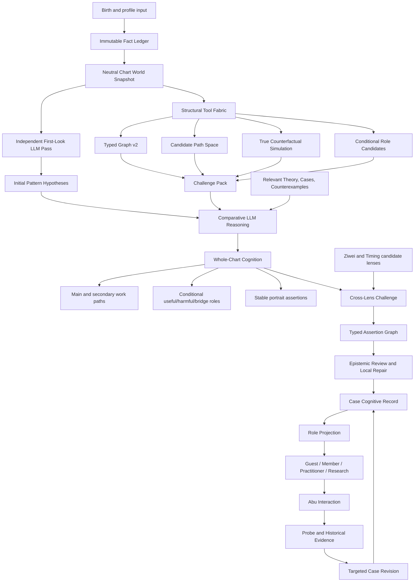

# V50 System Architecture & Cognitive Authority Audit v1

> Status: architecture review and optimization proposal  
> Date: 2026-07-13  
> Scope: Bazi, Ziwei, Graph, Path, Simulation, World Model, LLM cognition, Context, Review, Probe, Case Memory, Product Projection, Abu, training and validation  
> Boundary: this document proposes the next architecture; it does not modify Runtime, Brain, theory, model weights, UI, or production data.

## 0. Executive conclusion

V50 has completed an important strategic correction: the LLM is once again the cognitive subject that understands a chart, while the system provides facts, knowledge, tools, memory, orchestration, and review.

However, the current implementation has not fully caught up with that definition.

The real system today is closer to:

```text
Deterministic facts
-> immature structural heuristics
-> fixed context quotas
-> sequential LLM stages
-> advisory-only review
-> broad API payload
-> UI selectively hides fields
```

The target should be:

```text
Immutable chart facts
-> neutral structural observations
-> candidate path and role space
-> LLM pattern and hypothesis reasoning
-> conditional work-path and useful/harmful-role judgment
-> Ziwei and Timing challenge
-> typed assertions
-> risk-based epistemic review
-> case evidence and targeted revision
-> role-specific product projection
-> Abu-guided interaction
```

The top conclusion is not "let the system decide" or "let the LLM decide everything". It is:

> **The system determines what is factually possible and computationally observable; the LLM determines which interpretation best explains this chart; the review system determines whether that interpretation is grounded, coherent, specific, and appropriately uncertain.**

The current P0 problem is that Graph v1, Path scoring, Role classification, and Ablation are not yet strong enough to be treated as high-priority structural evidence. Some code is visibly specialized around one sample family. Until rebuilt, these outputs must be labeled experimental observations rather than silently steering LLM attention.

## 1. What was audited

The review covered the active production path and adjacent research modules:

```text
BirthInput
-> calendar and pillar resolution
-> Bazi material store
-> Ziwei material bundle
-> Mingli Graph / Path / Role / Analyzer
-> Simulation / Ablation
-> ChartWorldInstance
-> Knowledge retrieval
-> MingliContextCompiler
-> MingliAgent / CognitiveOrchestrator
-> Pattern / Hypothesis / Work Path / Useful God
-> Ziwei integration / Domain reasoning
-> Epistemic review
-> Case workspace / Probe / Deliberation
-> Product API / role modes
-> Abu command runtime
-> synthetic, benchmark, and training scripts
```

Primary source locations:

- `packages/core/engines/`
- `packages/core/graph/`
- `packages/core/simulation/`
- `packages/core/mingli_agent/`
- `packages/core/mechanism/`
- `packages/core/state/`
- `packages/core/timing/`
- `packages/core/abu_runtime/`
- `apps/product/`
- `scripts/`
- `data/validation/`
- `docs/`

## 2. Current architecture: what is actually true

### 2.1 The LLM is already the final cognitive authority

The production `MingliAgent` currently asks LLMs to perform:

1. first-look preview;
2. pattern discovery and competing hypotheses;
3. work path, body-function relation, useful-god reasoning, and portrait;
4. Ziwei integration;
5. prior predictions and a Probe;
6. on-demand domain reasoning;
7. case revision after user interaction.

This is strategically correct. The deterministic modules no longer produce the final reading.

### 2.2 The current "orchestrator" is a stage runner, not yet a reasoning orchestrator

`CognitiveOrchestrator` records stage duration, context hash, model route, and artifact receipts. It does not yet:

- decide which tool to call based on uncertainty;
- request a counterfactual when hypotheses are close;
- retrieve knowledge for a specific dispute;
- ask the Graph for missing candidate paths;
- stop once the context is sufficient;
- conduct targeted reflection on only the failed semantic node.

It is useful infrastructure, but should not be described as the full central brain.

### 2.3 The documented Product Projection Layer is no longer a clean implementation boundary

The current API builds one broad `deepbazi.living_reading.v1` payload containing:

- whole-chart thesis;
- hypotheses;
- work path;
- useful-god reasoning;
- portrait;
- domains;
- prior predictions;
- probes;
- workspace beliefs;
- review metadata;
- cognitive-run metadata;
- full Ziwei profile.

Role differences are partly handled by field hiding and UI rendering. This is weaker than the previously designed principle:

```text
One cognitive record
-> explicit role projection contract
-> Guest / Member / Practitioner / Research output
```

The role projection concept remains correct and should be restored as a real server-side boundary.

## 3. The central authority model

### 3.1 One central cognition system, four authorities

The old word `Brain` should no longer refer to a deterministic decision module. The central cognition system is a composition:

```text
Mingli Cognitive System
= Fact Authority
+ Structural Tool Fabric
+ Context and Tool Orchestrator
+ LLM Cognitive Reasoner
+ Epistemic Review
+ Case Memory
```

| Surface | Authority | May do | May not do |
|---|---|---|---|
| Chart facts | deterministic engines | calculate pillars, hidden stems, ten gods, relations, luck/year material, Ziwei chart facts | invent a reading |
| Structural observations | Graph/Path/Simulation tools | enumerate candidates, measure topology, run true counterfactuals | declare the one true pattern |
| Chart cognition | LLM reasoner | discover pattern, compare hypotheses, choose main and secondary work, form conditional roles | invent chart facts or unsupported relations |
| Epistemic review | deterministic checks plus targeted semantic review | repair mechanical errors, flag contradictions, request local reconsideration | rewrite every difficult reading into a safe template |
| Theory and knowledge | human-led research process | curate, freeze, reject, version, attach evidence | auto-promote an LLM opinion into theory |
| Case evidence | Probe, historical events, practitioner feedback | update the current case belief state | alter natal facts or global theory directly |
| Product experience | projection and Abu | select density, language, interaction, next action | generate new Mingli judgment |

### 3.2 Who determines the work path?

The answer should be deliberately hybrid.

The system should compute:

- all structurally legal candidate paths within a bounded search space;
- source capacity;
- relation direction and continuity;
- seasonal support;
- root and visibility support;
- target receptivity;
- closure and break conditions;
- robustness under real node/edge ablation;
- timing sensitivity;
- contradictory observations;
- missing facts and model limitations.

The system should not collapse these into one unquestionable scalar winner.

The LLM should then:

- decide which candidate best explains the whole chart;
- distinguish main work, secondary work, blocked work, and apparent-but-failed work;
- compare different theory lenses;
- reject a high-scoring path when it conflicts with the whole pattern;
- compose a missing semantic path only if every step maps to valid facts or tool operations;
- explain why candidate A is believed over candidate B.

Therefore:

> **The system defines the candidate and constraint space; the LLM makes the chart-level comparative judgment.**

### 3.3 Can useful god, harmful god, and bridge god be calculated directly?

The system can calculate **role candidates**, but should not freeze one global role without a lens.

The same element or node can have different roles under different questions:

```text
Seasonal lens
Structure lens
Work-path lens
Climate-regulation lens
Timing lens
Domain lens
Repair lens
```

For example, one node can be structurally useful for closing the main path, harmful when over-strengthened, and temporarily useful in a specific timing window. Therefore the target object should not be a flat `useful_god` label. It should be a conditional role lattice:

```yaml
FunctionalRoleCandidate:
  node_ref:
  element:
  lens:
  role: useful | harmful | bridge | converter | blocker | carrier | unresolved
  effect_on_path_refs:
  applicable_conditions:
  invalidating_conditions:
  marginal_effect:
  evidence_refs:
  counter_evidence_refs:
  confidence_band:
```

The tool fabric proposes these candidates. The LLM compares them inside the selected chart hypothesis and produces the final conditional interpretation.

## 4. Critical findings

### P0-1. Graph v1 contains sample-specific structural assumptions

The most serious implementation finding is in `packages/core/graph/`:

- only the `巳酉丑` triple combination is encoded;
- `酉` is fixed as its bridge;
- visible 食神/伤官 stems are automatically marked as output converters;
- pressure-target detection is hardcoded to metal;
- one active-flow rule is explicitly built around output converter plus this triple bridge;
- one wealth-flow shortcut is tied to 甲/乙 day master plus earth nodes.

This is not a general Mingli graph model. It is a research prototype specialized around a familiar case family.

**Decision:** keep it as a useful prototype, but immediately downgrade its authority to `experimental_tool_observation` until Graph v2 is validated across balanced families.

### P0-2. Current ablation is not actual ablation

`run_ablation_simulation` does not remove a node, rebuild the graph, rerun path exploration, and compare the resulting state. It derives a state delta from the same node-importance scores and labels.

This makes the current result circular:

```text
heuristic says node is important
-> "ablation" reuses heuristic
-> result says removing node is important
```

**Decision:** rename current output to `estimated_sensitivity` or rebuild it as real counterfactual simulation. Do not call it causal evidence in production.

### P0-3. Path exploration mixes topology with causality

Current DFS treats many edge types as traversable paths, including same-pillar links, storage, harmony, clash, and directional generation/control. Several are reversed for traversal. This creates candidate sequences that may be connected topologically but are not meaningful causal work paths.

Additional defects:

- reversed traversal reuses the original edge id, so path node direction and original edge direction can disagree;
- path ids use Python's process-randomized `hash()`, so ids are not stable across processes;
- a single path score hides distinct dimensions;
- score priors are not calibrated across chart families.

**Decision:** rebuild path enumeration around typed relation semantics and stable content hashes.

### P0-4. Tool attention can anchor the LLM on unvalidated heuristics

The Context Compiler marks candidate paths and ablations as high-priority by category. Because Graph v1 and ablation are immature, their scores can become an anchoring mechanism rather than neutral assistance.

**Decision:** the first-look pass should initially see immutable facts and neutral relations, not tool rankings. Tool candidates and scores should enter a second challenge pass, clearly labeled by validation status.

### P0-5. Review currently records issues but always passes delivery

`_advisory_review` converts every error to a warning and sets `passed=true`. This was introduced to prevent expensive whole-round LLM retries, which is reasonable for latency, but it also means the review layer currently has no meaningful correction authority.

The correct solution is not returning to full LLM retries. It is a correction matrix:

| Error class | Action |
|---|---|
| schema, enum, missing id, duplicate, invalid citation | repair locally |
| deterministic chart fact conflict with one unique correction | repair from ledger and annotate |
| wording leak or forbidden phrase | redact or replace locally |
| ambiguous causal relation | targeted LLM revision of that assertion only |
| competing theory interpretation | preserve uncertainty; do not auto-repair |
| unsupported high-risk claim | suppress claim and retain review issue |
| generic or template-like cognition | fail professional-quality gate; regenerate only the affected stage if policy allows |

### P1-1. Context is quota-based, not sufficiency-based

The current Context Compiler uses fixed category limits. This is better than dumping the whole world, but it does not prove that the selected context is sufficient for the task.

Knowledge retrieval is also broad keyword matching over a globally constructed term set, followed by taking the first items for every stage. It is not yet query-, hypothesis-, or dispute-conditioned retrieval.

**Decision:** redesign context as:

```text
Stable Core
+ Stage Question
+ Candidate/Challenge Pack
+ Relevant Knowledge
+ Case Memory Delta
```

Then validate sufficiency through context ablation and blind expert quality, not token count alone.

### P1-2. Mechanism, State, Theme, and Decision Confidence are mostly parallel research code

The `mechanism/`, `state/`, and richer `timing/` packages have substantial contracts and tests, but they are not the active production cognition chain. Most are used by scripts and unit tests, not `MingliAgent` production reasoning.

Their current numeric outputs are also predominantly hand-weighted and uncalibrated. For example, Decision Confidence is explicitly marked `calibrated=false` but can still look like a product score.

**Decision:** do not delete the research work. Move it behind an explicit research namespace/status and selectively reuse its contracts after the new cognitive chain proves a need. Avoid pretending that dormant parallel models are production intelligence.

### P1-3. Timing exists in multiple parallel forms

Production `ChartWorldInstance` uses a simple timing material, while richer timing interaction and candidate modules exist separately. This creates multiple meanings of "Timing".

**Decision:** split and consolidate:

1. `TimingFacts`: deterministic luck/year/month calendar facts;
2. `TimingInteractionCandidates`: tool-derived activations and conflicts;
3. `TimingInterpretation`: LLM conditional judgment under the whole-chart hypothesis;
4. `TimingEvidence`: historical events used to calibrate reality mapping.

### P1-4. Ziwei is a valid fact source but not yet a mature second cognitive engine

The `iztro` chart bridge and palace/star extraction provide useful deterministic material. The active world is compiled with overview material, then domain stages filter the broad profile. Domain-specific Ziwei interactions, palace state evolution, and conflict handling remain thin.

**Decision:** keep Ziwei as a supporting lens. It may corroborate, challenge, or localize a Bazi hypothesis, but should not be marketed internally as an equally mature independent judgment engine yet.

### P1-5. Probe evidence semantics are modeled but not used in belief math

Probe evidence records reliability, relevance, evidence kind, source, year, and recurrence. But hypothesis and assertion beliefs are updated by simple strengthen/weaken counts. Reliability and relevance do not affect the result.

**Decision:** use weighted case evidence:

```text
evidence impact
= direction
* reliability
* relevance to target
* independence
* recurrence quality
* source specificity
```

Behavior Probe should calibrate reality mapping. Historical events can support timing assertions. Neither should directly prove structural theory.

### P1-6. Professional percentages are presentation formulas, not calibrated probabilities

Practitioner/Research deliberation currently derives support percentages from confidence bands, citation counts, conditions, and fixed constants. These values are useful sorting heuristics, but they are not empirical probabilities.

**Decision:** display them as `current support` or ordinal bands until calibrated. Always show why, counter-evidence, and what would change the assessment.

### P1-7. Product roles are not yet enforced by a canonical server-side projection contract

The broad public payload exposes internal concepts and relies on UI behavior to decide what appears. This is the source of repeated "engineering information leaking into the user page".

**Decision:** restore explicit server projections:

```text
MingliCognitiveRecord + CaseWorkspace
-> RoleProjection
-> GuestReading
-> MemberReading
-> PractitionerWorkbench
-> ResearchWorkbench
```

Role projection may omit, simplify, reorder, and explain. It may not invent a new chart judgment.

### P2-1. Validation infrastructure is broad but fragmented

The repository contains v1 and v2 taxonomies, benchmark matrices, synthetic fixtures, cognitive benchmarks, metamorphic suites, model comparisons, and training gates. This is valuable, but the scripts do not yet form one canonical evaluation stack. Some scripts use v1 fixtures while newer builders produce v2.

Many checks validate contracts, isolation, and schema completeness rather than professional Mingli cognition.

**Decision:** define one canonical benchmark manifest and retire duplicate runners from active use.

## 5. Module disposition matrix

| Module | Current role | Decision | Target role |
|---|---|---|---|
| Birth/calendar engine | deterministic facts | KEEP + harden | immutable fact authority |
| Bazi material engine | pillars, hidden stems, ten gods, simple relations/strength | KEEP + REBUILD selected parts | full factual ledger; strength features labeled by method/confidence |
| Ziwei chart bridge | deterministic Ziwei chart | KEEP | Ziwei fact authority |
| Ziwei material/dynamic evidence | overview extraction | EVOLVE | domain-specific candidate observations |
| Graph builder v1 | general-looking but sample-specialized graph | REBUILD | typed neutral relation graph v2 |
| Path explorer v1 | generic DFS plus scalar score | REBUILD | typed candidate work-path search with vector metrics |
| Role classifier v1 | fixed converter/bridge/anchor labels | REPLACE | conditional role candidate lattice |
| Graph analyzer v1 | hand-weighted salience | DOWNGRADE TO RESEARCH | one candidate attention policy, benchmarked against experts |
| Simulation/Ablation v1 | heuristic restatement | REBUILD | actual graph/path recomputation under controlled mutation |
| Mechanism package | AST research representation | RETAIN AS RESEARCH | optional explanation representation after cognition |
| Unified State/Theme | research semantic adapters | RETAIN AS RESEARCH | future cross-system state language, not current judge |
| Decision Confidence formula | directional product research | RENAME/DOWNGRADE | uncalibrated decision-support indicator |
| Timing packages | duplicated fact/candidate semantics | MERGE | facts, candidates, interpretation, evidence split |
| ChartWorld compiler | combines facts and tool observations | REFACTOR | versioned World Snapshot with authority metadata |
| Knowledge cards | useful research asset | KEEP | versioned world knowledge with theory/evidence status |
| Knowledge retrieval | global keyword matching | REBUILD | stage-, hypothesis-, and counterexample-aware retrieval |
| Context Compiler | fixed quotas | REBUILD | blind-first plus challenge-pack minimum sufficient context |
| Cognitive Orchestrator | sequential stage runner | KEEP + EVOLVE | uncertainty-driven tool and context orchestration |
| LLM Reasoner | final chart cognition | KEEP AS CENTER | pattern, hypothesis, work, roles, assertions, targeted revisions |
| Cognitive contracts | good typed foundation | EXTEND | candidate linkage, theory lens, uncertainty, comparison receipts |
| Epistemic review | citation and regex checks, advisory pass | SPLIT | mechanical repair, semantic peer review, safety suppression |
| Case workspace | case belief and history | KEEP + REBUILD belief math | weighted evidence graph and local revision memory |
| Probe planner | role copy plus heuristic information value | KEEP + EVOLVE | actual Next Best Question selection |
| Professional deliberation | useful workflow, synthetic support percentages | KEEP + RELABEL | case-level expert override/fork with reasons, not global truth |
| Product API payload | broad living reading | SPLIT | canonical role-specific output contracts |
| Abu command runtime | regex command resolver | KEEP AS SAFE BASE | deterministic capability execution plus LLM parsing/expression |
| Abu visual/UI | distinctive product shell | KEEP | expression and navigation over the corrected cognition chain |
| Validation scripts | many valuable lanes | CONSOLIDATE | one benchmark registry and reproducible audit packet |
| Weight training | currently gated | KEEP GATED | no weight tuning before expert gold and sealed blind set |

## 6. Target cognitive architecture



### 6.1 Two-pass attention to avoid tool anchoring

Pass A should be an independent first look:

```text
immutable ledger
+ neutral structural relations
+ limited seasonal/root facts
-> LLM produces attention and 2-3 hypotheses
```

Pass B should challenge that first look:

```text
initial hypotheses
+ candidate path space
+ actual ablations
+ counterexample knowledge
+ omitted critical facts
-> LLM compares, rejects, revises, or preserves uncertainty
```

This design lets the system help the LLM without telling it the answer before it has looked at the chart.

### 6.2 Candidate work-path contract

Replace the text-only work-path contract with an auditable comparison object:

```yaml
WorkPathCandidate:
  candidate_id:
  origin: system_enumerated | llm_composed
  node_refs:
  relation_refs:
  source_capacity:
  flow_continuity:
  seasonal_support:
  root_support:
  target_receptivity:
  closure:
  robustness:
  timing_sensitivity:
  contradiction_refs:
  missing_information:
  theory_lenses:
  evidence_refs:

WorkPathDecision:
  selected_main_path_id:
  secondary_path_ids:
  blocked_path_ids:
  rejected_path_ids:
  comparison_reasons:
  unresolved_competition:
```

Do not convert the vector into a single truth score before LLM comparison.

### 6.3 Assertion graph, not a report template

The cognitive output should be a case-level assertion graph:

```text
Chart hypothesis
-> work path
-> functional roles
-> stable portrait
-> domain causal chain
-> timing condition
-> observable prediction
-> falsifier
-> Probe
```

Each assertion must record:

- what kind of claim it is;
- which hypothesis it depends on;
- supporting and counter evidence;
- conditions and falsifiers;
- whether it is stable, timing-sensitive, domain-specific, or unresolved;
- which product roles may see it.

The final user experience can be concise without making the underlying cognition shallow.

## 7. Context and model optimization

### 7.1 What each LLM stage should see

| Stage | Required context | Excluded by default |
|---|---|---|
| Independent first look | immutable ledger, visible/hidden structure, season/root facts, neutral relations | path rankings, expected labels, prior user biography, domain templates |
| Hypothesis challenge | first-look hypotheses, candidate paths, true ablations, counterexamples, critical omissions | unrelated domains and full case history |
| Work and role reasoning | selected plus strongest alternative hypothesis, path candidates, role candidates, applicable theory | entire raw world dump |
| Ziwei integration | frozen Bazi cognition, only relevant palace/star facts, discrepancies | unrelated palaces and duplicated chart payload |
| Domain reasoning | frozen whole-chart cognition, domain facts, domain-specific Ziwei/Timing candidates, user question | other domain prose |
| Probe revision | affected assertions/hypotheses, new evidence, previous delta | full regeneration prompt |

### 7.2 Prompt and model policy should be trained as a system policy

Before any weight training, V50 should optimize a policy tuple:

```text
model
+ task split
+ context composition
+ tool visibility
+ temperature/thinking
+ output contract
+ local repair policy
```

Model selection should be evaluated by professional cognition quality, not schema compliance alone. A faster model may handle intake, expression, or low-risk explanation, while the strongest validated cognitive model handles pattern and work-path comparison.

The optimization target is not "smallest latency at any cost". It is:

```text
professional quality
* cross-chart discrimination
* factual reliability
* stability
* useful uncertainty
per second and per token
```

## 8. Probe and case-memory redesign

### 8.1 Probe is a Next Best Question, not a report footer

Every Probe must identify:

- the exact hypothesis or assertion competition;
- the expected partitions of possible answers;
- why the user can reliably observe the answer;
- which evidence semantics the answer will have;
- what is allowed to change;
- what must remain unchanged.

### 8.2 Different roles require different questions

| Mode | Probe objective | Example style |
|---|---|---|
| Guest | recognition without technical burden | which observable response is more like you |
| Member | self/timing/decision clarification | current situation, repeated behavior, and one actionable distinction |
| Practitioner | case discrimination | compare two named professional hypotheses with evidence and counter-evidence |
| Research | falsification and anomaly capture | seek cases that fit neither hypothesis and preserve outliers |

### 8.3 Historical years are useful, but only for the right target

Asking "what happened in 2023?" can be high-quality evidence when it tests a timing assertion. It should not be used to prove a natal structure theory by itself.

Recommended semantics:

```yaml
HistoricalEventEvidence:
  year:
  event_class:
  source:
  reliability:
  timing_relevance:
  structural_relevance:
  supports_assertion_refs:
  weakens_assertion_refs:
  does_not_support_theory_refs:
```

### 8.4 After a Probe, the chart does not change

The following remain immutable:

- pillars;
- hidden stems;
- ten gods;
- natal graph facts;
- natal structural relations.

The following may change locally:

- hypothesis belief;
- domain assertion status;
- hidden-attribute belief;
- timing-reality mapping;
- next question;
- selected product explanation.

The affected semantic node should be re-evaluated, not the entire chart regenerated.

## 9. Training and validation redesign

### 9.1 Separate five things currently called training

| Lane | What changes | Evidence source | Weight training? |
|---|---|---|---|
| Fact engine validation | calendar and chart correctness | authoritative calculators and fixtures | no |
| Structural tool calibration | Graph, paths, roles, ablation | synthetic controlled variants and expert structural labels | no model weights |
| Retrieval/context optimization | what the LLM sees | expert preference, omission tests, context ablation | no model weights initially |
| Cognitive policy evaluation | model/prompt/tool-stage policy | sealed expert cases, pairwise review, V30/V50/new comparison | no, until ready |
| Case reality calibration | assertion and Probe mapping | historical, behavior, practitioner, population evidence | case policy first |

### 9.2 What synthetic charts should validate

Synthetic charts are first-class structural evidence, but they must test structural invariants, not desired prose.

Use them for:

- relation completeness;
- path appearance/disappearance;
- role change under one controlled mutation;
- true ablation response;
- stable natal facts under timing mutation;
- timing activation without rewriting the natal chart;
- equivalent representations producing equivalent candidate spaces;
- id and output reproducibility.

Do not use unreviewed synthetic expected labels as gold for the final LLM reading.

### 9.3 Balanced coverage must replace familiar-chart repetition

The benchmark should balance at least these axes:

```text
10 day-master/polarity families
12 month environments
strong / weak / contested / follow-structure candidates
visible vs hidden decisive nodes
rooted vs rootless
complete / half / broken combinations
clash / harmony / punishment / harm / destruction
output / wealth / officer-killing / resource / peer flow families
closed / conditional / broken / ambiguous work paths
single dominant vs competing mechanisms
timing reinforcement / reversal / insufficient timing
Ziwei agreement / tension / unavailable
exact / approximate / unknown birth time
```

The 518K distribution audit remains useful for detecting distribution collapse, but large volume cannot replace expert labels for cognition.

### 9.4 Canonical evaluation stack

Create one manifest with four suites:

```text
Suite A: deterministic fact regression
Suite B: structural metamorphic and counterfactual validation
Suite C: blind cognitive benchmark
Suite D: product task-completion and interaction validation
```

Critical cognitive metrics:

- fact fidelity;
- first-look salience quality;
- minimum hypothesis coverage;
- strongest-alternative quality;
- work-path causal coherence;
- conditional role accuracy;
- counter-evidence use;
- same-chart stability;
- cross-chart discrimination;
- controlled-variant sensitivity;
- template similarity;
- assertion falsifiability;
- blind expert preference;
- latency and token cost.

### 9.5 Professional reading rubric

Hard gates:

1. no invented chart facts;
2. no reversed generating/controlling relation;
3. no contradictory ten-god identity;
4. no unsupported exact event claim;
5. at least one genuine alternative hypothesis;
6. main work path has source, transformation, target, closure, and failure conditions;
7. claims are distinguishable from other charts.

Suggested 100-point score:

| Dimension | Points |
|---|---:|
| Fact fidelity | 15 |
| Pattern salience | 15 |
| Hypothesis comparison | 15 |
| Work-path causal coherence | 20 |
| Conditional role/useful-harmful logic | 10 |
| Domain specificity | 10 |
| Timing and cross-lens integration | 5 |
| Falsifiability and Probe quality | 5 |
| Readability and practical value | 5 |

No model or prompt policy should be promoted using a single total score. Hard-gate failure overrides the total.

## 10. Optimization roadmap

### Slice 0: authority stabilization

Goal: stop unvalidated tool output from masquerading as structural truth.

- label Graph/Path/Role/Ablation v1 as experimental;
- remove their automatic high-priority authority from independent first look;
- define canonical `fact`, `tool_observation`, `hypothesis`, `assertion`, and `evidence` semantics;
- freeze one current architecture document and mark superseded docs;
- do not expand domains or add new template output.

Exit condition: LLM can perform an independent first look without unvalidated expected answers or graph-score anchoring.

### Slice 1: factual world completeness

Goal: make the world model trustworthy before improving judgment.

- complete branch and stem relation coverage;
- make relation provenance explicit;
- separate branch dominant element from hidden-stem interactions;
- version strength calculations by method and confidence;
- unify Timing facts;
- add reproducibility tests for all ids and facts.

Exit condition: deterministic facts pass authoritative and metamorphic regression across balanced families.

### Slice 2: structural tool fabric v2

Goal: compute a real candidate space rather than a hidden verdict.

- typed Graph v2;
- causal path grammar;
- vector path metrics;
- actual node/edge counterfactual recomputation;
- conditional role candidates;
- expert-labeled attention benchmark;
- no chart-specific hardcoding.

Exit condition: controlled mutations change only the expected structural candidates, and expert review finds acceptable recall of important paths.

### Slice 3: cognitive vertical slice v2

Goal: prove that World + Tools + LLM is better than V30 and current V50.

- independent first look;
- challenge pack;
- candidate comparison;
- main/secondary/blocked work paths;
- conditional functional roles;
- typed assertion graph;
- targeted local semantic review;
- one whole-chart plus career/wealth vertical slice first.

Exit condition: blind experts prefer the new slice over V30 and current V50 on salience, causal coherence, specificity, and factual reliability.

### Slice 4: evidence and Probe intelligence

Goal: make interaction genuinely improve the current case.

- weighted evidence impact;
- independence and recurrence handling;
- historical timing evidence;
- Next Best Question selection;
- targeted assertion revision;
- practitioner/research anomaly preservation.

Exit condition: Probe answers reduce the intended uncertainty without altering immutable chart facts or unrelated assertions.

### Slice 5: model/context policy optimizer

Goal: systematically find the best model, prompt, context, and repair policy.

- sealed benchmark manifest;
- model routing experiments;
- context ablation;
- prompt-policy variants;
- latency/quality frontier;
- no automatic promotion;
- no weight training before expert-gold readiness.

Exit condition: a reproducible policy beats the current baseline without hidden holdout leakage.

### Slice 6: product projection and Abu alignment

Goal: let users experience the improved cognition without seeing the machinery.

- restore server-side role projection;
- keep Member focused on understanding and decisions;
- keep Practitioner focused on comparison and judgment;
- keep Research focused on theory/evidence audit;
- let Abu navigate, clarify, execute capabilities, and express next questions;
- never let Abu become an ungrounded second Mingli brain.

Exit condition: each role completes its user job from the same cognitive record, with no internal-engine leakage and no new claims introduced by presentation.

## 11. Documentation and code cleanup policy

Do not perform another blind deletion pass. Use an authority-driven cleanup:

1. declare one canonical current architecture document;
2. give every major package a status: production, experimental, research, deprecated, or archived;
3. move superseded architecture and phase reports to an archive index with date and replacement link;
4. remove dead repair prompts and unreachable branches only after call-site and test proof;
5. separate generated reports and validation data from hand-authored architecture docs;
6. never keep two active definitions of Brain, Timing, Confidence, or Projection;
7. preserve research history, but prevent old docs from appearing as current design.

## 12. What should not happen next

- Do not let Graph v1 select the final work path.
- Do not let the LLM invent calendar or chart facts.
- Do not use one scalar path score as truth.
- Do not call heuristic sensitivity a real ablation.
- Do not treat a useful god as one global fixed element independent of lens and condition.
- Do not train weights from synthetic expected contracts or Teacher outputs.
- Do not promote a model because it follows JSON better.
- Do not use Probe agreement as proof of structural theory.
- Do not expose one giant internal payload and depend on CSS/JavaScript to create product boundaries.
- Do not add more domains before whole-chart cognition is demonstrably professional.
- Do not solve generic output with more report templates.
- Do not send every mechanical error back to the LLM.
- Do not silently pass every semantic failure either.

## 13. Final architecture decision

The V50 foundation is not wasted. The following are durable assets:

- typed contracts;
- deterministic fact engines;
- Ziwei calculation bridge;
- knowledge cards and evidence principles;
- staged LLM cognition;
- case storage and jobs;
- Probe boundaries;
- practitioner/research workflow concepts;
- role and journey design;
- Abu product identity.

The parts that must be re-positioned or rebuilt are:

- Graph/path/role/ablation authority;
- minimum sufficient context;
- knowledge retrieval;
- functional-role reasoning;
- epistemic repair policy;
- evidence-weighted case belief;
- canonical evaluation stack;
- server-side product projection.

The final definition should be frozen as:

> **DeepBazi is a professional Mingli cognitive system in which deterministic engines establish the chart world, structural tools construct and test candidate explanations, an LLM performs whole-chart comparative reasoning, an epistemic review system protects facts and coherence, and case evidence continuously calibrates the current reading without contaminating global theory.**

Chinese mission-level architecture statement:

> **系统负责建立可信的命理世界、枚举可能、计算变化并保存证据；LLM 负责像命理师一样发现重心、比较假设、形成做功与领域判断；验证系统负责保证它没有脱离事实、忽略反证或退化成模板。**

