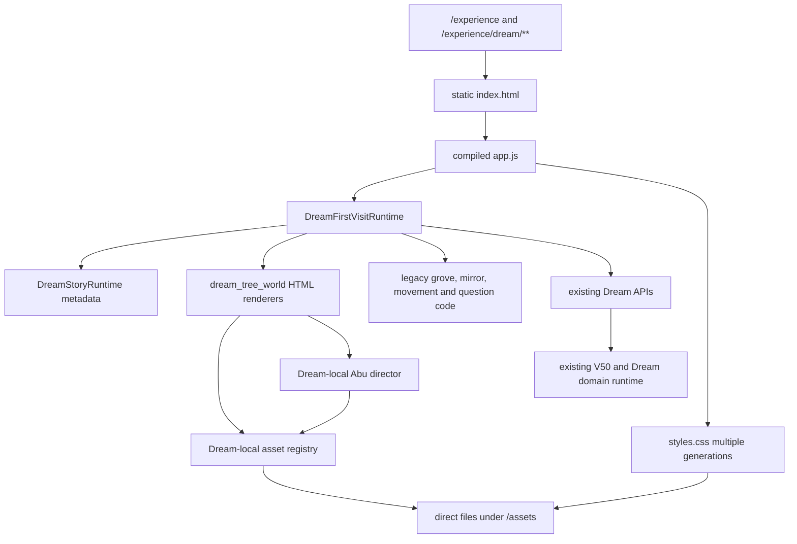
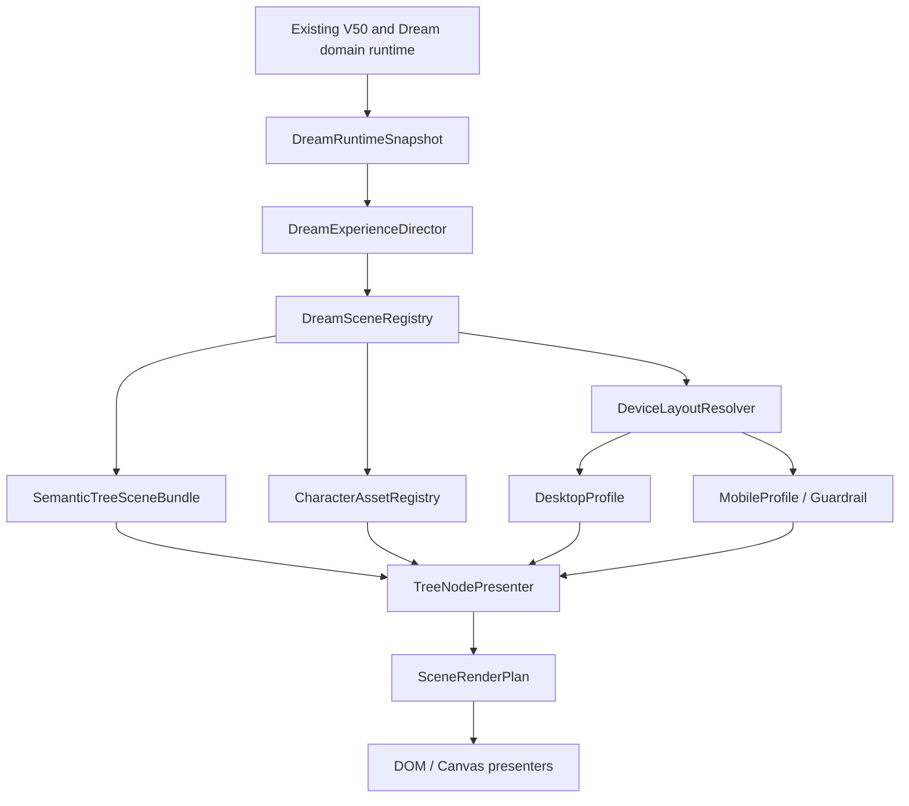
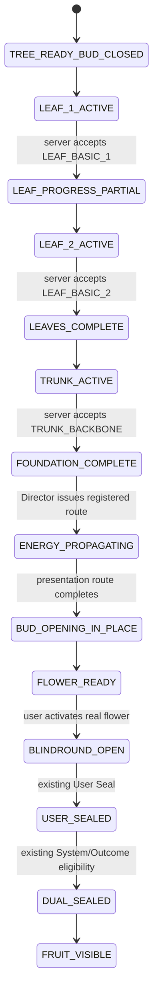

# ABU Dream Architecture Rebase 08 - Phase L0

## 0. Phase receipt

```yaml
ABU-DREAM-ARCHITECTURE-REBASE-08_PHASE_L0:
  status: READY_FOR_OWNER_REVIEW
  phase: L0
  implementation: NOT_STARTED
  visual_code_changed: false
  runtime_code_changed: false
  asset_changed: false
  legacy_deleted: false
  accepted_transition_changed: false
  abu_replaced: false
  push_or_deploy: false
  report_only: ABU_DREAM_ARCHITECTURE_REBASE_08_PHASE_L0_REPORT.md
```

Audit date: `2026-07-24`

Repository:

```text
/Users/liujin/DEV/AIProjects/bazi-v50-cag04-reconcile/qiazhi/v50
```

Shared authoritative reads:

```text
/阿布知命/00_项目总索引/ABU_KNOWS_MASTER_DOCUMENT_INDEX.md
/阿布知命/30_Codex实施令/ABU_DREAM_ARCHITECTURE_REBASE_AND_DEVICE_POLICY_08.md
```

Inherited read-only evidence:

```text
docs/product/ABU_DREAM_RUNTIME_OWNERSHIP_TRACE_09_REPORT.md
```

The shared master index records:

```yaml
Recovery_07_Phase_A: OWNER_ACCEPTED
ARCHITECTURE_08_PHASE_L0: AUTHORIZED
SEMANTIC_TREE_VISUAL: NOT_IMPLEMENTED
```

This report performs the authorized L0 architecture and ownership work only. It
does not assert that the semantic tree scene has been implemented.

## 1. Executive verdict

```yaml
CURRENT_DREAM_DOMAIN_RUNTIME: KEEP
CURRENT_DREAM_PRESENTATION_OWNER: CONFLICTING
CURRENT_BROWSER_RENDER_OWNER: DreamFirstVisitRuntime_PLUS_HTML_HELPERS_PLUS_CSS
CURRENT_DREAM_STORY_DIRECTOR: METADATA_ONLY
TARGET_PRESENTATION_OWNER: DreamExperienceDirector
TARGET_ASSET_OWNER: DreamSceneRegistry
TARGET_FIXED_TREE_BUNDLE: SemanticTreeSceneBundle
TARGET_CHARACTER_OWNER: CharacterAssetRegistry
TARGET_DEVICE_MODEL: ONE_SCENE_GRAPH_WITH_TWO_LAYOUT_PROFILES
REAL_TREE_ORGAN_ANCHORS: CONTRACT_DEFINED_NOT_IMPLEMENTED
SERVER_NODE_SLOT: MISSING
PHASE_B_CUTOVER: NOT_AUTHORIZED
```

The existing V50 and Dream business chain is not the problem and must not be
replaced:

```text
V50 LifeCase / CanonicalScene / Assertions
→ DreamTruthAdapter / DreamProjection
→ DreamVisit / Navigation / Control Lease
→ BlindRound / double Seal / OutcomeEvidence
→ Reveal / EvaluationRecord / KnowledgeSeed
```

The ownership break is entirely in presentation:

```text
DreamStoryRuntime says what state exists
DreamFirstVisitRuntime decides what actually renders
dream_tree_world.ts builds HTML and derives questions
dream_asset_registry.ts chooses raw paths
styles.css chooses composition and also owns some URLs
compiled app.js is the file the browser actually executes
```

Phase L0 therefore freezes a strangler-style target. Phase B must route one scene
at a time through the new presentation owner while the existing backend remains
the sole source of business truth.

## 2. Current versus target architecture

### 2.1 Current runtime



### 2.2 Target presentation ownership



The target is not a second Dream Runtime. `DreamExperienceDirector` consumes
existing domain snapshots and emits presentation plans. It cannot create a
LifeCase fact, a question answer, a Seal, an OutcomeEvidence record, or a
PathAssertion.

## 3. Product, development, and legacy route map

| Route or entry | Current owner | Runtime class | L0 disposition |
|---|---|---|---|
| `/experience` | `apps/product/product_surface.py` | Product shell | `KEEP` |
| `/experience/dream` | `apps/product/product_surface.py` | Same static shell as `/experience` | `KEEP` |
| `/experience/dream/{dream_path}` | `apps/product/product_surface.py` | Same static shell, client routing | `KEEP` |
| `/api/v50/dream/**` | `apps/product/dream_api.py` | Dream domain and game APIs | `KEEP` |
| `/assets/**` | `product_surface.py` | Product static assets | `KEEP`, registry-gate future Dream loads |
| `/experience-static/**` | `product_surface.py` | Compiled product and internal tools | `KEEP` |
| `/experience-static/internal-tools/abu-motion-gallery-v1/` | static internal tool | Abu asset QA | `KEEP_DEV_ONLY` |
| `/abu-theater` | `product_surface.py` redirect | Internal theater | `KEEP_DEV_ONLY` |
| old `/experience-static/prototypes/abu-says-*` | redirect to theater | Legacy prototype entry | `QUARANTINE_ROUTE` |
| `/theater`, `/theater/studio` | separate static media theater | Studio tool, not Dream Runtime | `KEEP_DEV_ONLY`, never import as Dream owner |
| `/app` | redirect to `/experience` | Compatibility entry | Outside this Phase |

There is one product page bundle for `/experience` and all Dream routes. This is
compatible with the target only if the Director becomes the sole Dream
presentation owner inside that bundle.

## 4. Legacy inventory and disposition

Disposition vocabulary:

```text
KEEP
ADAPT
QUARANTINE
DELETE_AFTER_CUTOVER
UNKNOWN_OWNER
```

No item is moved or deleted in L0.

### 4.1 Domain and API owners

| Path | Current responsibility | Disposition | Reason |
|---|---|---|---|
| `packages/experience/dream.py` | grants, visits, encounter/tree/reveal contracts | `KEEP` | Existing domain owner |
| `packages/experience/dream_game.py` | BlindRound, projections, Seals, evidence, evaluation, KnowledgeSeed | `KEEP` | Existing game truth owner |
| `packages/experience/dream_navigation.py` | anchors, lease, fencing, projection bindings, Canonical Abu projection | `KEEP` | Existing navigation truth owner |
| `apps/product/dream_service.py` | truth adapter, eligibility and journey orchestration | `KEEP` | Existing service owner |
| `apps/product/dream_game_service.py` | game state, system Seal, user Seal, reveal and evaluation | `KEEP` | Existing game service owner |
| `apps/product/dream_navigation_service.py` | control lease, anchor resolution, recovery and departure | `KEEP` | Existing navigation owner |
| `apps/product/dream_projection.py` | role-filtered Dream projections and OneCanvas verification | `KEEP` | Existing projection owner |
| `apps/product/dream_api.py` | `/api/v50/dream/**` HTTP contract | `KEEP` | Existing API owner |
| Dream store contracts and Postgres/memory stores | persistence and atomic commits | `KEEP` | Existing storage owner |

### 4.2 Presentation source

| Path | Current responsibility | Disposition | Cutover condition |
|---|---|---|---|
| `apps/product/experience_shell/src/dream_story_contracts.ts` | business/presentation names and commands | `ADAPT` | Split domain-facing snapshot types from scene registry types |
| `dream_story_reducer.ts` | maps server state to story state | `ADAPT` | Becomes Director input reducer; cannot render |
| `dream_story_runtime.ts` | local story snapshot and scene metadata | `ADAPT` | Becomes thin state bridge under Director |
| `dream_scene_director.ts` | current scene metadata table | `ADAPT` | Replace metadata-only table with Director + versioned registry boundary |
| `dream_runtime.ts` | 3,425-line actual orchestration, rendering, movement, mirror, game and legacy state owner | `ADAPT` then `QUARANTINE` by responsibility | Director owns transitions; presenters receive render plans |
| `dream_tree_world.ts` | porch, fixed tree, question-map HTML and frontend question derivation | `QUARANTINE` | Replace only after semantic bundle scene passes Owner QA |
| `dream_asset_registry.ts` | direct Dream URL table | `ADAPT` | Fold into validated `DreamSceneRegistry` and `CharacterAssetRegistry` |
| `dream_abu_motion_director.ts` | Dream-local Abu role-to-file resolver | `ADAPT` | Must resolve through CharacterAssetRegistry |
| `dream_entry_transition.ts` | accepted ABU_03 overlay and handoff | `KEEP`, then Director-wrap | Visual behavior remains unchanged; Director only gains ownership of invocation |
| `dream_home_portal.ts` | home tree and sleeping Abu presentation | `ADAPT` | Register assets; preserve accepted entry chain |
| `main.ts` | route boot and handoff | `ADAPT` | Route only boots Director, not scene-specific logic |
| compiled `static/experience/app.js` | actual browser executable | `GENERATED_AFTER_CUTOVER` | Must be produced from reviewed source, never hand-owned |
| `static/experience/styles.css` | all scene generations, direct assets, final composition | `QUARANTINE_BY_SELECTOR` | New scenes get scoped style ownership; old blocks removed only after cutover |

### 4.3 Active legacy responsibilities inside `dream_runtime.ts`

| Responsibility | Current evidence | Disposition |
|---|---|---|
| Old free-roam movement and direct ground coordinates | phases and handlers remain in the monolith | `QUARANTINE` |
| Own-tree recognition and tree-distance hit logic | executable but no longer aligned with current game shell | `QUARANTINE` |
| Root mirror and first-visit path | mixed with game flow | `ADAPT` only where Return/Departure still needs it |
| Game orchestration | active API calls and state | `ADAPT`; keep domain commands, remove rendering decisions |
| Three-tree porch rendering | calls `renderDreamTreePorch` directly | `ADAPT` to registry scene |
| Fixed tree idle rendering | calls a baked full-scene image | `QUARANTINE` after semantic bundle cutover |
| Tree question-map rendering | compiled but hidden behind `ENABLE_PHASE_B_TREE_QUESTIONS = false` | `QUARANTINE`; never enable as Phase B implementation |
| Frontend question and correct-answer derivation | `buildDreamTreeQuestions()` | `QUARANTINE_P0`; conflicts with server Question Authority |

### 4.4 CSS generations

The current stylesheet contains multiple declarations for the same semantic
surfaces:

```text
.dream-tree-porch-camera: 6 definitions
.dream-tree-porch-tree: 23 definitions
.dream-game-layer.is-tree-world: 3 definitions
.dream-tree-world-shell: 13 definitions
.dream-question-tree-stage: 4 definitions
```

These blocks represent the original grove, earlier first-visit work, the tree
world reconstruction, visual rebuild, Ghost Orbit, ABU_03 handoff, and porch-v5.
They are not deleted in L0.

Quarantine rule for Phase B:

```text
new registry scene uses a scene-version root selector
→ no legacy selector may target inside that root
→ Owner accepts the new scene
→ old selector reachability is proven zero
→ only then mark the old block DELETE_AFTER_CUTOVER
```

### 4.5 Asset and registry inventory

| Registry or bundle | Current claim | Physical/runtime status | Disposition |
|---|---|---|---|
| `config/media_asset_registry_v1.json` | `DREAM_THREE_TREE_PORCH_V3` | referenced Manifest is missing | `UNKNOWN_OWNER` |
| `dream_asset_registry.ts` | direct porch-v5 and fixed-tree paths | product reachable | `ADAPT` |
| compiled `app.js` | duplicate hardcoded paths | browser active | `GENERATED_AFTER_CUTOVER` |
| `runtime-foundation-v1/manifest.json` | mixed runtime foundation index | present, not sole resolver | `ADAPT` |
| `porch-v5/manifest.json` | clean background + three alpha actors | present; full bundle not Owner-locked | `QUARANTINE_PENDING_OWNER_ASSET_DECISION` |
| `director-v2/manifest.json` | baked fixed-tree and transition derivatives | present; not semantic scene bundle | `REFERENCE_ONLY` / `QUARANTINE` |
| global Abu `motion-registry.js` | broad action catalog | present | `ADAPT` into CharacterAssetRegistry |
| Abu actor `library.json` | action inventory/lifecycle | present | `KEEP_SOURCE_CATALOG` |
| Dream-local Abu director | separate role resolver | active | `ADAPT`, then remove duplicate file ownership |

## 5. Conflicting implementation matrix

| Concern | Competing owners | Proven conflict | L0 resolution |
|---|---|---|---|
| Scene state | `DreamStoryRuntime` vs `DreamFirstVisitRuntime` | story scene is metadata; monolith chooses actual HTML | Director becomes sole scene-transition owner |
| Scene asset | global media registry vs Dream-local registry vs CSS | global points to missing v3; live bundle loads v5; CSS also owns URLs | Scene Registry is sole asset resolver |
| Render composition | `dream_tree_world.ts` vs `dream_runtime.ts` vs CSS | HTML, state and z-order are split | SceneRenderPlan owns layer list and order |
| Fixed tree questions | server BlindRound/Projection vs `buildDreamTreeQuestions()` | frontend selects questions and correct options from allowed data | server issues question + `node_slot`; frontend presents only |
| Abu identity | Dream-local Director vs global motion registry vs actor library | defaults and status differ | CharacterAssetRegistry locks identity, variant and hash |
| ABU_03 status | shared Owner record vs local Manifest/global registry | shared baseline accepted; files still say awaiting review | registry must carry Owner acceptance record in Phase B |
| Device layout | repeated CSS media queries | no explicit semantic-to-screen resolver | one scene graph, two profile records |
| Source/build | TypeScript source vs compiled `app.js` | browser executes a second mutable copy | source is authoritative; generated artifact follows reviewed build |
| Legacy fallback | direct constants, baked frames, preload errors ignored | unapproved visuals can still render | Registry fail-closed by scene/bundle/hash/status |

## 6. Target `DreamExperienceDirector`

### 6.1 Sole responsibility

`DreamExperienceDirector` is the only presentation coordinator allowed to:

- synchronize an existing server/domain snapshot with a presentation state;
- choose the next registered `scene_id`;
- validate that the scene is compatible with the current business state;
- obtain a validated asset/character/layout bundle from registries;
- issue a `SceneRenderPlan`;
- coordinate accepted transitions, return, recovery and departure;
- consume presentation completion events without treating them as business truth;
- fail closed when a scene, asset, hash, authorization or binding is invalid.

It is not allowed to:

- create or modify LifeCase, CanonicalScene, Assertions or PathAssertion;
- invent questions, answers, relations, evidence or outcome data;
- submit a Seal without the existing user command and API;
- advance server progress because an animation completed;
- infer an asset from a relative path, CSS class, filename or fallback convention;
- maintain a second copy of DreamVisit, BlindRound or Navigation truth.

### 6.2 Inputs

```yaml
DreamRuntimeSnapshot:
  visit: existing_DreamVisitView
  navigation: existing_control_lease_and_anchor_projection
  encounter: existing_DreamEncounterProjection
  selected_tree: existing_DreamTreeProjection_or_null
  game_attempt: existing_DreamGameAttemptView_or_null
  reveal: existing_DreamGameResult_or_null
  authorization_version: server_value
  projection_version: server_value
  world_projection_ref: opaque_server_value

DreamPresentationContext:
  current_scene_id: registered_id_or_empty
  previous_scene_id: registered_id_or_empty
  transition_state: idle_or_running_or_interrupted
  reduced_motion: boolean
  device_profile_id: resolved_profile
  recovery_checkpoint: presentation_only
```

### 6.3 Output

```yaml
SceneRenderPlan:
  scene_id: string
  scene_version: string
  semantic_scene_graph_id: string
  asset_bundle_id: string
  character_variant_id: string
  layout_profile_id: string
  ordered_layers: registered_layer_refs
  active_organ_anchor_id: string_or_empty
  organ_states: server_derived_presentation_states
  allowed_commands: existing_domain_commands_only
  transition_contract: registered_transition
  fail_closed_policy: registered_policy
```

No raw URL, question answer, hidden outcome, or ad hoc pixel coordinate may be
added by a component after this plan is issued.

## 7. Target `DreamSceneRegistry`

### 7.1 Registry record

```yaml
DreamSceneRegistryEntry:
  scene_id: string
  scene_version: string
  compatible_business_states: list
  semantic_scene_graph_id: string
  asset_bundle_id: string
  character_variant_id: string
  desktop_layout_profile_id: string
  mobile_layout_profile_id: string
  entry_transition_id: string_or_none
  exit_transition_id: string_or_none
  camera_contract: string
  reduced_motion_policy: string
  fallback_policy: FAIL_CLOSED_or_APPROVED_STATIC
  owner_acceptance_ref: string
  registry_record_hash: sha256
```

Required invariant:

```text
unregistered path or hash
→ no scene plan
→ fail closed
```

CSS cannot name asset URLs. Components cannot construct paths.

### 7.2 Initial scene inventory for Phase B planning

| `scene_id` | Existing business source | Target bundle status | L0 action |
|---|---|---|---|
| `dream.home.portal` | visit availability / home shell | current home tree and sleeping fallback need registry record | Define only |
| `dream.entry.abu03` | `ENTERING_DREAM` | ABU_03 Hash-resolved and Owner-accepted | Define and lock; do not modify |
| `dream.porch.three_tree` | no attempt / encounter cards | accepted full three-tree bundle unresolved | Registry slot only, fail closed until approved |
| `dream.tree.commit_transition` | selected round start | current `tree-enter-clean.mp4` transitional | Registry slot only |
| `dream.tree.fixed.empty` | selected attempt, before questions | semantic bundle missing | First Phase B cutover candidate |
| `dream.tree.fixed.question` | foundation progress | semantic organs and server node slots missing | Not implementable yet |
| `dream.flower.blindround` | question flower state | reuse existing BlindRound truth | Registry slot only |
| `dream.fruit.dual_seal` | both judgments sealed | reuse existing double-Seal truth | Registry slot only |
| `dream.reveal.triptych` | revealable/result | reuse existing result truth | Registry slot only |
| `dream.return.departure` | existing navigation/departure state | existing controller remains authoritative | Director orchestration only |

## 8. `SemanticTreeSceneBundle`

### 8.1 Bundle contract

```yaml
SemanticTreeSceneBundle:
  bundle_id: string
  bundle_version: string
  scene_graph_id: string
  canonical_artboard:
    width: integer
    height: integer
    coordinate_space: normalized_source_space_v1
  base_layers:
    - background
    - ground
    - tree_roots
    - tree_trunk
    - tree_branches
    - tree_leaves
    - tree_bud
    - foreground_occluders
  organ_anchors: list[TreeOrganAnchor]
  energy_routes: list[TreeEnergyRoute]
  question_band_safe_area_ref: string
  abu_ground_anchor_ref: string
  asset_hash_manifest: map[path, sha256]
  owner_acceptance_ref: string
  bundle_hash: sha256
```

This is a layered semantic scene package, not a flat screenshot with overlay
coordinates. The current `tree-question-map-full-preseal.png` is one baked image
containing the tree, environment and Abu. It cannot qualify as this bundle.

### 8.2 Real tree-organ anchor contract

```yaml
TreeOrganAnchor:
  anchor_id: string
  organ_type: LEAF_BASIC | TRUNK_BACKBONE | FLOWER_BLINDROUND
  organ_instance_ref: authored_layer_or_mask_ref
  parent_organ_ref: branch_or_trunk_ref
  source_geometry_ref: polygon_mask_or_alpha_mask
  source_space_bounds: normalized_rect
  visual_pivot: normalized_point
  hit_geometry_ref: same_visible_organ_geometry
  depth_layer: integer
  occlusion_group: string
  state_variants: list
  server_node_slot: stable_slot
  accessibility_label_key: string
```

Required constraints:

- `source_geometry_ref` must trace the visible organ itself.
- `hit_geometry_ref` cannot be a transparent rectangle or floating icon.
- a device profile maps source geometry to screen geometry; it never changes the
  semantic anchor.
- `server_node_slot` is the only question-to-organ binding.
- a component cannot choose an organ based on question text, order or relation
  type.

### 8.3 Required anchor slots

| Server `node_slot` | Organ | Required authored position | Question authority |
|---|---|---|---|
| `LEAF_BASIC_1` | first special leaf or leaf cluster | attached to a real visible branch in the crown | server-issued foundation question |
| `LEAF_BASIC_2` | second distinct leaf or leaf cluster | attached to a different visible branch/cluster | server-issued foundation question |
| `TRUNK_BACKBONE` | visible trunk or principal load-bearing branch texture | on actual trunk/branch geometry, never at roots as a floating mark | server-issued backbone question |
| `FLOWER_BLINDROUND` | closed bud attached to an authored twig | remains on the same twig when opening | existing BlindRound, after prerequisites |

Current runtime status:

```yaml
server_node_slot_field: MISSING
semantic_organ_layers: MISSING
semantic_hit_geometry: MISSING
current_frontend_node_ids:
  - leaf_structure
  - leaf_support
  - branch_path
  - problem_flower
current_frontend_status: QUARANTINE
```

`BlindRoundDefinition`, `PreOutcomeDreamProjection`, allowed nodes and allowed
relations already exist and remain authoritative. Phase B needs a presentation
binding emitted by the server, not a new question engine:

```yaml
DreamTreeQuestionPresentationBinding:
  question_id: existing_id
  projection_ref: existing_opaque_ref
  node_slot: one_of_the_four_registered_slots
  target_lens: existing_OneCanvas_lens
  binding_version: string
  binding_hash: sha256
```

The binding contains no hidden outcome and cannot alter the question record.

## 9. Tree learning and flower-opening state machine

### 9.1 Authority split

```text
Server:
  owns question, accepted answer, progress, BlindRound eligibility and Seals

Director:
  maps the current server progress to a registered presentation state

Scene bundle:
  owns visible organ geometry and approved energy routes

Presenter:
  animates the issued state; animation never advances server truth
```

### 9.2 State machine



### 9.3 Energy-route contract

```yaml
TreeEnergyRoute:
  route_id: foundation_to_flower_v1
  ordered_segments:
    - LEAF_BASIC_1.vein_to_branch
    - LEAF_BASIC_2.vein_to_branch
    - shared_branch_to_trunk
    - trunk_to_flower_twig
    - flower_twig_to_bud
  topology_owner: SemanticTreeSceneBundle
  activation_owner: DreamExperienceDirector
  business_progress_owner: server
  creates_mingli_fact: false
  creates_question_progress: false
```

The energy may travel only through authored geometry of the same tree. It cannot
be a free-floating line, orbit, ring, icon or path inferred from a V50 relation.
It is feedback for completed learning steps, not a PathAssertion.

### 9.4 Failure, retry and recovery

- Incorrect foundation answers do not open the flower and do not reveal outcome
  data.
- The server may direct the existing OneCanvas Lens for re-observation.
- Closing OneCanvas returns to the same scene, organ and question binding.
- Refresh restores server progress and a registered static state; it does not
  replay already committed learning as new business events.
- Reduced Motion skips traveling energy and uses approved static state changes:
  completed leaves/trunk become settled, then the bud crossfades open in place.
- If a geometry, binding, hash or authorization is stale, the Director fails
  closed rather than choosing another organ.
- `USER_SEALED` still has no fruit.
- Fruit becomes an eligible presentation only after the existing double-Seal
  state is authoritative.

## 10. `CharacterAssetRegistry` and Hash locks

### 10.1 Registry contract

```yaml
CharacterAssetRegistryEntry:
  character_identity_id: string
  variant_id: string
  source_file: repo_path
  content_hash: sha256
  pixel_dimensions: [width, height]
  duration_ms: integer
  alpha_mode: string
  anchor: string
  approved_scene_ids: list
  approved_scale_range: [minimum, maximum]
  owner_acceptance_record: string
  supersedes: string_or_none
  fallback_variant_id: string_or_none
```

The original big-eyed Abu is a character identity. Displaying it smaller on a
mobile screen is a layout choice, not permission to substitute another Abu.

### 10.2 Big-eyed Abu lock

```yaml
character_identity_id: ABU_CHARACTER_V1_BIG_EYED
variant_id: ABU_01_SEATED_IDLE_LOOP_V3
catalog_id: ABU_01_SEATED_IDLE_LOOP_V3
library_status: LIBRARY_READY
owner_acceptance_record: PASS_OWNER_APPROVED_2026_07_23
anchor: bottom_center
canvas: [960, 720]
duration_ms: 10000
alpha_mode: VP9_ALPHA

deliveries:
  webm:
    path: apps/product/static/l5/assets/abu/v12-actor-pass/abu-01-seated-idle-loop-v3/web/abu_01_seated_idle_loop_v3.webm
    sha256: a63cfd680f27eae5f8fcbb317231d1a0e15ec37db52b854d9163777f769d2ec7
  webp:
    path: apps/product/static/l5/assets/abu/v12-actor-pass/abu-01-seated-idle-loop-v3/web/abu_01_seated_idle_loop_v3.webp
    sha256: 3b8adb105db8749ff6da57d015e80ec8c747fc96253e32ef4f0b078de2a2aed8
  poster:
    path: apps/product/static/l5/assets/abu/v12-actor-pass/abu-01-seated-idle-loop-v3/posters/abu_01_seated_idle_loop_v3.png
    sha256: 6aa0b95c6b7f325286087eb665c943f2aa49c2d43a0615b64102a3027b128702
```

Allowed initial roles:

```text
three-tree seated observer
fixed-tree quiet companion
reduced-motion poster fallback
```

It cannot be replaced through a generic global default action.

### 10.3 ABU_03 transition lock

```yaml
asset_id: ABU_03_DREAM_ENTRY_TRANSITION_V1
character_identity_id: ABU_CHARACTER_V1_BIG_EYED
action_type: ONE_SHOT
runtime_role: home sleeping Abu to fog path to three-tree handoff
owner_acceptance_record: Recovery-07 Phase A OWNER_ACCEPTED
duration_ms: 7750
handoff_start_ms: 7100
dimensions: [1920, 1080]
audio_tracks: 0
enter_scene_id: dream.home.portal
exit_scene_id: dream.porch.three_tree

runtime:
  path: apps/product/static/l5/assets/dream/entry-transition-v1/abu_03_dream_entry_transition_v1_runtime_1080p.mp4
  sha256: 76e3ddf69bb9f206fd6f3fc90969f3c0ede521e1a4a93579d79f28ac8ebd615d
first_frame:
  path: apps/product/static/l5/assets/dream/entry-transition-v1/abu_03_dream_entry_transition_v1_first_frame.png
  sha256: 9a3a63cbd3b2de77d65955b3ea9d9eebc837ffe06376772050214c854ae056d8
last_frame:
  path: apps/product/static/l5/assets/dream/entry-transition-v1/abu_03_dream_entry_transition_v1_last_frame.png
  sha256: 31e57cde8f35b30d665d2dc918b3d091c796cba25f4bcba2d8ed8ef98532612d
manifest:
  path: apps/product/static/l5/assets/dream/entry-transition-v1/manifest.json
  sha256: 51377d9de08cbe2d03d0cd684c31e0375a69e929bcc8305bedb5c8abd7d31b5b
```

The local Manifest and global media registry still say
`POSTPROCESS_COMPLETE_AWAITING_OWNER_REVIEW`. The shared Owner record supersedes
that status semantically, but L0 does not edit either file. Phase B must reconcile
the metadata without changing any accepted pixels, frames, duration or handoff.

## 11. Desktop and Mobile shared architecture

### 11.1 One semantic scene

The two devices share:

- the same `scene_id` and scene version;
- the same SemanticTreeSceneBundle;
- the same organ anchor IDs and server `node_slot` bindings;
- the same question, progress, Seal and reveal states;
- the same character identity and asset Hash;
- the same event and recovery semantics;
- the same authorization and fail-closed checks.

They may differ only through a layout profile.

### 11.2 Profile schema

```yaml
DeviceLayoutProfile:
  profile_id: string
  profile_version: string
  reference_viewport: [width, height]
  scene_crop: normalized_rect
  camera_fit_mode: contain_or_cover_with_semantic_safe_area
  semantic_safe_area: normalized_rect
  question_band_safe_area: normalized_rect
  abu_layout:
    ground_anchor_id: string
    apparent_height_ratio: number
    approved_scale: number
  organ_mapping:
    source_to_view_transform: affine_or_homography_ref
    minimum_touch_size_css_px: number
  foreground_mask_set: list
  reduced_motion_policy: string
  low_performance_policy: string
```

### 11.3 `DesktopProfile`

```yaml
profile_id: dream.desktop.1440x900.v1
reference_viewport: [1440, 900]
iteration_role: PRIMARY_DESIGN_AND_OWNER_QA
required:
  - one full scene
  - stable camera
  - full semantic tree visible
  - question band does not cover active organ
  - Abu grounded and occluded by approved foreground layers
  - no document scroll
```

### 11.4 `MobileProfile` guardrail

```yaml
profile_id: dream.mobile.390x844.guardrail.v1
reference_viewport: [390, 844]
iteration_role: ARCHITECTURAL_GUARDRAIL
required:
  - no crash, white screen or console error
  - no horizontal document overflow
  - all required organs remain visible and operable
  - safe-area insets honored
  - touch targets meet visible-organ geometry and minimum size
  - refresh and return restore the same semantic scene and node
  - same business state and answer authority as desktop
forbidden:
  - duplicate mobile page
  - separate mobile state machine
  - alternate mobile asset identity
  - client-selected substitute question or organ
```

Mobile visual refinement may follow desktop scene acceptance, but mobile
architecture and semantic reachability cannot be deferred.

## 12. Quarantine boundary

L0 records quarantine candidates; it does not move them.

### 12.1 Quarantine immediately from new call sites

- `renderDreamTreeQuestionMap()` and its generic node buttons;
- `buildDreamTreeQuestions()` and all frontend correct-answer selection;
- `ENABLE_PHASE_B_TREE_QUESTIONS` as a feature activation mechanism;
- old free-roam tree hit masks and movement-driven question discovery;
- direct Dream asset URLs in components and CSS;
- direct Dream Abu role-to-file resolution outside CharacterAssetRegistry;
- missing `DREAM_THREE_TREE_PORCH_V3` fallback assumptions;
- baked-tree fallback frames as semantic-tree organ sources.

### 12.2 Keep reachable until scene cutover

- current product shell and `DreamFirstVisitRuntime`;
- current ABU_03 controller;
- current porch renderer;
- current fixed-tree idle renderer;
- existing Return/Recovery/Departure behavior;
- current compiled bundle and CSS.

These cannot be deleted before the Director serves an equivalent scene and Owner
accepts its visual output.

### 12.3 `DELETE_AFTER_CUTOVER`

Only after reachability proof and Owner approval:

- old free-roam presentation paths;
- disabled generic question-map presentation;
- overridden porch/fixed-tree CSS generations;
- raw asset constants superseded by registry entries;
- Dream-local Abu path resolver superseded by CharacterAssetRegistry;
- source/compiled duplicate ownership patterns;
- obsolete baked-image fallbacks no longer referenced by any approved scene.

## 13. Phase B first-scene cutover plan

This is a file-level plan only; no file is created in L0.

First target:

```text
dream.tree.fixed.empty
```

Reason:

- it is downstream of the already accepted ABU_03 and three-tree selection;
- it can prove Director, Registry, Bundle and device-profile ownership without
  enabling questions;
- it permits an empty semantic tree scene before question organs are connected;
- it avoids touching BlindRound, Seals or reveal logic during the first cutover.

Planned source boundaries:

```text
planned://apps/product/experience_shell/src/dream/director/dream_experience_director.ts
planned://apps/product/experience_shell/src/dream/registry/dream_scene_registry.ts
planned://apps/product/experience_shell/src/dream/registry/character_asset_registry.ts
planned://apps/product/experience_shell/src/dream/scene/semantic_tree_scene_bundle.ts
planned://apps/product/experience_shell/src/dream/layout/device_layout_profiles.ts
planned://apps/product/experience_shell/src/dream/presenters/tree_node_presenter.ts
planned://apps/product/experience_shell/src/dream/scenes/fixed_tree_empty_scene.ts
```

Cutover sequence:

```text
1. Add contracts and validation with no route change.
2. Register ABU_03 and big-eyed Abu by exact Hash.
3. Register one empty fixed-tree scene bundle.
4. Route only the fixed-tree empty state through DreamExperienceDirector.
5. Keep all old code physically present but unreachable for that scene.
6. Prove desktop visual baseline and mobile guardrail.
7. Owner accepts.
8. Mark replaced fixed-tree idle code for DELETE_AFTER_CUTOVER.
9. Only then add server node-slot bindings and semantic question organs.
```

If the semantic fixed-tree bundle is not available or its Hash is not approved,
the scene must fail closed. A flat screenshot with CSS markers is not an allowed
temporary substitute.

## 14. Risks and unresolved Owner inputs

### P0

1. **Server `node_slot` is missing.** Current frontend derives its own three
   foundation questions and correct answers. Phase B must add a presentation
   binding to the existing server projection before any organ question ships.
2. **Semantic fixed-tree organ asset is missing.** Current baked images cannot
   provide real leaves, trunk texture, attached bud, masks or energy topology.
3. **Multiple asset registries remain reachable.** Until registry cutover, raw
   paths and CSS can still bypass intended ownership.

### P1

1. The complete Owner-approved three-tree bundle is not recoverable as one locked
   identity. The global v3 Manifest is missing; porch-v5 actors remain unapproved
   as a full bundle.
2. ABU_03 local metadata is stale relative to the Owner-accepted baseline.
3. The source/compiled bundle pair can drift because the browser executes
   `static/experience/app.js`.

### Owner inputs needed before visual Phase B completion

- Approve one complete semantic fixed-tree asset bundle with authored organ
  layers/masks.
- Approve one complete three-tree porch bundle identity, or explicitly supersede
  the missing v3 registration.

No additional product semantics are required for the L0 architecture.

## 15. Non-mutation proof

Baseline hashes observed before writing this report:

```text
dream_asset_registry.ts
  f7e49cd5116392ca86448b4f613b65769f5d58aad60d05451da4ec8f80760ff5
dream_tree_world.ts
  ec10701dd45ca5ccbc6f24fddae906153e5e7cd98e4d174c5d97986f6ae02e29
dream_runtime.ts
  418255ad0da068405cf88a9bfa4eaac4043d056320dc7c828e7af9f7655d2a31
static/experience/app.js
  61e9e30b4e05e6f080dd55e0e35e43664033a5c94a4a17dfc32c268bc35d12b8
static/experience/index.html
  61dcdde988c2ae919bf4fa1ea978f7dde09d7ce2cb78c9d1195210b67672a09b
static/experience/styles.css
  735dd611394d8ea7eca71eb71c2fe48ac7203ea223ccebd4082069e64d8fd29a
config/media_asset_registry_v1.json
  52620833f423d26a179dab1b8a2f23f53b1a929b21cdcc8a4e2a74575a6232fa
```

Only this report is authorized to differ after L0. No tests or builds are run
because this phase changes no executable source and a build could mutate generated
output in the preserved dirty worktree.

## 16. Final status

```yaml
ABU-DREAM-ARCHITECTURE-REBASE-08_PHASE_L0:
  status: READY_FOR_OWNER_REVIEW
  legacy_inventory: COMPLETE
  conflict_matrix: COMPLETE
  quarantine_plan: COMPLETE_NOT_APPLIED
  DreamExperienceDirector: CONTRACT_DEFINED
  DreamSceneRegistry: CONTRACT_DEFINED
  SemanticTreeSceneBundle: CONTRACT_DEFINED_ASSET_MISSING
  organ_anchor_contract:
    LEAF_BASIC: DEFINED_NOT_IMPLEMENTED
    TRUNK_BACKBONE: DEFINED_NOT_IMPLEMENTED
    FLOWER_BLINDROUND: DEFINED_NOT_IMPLEMENTED
  flower_opening_state_machine: DEFINED_NOT_IMPLEMENTED
  big_eyed_abu_hash_lock: DEFINED
  ABU_03_hash_lock: DEFINED
  DesktopProfile: DEFINED
  Mobile_Guardrail: DEFINED
  Phase_B: WAITING_FOR_OWNER_AUTHORIZATION
```
