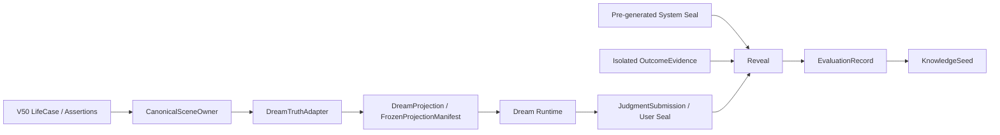
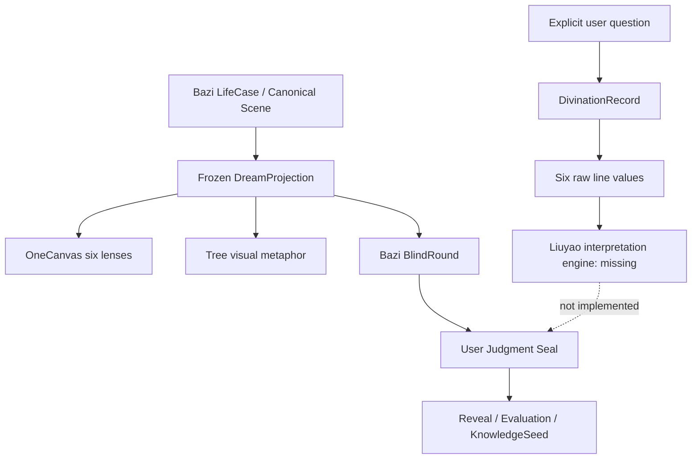

# ABU-DREAM-GAMEPLAY-ENGINE-AUDIT-06

```text
status: COMPLETE
audit_mode: READ_ONLY_RUNTIME_TRACE
code_modified: false
assets_modified: false
database_modified: false
tests_added_or_run: false
deployment_or_git_operation: false
```

## Executive Verdict

当前仓库已经存在一套**真实、可持久化、带并发与防泄漏边界的 BlindRound 事务内核**，也存在真实的 Dream 访问、授权、恢复、离梦和 OneCanvas 复用链。

但它还不是完整的“阿布梦境人工生命游戏引擎”：

| 判断对象 | 结论 |
| --- | --- |
| Dream 访问与导航 Runtime | `REAL_RUNTIME` |
| BlindRound、双 Seal、Reveal、Evaluation、KnowledgeSeed | `REAL_RUNTIME` |
| 当前内容 | `SIMULATED_FIXTURE` |
| 两叶一枝的结构学习题 | `CONFLICTING_IMPLEMENTATION`，且运行开关关闭 |
| `knowledge_cutoff` 的真实时间截断 | `MISSING` |
| 生命树的完整 V50 语义映射 | `PARTIAL_RUNTIME` |
| 六爻 | `PARTIAL_RUNTIME`，只有显式起卦记录，没有正式解释引擎 |
| 用户生命树持续成长 | `MISSING`，仅 LifeCase 持续 |
| Canonical NPC 自主生活世界 | `MISSING` |
| 完整游戏闭环 | `PARTIAL_RUNTIME` |

最重要的两个 P0 事实：

1. `knowledge_cutoff` 当前被记录并参与 Hash，但冻结 Canvas 是从当前 Canvas 直接复制，并未按 cutoff 过滤。
2. 两叶一枝题的题目、正确答案和判定目前由前端派生，`correctOptionId` 进入浏览器；虽然该功能开关目前关闭，但不能直接启用。

因此当前可准确表述为：

> 系统已经具备真实的盲断事务引擎，但尚未具备合格的服务端树上问题权威、时间截断编译器、持续生命树和 Canonical NPC 世界引擎。

## Audit Boundary

本报告只核对源码、Schema、fixture、API、存储合同和实际调用链，没有根据设计文档推定 Runtime 已存在。

主要入口：

- `apps/product/product_surface.py`
- `apps/product/experience_shell/src/main.ts`
- `apps/product/experience_shell/src/dream_runtime.ts`
- `apps/product/dream_api.py`
- `apps/product/dream_service.py`
- `apps/product/dream_projection.py`
- `apps/product/dream_game_service.py`
- `apps/product/dream_game_content.py`
- `apps/product/dream_store_postgres.py`
- `packages/experience/dream.py`
- `packages/experience/dream_game.py`
- `packages/experience/dream_navigation.py`
- `deploy/postgres_v50_schema.sql`

本轮未运行测试，也未读取或修改运行数据库。数据库状态判断仅基于正式 Schema、Store 和仓库内容；仓库当前只有明确标注的模拟资料包，不存在可证明为 `VERIFIED_REAL` 的内容包。

## Authority Chain



这条主链真实存在。`DreamTruthAdapter` 直接读取 `CanonicalSceneOwner` 和正式六柱 Canvas，没有发现第二套 LifeCase、第二套 OneCanvas 或由游戏表现反写 V50 的路径。

## 1. Engine Reality Matrix

| 能力 | 状态 | Runtime 证据 | 结论 |
| --- | --- | --- | --- |
| V50 Canonical Scene 权威 | `REAL_RUNTIME` | `apps/product/dream_service.py` 的 `DreamTruthAdapter` 使用 `CanonicalSceneOwner` | Dream 没有另建命盘事实 Owner |
| Truth Adapter | `REAL_RUNTIME` | `apps/product/dream_service.py:58` 起 | 校验 grant、purpose、privacy version、source hash 和完整命盘 |
| DreamProjection | `REAL_RUNTIME` | `apps/product/dream_projection.py` | 有角色披露、授权绑定和只读投影 |
| Dream 数据边界 | `REAL_RUNTIME` | `deploy/postgres_v50_schema.sql:112` 起 | Schema 明确 Dream 只存授权、访问和投影；Canonical facts 留在正式 Case |
| Dream API Owner | `REAL_RUNTIME` | `apps/product/dream_api.py` | 单一 `DreamJourneyService` 与 `DreamGameService` |
| Dream 页面 Runtime | `REAL_RUNTIME` | `apps/product/experience_shell/src/main.ts`、`dream_runtime.ts` | `/experience/dream` 使用同一静态产品壳 |
| Scene Director / Registry | `PARTIAL_RUNTIME` | `dream_story_runtime.ts` 及场景元数据 | 有状态编排，但仍由大型 `DreamFirstVisitRuntime` 承担多数渲染与输入职责 |
| OneCanvas 复用 | `REAL_RUNTIME` | `components.ts` 的 `renderCanonicalCanvasScene` | Dream 没有第二套命盘绘图语义 |
| 三树资格与组合 | `REAL_RUNTIME` | `DreamEligibilityService.pilot_composition` | 当前固定为 1 个本人授权真人 + 2 个 Bootstrap NPC，不是三棵陌生树 |
| Dream 授权与撤回 | `REAL_RUNTIME` | `dream_service.py`、grant Store/API | 可撤回且失败关闭 |
| Visit / Recovery / Departure | `REAL_RUNTIME` | `dream_navigation_service.py`、`dream_navigation.py` | 有 lease、epoch、fence、checkpoint、幂等离梦 |
| BlindRoundDefinition | `REAL_RUNTIME` | `packages/experience/dream_game.py`、`dream_game_service.py` | 正式合同、API、Store 和状态机均存在 |
| Pre-outcome Projection | `REAL_RUNTIME` | `PreOutcomeDreamProjection` | 绑定 viewer、visit、case namespace、授权和 Projection Hash |
| `knowledge_cutoff` 记录 | `REAL_RUNTIME` | `ProblemQuestionRecord`、`FrozenProjectionManifest` | 字段真实存在并进入 manifest/hash |
| `knowledge_cutoff` 内容过滤 | `MISSING` | `compile_simulated_round()` 直接复制当前 Canvas | 不能证明 Canvas 中所有内容均在 cutoff 前成立 |
| OutcomeEvidence 隔离域 | `REAL_RUNTIME` | 独立表与 Store；只在 reveal 路径读取 | 没有“先发客户端再隐藏” |
| UserJudgmentSeal | `REAL_RUNTIME` | `JudgmentSubmission`、`UserJudgmentSeal`、事务提交 | 玩家判断不可变、与 Projection Hash 绑定 |
| SystemJudgmentSeal 存储与隔离 | `REAL_RUNTIME` | `SystemJudgmentSeal` 拒绝 player/viewer/submission 输入 | 独立于玩家提交 |
| SystemJudgment 的专业认知来源 | `SIMULATED_FIXTURE` | `compile_simulated_round()` 从 fixture 预生成 | 不是当前 Reasoner 的专业 Path 认知 |
| 双 Seal 揭盲 | `REAL_RUNTIME` | `dream_game_service.py` reveal 路径 | Reveal 前检查用户 Seal、系统 Seal 与 OutcomeEvidence |
| EvaluationRecord | `REAL_RUNTIME` | `dream_game_service.py`、`dream_game.py` | 真实写入，但评分语义很初级 |
| KnowledgeSeed | `REAL_RUNTIME` | `KnowledgeSeed.formal_status=PRIVATE_LEARNING_RECORD` | 不进入 LifeCase、PathAssertion、共享知识库或训练证据 |
| 内容包导入与状态 | `PARTIAL_RUNTIME` | `scripts/v50_dream_matured_fruit.py`、`dream_game_content.py` | 可校验/导入/撤权；真实授权和保管链仅检查字段/Hash，不解析外部事实 |
| `VERIFIED_REAL` 内容 | `MISSING` | 仓库仅有 `dream_problem_flower_simulated_v1.json` | 当前正式门仍是 0/3 |
| 两叶一枝题 | `CONFLICTING_IMPLEMENTATION` | `dream_tree_world.ts` 前端生成题目与答案；功能开关关闭 | 存在第二 Question Authority，不能启用 |
| 问题花 UI 可达性 | `PARTIAL_RUNTIME` | 后端可用；前端 Phase B 开关为 false | 当前选树后落入固定树空场 |
| 六爻起卦记录 | `PARTIAL_RUNTIME` | `DivinationRecord` 与显式 API | 只有六爻随机线值和动爻记录 |
| 六爻解释/判断引擎 | `MISSING` | `interpretation_status=not_generated` | 没有卦名、六亲、用神、月日建、变卦和解释链 |
| 用户生命树持续模型 | `MISSING` | 首页树是静态资产；状态来自当前 LifeCase 文案 | 没有独立 Tree State、成长变量或版本历史 |
| Canonical NPC 身份种子 | `SIMULATED_FIXTURE` | `apps/product/dream_pilot.py` 的雾岚、砚舟 | 唯一 LifeCase 存在，但仅用于投影 |
| NPC Mind / 自主行动 | `MISSING` | bootstrap 明确关闭 mind wake、dialogue、autonomous action | 不构成人工生命 |
| Canonical World Clock | `MISSING` | 只有导航服务将现实时间转为毫秒 Tick | 无 anchor、倍率、Epoch、Suspension |
| NPC Attention Lease | `MISSING` | 现有 lease 是用户多设备控制 | 不能误报为 NPC 唤醒租约 |
| 完整人工生命游戏引擎 | `MISSING` | 无世界时间、事件调度、Mind、记忆、关系和离线结算 | 文档存在不等于 Runtime |

## 2. Life Tree Mingli Mapping

### 2.1 V50 事实到树体的映射

| V50 对象 | 当前树体投影 | 分类 | 审计结论 |
| --- | --- | --- | --- |
| 五行强弱 | 只取日干主元素用于颜色/主题 | `PARTIAL_RUNTIME` | 没有强弱、制化、流通的稳定树体语法 |
| 五行流通 | 无 | `MISSING` | OneCanvas 可展示关系，但树体不表达 |
| 十神及状态 | 无正式树体映射 | `MISSING` | 没有器官级合同 |
| 根、透、藏干 | 只存在于正式 Canvas | `MISSING` | 树根并未由通根/透干数据生成 |
| 合冲刑害 | 仅可能进入 Canvas；树卡只粗略计数 effective 关系 | `PARTIAL_RUNTIME` | 不同关系没有稳定枝路表现 |
| 体、用 | 无 | `MISSING` | 没有正式 Owner 或投影字段 |
| 做功路径 | 树动画明确 disabled | `MISSING` | 不猜线是正确边界，但尚无树体投影 |
| potential | 普通投影省略 | `AUTHORITATIVE_MAPPING` | 披露边界正确；仅 Lab 应可见 |
| structural | 没有树体语法 | `MISSING` | 不能用装饰代替 |
| activated | 粗略 climate 文案，不足以构成激活映射 | `PARTIAL_RUNTIME` | 无逐段激活引用 |
| effective | 只投影数量 token | `DERIVED_PROJECTION` | 不能说明是哪条关系或作用方向 |
| 大运、流年 | climate 有 luck/year/quiet 三种粗粒度 | `DERIVED_PROJECTION` | 没有改变具体器官的正式合同 |
| 流月 | 无 | `MISSING` |  |
| 流日轻扰动 | 无正式事实映射；视觉相位由 Hash 决定 | `VISUAL_METAPHOR` | 不能解释为命理状态 |

### 2.2 根、干、枝、叶、花、果的当前语义

| 树体器官 | 当前真实来源 | 分类 | 是否可作为命理事实 |
| --- | --- | --- | --- |
| 整棵树 | LifeCase/Scene 的浅层主题 + Hash 选 art variant | `DERIVED_PROJECTION` + `VISUAL_METAPHOR` | 否，只是生命载体 |
| 根 | 静态美术；前端曾计划承载结构题 | `PLACEHOLDER` | 否 |
| 树干 | 静态美术 | `PLACEHOLDER` | 否 |
| 特殊枝干 | 前端从 formal relation 或 simulated candidate 派生题目 | `CONFLICTING_IMPLEMENTATION` | 当前不可作为权威题目 |
| 特殊树叶 | 前端从可见 stem/hidden stem 派生题目 | `CONFLICTING_IMPLEMENTATION` | 当前不可作为权威题目 |
| 花骨朵/问题花 | 设计上对应 BlindRound；运行 UI 当前关闭 | `PARTIAL_RUNTIME` | 后端 BlindRound 是事实，树体花器官尚未闭合 |
| 果实 | 双 Seal 后 Reveal 的视觉隐喻 | `VISUAL_METAPHOR` backed by `REAL_RUNTIME` | 果实不是事实本身；OutcomeEvidence 才是 |

稳定性结论：

- 相同 source hash 会稳定得到同一 art variant 和动画相位。
- 这种稳定主要来自 Hash，不是完整命理映射。
- 不同命盘目前主要表现为日干元素配色、Hash 变体、粗粒度 climate 和 effective relation 数量，容易退化为“换色树”。
- 大运流年没有重造 LifeCase，但也没有形成足够精确的树体气候/激活合同。
- 前端没有从自然语言猜 PathAssertion；这条边界保持正确。

## 3. Question and BlindRound Audit

### 3.1 两叶一枝

| 项目 | 当前实现 | 状态 |
| --- | --- | --- |
| `question_id` | 仅前端本地 node id | `CONFLICTING_IMPLEMENTATION` |
| `case_ref` | 间接来自当前 Projection | `PARTIAL_RUNTIME` |
| `projection_version` | 没有独立题包绑定 | `MISSING` |
| `cutoff_time` | 页面可读 Projection 的 cutoff，但题目未独立绑定 | `PARTIAL_RUNTIME` |
| `evidence_refs` | 从 Canvas 节点/关系直接派生 | `PARTIAL_RUNTIME` |
| `answer_type` | 前端单选 | `PLACEHOLDER` |
| frozen answer / commitment | `correctOptionId` 明文进入浏览器 | `CONFLICTING_IMPLEMENTATION` |
| disclosure manifest | 无 | `MISSING` |
| 玩家答案 | `sessionStorage` | `PLACEHOLDER` |
| 服务端提交/Seal | 无 | `MISSING` |
| 花解锁 | 前端 `passedNodes` | `CONFLICTING_IMPLEMENTATION` |

运行现实：

- `ENABLE_PHASE_B_TREE_QUESTIONS = false`。
- 当前选树后进入固定树空场，不会执行两叶一枝题。
- 如果直接打开该开关，浏览器将同时拥有题目、正确答案和判定权，形成第二套 Question Authority。

### 3.2 正式问题花 / BlindRound

| 合同字段 | 当前状态 | 证据 |
| --- | --- | --- |
| question_id / version | `REAL_RUNTIME` | `ProblemQuestionRecord` |
| case / scene ref | `REAL_RUNTIME` | `BlindRoundDefinition.resident_scene_ref` |
| projection version/hash | `REAL_RUNTIME` | `FrozenProjectionManifest` |
| cutoff time | `REAL_RUNTIME` 字段，`MISSING` 内容过滤 | `knowledge_cutoff` |
| evidence/node/relation refs | `REAL_RUNTIME` | `allowed_nodes` / `allowed_relations` |
| answer type/options | `REAL_RUNTIME` | 固定 yes/no/partial-or-unclear |
| hidden outcome ref | `REAL_RUNTIME` 隔离存储 | 独立 OutcomeEvidence 表 |
| disclosure manifest | `PARTIAL_RUNTIME` | Projection Hash/输入 manifest 存在，但没有完整字段级披露清单 |
| player judgment/confidence | `REAL_RUNTIME` | `JudgmentSubmission` |
| Player Seal | `REAL_RUNTIME` | `UserJudgmentSeal` |
| System Seal | `REAL_RUNTIME`，内容为 fixture | `SystemJudgmentSeal` |
| reveal time / immutable record | `REAL_RUNTIME` | `OutcomeRevealRecord` |
| EvaluationRecord | `REAL_RUNTIME` | 独立不可变记录 |
| KnowledgeSeed | `REAL_RUNTIME` | 私人学习记录 |

### 3.3 防泄漏结论

已成立：

- OutcomeEvidence 独立存储。
- Pre-outcome API 不包含 OutcomeEvidence。
- Reveal 路径才读取 OutcomeEvidence。
- SystemJudgmentSeal 的输入 manifest 禁止玩家选择、文本、信心和提交。
- User Seal 与 Projection Hash 绑定。
- 模拟包被强制标记 development-only，不能贡献 3/3。

未成立：

- cutoff 没有真实过滤。
- 两叶一枝的正确答案目前进入客户端。
- Verified-real 内容准入只校验字段与 Hash，尚未解析授权、脱敏和外部保管链的真实性。

因此“当前题目和答案真实、可追溯、防泄漏”的整体结论是：

> BlindRound 事务合同可追溯且 OutcomeEvidence 隔离成立；内容仍是模拟资料，cutoff 和树上基础题权威未通过，不能整体判为可发布。

## 4. Bazi–Liuyao–Tree Mapping



| 问题类型 | 当前 Owner | 当前状态 | 边界 |
| --- | --- | --- | --- |
| 八字结构知识题 | 应为服务端 Question Authority；当前由前端派生 | `CONFLICTING_IMPLEMENTATION` | 不得读取 OutcomeEvidence |
| 八字时间性判断题 | BlindRoundDefinition + FrozenProjection | `PARTIAL_RUNTIME` | cutoff 未真正过滤 |
| 六爻即时问事题 | `DivinationRecord` | `PARTIAL_RUNTIME` | 一次显式起卦有记录，但没有解释引擎 |

六爻真实调用点：

- `POST /api/v50/dream/visits/{visit_id}/game/attempts/{attempt_id}/divination`
- `DreamGameService.cast_divination`
- `DivinationRecord`

已满足：

- 用户必须显式发起。
- 问题文本、主体、服务端时间、授权和幂等键被冻结。
- 六条爻值和动爻被保存。
- 不修改八字 LifeCase。

未满足：

- 没有卦名、六亲、世应、月建日建、用神、变卦和正式解释。
- 当前每次 attempt 最多一卦，但新 Visit/attempt 可对同一问题再次起卦，尚无全局“一问一卦”约束。
- 没有独立六爻系统判断 Seal。

## 5. Gameplay Contract Matrix

| 设计要求 | 当前实现 | 偏差与风险 | 唯一 Owner | 修复顺序 |
| --- | --- | --- | --- | --- |
| 用户自己的持续生命树 | LifeCase 持续；首页使用静态树资产和文案 | 没有 Tree State、成长或版本历史 | V50 LifeCase + future TreeProjection | P2 |
| 点击熟睡阿布进入梦境 | 页面入口与转场存在 | 属于 Presentation，不影响命理事实 | Dream Runtime | 保持 |
| 三棵陌生树轮转 | 当前组合为本人授权树 + 雾岚 + 砚舟 | 不符合“三棵陌生树” | Eligibility/Composition Owner | P1 |
| 选择中央树 | UI 与 Visit 场景选择存在 | 视觉仍在重建期 | Dream Runtime | P1 |
| 两叶一枝理解 | 前端代码存在但开关关闭 | 正确答案泄漏到客户端、无服务端 Seal | Missing Question Authority | P0 |
| 花开放 | 前端 passedNodes 控制；后端可直接 open question | 两套规则冲突 | DreamGameService 应唯一拥有 | P0 |
| Bazi BlindRound | 完整后端合同 | 内容是模拟 fixture | DreamGameService | P1 内容 |
| Liuyao BlindRound | 只有显式起卦记录 | 无解释、系统判断、正式对账链 | Liuyao Owner 未实现 | P1/P2 |
| 玩家提交并 Seal | 完整事务链 | 无主要缺口 | DreamGameService | 保持 |
| 结果成熟 | fixture 的结果预先存在于隔离表 | 没有真实 outcome maturity scheduler | Outcome Owner | P1 |
| 第二 Seal | 发布前 System Seal 已存在 | 当前来自 fixture，不是专业认知 | Content Compiler | P1 |
| Reveal/Reconcile | 双 Seal 后真实执行 | Evaluation 仍很浅 | DreamGameService | P3 |
| KnowledgeSeed | 私人不可变学习记录 | 首页“带回”只是短时 session 展示 | DreamGameService / Home Projection | P2 |
| 生命树成长/解锁 | 无 | 尚未实现 | Missing | P2 |
| 正式离梦 | 有 lease、checkpoint、anchor、幂等 close | 属导航，不等于世界生命连续 | DreamNavigationService | 保持 |
| 不再返回同组 | 无 DB 唯一约束；组合可重复 | 只是未实现 | Encounter Composition Owner | P1 |

## 6. Actor Identity Matrix

| 角色 | 当前身份字段 | 证据资格 | 隐私/撤回 | 训练权限 | 前台披露 | 状态 |
| --- | --- | --- | --- | --- | --- | --- |
| 真人用户 | `authorized_human` + owner/grant | 可成为真人来源，但当前 Dream Game 没有 verified-real pack | grant 可撤回 | 未与训练授权分层 | 可匿名显示 | `PARTIAL_RUNTIME` |
| 真人 AI 辅助行为 | 无正式 `source_origin` | 无法与真人直接行为区分 | 无专门边界 | 无 | 无 | `MISSING` |
| 真人授权代理 | 无正式 actor/agency 合同 | 无法证明授权范围和期限 | 无 | 无 | 无 | `MISSING` |
| 合成自主 NPC | 当前只有 `canonical_npc` 场景种子 | 明确不是现实证据 | 无 NPC 隐私生命周期 | 不得冒充真人 | 可匿名显示 | `SIMULATED_FIXTURE` |

当前后台只区分：

```text
authorized_human
canonical_npc
legacy_unclassified
```

尚未实现所需四维来源：

```text
actor_origin
agency_mode
world_lineage
evidence_origin
```

雾岚、砚舟具备唯一 ID、Canonical LifeCase 和明确的非真人标记，但能力开关明确关闭：

```text
mind_wake = false
free_dialogue = false
autonomous_action = false
```

因此它们是**可投影的 Canonical NPC fixture**，不是自主人工生命。

## 7. Canonical NPC World Engine Audit

| 世界能力 | 状态 | 实际情况 |
| --- | --- | --- |
| Canonical World Clock | `MISSING` | 只有现实时间毫秒 Tick |
| world_time_anchor | `MISSING` |  |
| 有理时间倍率 | `MISSING` |  |
| integer Tick | `PARTIAL_RUNTIME` | 有整数毫秒，但不是版本化世界时钟 |
| Clock Epoch / Suspension | `MISSING` |  |
| Simulation Branch | `MISSING` |  |
| NPC 唯一身份 | `SIMULATED_FIXTURE` | 两个固定 Bootstrap LifeCase |
| 正史年龄/位置 | `MISSING` |  |
| 事件调度器 | `MISSING` |  |
| Mind Wake / Release | `MISSING` | 显式关闭 |
| NPC Attention Lease | `MISSING` | 用户 Control Lease 不可混用 |
| 单调 NPC fence_token | `MISSING` |  |
| 迟到 Mind 提交拒绝 | `MISSING` |  |
| 记忆与关系状态 | `MISSING` |  |
| 离线行动 | `MISSING` |  |
| Encounter Thread | `MISSING` | Visit 不是 NPC Encounter Thread |
| Disclosure Manifest | `MISSING` | 只有 Projection/授权边界 |
| NPC 隐私撤回/去标识化 | `MISSING` |  |
| 独立事件生成 | `MISSING` |  |
| 结果成熟调度 | `MISSING` | fixture 结果预装 |

`ABU_SYNTHETIC_EVIDENCE_POPULATION_ARCHITECTURE_V1` 仅是候选架构文档，不能计为 Runtime。

Canonical Abu 当前也只是带固定位置/动作的公共 Projection，不是具有 Mind、时间线和自主选择的人工生命。

## 8. Scoring and Growth Audit

### 已存在

- BlindRound 揭盲后的 `EvaluationRecord`。
- 玩家与系统结果是否匹配。
- 信心 bucket。
- 选取节点与允许节点的简单遗漏比较。
- 反证条件是否达到最低文本长度。
- 私人 `KnowledgeSeed`。

### 尚未形成合法语义

- `formal_evidence_support = NOT_REVIEWED`。
- `path_reference_overlap = NOT_REVIEWED`。
- “置信度校准”只是分桶，不是统计校准。
- “遗漏节点”把所有未选 allowed node 都算遗漏，不能等同专业错误。
- 两叶一枝没有服务端结构学习评分。
- 没有积分、经验、徽章、排名或排行榜。
- 没有生命树成长变量。
- 没有防重复刷分所需的跨 Visit 唯一性规则。

结论：

> 当前不存在“花朵积分”。现有 EvaluationRecord 只是一份揭盲后、语义有限的复盘记录；它不能被宣传为命理能力分、真实准确率或生命树成长依据。

正确边界当前仍保持：

- 模拟结果不计入真人验证率。
- 未揭盲问题不评分。
- KnowledgeSeed 不修改 LifeCase、PathAssertion 或共享知识。

## 9. Full Gameplay Loop Reality

| 步骤 | 当前 Owner | 存储/提交点 | 状态 |
| --- | --- | --- | --- |
| 用户自己的生命树 | V50 LifeCase + Home Projection | Canonical Case | `PARTIAL_RUNTIME` |
| 点击熟睡阿布 | Dream presentation | 客户端场景状态 | `REAL_RUNTIME` |
| 进入梦境 | Dream Runtime | DreamVisit | `REAL_RUNTIME` |
| 三树轮转 | Eligibility + Runtime | EncounterSet / Scene refs | `PARTIAL_RUNTIME` |
| 选择中央树 | Dream Runtime | Visit/attempt context | `REAL_RUNTIME` |
| 两叶一枝 | 前端 dormant implementation | sessionStorage | `CONFLICTING_IMPLEMENTATION` |
| 花开放 | 前端 passedNodes / 后端 open question | 两套状态 | `CONFLICTING_IMPLEMENTATION` |
| 八字 BlindRound | DreamGameService | BlindRound/Attempt | `REAL_RUNTIME` + `SIMULATED_FIXTURE` |
| 六爻问事 | DreamGameService | DivinationRecord | `PARTIAL_RUNTIME` |
| User Seal | DreamGameService | immutable record | `REAL_RUNTIME` |
| 结果成熟 | 无调度器 | 预装 OutcomeEvidence | `SIMULATED_FIXTURE` |
| System Seal | Content compiler | immutable record | `REAL_RUNTIME` + `SIMULATED_FIXTURE` |
| Reveal/Reconcile | DreamGameService | reveal/evaluation | `REAL_RUNTIME` |
| KnowledgeSeed | DreamGameService | immutable private record | `REAL_RUNTIME` |
| 带回用户树 | Home presentation | sessionStorage 短时展示 | `PLACEHOLDER` |
| 树成长/解锁 | 无 | 无 | `MISSING` |
| 离开相遇 | DreamNavigationService | atomic departure/visit close | `REAL_RUNTIME` |
| 不再返回同组 | 无 | 无唯一约束 | `MISSING` |

## 10. Gap Plan

### P0 — 权威、泄漏、身份

1. 实现真实的 cutoff compiler：按可证明的时间来源过滤 Canonical Scene/Canvas；无法证明时 fail closed。
2. 建立唯一服务端 `TreeLearningQuestionBundle` Owner，移除前端 `correctOptionId` 和客户端正确答案判定。
3. 花解锁必须由服务端 attempt 状态决定，不能由 sessionStorage 决定。
4. 在启用真人/代理/NPC 混合玩法前补齐 actor origin、agency、lineage、evidence origin。
5. Verified-real 准入必须解析真实授权、脱敏、原始时间戳和保管链，不仅校验非空字段/Hash。

### P1 — 游戏闭环

1. 让固定树场从服务端题包渲染两叶一枝一花。
2. 把结构题答案和完成状态持久化到 attempt。
3. 解决当前“本人树 + 两 NPC”与“三棵陌生树”的产品冲突。
4. 增加 Outcome maturity scheduler 和不可重复 EncounterSet 约束。
5. 如六爻进入正式玩法，补齐独立卦例解释与 Seal，而不是只保存六条线值。

### P2 — 长期世界与 NPC

1. Canonical World Clock、Epoch、Simulation Branch。
2. NPC lifecycle、位置、Mind Wake、Attention Lease、fence token。
3. 记忆、关系、离线行动、Encounter Thread 和 Disclosure Manifest。
4. 用户持续生命树的正式 TreeProjection/版本历史。

### P3 — 成长与表现

1. 专业复盘评分、置信度校准和路径证据人工审查。
2. KnowledgeSeed 与个人学习账本的长期呈现。
3. 只有语义合法后再讨论成长、排名和视觉反馈；当前不应冻结数值。

## 11. Next Minimal Implementation Slice

建议下一刀：

```text
DREAM-QUESTION-AUTHORITY-AND-CUTOFF-01
```

严格范围：

1. 服务端生成 `TreeLearningQuestionBundle`：2 个 `LEAF_BASIC` + 1 个 `TRUNK_BACKBONE`。
2. 每题绑定 question_id、case/scene/projection version、knowledge_cutoff、evidence refs、answer type、冻结答案 commitment 和 disclosure manifest。
3. 实现真正的 cutoff snapshot/filter；时间来源无法证明时拒绝发布题包。
4. 前端只渲染服务端题包并提交答案，不接收 `correctOptionId`。
5. 结构题进度与花解锁写入同一 attempt，由服务端 Owner 管理。
6. 不实现 NPC 世界、不改评分数值、不做生命树成长、不扩视觉和 Runtime。

这是当前最小但必要的纵切：先修正 P0 权威与时间边界，才能让现有真实 BlindRound 内核成为可玩的完整链。

## 12. Direct Answers

1. **当前到底有没有真正的游戏引擎？**
   有真实的 Dream 导航和 BlindRound 事务引擎；没有完整人工生命世界引擎。总状态为 `PARTIAL_RUNTIME`。

2. **当前生命树是否真的由 V50 命理知识驱动？**
   只在数据来源和少量主题字段上由 V50 驱动；根、干、枝、叶、花的完整命理映射尚未成立，不能宣称真正的语义生命树。

3. **当前题目和答案是否真实、可追溯、防泄漏？**
   BlindRound 合同可追溯、OutcomeEvidence 隔离成立，但内容仅为模拟 fixture，cutoff 未过滤；两叶一枝答案仍由客户端持有。整体未通过发布资格。

4. **当前花朵积分是否具有合法语义？**
   没有正式花朵积分。揭盲后的 EvaluationRecord 有有限复盘意义，但不能代表专业分数或真实准确率。

5. **当前用户树是否真正持续？**
   用户 LifeCase 持续；生命树本身没有独立持续状态、成长变量或版本历史。

6. **当前类用户 NPC 是否只是 fixture？**
   是。雾岚、砚舟是明确标记的 Canonical NPC Bootstrap fixture，Mind、自由对话和自主行动均关闭。

7. **当前正式 NPC 是否能够在正史世界中自主生活？**
   不能。世界时钟、事件调度、Mind、记忆、关系和离线结算均未实现。

8. **下一条最小实施任务应该是什么？**
   `DREAM-QUESTION-AUTHORITY-AND-CUTOFF-01`：先建立服务端树上问题权威和真实 cutoff 编译器，再接通现有 BlindRound。

---

`ABU-DREAM-GAMEPLAY-ENGINE-AUDIT-06：COMPLETE`
