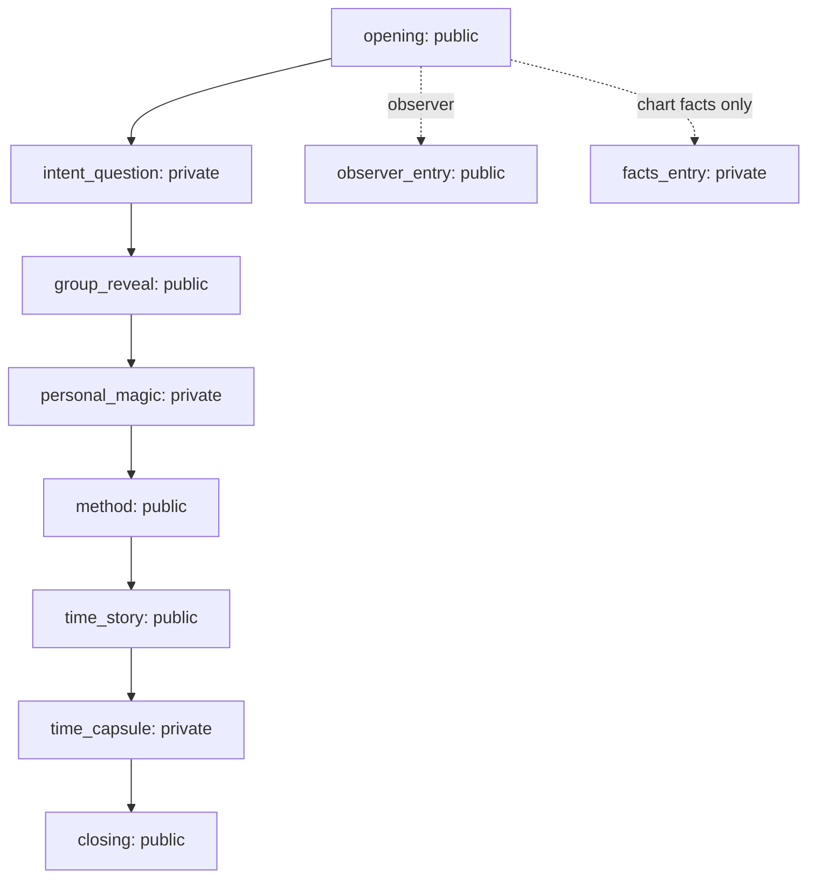

# V50 Abu Living Theater v1

Status: first playable vertical slice  
Topic reference: `topic-00-seen-and-continuing@1.0.0`

## Product Position

Abu Living Theater is a first-class DeepLife experience domain. It turns approved Mingli cognition into a staged, private-by-default, replayable experience. It does not calculate Mingli, revise a LifeCase, or treat narrative as evidence.

```text
DeepBazi Cognitive Runtime
        -> approved LifeCase cognition
LifeCase Continuity Runtime
        -> versioned case authority
MingliExperienceEnvelopePort
        -> minimal immutable disclosure snapshot
Abu Experience Runtime
        -> scene, cue, interaction, live, replay
```

The dependency is one-way. `packages/experience` cannot import a LifeCase repository, draft insight, Reality Evidence, or cognitive implementation.

## Frozen Contracts

| Contract | Responsibility |
| --- | --- |
| `MingliExperienceEnvelope v1` | Topic-bound, participant-bound, versioned cognition projection |
| `TopicPackage v1` | Editable creative source: scene graph, cues, assets, policies |
| `CompiledTopic v1` | Validated and immutable runtime program with content hash |
| `CueTemplate v1` | Semantic and presentation template before participant binding |
| `PerformanceCueInstance v1` | Final dialogue, subtitle, action, evidence refs and hash frozen for one performance |
| `TheaterEvent v1` | Ordered public, private or operator event |

Generated JSON Schemas live in:

```text
docs/product/contracts/abu-living-theater-v1/
```

Reproduce them with:

```bash
PYTHONPATH=packages:apps .runtime/venv/bin/python scripts/v50_export_experience_schemas.py
```

## Envelope Modes

### personal_ready

Requires an active LifeCase, active chart version, committed baseline insight and `reliable` or `competing` epistemic state. The envelope contains only approved baseline cognition, its conditions, counter-signals, uncertainty and explicitly approved competing hypotheses.

### chart_facts_only

Used when the four pillars are reliable but no formal LifeCase cognition is eligible. It can show chart facts. It cannot manufacture a personal claim.

### observer

Used without authorized chart or case content. It follows a complete public program and never pretends to know the participant's chart.

The envelope expires after 24 hours in v1. Its source hash binds participant, topic, chart version, LifeCase version and disclosed content. Birth location, Reality Evidence, conversation history and draft insight are not included.

## Topic Compiler Gates

The compiler rejects:

- missing entry, fallback, transition, cue or asset references;
- duplicate node, cue or asset IDs;
- public nodes reading `envelope.*`;
- private nodes without a public rejoin node;
- cue/node visibility mismatch;
- dialogue without subtitles;
- unreachable nodes;
- paths or cycles with no terminal exit.

The runtime receives only a `CompiledTopic`. It contains no Topic 00 branch. Topic 01 is a four-node contract fixture that runs through the same generic runtime.

## Runtime Modes

| Mode | Meaning |
| --- | --- |
| Live | One SharedSession, public clock, private participant windows and director-controlled barriers |
| Time-shift | A new ParticipantRun in an existing topic space; authorized historical traces may be visible, private history is not |
| Solo | One participant follows the same CompiledTopic with automatic barrier rejoin |
| Replay | Reads the original frozen events and Cue Instances; never reruns LLM, Reasoner or TTS |

## Topic 00 Scene Graph



Act 1 establishes recognition without public disclosure. Act 2 explains that a professional judgment has evidence, alternatives and uncertainty. Act 3 turns the performance into a private future observation rather than a final prediction.

## Privacy And Authority Invariants

1. Public events reject sensitive key families recursively, including envelope, chart, pillars, approved claims and private answers.
2. A private ParticipantRun is authorized by its account owner or an opaque token hash.
3. A participant can read only public events and their own private events/cues.
4. Anonymous group traces require at least three participants and expose counts only.
5. TopicExploration has `writes_life_case: false`; a capsule never changes formal cognition.
6. A frozen Cue keeps claim refs, envelope hash, phrase policy version and cue hash.
7. Playback and Replay use the same Cue Instance.
8. Public scenes never receive an envelope.

## Product Routes

```text
/theater         participant lobby and performance
/theater/studio  admin director entry
```

The frontend supports WebSocket updates with ordered cursor recovery and HTTP polling fallback. A stale incremental snapshot cannot move the UI backward. The explicit leave action clears the local run and resets the visual act.

## Verification

Targeted:

```bash
PYTHONPATH=packages:apps .runtime/venv/bin/python -m pytest tests/test_v50_abu_living_theater.py -q
```

Relevant product regression:

```bash
PYTHONPATH=packages:apps .runtime/venv/bin/python -m pytest \
  tests/test_v50_abu_living_theater.py \
  tests/test_v50_product_account_profile_journey.py \
  tests/test_v50_product_runtime_cleanup.py \
  tests/test_v50_abu_companion_dock.py \
  tests/test_v50_life_case_application_convergence_v1.py -q
```

The tests include positive personal disclosure, chart/observer fallback, competing-hypothesis fields, public privacy fault injection, compile failures, three-participant aggregation, reconnect deltas, cue/replay hash identity, Solo/Time-shift behavior and Topic 01 generic execution.

## Deliberate V1 Limits

- No full video production pipeline or generated TTS asset pipeline.
- No LLM is called by the Theater Runtime; v1 dynamic wording uses controlled bindings into approved cognition.
- No automatic LifeCase writeback.
- No public premiere claim has been made.
- No inference is drawn from topic participation or capsule text.
- Topic 01 is a contract fixture, not a produced show.

## Analyst Review Questions

1. Does the personal scene preserve the approved claim's meaning and conditions?
2. Does the observer path feel complete without pretending to know the person?
3. Does the staged rhythm create recognition, explainability and continuation rather than another report?
4. Is the distinction between narrative expression and Mingli evidence visible enough?
5. Are any private details inferable from public events or group traces?
6. Is the time capsule useful without implying that it updates formal cognition?

