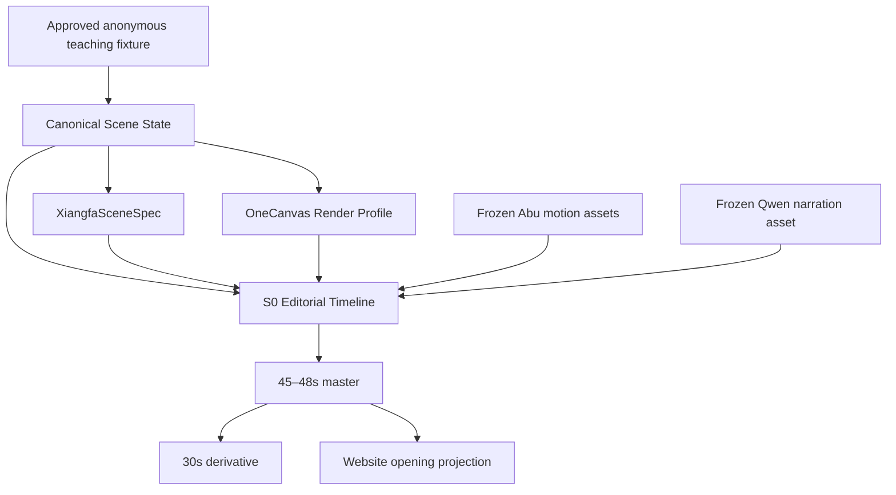

# V50 Abu Says Mingli S0 Opening Theater and Xiangfa Sync v1

```yaml
document_status: CLOSED_ACCEPTED_STAGE_MILESTONE
date: 2026-07-20
product: DeepBazi
experience: 阿布说命
slice: S0 品牌级开场小剧场
implementation_authorized: false
next_gate: public_release_separate_gate
current_fixture_decision: SELECT_CANDIDATE_A
animatic_authorized: completed_and_locked_as_s0_v1_2
production_release_authorized: false
new_mingli_reasoning: forbidden
formal_state_write: forbidden
```

> 本文把 S0 开场片、品牌表达、OneCanvas 演出、象法转场与后续系统
> 同步收敛为一份执行规格。更新后的实际媒体已完成分析师审阅：`Abu Actor
> Pass V1` 正式 `CLOSED / PASS`，`S0 V1.2` 锁定为内部阶段成果，不启动
> S0 V1.3。本文不修改 Product Constitution，也不授权公开发布。

### 0.1 S0-G0 决议锁

```yaml
S0_G0: COMPLETE
S0_G1: COMPLETE
S0_G2: COMPLETE
ABU_ACTOR_PASS_V1: CLOSED_PASS
S0_V1_2: ACCEPTED_STAGE_MILESTONE_LOCKED
additional_s0_rework: NOT_REQUIRED
next_product_mainline: XIANGFA_GENERATION_V1
final_film: INTERNAL_STAGE_VERSION_COMPLETE
website_release: BLOCKED
public_release: BLOCKED
voice: Eric_internal_only
public_brand: DeepBazi · Life Intelligence
experience_name: 阿布说命
```

非阻断公开版待办：390px 指引镜头的局部遮挡；完整戏曲变脸动作在公开品牌
主版中的使用强度。两项都不得成为重开 S0 V1.3 的理由。

G1 审计历史与当前审阅入口：

- `reports/abu-says-mingli-s0/g1/S0_G1_ANALYST_FIXTURE_SELECTION.md`；
- `reports/abu-says-mingli-s0/g1/s0_g1_fixture_candidates_v1.json`；
- `reports/abu-says-mingli-s0/g1/S0_G1_ANALYST_DECISION_LOCK_V2.json`；
- `reports/abu-says-mingli-s0/g1/S0_G1_CANDIDATE_A_PROFESSIONAL_REVIEW_PACK.md`；
- `reports/abu-says-mingli-s0/g1/S0_G1_CANDIDATE_A_PROFESSIONAL_DECISION_LOCK_V1.json`；
- `reports/abu-says-mingli-s0/g1/s0_candidate_a_approved_teaching_projection_v1.json`；
- `reports/abu-says-mingli-s0/g1/s0_source_manifest_final_v1.json`；
- `reports/abu-says-mingli-s0/g1/S0_G1_FINAL_MANIFEST_LOCK.sha256`。

## 0. 一页结论

现在适合制作的不是完整小剧场系统，而是：

> **《阿布说命 · 开场小剧场 S0》：一条 45–48 秒的品牌级生产原型。**

S0 只完成四件事：

1. 说明 DeepBazi 尊重命理，但不把命理包装成迷信或宿命宣判；
2. 提出“命局是人生剧本的底稿”，强调人仍参与书写下一章；
3. 用一个匿名、已批准且来源可追溯的命理教学场景展示六柱 OneCanvas；
4. 用一次受控的“理入象”转场，为后续 Xiangfa 与 Mingli Theater 建立母版。

S0 不是：

- 完整产品功能教学；
- 自动生成整场视频的 Theater 引擎；
- 新的命理 Reasoner；
- “命盘 + Prompt → AI 随机画图”；
- 对 OneCanvas、正式声线或 Xiangfa 当前完成度的提前宣传；
- 对用户人生已经写定的宿命表达。

S0 的唯一认知来源必须是同一份受控场景：

```text
Approved teaching fixture / disclosed LifeCase projection
        ↓
Canonical Scene State
        ├── OneCanvas：理的结构呈现
        ├── Xiangfa：同一结构的视觉映射
        └── Theater：同一结构的时间编排
```

三者不分别理解命局，只共同呈现同一命局。

---

## 1. 品牌命题

### 1.1 不否定命理，也不神化命理

S0 不使用“命理完全不是预测”这种过度绝对的表达。正式立场是：

> **命理不应被简化成迷信、吉凶标签，或对未来的宿命宣判。它的价值，
> 是帮助人理解自己的结构、关系、节奏、条件与可能的转折。**

这既保留 DeepBazi 的专业命理身份，也把产品与廉价预测、恐吓式断语和
通用人生鸡汤分开。

### 1.2 人生剧本不是写死的剧本

“人生剧本”只允许按以下含义使用：

```text
命局 = 人生剧本的底稿

底稿呈现：
- 角色与关系；
- 稳定倾向；
- 运行节奏；
- 可能的冲突；
- 条件性的转折。

底稿不等于：
- 已写死的事件清单；
- 不可改变的结局；
- 系统替用户作出的决定。
```

### 1.3 品牌表达体系

```yaml
main_slogan: 看见命局，也看见自己。
supporting_line: 读懂人生剧本，做出更清醒的选择。
product_belief: 命理不是宿命的宣判，而是一种认识自己的方式。
abu_identity: 阿布陪你把抽象命理变成看得见、听得懂的人生剧本。
```

同一画面最多使用主 Slogan 和一条副句，不堆叠四五句品牌口号。

### 1.4 Abu 的 IP 角色

Abu 不是：

- 预言者；
- 神谕者；
- 居高临下宣判吉凶的大师；
- 对命主拥有全知视角的卡通主持人。

Abu 是：

- 与用户站在同一侧的命理向导；
- 帮助聚焦结构、关系和变化的解释者；
- 在不确定处明确停下来的专业伙伴；
- 最后把选择权交还给用户的人生剧本阅读伙伴。

构图原则：**Abu 与用户一起看画布，不站在画布之上控制命运。**

---

## 2. 为什么是 S0，而不是完整 Theater

当前系统已经拥有可复用的基础，但各自门禁不同：

| 能力 | 当前真实状态 | S0 可使用方式 | S0 不得宣称 |
|---|---|---|---|
| Abu 动作素材 | 多组透明 WebP/PNG 与开场素材已存在 | 作为离线演员素材 | 已有完整 Rive 演员或真实口型 |
| Living Theater | 首个可玩纵向切片成立 | 复用 Cue、隐私和回放思想 | 完整 Theater 产品已完成 |
| Performance Proof | 音频主时钟和冻结表演包已证明 | 复用冻结音轨与时间 Cue | 完整表演运行时已通过发布门禁 |
| OneCanvas | 唯一用户侧 Canvas 候选，机器门禁已推进 | 使用匿名批准 Fixture 的真实结构画面 | 普通用户产品门禁或生产发布已通过 |
| Abu Voice | Eric 为待人工审听候选 | 内部草版预录并冻结 | Eric 已是正式品牌声线 |
| Xiangfa | 同源投影方向和技术 Proof 存在 | 做一个人工策展、可追溯的转场 | 自动 Xiangfa 系统已经成立 |

因此 S0 采用：

```text
半手工导演编排
+ 真实 OneCanvas 结构画面
+ 受控 XiangfaSceneSpec
+ 已有 Abu 动作素材
+ 预生成并冻结的 Qwen TTS
```

它是 `Production Prototype`，不是用一条影片伪装尚未完成的产品能力。

---

## 3. S0 产品目标与非目标

### 3.1 目标

S0 必须让第一次接触 DeepBazi 的人理解：

1. 这仍然是一个专业命理产品；
2. 产品不只扔出一句结论，而是让命局结构变得可见；
3. 六柱、时间和做功路径来自同一个命理场景；
4. Abu 帮助理解，不替用户决定人生；
5. “理、象、时”是同一命局的三种呈现，不是三套系统。

### 3.2 非目标

S0 不负责：

- 解释完整八字理论；
- 展示全部 OneCanvas 控件；
- 展示全部 Relation Atlas 关系；
- 证明 Xiangfa 自动生成质量；
- 证明 TTS 真人理解度；
- 展示私人真实用户命盘；
- 生成任何新的命理判断；
- 修改 ChartVersion、LifeCase 或案例 Belief；
- 自动保存用户反馈；
- 实现 Live、多人、课堂编辑器或视频批量生产。

---

## 4. 45–48 秒主版分镜

### Shot 01 · 0–6 秒 · 山谷与 Abu

**画面**

- 东方山谷、晨雾、暖纸白和低饱和墨绿；
- Abu 从画面一侧出现，轻呼吸、眨眼、抬头；
- 镜头保持安静，不先堆功能和文字。

**旁白**

> 很多人把命理，当成对未来的预测。

**认知来源**

纯品牌场景，无个人命理内容。

### Shot 02 · 6–12 秒 · 拒绝宿命宣判

**画面**

- 零散断语、吉凶标签和报告碎片短暂浮现；
- Abu 轻轻聚焦，碎片淡去，画面重新留白；
- 不出现夸张法阵、星空 HUD 或恐吓符号。

**旁白**

> 但命理不该被简化为迷信，也不该被用来宣判一个注定的人生。

### Shot 03 · 12–20 秒 · 人生剧本底稿

**画面**

- 雾中出现若隐若现的道路、节奏线和关系线；
- 这些线条不是具体事件预言，而是角色、关系和转折的抽象底稿；
- Abu 与观众站在同一侧看向前方。

**旁白**

> 它更像人生剧本的底稿：让你看见自己的角色、关系、节奏，
> 以及可能出现的转折。

### Shot 04 · 20–31 秒 · OneCanvas 亮相

**画面**

- 年、月、日、时四柱依次出现；
- 大运、流年从时间侧进入；
- 只展示六柱十二节点、一条正式主路径和一个时间引动；
- Abu 侧身看向画布，并以克制动作提示重点。

**旁白**

> 所以，我们正在把原局四柱、大运与流年，展开成一张可以看见、
> 操作和比较的六柱互动图。

**硬边界**

- 使用批准的匿名教学 Fixture；
- 所有节点、关系与路径来自冻结的 Scene Source；
- 不为画面效果补出不存在的关系；
- 使用进行时“我们正在把……”，不把 OneCanvas 提前宣传成已经正式发布。

### Shot 05 · 31–40 秒 · 做功与时间变化

**画面**

- 一条路径逐段点亮；
- 大运或流年引动一个局部变化；
- 路径只表现 `activated / reinforced / weakened / blocked` 等离散变化；
- 受阻处停下，不显示未经校准的百分比或“能量 82%”。

**旁白**

> 你可以看见关系怎样形成，时间怎样引动，一条路径为什么成立、
> 变化，或被阻断。

### Shot 06 · 40–46 秒 · 理入象

**画面**

- 同一节点位置和路径骨架逐渐转为意境场景；
- 主体、支持、阻断和路径均保留 semantic binding；
- 不做金石、树木、火焰和河流的五行物件堆砌；
- Abu 退到侧面，让用户与前方道路成为画面中心。

**旁白**

> 阿布不替你决定命运。它陪你读懂底稿，更清醒地认识自己，
> 也更主动地写下下一章。

### Shot 07 · 46–48 秒 · 品牌收束

**画面**

```text
阿布说命
看见命局，也看见自己。

读懂人生剧本，做出更清醒的选择。
DeepBazi · Life Intelligence
```

**旁白**

> 阿布说命。看见命局，也看见自己。

---

## 5. 冻结旁白稿

### 5.1 45–48 秒主版

```text
很多人把命理，当成对未来的预测。

但命理不该被简化为迷信，
也不该被用来宣判一个注定的人生。

它更像人生剧本的底稿：
让你看见自己的角色、关系、节奏，
以及可能出现的转折。

所以，我们正在把原局四柱、大运与流年，
展开成一张可以看见、操作和比较的六柱互动图。

你可以看见关系怎样形成，时间怎样引动，
一条路径为什么成立、变化，或被阻断。

阿布不替你决定命运。
它陪你读懂底稿，更清醒地认识自己，
也更主动地写下下一章。

阿布说命。
看见命局，也看见自己。
```

### 5.2 30 秒传播版（未锁定、未授权）

```text
很多人把命理，当成对未来的预测。

但命理不该被简化为迷信，也不该被用来宣判一个注定的人生。
它更像人生剧本的底稿，让你看见自己的结构、关系与转折。

我们正在把四柱、大运与流年，展开成一张六柱互动图。

阿布不替你决定命运。
它陪你读懂底稿，更清醒地写下下一章。

阿布说命。
看见命局，也看见自己。
```

30 秒版当前不属于 G1 冻结产物。未来只能从获批主版裁切，不得另写一套相互
冲突的品牌立场。

---

## 6. 统一场景合同

### 6.1 单一来源



Theater、OneCanvas 与 Xiangfa 不拥有独立的命理解释权。

### 6.2 `S0SourceManifest`

```yaml
S0SourceManifest:
  manifest_id:
  manifest_version:
  content_hash:

  source_mode: approved_teaching_fixture
  source_chart_version:
  source_scene_state:
  source_life_case_projection:
  disclosure_role: public_demo

  pillar_refs:
  relation_refs:
  committed_path_refs:
  temporal_refs:
  uncertainty_refs:

  onecanvas_snapshot_hash:
  xiangfa_scene_spec_hash:
  narration_script_hash:
  speech_asset_hash:
  abu_asset_refs:
  brand_asset_refs:

  forbidden_claims:
  release_scope: internal | analyst_review | public
```

S0 必须使用匿名教学 Fixture，不使用真实用户姓名、出生资料、对话、现实反馈或
私人 LifeCase 音频。

### 6.3 `S0EditorialTimeline`

```yaml
S0EditorialTimeline:
  timeline_id:
  duration_ms:
  fps:
  scenes:
    - scene_id:
      in_ms:
      out_ms:
      camera:
      abu_action_ref:
      narration_segment_ref:
      subtitle_ref:
      visual_cues:
      semantic_refs:
      xiangfa_binding_refs:
      transition:
```

每个视觉 Cue 都必须能够回到 `semantic_ref` 或明确标记为纯品牌环境。

### 6.4 不允许的旁路

```text
Chart + free prompt → AI video
Chart + five elements → random fantasy illustration
OneCanvas screenshot → director invents another path
TTS rewrite → voice says a stronger conclusion than subtitle
Xiangfa metaphor → promoted back into formal Mingli fact
```

---

## 7. XiangfaSceneSpec v1 草案

### 7.1 定位

Xiangfa V1 是同一命理场景的受控视觉映射，不是新的认知模块。

```text
Canonical Scene State
        ↓
Xiangfa Projection Compiler / curated binding
        ↓
XiangfaSceneSpec
        ↓
static scene / transition / Theater profile
```

第一版只支持一个批准 Fixture，不追求所有八字自动生成。

### 7.2 合同

```yaml
XiangfaSceneSpec:
  scene_spec_id:
  source_scene_state_id:
  source_hash:
  epistemic_scope: committed_projection | teaching_fixture

  narrative_theme:
  subject:
    semantic_ref:
    role:
    visual_form:

  path_bindings:
    - path_ref:
      visual_motif:
      direction:
      status: active | reinforced | weakened | blocked

  support_bindings:
    - semantic_ref:
      visual_motif:

  obstruction_bindings:
    - semantic_ref:
      visual_motif:

  temporal_bindings:
    - temporal_ref:
      visual_event:

  environment:
    moisture:
    temperature:
    light:
    openness:
    movement:

  focus_priority:
  disclosure_labels:
  forbidden_patterns:
  unresolved_bindings:
```

### 7.3 五个画面层级

| 层级 | 回答的问题 | 例子 |
|---|---|---|
| 主体层 | 谁或什么是场景主角 | 行路者、草木、灯火、山体 |
| 路径层 | 力量和行动向哪里走 | 光路、水路、道路、山势 |
| 支持层 | 什么帮助路径成立 | 桥、灯、地势、庇护 |
| 阻断层 | 什么使路径受制或改道 | 狭口、断桥、风雨、遮蔽 |
| 氛围层 | 整体阶段与环境如何 | 湿/燥、明/暗、开阔/压迫、静/动 |

### 7.4 V1 允许与禁止

允许：

- 一张有主体、主次、情绪和路径的静态场景；
- 一次从 OneCanvas 结构到意境场景的短转场；
- 人工策展视觉隐喻；
- AI 生成环境或主体草图，但必须受 Spec 约束并经人工复核；
- 保留 semantic anchor 的热点或后续动画锚点。

禁止：

- 五行图标或物件堆积；
- 纯玄学海报；
- 无法回溯到场景对象的随机物件；
- 用视觉美感掩盖候选、受阻或不确定性；
- 把 AI 生成画面解释为新的命理证据；
- 从象法画面反向写入 LifeCase。

---

## 8. 素材与制作策略

### 8.1 当前可复用资产

- Abu v10 opening scene 背景、角色与开场视频；
- `welcome_wave`、`idle_blink`、`head_tilt` 等透明动作；
- OneCanvas 的真实六柱、路径和时间状态；
- Performance Proof 的音频主时钟、字幕和 Cue 思路；
- Qwen TTS Eric 候选声线；
- 当前 DeepBazi Logo、墨绿、暖纸白与朱砂色品牌系统。

### 8.2 S0 最小补充资产

优先补充：

1. Abu 三分之二侧身看向画布；
2. Abu 克制指引动作；
3. Abu 从指引回到中性站姿的过渡；
4. 一张与批准 Fixture 对应的 Xiangfa 主场景；
5. 一组结构线转为路径/道路/光线的过渡层；
6. 横版和竖版均可安全裁切的山谷环境母版。

没有这些新资产时，可以先做静帧 Animatic，不以旧动作硬凑最终品牌片。

### 8.3 动画语言

Abu：

- 轻呼吸、眨眼、轻点头；
- 小幅转头和视线引导；
- 不做夸张舞蹈、法术或全知姿态；
- 不要求 S0 v1 实现伪造的固定嘴型。

OneCanvas：

- 节点依次出现；
- 路径逐段点亮；
- 时间节点进入；
- 离散变化被清楚表现；
- 不用速度和线宽暗示未经校准的连续数值。

转场：

- 雾中进入；
- 结构线转为环境线索；
- 同一位置和方向保持视觉连续；
- 不通过切到另一张无关插画假装“理入象”。

### 8.4 画面规格

```yaml
composition_master: 3840x2160
primary_delivery: 1920x1080_30fps
website_delivery: 1920x1080_and_responsive_poster
vertical_delivery: 1080x1920_dedicated_layout
short_delivery: 30s_from_locked_master
subtitles: burned_preview_plus_sidecar_vtt
reduced_motion: static_poster_and_text_summary
```

竖版必须重排画面，不允许把横版中心裁切后导致 Abu、六柱或字幕溢出。

---

## 9. 声音与字幕

### 9.1 当前声线边界

```yaml
candidate_voice: Eric
voice_status: candidate_pending_human_review
S0_internal_use: allowed
S0_public_brand_freeze: requires_voice_review
```

S0 使用预生成、冻结的音频，不在播放时等待实时 TTS。语音和字幕读取同一份
锁定旁白稿，任何一方都不能擅自改写确定性等级。

### 9.2 表演要求

- 温和、清楚、沉静；
- 不是儿童角色音；
- 不是新闻播音腔；
- 不是促销广告语气；
- 对“不是宣判”“可能的转折”“不替你决定”保留自然重音；
- 专业术语发音遵守现有 Abu Voice Corpus。

### 9.3 音乐与音效

- 极轻的现代东方氛围；
- 给旁白留出完整频段；
- 节点出现与路径变化只使用克制提示音；
- 不使用廉价玄学钟声、雷声、法阵或紧张预言音效。

---

## 10. 分阶段任务

### S0-G0 · 分析师与品牌裁决

**任务**

1. 裁决本文第 12 节的八个问题；
2. 解决 Product Constitution v1.1 与受控 Theater 切片之间的 DC-001；
3. 冻结对外品牌名、Slogan、人生剧本表述和能力措辞；
4. 确认 S0 是内部 Prototype、官网片，还是可公开传播片。

**交付**

- `S0_ANALYST_DECISION_LOCK.md`；
- 旁白批准版本；
- 发布范围；
- 批准的匿名 Fixture ID。

**Gate**

未通过 G0，不开始成片制作，只允许脚本和静态分镜。

### S0-G1 · 内容与来源锁定

**当前状态：`PASS_WITH_CONDITIONS`**

候选 A 已分别通过原局路径、庚子阶段变化与丙午阶段变化三项中等置信度专业
批准，并晋升为 `approved_anonymous_teaching_fixture`。批准范围仅限内部教学
投影；它仍不是真实用户 LifeCase、算法唯一最优路径、现实反馈验证命例或事件
预测案例。`weakened` 只能表达源端相对原局受制，`reinforced` 只能表达火侧
相对庚子阶段重新得助。

**任务**

1. 从批准 Fixture 编译冻结场景；
2. 选择一条已提交主路径、一个时间引动和一个离散变化；
3. 生成 `S0SourceManifest`；
4. 锁定旁白、字幕和字卡；
5. 对所有认知对象保存 hash 和 source ref。

**Gate**

画面脚本中的每个命理对象都可追溯；不存在私人数据和导演补算。

### S0-G2 · 分镜与 Animatic

**任务**

1. 为七个镜头制作关键帧；
2. 生成低保真时间板；
3. 加入临时旁白和字幕；
4. 验证 45–48 秒节奏；
5. 同时验证 16:9 与 9:16 构图。

**Gate**

即使没有精美动效，三名评审也能准确复述品牌命题与 OneCanvas 的作用。

### S0-G3 · Xiangfa V1 单例闭环

**任务**

1. 形成该 Fixture 的 `XiangfaSceneSpec`；
2. 审批主体、支持、阻断、路径和时间映射；
3. 产出一张主场景和结构转场层；
4. 验证所有关键视觉对象仍能回到 semantic ref；
5. 记录 AI 生成版本、人工编辑和最终 hash。

**Gate**

分析师能从画面指出主轴、支持、阻断和路径，且没有新增命理事实。

### S0-G4 · Abu、声音与品牌资产

**任务**

1. 选择或补齐 Abu 观察、指引和回中性动作；
2. 生成 Eric 内部试音；
3. 人工审听语气、停顿与品牌长期适配；
4. 冻结 Logo、色彩、字体、音乐和音效；
5. 生成横竖版安全区。

**Gate**

没有水印、图标、底色、锚点跳动或角色比例漂移；声线状态被如实标记。

### S0-G5 · 主版合成

**任务**

1. 以冻结音轨为主时钟；
2. 按 `S0EditorialTimeline` 编排 Abu、OneCanvas、Xiangfa 和字幕；
3. 生成 45–48 秒横版主版；
4. 生成独立重排的竖版；
5. 从主版派生 30 秒传播版和静态 Poster。

**Gate**

同一帧的声音、字幕、结构和视觉隐喻表达同一认知，不存在跨轨矛盾。

### S0-G6 · 四类验收

**命理语义验收**

- 路径、关系、时运和变化与 Source Manifest 一致；
- 未批准对象不出现在画面、字幕、音频或调试产物；
- 候选与不确定性没有被动画升级为正式事实。

**品牌验收**

- 观众不会把 Abu 理解为全知预言者；
- “人生剧本”被理解为底稿而非写死结局；
- 产品仍然被理解为专业命理系统，而非泛化人生教练。

**视觉与声音验收**

- OneCanvas 是核心亮点，不被环境和角色抢走；
- 理入象具有结构连续性；
- 字幕在横版、竖版和手机安全区内可读；
- 音乐不压人声，语气不营销、不幼稚。

**技术验收**

- 主版、竖版、30 秒版和 Poster 可复现；
- 资产、脚本、音轨和输出均有版本与 hash；
- reduced-motion 与无声文字回退存在；
- 视频不依赖私人 API 或在线实时生成。

### S0-G7 · 发布裁决

只允许三种结果：

```text
INTERNAL_ONLY
WEBSITE_APPROVED
PUBLIC_CAMPAIGN_APPROVED
```

`PUBLIC_CAMPAIGN_APPROVED` 必须额外确认：

- OneCanvas 对外能力措辞没有超前；
- Abu 声线完成品牌审听；
- Xiangfa 仅被表述为受控视觉投影；
- Product Constitution v1.2 已解决 DC-001；
- 没有专业命理或发布门禁被一条漂亮视频替代。

---

## 11. 验收量表

每项按 `0 / 1 / 2` 评分：

| 维度 | 0 | 1 | 2 |
|---|---|---|---|
| Mingli First | 像泛化品牌片 | 命理存在但弱 | 专业命理是明确起点 |
| 非宿命表达 | 像预言或宣判 | 有保留但含混 | 底稿与选择权清楚 |
| OneCanvas 理解 | 只觉得炫酷 | 知道是命盘图 | 理解六柱、时间与路径作用 |
| Abu 身份 | 吉祥物/大师 | 有陪伴感 | 清楚是命理向导与解释者 |
| 结构同源 | 三套画面拼接 | 部分连续 | 理、象、时可追溯为同一场景 |
| Xiangfa 意义 | 五行物件堆积 | 有氛围 | 主体、支持、阻断与路径清楚 |
| 视觉高级感 | 模板化/玄学廉价 | 可用 | 现代东方、克制、有辨识度 |
| 信息密度 | 看不懂 | 基本理解 | 45 秒只保留一个亮点和一个命题 |
| 声音适配 | 幼稚/营销 | 可听 | 温和、专业、适合长期品牌使用 |
| 能力诚实 | 明显超前宣传 | 边界含混 | 当前、原型与未来表述准确 |

建议门槛：

```text
总分 >= 17 / 20
Mingli First = 2
非宿命表达 = 2
结构同源 = 2
能力诚实 = 2
任一认知越权 = 直接失败
```

---

## 12. 必须先交给分析师裁决的问题

### Q1 · 宪章边界

`Product Constitution v1.1` 将生命小剧场列为当时阶段不做。是否批准 S0 作为：

> 不新增认知、不改变正式状态、只消费批准场景的受控品牌生产原型？

**建议答案：批准设计和内部 Animatic；成片和对外发布分别设 Gate。**

### Q2 · “预测”措辞

是否采用：

> 命理不应被简化成对未来的宿命宣判。

而避免：

> 命理不是预测未来。

**建议答案：采用前者，避免否定命理的时序观察能力。**

### Q3 · “人生剧本”措辞

是否冻结“人生剧本的底稿”，并在所有传播中保留用户参与书写下一章？

**建议答案：冻结；禁止使用“早已写好的剧本”。**

### Q4 · 对外品牌

片尾主品牌使用哪一种：

```text
DeepBazi · Life Intelligence
DeepLife powered by DeepBazi
DeepBazi / DeepLife 双品牌
```

**建议答案：S0 先使用当前可见主品牌 `DeepBazi · Life Intelligence`，
“阿布说命”作为体验/IP 名称；双品牌另行做品牌架构裁决。**

### Q5 · OneCanvas 能力措辞

在 R1 人工产品门禁前，是否允许对外说“可以操作和比较”？

**建议答案：内部版可用；对外版改为“我们正在把……展开成……”，或等 R1
Product Gate 后再使用完成时。**

### Q6 · 演示 Fixture

选择哪一个匿名、已批准、结构清楚且适合 45 秒表达的教学案例？

**建议标准：一条正式主路径、一个清楚的时间引动、一个可见的受阻或改道，
不选专业争议过大的案例。**

### Q7 · Xiangfa 隐喻

谁批准主体、支持、阻断和路径的象法映射？

**建议答案：产品设计提出，专业分析师批准；AI 只生产候选视觉，不拥有映射权。**

### Q8 · Abu 声线

Eric 是否仅用于内部 S0，还是可随 S0 冻结为品牌声线？

**建议答案：先用于内部 Animatic；完成现有 Voice Corpus 人工审听后再决定公开版。**

### 12.1 分析师 Decision Lock 模板

分析师可直接返回以下结构，不需要重写整份规格：

```yaml
S0AnalystDecisionLock:
  constitution_scope: approve_internal_prototype | revise | reject
  prediction_wording: approve | revise
  life_script_wording: approve | revise
  public_brand: DeepBazi | DeepLife | dual_brand | pending
  onecanvas_public_wording: present_tense | in_development | hold_until_product_gate
  approved_fixture_id:
  xiangfa_mapping_owner:
  abu_voice_scope: internal_only | public_candidate | pending
  release_ceiling: storyboard | animatic | internal_master | website | public
  required_changes:
  non_blocking_notes:
  signed_at:
```

Decision Lock 落盘后不得在制作过程中静默改动品牌立场、命理场景或发布范围。

---

## 13. 与现有路线的关系

S0 不进入 R1，不扩大 Relation Atlas，也不改变当前实施路线。

```text
R1 / Architecture Consolidation
→ 继续按当前 Roadmap 完成产品与架构门禁

S0
→ 只进行文档、分析师裁决、分镜和 Animatic
→ 未获 G0 不进入成片制作
→ 未获 G7 不进入公开发布
```

S0 如果发现 OneCanvas、Scene 或 Xiangfa 合同缺陷，只登记问题并回到对应权威
处理，不允许在视频合成层偷偷修补命理语义。

---

## 14. Codex 执行边界

在分析师 G0 裁决前，Codex 只可：

1. 维护本文；
2. 整理现有素材清单和版本；
3. 制作不含新命理判断的静态分镜；
4. 为旁白生成内部试音；
5. 准备批准 Fixture 的候选清单；
6. 建立不运行于生产的 Animatic 目录结构。

不得：

- 改 Reasoner、Relation、Path、LifeCase 或命理算法；
- 把 Xiangfa 视觉隐喻写回正式案例；
- 宣称 S0、Xiangfa、OneCanvas 或 Eric 已通过生产门禁；
- 在 R1 页面中夹带 Theater 或 Xiangfa 功能；
- 部署到 13 服务器或公开网站；
- 用真实用户私人数据制作品牌片。

---

## 15. 最终定义

> **《阿布说命 · 开场小剧场 S0》不是一条介绍功能的视频，而是 DeepBazi
> 第一份可观看的品牌宣言：我们尊重命理，但拒绝把命理神化为宿命宣判；
> 我们用 OneCanvas 看见结构，用 Xiangfa 看见意境，用 Theater 看见时间，
> 而 Abu 陪用户读懂人生剧本的底稿，把人生的主动权留给人。**

---

## 16. Mobile & Social Delivery Addendum

2026-07-20 完成手机与社交媒体交付纠偏，且不改动 S0 已冻结的叙事与命理来源。

### 16.1 手机入口

手机端不再依赖用户寻找隐藏的播放器按钮。进入剧场时只提供两个清楚入口：

```text
有声播放
静音观看
```

两者都启动同一条正式剧情时间轴。进入后，播放、暂停、进度和声音开关始终可见。

### 16.2 时钟边界

```text
音频可用
→ audio clock

音频被浏览器拒绝或暂不可用
→ visual fallback clock
→ 字幕、Abu、OneCanvas 和 Xiangfa 继续推进
```

声音不可用不得再导致剧情冻结；声音恢复也不得要求用户从头重播。

### 16.3 三种正式画幅

```text
手机交互：390 × 844
电脑 / YouTube：1920 × 1080
抖音 / Shorts：1080 × 1920
```

9:16 是独立构图，不是横版裁切，也不是把 390px 手机样式直接放大。

详细实施与验收记录：

`reports/abu-says-mingli-s0/mobile-social-v1/MOBILE_AND_SOCIAL_DELIVERY_V1.md`
