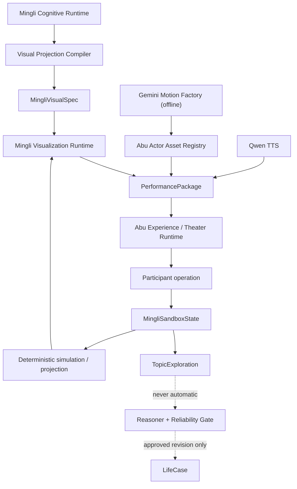

# V50 Interactive Mingli Theater Architecture v1

Status: accepted architecture; Topic 01 vertical slice implemented  
Date: 2026-07-18

> 2026-07-19 proposal note: the brand opening production prototype is specified
> in `V50_ABU_SAYS_MINGLI_S0_OPENING_THEATER_AND_XIANGFA_SYNC_V1.md`. S0 is
> pending analyst review. It consumes this architecture and a canonical Scene
> State; it does not authorize a second Theater runtime, Xiangfa reasoner or
> production release.

> 2026-07-18 refinement: the second vertical experience slice is now frozen in
> `V50_MINGLI_INTERACTIVE_CANVAS_TEMPORAL_SANDBOX_V1.md`. That contract owns
> Canvas provenance, compiler authority, temporal sandbox and formal diff semantics.
> This Theater document remains an upstream consumption architecture and must not
> be used to bypass the narrower Temporal Sandbox boundaries.

## Product Definition

`阿布说命` 不是一个视频栏目。站内本体是可观看、可操作、可讨论、可验证的命理专题：

```text
Abu presents a Mingli phenomenon
→ participant predicts
→ participant operates the chart
→ deterministic tools show the structural change
→ Abu explains the observed difference
→ counter-evidence is considered
→ exploration is saved without mutating the formal case
```

站外短视频和长视频只是同一专题的观看投影；DeepLife 站内提供用户亲手操作自己或示例命盘的完整体验。

## Three Separate Systems

### 1. Gemini Abu Motion Factory

Gemini 是离线动画素材工厂，不是最终动画引擎，也不进入 Live 运行时。

适合生产：

- 入场、走位、思考、点头、指向、倾听、推开报告和总结；
- 温和、好奇、认真、不确定等表演状态；
- 山谷、舞台、象法和过场氛围素材。

不负责：

- 用户私人命理台词；
- 四柱、Graph、路径与时序结构；
- 一整场需要暂停、分支和恢复的节目；
- 精确中文口型；
- 实时命理计算。

每个镜头必须遵循统一资产合同：

```yaml
AbuMotionAsset:
  asset_id:
  action:
  emotion:
  camera: front | three_quarter | side
  duration_ms:
  loopable:
  canvas_size:
  character_scale:
  foot_anchor:
  mouth_anchor_track:
  neutral_in_pose:
  neutral_out_pose:
  background: transparent | keyed | produced_scene
  lighting_profile:
  character_version:
  source_model_version:
  content_hash:
```

动作片段优先为 2–6 秒的镜头级素材。长节目由 Performance Timeline 编排，不由视频硬拼成不可中断的单片。

### 2. Mingli Visualization Runtime

命理工具动画是程序化认知界面。它消费已批准或明确标记为实验性的结构化语义，不自己断命。

```text
Approved cognition / deterministic simulation
→ MingliVisualSpec
→ MingliVisualCue
→ SVG / HTML / optional Canvas renderers
```

第一版视觉对象：

```text
Pillar / Stem / Branch / Hidden Stem
Graph Node / Edge / Path
Environment Field
Support / Conflict / Activation / Uncertainty Signal
Luck / Year / Month Timeline
Xiangfa Environment / Entity / Action Layer
```

第一版状态：

```text
normal
focused
active
supporting
suppressed
competing
uncertain
historical
disabled
```

第一版动画动词：

```text
enter / reveal / pulse / flow / split / merge
dim / lock / shake / fade / compare / interrupt
```

视觉语法必须稳定表达认识论状态：主路径可以点亮，竞争路径以暗色保留，未决条件不能被隐藏成唯一答案。

### 3. Executable Mingli Topic

一个专题共用同一份专业认知和 VisualSpec，可以投影为四种体验：

| Mode | Participant job |
| --- | --- |
| Watch | 观看完整演示或站外视频 |
| Guided Lesson | 按 Abu 引导完成固定学习检查点 |
| Lab | 自由选择节点、路径、时序和对比实验 |
| Debate | 比较竞争解释、共同事实、反证与待补证据 |

Live 只是这些专题的多人调度方式，不拥有另一套命理逻辑。

## Runtime Relationship



## MingliVisualSpec

The visualization input must be typed and traceable. Long prose is not a drawing contract.

```yaml
MingliVisualSpec:
  source_chart_version:
  source_life_case_version:
  epistemic_scope: approved | competing | simulation | teaching_fixture
  focus:

  chart_facts:
    pillars:
    hidden_stems:
    relations:

  paths:
    - path_id:
      label:
      node_refs:
      edge_refs:
      key_node_refs:
      status: approved | competing | interrupted | unresolved
      evidence_refs:

  temporal_overlay:
  unresolved_conditions:
  visual_anchors:
  must_not_visualize:
```

The compiler rejects missing source refs, unsupported relations and visual commands that upgrade uncertainty into certainty.

## MingliVisualCue

Performance and user interaction use the same command vocabulary:

```yaml
MingliVisualCue:
  cue_id:
  at_ms:
  action:
    reveal_pillar |
    focus_object |
    highlight_path |
    flow_path |
    dim_path |
    pulse_node |
    ablate_node |
    apply_temporal_overlay |
    compare_states
  target_refs:
  source_claim_refs:
  sandbox_revision:
  visual_only:
```

During a performance, audio time triggers cues. During a Lab, participant actions trigger the same cues after an allowed state transition.

## Mouth And Actor Reality

Qwen TTS owns formal speech. Generated motion clips own body performance only.

Fixed mouth overlays work only when a clip provides a stable or tracked mouth anchor. Therefore:

```text
restrained speaking clips
→ 3–5 mouth shapes driven by audio energy / simple visemes

large head movement or full-body clips
→ no fake fixed mouth overlay

Rive actor
→ future full action + mouth + interruption control
```

The current WebP voice-energy glow is a fallback, not true lip sync.

## MingliSandboxState

All participant experiments branch from immutable sources:

```yaml
MingliSandboxState:
  sandbox_id:
  source_chart_version:
  source_life_case_version:
  revision:

  selected_objects:
  hidden_nodes:
  disabled_relations:
  temporal_overlay:
  active_hypotheses:
  comparison_mode: baseline | modified | baseline_vs_modified
  user_prediction:

  computed_result_refs:
  baseline_result_hash:
  modified_result_hash:
  diff:
  epistemic_label: deterministic_simulation | hypothesis_projection | exploratory
```

The UI must keep `Baseline`, `Modified` and `Diff` distinguishable. Closing or resetting the sandbox restores the formal source without any mutation.

## Standard Topic Rhythm

```text
1. 看：Abu presents one specific phenomenon.
2. 猜：participant records an independent prediction.
3. 动：participant changes an allowed sandbox state.
4. 看变化：the stage renders the structural diff.
5. 问 Abu：Abu receives current object and sandbox context.
6. 找反证：the topic asks what would invalidate the interpretation.
7. 保存：prediction, experiment, explanation and open question become TopicExploration.
```

Public group results appear only after private predictions are frozen. Personal charts stay in private branches; public teaching uses anonymous approved fixtures.

## First Executable Topic

```text
去掉哪个节点，会真正改变这张命盘的运行路径？
```

It is a strong first candidate because it can validate:

- four-pillar focus;
- Graph and path rendering;
- key-node selection;
- node ablation;
- competing paths;
- Abu explanation grounded in the current visual object;
- a participant prediction and saved exploration.

The deterministic ablation semantics and one approved teaching fixture have now been implemented as the narrow Topic 01 vertical slice. The implementation reads an immutable approved path, permits one single-node ablation, emits a deterministic structural diff, restores the original and saves only `TopicExploration`.

The implementation does not infer real-world meaning from a visually broken path. That remains `reasoning_required`. Cases without traceable approved path references are refused instead of guessed. See `V50_ABU_MINGLI_TOPIC_01_STRUCTURAL_ABLATION.md`.

## Delivery Order

```text
Phase 1  Abu Motion Pack v1 + four-pillar stage
Phase 2  path graph + approved/competing comparison
Phase 3  isolated node-ablation sandbox
Phase 4  one Executable Mingli Topic (Topic 01 implemented)
Phase 5  temporal activation renderer
Phase 6  parameterized Xiangfa scene
```

Do not open all phases in parallel. Every phase must first prove semantic correctness, then interaction clarity, then visual quality.

## Non-Negotiable Boundaries

1. Gemini produces assets, never formal Mingli judgment.
2. Visualization renders cognition; it is not another Brain.
3. User operations never mutate chart facts.
4. Sandbox exploration never auto-promotes into LifeCase.
5. Uncertainty remains visible in color, path state and Abu language.
6. Programmatic Mingli objects remain inspectable and accessible; video is not the only carrier of meaning.
7. One topic uses one action owner and one canonical state.
8. A spectacular animation with incorrect semantics fails acceptance.
