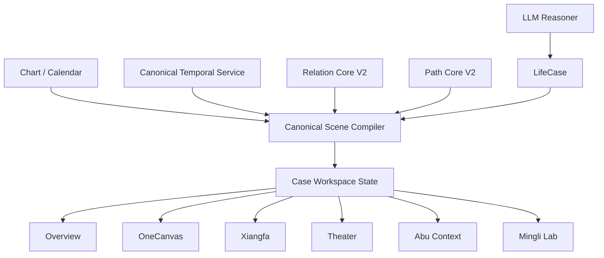

# Life Script Case Workspace & Mingli Lab Blueprint v1

> Status: `FROZEN PRODUCT DESIGN BASELINE`
>
> Product implementation: `ISOLATED DESIGN STUDY ONLY`
>
> Production adoption: `BLOCKED`
>
> Current authorization: information architecture, isolated clickable design study, and Lab product blueprint only

Design receipt: an isolated clickable study now exists at
`apps/product/static/experience/design-studies/life-script-workspace-v1/`.
It proves the information architecture and shared Scene projection only. It is
not an active product route and does not implement the production Case
Workspace, Mingli Lab, Relation Core V2 or Path Core V2.

## 0. Decision

DeepBazi does not become a collection of successful but separate features.

```text
one case
→ one canonical Mingli world
→ one shared workspace state
→ multiple consistent projections
```

The target product is:

> **Life Script Case Workspace · 人生剧本工作台**

Abu, OneCanvas, Xiangfa, Theater and Mingli Lab are not independent products and may not create independent Mingli facts.

## 1. Product Model

| Experience | User task | Product role |
|---|---|---|
| Abu | understand, ask and navigate | companion over the current case context |
| Overview | know what matters now | concise LifeCase projection |
| OneCanvas | see and operate structure | precise `Li` projection |
| Xiangfa | understand structure through imagery | `Xiang` projection |
| Theater | see path and time unfold | `Time` projection |
| Mingli Lab | experiment, compare, teach and research | professional Sandbox mode |

The target cognition and projection flow is:



The diagram is a target contract. Relation Core V2, Path Core V2 and Canonical Scene convergence are not yet implemented.

## 2. Shared Workspace State

Every mode consumes the same case identity and selection state.

```yaml
CaseWorkspaceState:
  case_id:
  chart_version_id:
  life_case_revision_id:
  temporal_snapshot_id:
  scene_state_id:
  disclosure_profile:

  current_mode: overview | onecanvas | xiangfa | theater | lab
  selected_semantic_refs: []
  focused_path_ref:
  temporal_stage: natal | dayun | annual
  theater_timecode:

  sandbox_session_id:
  sandbox_dirty: false
  comparison_variant_ids: []

  abu_thread_id:
  abu_drawer_state: closed | peek | open
```

Mode changes preserve:

- case and LifeCase revision;
- selected node, relation or path;
- current time stage;
- Sandbox identity;
- user role and disclosure policy;
- Abu conversation context.

A mode may change presentation. It may not silently change the selected Mingli object or formal case state.

## 3. Information Architecture

### 3.1 Desktop

```text
┌ Brand ─ Case identity ─ Time context ─ Role ─ Profile ┐
├ Overview | 命局 | 象法 | 时间 | 实验室              ┤
│                                                     │
│                Current mode surface                 │
│                                                     │
│                                          Abu        │
└ Context summary / current selection / status ───────┘
```

Desktop rules:

- one dominant work surface;
- no permanent multi-panel dashboard by default;
- contextual details open beside or below the selected object;
- Abu is collapsible and never creates a second navigation system;
- formal and Sandbox state are visible at all times when Lab is active.

### 3.2 Mobile

```text
top: case identity + time context
middle: one full-screen current mode
bottom: mode bar
floating/peek: Abu
```

Mobile rules:

- no desktop sidebar compressed into a drawer maze;
- the current Mingli object remains the visual focus;
- mode bar uses at most five destinations;
- Abu opens as a bottom sheet and preserves the current object;
- audio, subtitles and actions remain reachable with one thumb;
- system and social-video portrait layouts are separate compositions.

## 4. Mode Definitions

### 4.1 Overview

Ordinary-user default:

```text
one chart-specific baseline statement
one committed observation path
up to three current changes
known / uncertain distinction
one Abu-guided next action
```

Overview does not duplicate the full report, relation inventory or engineering review.

### 4.2 OneCanvas

OneCanvas is the precise structural surface.

It may show:

- four natal pillars plus DaYun and annual observation;
- role-approved relations;
- committed, candidate, blocked and user-draft paths;
- legal Sandbox editing;
- selected-object explanation;
- temporal differences.

It may not infer a relation, promote a path or decide legality in the browser.

### 4.3 Xiangfa

Xiangfa maps the same semantic objects into a coherent visual world.

```text
semantic node → visual subject
relation/path → spatial or light connection
support/block → constrained visual change
time stage → atmosphere and approved object changes
```

Every interactive Xiangfa object retains a `semantic_ref`. Decorative elements never become Mingli evidence.

### 4.4 Theater

Theater is the time behavior of the current Scene, not a separate prediction system.

```text
Scene State
→ Theater Projection
→ timed cues
→ Abu action + narration + subtitle + camera + path animation
```

The page remains available before audio. Audio failure never stops visual progression.

### 4.5 Mingli Lab

Lab is the professional Sandbox mode of the same Workspace. It is not a second Graph or a separate research backend.

## 5. Abu Contract

Abu always receives a role-filtered Context Pack containing:

- current case and revision;
- current mode;
- selected semantic references;
- current temporal stage or theater cue;
- formal versus Sandbox source;
- allowed commands;
- disclosed uncertainty and blocked reasons.

Abu may:

- explain the selected object;
- navigate to a mode or stage;
- start an approved Sandbox action;
- ask one high-value clarification;
- play, pause or locate a narrated segment;
- distinguish formal, candidate and hypothetical content.

Abu may not:

- create a missing relation;
- promote a candidate path;
- write LifeCase cognition without the formal commit flow;
- disclose filtered professional or research objects;
- restart context when the user changes modes.

## 6. Role and Disclosure Matrix

| Capability | Member | Practitioner | Researcher | Admin |
|---|---:|---:|---:|---:|
| Overview formal cognition | yes | yes | yes | yes |
| OneCanvas committed path | guided | full | full | full |
| candidate / blocked paths | limited | yes | yes | yes |
| legal Sandbox variants | guided | yes | yes | yes |
| user PathDraft | guided | yes | yes | yes |
| provenance / school profile | no | selected | full | full |
| ontology and relation audit | no | limited | yes | yes |
| teaching scene authoring | no | yes | yes | yes |
| role switching | no | no | no | yes |

Role filtering occurs before projection. CSS hiding is never an authorization boundary.

## 7. Mingli Lab V1 Blueprint

### 7.1 User Tasks

1. create a legal chart variant without changing the formal chart;
2. scan DaYun and annual stages;
3. inspect one relation through multiple approved lenses;
4. draw and compare a user PathDraft;
5. compare formal, candidate and user paths;
6. compare A/B chart or temporal variants;
7. inspect provenance, school and epistemic status;
8. save or discard a replayable Sandbox session;
9. restore the formal scene;
10. project an approved scene into Theater or Xiangfa.

### 7.2 Lab Lenses

Lab lenses are projections over the same object identity:

```text
fact
relation
path
time
evidence
provenance
```

They do not create six independent copies of a node.

### 7.3 Permanent Lab Boundaries

- Sandbox never writes the formal ChartVersion or LifeCase;
- user PathDraft never becomes a formal path automatically;
- no candidate is promoted by score alone;
- legal calendar mode and free structural research mode are explicit and separate;
- every mutation is replayable and discardable;
- every object retains source and epistemic status;
- Lab engineering remains blocked until RA3 and contract alignment.

## 8. Command Model

Page controls and Abu consume one Command Registry.

```yaml
WorkspaceCommand:
  command_id:
  case_id:
  source: page | abu | keyboard | theater
  intent:
  selected_refs: []
  expected_effect:
  authority_owner:
  confirmation_policy:
  allowed_roles: []
```

Examples:

```text
select_semantic_object
change_workspace_mode
set_temporal_stage
play_theater
open_abu_explanation
create_sandbox_session
update_chart_target_draft
draw_path_segment
compare_variants
discard_sandbox
```

Commands express user intent. Domain services decide facts and legality.

## 9. Visual System

The shared visual direction remains:

```text
warm paper white
ink green
small cinnabar accents
modern Eastern restraint
hand-painted atmosphere
precise structural geometry
Abu: warm and animated, never childish
```

Layer-specific rules:

```text
structure: precise and quiet
xiangfa: atmospheric but traceable
time: motion with discrete meaning
Abu: warm, contextual and interruptible
Lab: dense only when the role asks for density
```

Do not place every mode inside nested cards. The current mode owns the page.

## 10. Canonical Scene Requirements

The future `CanonicalSceneState` must support all consumers without containing layout:

```yaml
CanonicalSceneState:
  identity:
  semantic_nodes:
  relation_refs:
  path_refs:
  temporal_stage:
  epistemic_status:
  source_refs:
  selected_refs:
  disclosure_profile:
  diff_refs:
```

Required projections:

```text
InspectorProjection
OneCanvasProjection
OverviewProjection
AbuContextProjection
TheaterProjection
XiangfaProjection
LabProjection
```

This is the next architecture design slice after the R1 human product gate. It is not authorized for implementation in this blueprint.

## 11. Incremental Product Migration

```text
now
→ freeze IA and clickable design study
→ execute R1 human gate
→ converge Scene identity and projection adapters
→ pilot generated TypeScript contracts
→ implement Relation / Path V2 behind adapters
→ migrate one consumer at a time
→ introduce the new Experience Shell route
→ observe legacy usage
→ retire L5 only with parity and rollback evidence
```

No React or full frontend rewrite is authorized by this blueprint.

## 12. Product Acceptance Tasks

A future Workspace prototype must prove, without oral guidance:

1. the user always knows which case is open;
2. switching modes preserves the selected object;
3. changing time preserves case and selection;
4. Abu explains the same selected object after a mode change;
5. formal and Sandbox states cannot be confused;
6. ordinary users can find one conclusion, one path and uncertainty quickly;
7. practitioners can reveal provenance without changing the ordinary-user surface;
8. mobile users can complete the same core tasks with bottom navigation;
9. hidden role objects are absent from client data;
10. Theater and Xiangfa show no relation missing from the Scene.

## 13. Current Gate

```yaml
blueprint: FROZEN_PRODUCT_DESIGN_BASELINE
clickable_design_study: AUTHORIZED
production_workspace_implementation: BLOCKED
mingli_lab_engineering: BLOCKED
canonical_scene_implementation: AFTER_R1_HUMAN_PASS
relation_atlas_ra1: BLOCKED
frontend_framework_migration: BLOCKED
```

The machine-readable execution authority remains:

`config/v50_execution_state.yaml`
