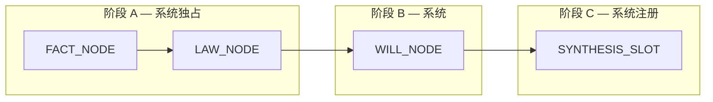
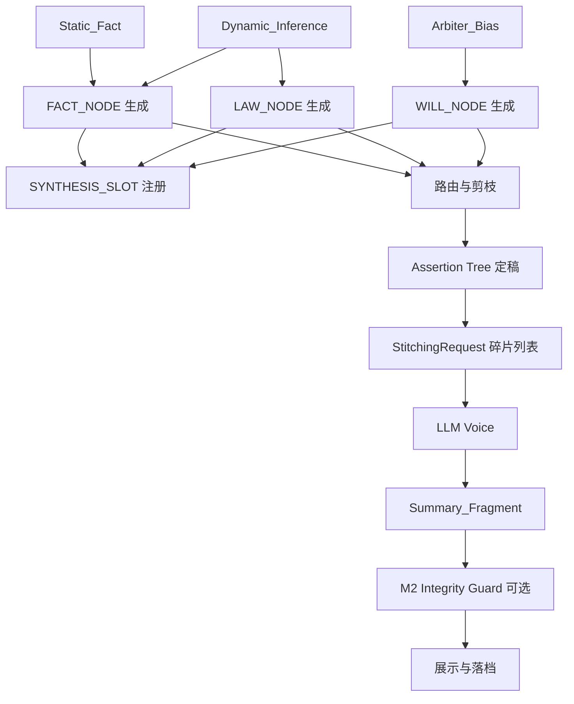

# V12.0 智能大脑系统设计白皮书 · 模块 M1–M4

| 元数据 | 值 |
|--------|-----|
| 文档状态 | **草案（Draft）** |
| 模块 | **M1** 三色 + Logic Interrupter；**M2** Logic Integrity Guard；**M3** Active Probing；**M4** Assertion Tree（断言主权） |
| 版本 | 0.4 |
| 约束 | **M1–M4 仅含数据模型、通信协议、状态机、Mermaid 流程与判定矩阵；不含生产环境业务实现代码与具体阈值常数。** |
| 前置阅读 | `architecture/V12_DOCUMENTATION_STEWARDSHIP.md`（索引与维护）、`architecture/V12_INFERENCE_PULSE_WHITEPAPER.md`（总纲）、`architecture/US_SYSTEM_LLM_BRAIN_FRAMEWORK_AND_INTELLIGENCE_REPORT_v1.md`、`architecture/INTELLIGENCE_LED_DECISION_FRAMEWORK_v2.md` |

---

## 0. 问题陈述与设计目标

### 0.1 现状

- `metadata` 与 `physics_tensor`（含 `meta`）长期**扁平混放**：排盘事实、L0 衍生量、L1/L2 插件产物、路由协商结果、意志上下文、语义标签等**共址**，不利于：
  - 系统侧按**责任边界**裁剪对 LLM 的投喂；
  - 裁决者按**真值 / 推演 / 偏置**理解数据血缘；
  - 实施**逻辑断点**（需用户确认的高敏碰撞）时的门控。

### 0.2 目标（M1）

1. 建立 **「三色元数据」** 概念模型与字段契约，作为后续存储与 API 演进的**规范源**。  
2. 给出自 **`physics_tensor.meta` 与现有 `metadata` 习惯用法** 向三色模型 **平滑迁移** 的分组计划（非一次性重写）。  
3. 定义 **逻辑断点（Logic Interrupter）** 的**协议级**行为：触发条件占位、与 `Arbiter_Bias` 的确认关系、对前后端的**事件/载荷**形状。

### 0.3 目标（M2）

1. 定义 **物理基调符号（PSV）**：从 `Static_Fact` / `Dynamic_Inference` 投影为可机读 **axis + polarity**。  
2. 定义 **语义审计器（Semantic Auditor）** 与 **拒稿码 / 自动重试 Prompt** 协议。  
3. 定义 Decision Inbox **`[LOGIC_CONFLICT]`** 异议块载荷，与 M1 中断协议区分职责。

### 0.4 目标（M3）

1. 扩展 **逻辑断点** 的**触发分类**（歧义 / 临界冲突 / 低置信证据链），与 M1 `InterruptRequest` **兼容**。  
2. 定义 **微推演对话（Micro-Inference Chat）** 的**原子化载荷**，禁止默认全量上下文复述。  
3. 定义 **决策闭环（Bias Re-entry）**：用户选择 → `Arbiter_Bias` → 解除 `blocking` → **局部重算** → 断言树同步（协议级）。  
4. 定义 **思想挂起** 状态机与问询文案**模板槽位**（非最终 UI 实现）。

### 0.5 目标（M4）

1. 定义 **碎片化断言树（Assertion Tree）** 与 **`AssertionNode`** Schema，区分 FACT / LAW / WILL / SYNTHESIS 四类节点。  
2. 定义 **主权分层**：系统先行事实与法典节点；LLM **仅**填充缝合槽并提升可读性。  
3. 定义 **断言路由与剪枝** 协议（可见性、高亮矛盾枝）。  
4. 定义 **语义缝合接口（Stitching Interface）**：输入断言碎片列表，输出 `Summary_Fragment`。

---

## 1. 三色元数据本体（Tri-Layer Ontology）

### 1.1 分层原则

| 层名 | 代号 | 语义 | 变更规则（规范层） |
|------|------|------|-------------------|
| **真值层** | `Static_Fact` | 由输入与历法唯一确定、或 L0 在**固定公式与固定参数版本**下可复算的**基线物理事实** | 同一生辰与同一静态配置下**可重放一致**；不随插件文案、用户勾选而变 |
| **推演层** | `Dynamic_Inference` | 插件、法典、L1 管线、路由、意志代理等在真值之上产生的**派生态** | 随插件开关、Manifest 版本、意志、大运流年锚点等变化；**可版本化、可审计** |
| **裁决偏置层** | `Arbiter_Bias` | 用户与裁决界面产生的**选择、归档、意图与偏好**，不改变真值公式本身，但参与**后续叙事权重与门控** | 仅经显式用户动作或等价 API 写入；**不得被空壳重算静默清空**（与 ILD 持久化原则对齐） |

> **说明**：三色是**逻辑分区**，不要求 V12 第一天即实现为三个物理文件或三个 DB 表；允许在过渡期内以**命名空间前缀**或**并行对象**挂载在同一 HTTP 载荷中。

### 1.2 Schema：`Static_Fact`（真值层）

**职责**：承载「可复算、可验算」的输入与基线输出，供系统与审计引用。

| 逻辑字段（概念名） | 类型（规范） | 说明 |
|--------------------|--------------|------|
| `schema_version` | `string` | 本层契约版本，如 `static_fact.v1` |
| `seed_fingerprint` | `string` | 同盘识别用稳定指纹（与现有 seed 签名策略对齐，实现待定） |
| `pillars` | `object` | 四柱干支结构（年月子时等） |
| `temporal_anchors` | `object` | 大运、流年等**作为输入锚点**的原始值（非插件解读） |
| `physics_param_version_id` | `string` | L0 所用参数表/缓存版本标识（便于复现） |
| `baseline_tensor` | `object` | **意志与 Inbox 未注入时** L0 输出的核心标量集合（如 deity 分值、轴、abs_nodes 等——具体键名由实现映射表锁定，本文不列实现键） |
| `climate_baseline` | `object` | 由月令与日主元素等确定的调候/气候**基线修正**（若当前实现落在 meta，迁移时归入此逻辑块） |
| `hidden_stems_profile` | `object` | 藏干及与柱绑定的静态结构（若当前分散在 tensor 根或 meta，迁移时收敛引用） |

**不变量（协议）**：

- `Static_Fact` 中不得写入 **插件自然语言结论** 或 **用户勾选状态**。  
- 对 LLM 的「只读真值」视图可由系统从本层**机械投影**，无需模型自行从杂包中分拣。

### 1.3 Schema：`Dynamic_Inference`（推演层）

**职责**：承载所有「在真值之上跑出来的」结构化结果，便于按插件/法典版本做 diff 与对 LLM 做**分 tier 投放**。

| 逻辑字段（概念名） | 类型（规范） | 说明 |
|--------------------|--------------|------|
| `schema_version` | `string` | 如 `dynamic_inference.v1` |
| `l1_audit` | `object` | L1 交互步骤摘要、全局熵、关键门控标志等 |
| `l2_pattern_rows` | `array` | 法典引擎输出的格局行（含 `pattern_id`、亲和、门控轨迹引用等） |
| `l2_engine_provenance` | `object` | 引擎名、Manifest 指纹、strict 标记等 |
| `plugin_registry_snapshot` | `object` | 启用插件列表、规范版本（与 orchestrator 写入习惯对齐） |
| `will_intention_context` | `object` | 意志代理写入的 `intention_context`（参数覆盖摘要、L2 乘子、拓扑因子等） |
| `conflict_and_topology` | `object` | 冲突拓扑、地支作用汇总等（当前多位于 `meta`） |
| `semantic_label_bundle` | `object` | 语义 VF 标签包（系统生成，非用户偏置） |
| `causal_routing` | `object` | 因果路由协商结果（若存在） |
| `post_will_tensor_delta` | `object` | （可选）相对 `baseline_tensor` 的**意志后暂态**摘要指针或只读差分描述 |

**不变量（协议）**：

- `Dynamic_Inference` **可以**依赖 `Static_Fact` 与运行时配置；**不得**反向改写 `pillars` 等真值输入。  
- 对 LLM 默认提供 **摘要投影**；全量行级 trace 可通过 **高推理模式** 或 **专用审计通道** 协议扩展。

### 1.4 Schema：`Arbiter_Bias`（裁决偏置层）

**职责**：显式记录「裁决者已经表态过什么」，供逻辑断点、终审 Prompt 与持久化合并使用。

| 逻辑字段（概念名） | `string` | 说明 |
|--------------------|----------|------|
| `schema_version` | `string` | 如 `arbiter_bias.v1` |
| `user_intention_id` | `string` | 当前会话意志枚举（如 seek_wealth / seek_stability / seek_fame），与配置层对齐 |
| `inbox_selections` | `array` | Decision Inbox 已勾选条目引用（卡片 id、类型、时间戳、seed 绑定） |
| `archived_semantic_verdicts` | `array` | 已归档语义断语（与 `persistence_layer` 语义对齐，可视为本层镜像或子集） |
| `confirmed_physics_patches` | `array` | 用户确认的能量/参数侧车（IndividualAdjustment 类，不直接等价全局改库） |
| `preference_profile_refs` | `array` | 历史偏好配置 ID 或外部画像引用（实现待定） |
| `bias_ack_tokens` | `array` | **逻辑断点**已确认令牌的集合（见第 4 节） |

**不变量（协议）**：

- `Arbiter_Bias` **仅**经用户显式动作或带授权的写入 API 更新。  
- 静默重算返回缺少本层字段时，**合并策略保留旧值**（与 ILD 防覆盖原则一致）。

---

## 2. 现状审计：`physics_tensor.meta` → 三色映射（迁移计划）

### 2.1 当前 `meta` 中常见键（非穷举，来自实现扫描）

下列键名用于**迁移分组**，不代表 V12 最终命名：

| 现行键（示例） | 建议归属 |
|----------------|----------|
| `climate_field_correction_v1` | `Static_Fact.climate_baseline`（若仅由柱与固定规则决定）或 `Dynamic_Inference`（若与运行时插件强耦合则标为推演，由实现裁定） |
| `params`（meta 内展示用参数字典） | 以只读快照形式：`Static_Fact` 附表或 `Dynamic_Inference.plugin_registry_snapshot` 引用 |
| `pattern_thresholds`, `pattern_thresholds_engine`, `l2_pattern_result_summary_v1`, `hit_pattern_name`, `pattern_manifest_file_sha256` | `Dynamic_Inference.l2_*` |
| `intention_context` | `Dynamic_Inference.will_intention_context` |
| `semantic_label_bundle_v1` | `Dynamic_Inference.semantic_label_bundle` |
| `causal_routing` | `Dynamic_Inference.causal_routing` |
| `enabled_plugins`, `plugin_specs`, `blind_school_features` | `Dynamic_Inference.plugin_registry_snapshot` |
| `mangpai_chip_logs`, `interaction_hub_mangpai`, `mangpai_pierce_semantics` | `Dynamic_Inference`（盲派推演产物） |
| `conflict_topology_v1`, `branch_interactions` | `Dynamic_Inference.conflict_and_topology` |
| `energy_flow_audit`, `energy_vault_flags`, `work_eligible`, `l1_robber_wealth_v1` 等 L1 摘要 | `Dynamic_Inference.l1_audit` |
| `chronos_v1`, `structural_preview_recommendation` | `Dynamic_Inference`（时空/预览类） |
| `pattern_profile`（路由写回的 profile） | `Dynamic_Inference`（与 `causal_routing` 可并列） |

**根级 `physics_tensor` 非常量**（如 `deity_scores`, `abs_nodes`, `deity_energy_axes`）：在契约上建议 **主副本** 作为当前帧状态；**基线副本** 入 `Static_Fact.baseline_tensor`，意志后帧可通过 `Dynamic_Inference.post_will_tensor_delta` 指向或差分（实现阶段再定）。

### 2.2 平滑迁移策略（仅计划，无代码）

| 阶段 | 动作 | 风险与控制 |
|------|------|------------|
| **P0 — 并行挂载** | API 响应中增加 `tri_layer: { static_fact, dynamic_inference, arbiter_bias }` 三对象，由**投影器**从现有 `metadata` + `physics_tensor` 填充；旧字段全量保留 | 双写读取，前端可渐进切换 |
| **P1 — 写入收口** | 新插件与 orchestrator **仅**写入规范路径；旧键名通过适配层同步到三对象 | 需键名映射表与弃用时间表 |
| **P2 — 读路径收敛** | 终判/审计 Prompt 构建**只读**三对象投影，不再扫描整包 `meta` | 需回归测试与 LLM 上下文体积评估 |
| **P3 — 存储归一** | 可选：DB/会话存储按三表或三 JSONB 列持久化 | 与咨询会话模型耦合，单独立项 |

---

## 3. `metadata` 与三色的关系

| 现行载体 | 建议 |
|----------|------|
| `BaziMetadata` 中排盘、冲突矩阵扫描点等 | 多数映射至 `Static_Fact`（输入侧）+ 部分扫描结果若属「当轮解释」可镜像至 `Dynamic_Inference` |
| `persistence_layer`, `history_context` | 核心进入 `Arbiter_Bias.archived_*` 与合并策略协议（字段级映射在 M3+ 细化） |
| `verdict_anchor_layer` | 系统产出，**不**属于三色中的用户偏置；可归 **系统快照**（可在 M4 定义第四类 `System_Memory`，本文 M1 不展开）或暂挂 `Dynamic_Inference` 的只读附录 |

---

## 4. 逻辑断点（Logic Interrupter）协议

### 4.1 目的

当 L0/L2 或插件链检测到 **高敏因果碰撞**（示例：**食伤制杀**类标签，实现由规则注册表定义，**本文只定义协议槽位**）时，若 **`Arbiter_Bias` 中不存在对应确认令牌**，系统**不得**默认推进至「终审闭合」或等效高成本叙事，而应进入 **中断态**，请求裁决者显式表态。

**触发类型的细化与微对话载荷**见 **§7（M3）**；M1 本节保留 **InterruptRequest / InterruptAck** 的**通用信封**，M3 在 `trigger_kind` 与 `micro_inference` 扩展上与之组合使用。

### 4.2 核心概念

| 概念 | 定义 |
|------|------|
| **断点标识** `interrupt_id` | 全局唯一、稳定字符串（如 `collision.shishang_zhisha.v1`） |
| **触发签名** `trigger_fingerprint` | 由真值子集 + 推演关键标量构成的短哈希，用于同盘同碰撞去重 |
| **确认令牌** `ack_token` | 用户确认后写入 `Arbiter_Bias.bias_ack_tokens[]` 的记录项 |

### 4.3 协议消息：`InterruptRequest`（系统 → 客户端）

系统通过 **SSE / NDJSON / REST 扩展字段** 之一下发（具体通道由 M5 定，此处只定义载荷形状）。

```json
{
  "protocol": "logic_interrupter.v1",
  "interrupt_id": "collision.shishang_zhisha.v1",
  "severity": "blocking | advisory",
  "trigger_fingerprint": "string",
  "summary_for_arbiter": "string",
  "required_bias_fields": ["bias_ack_tokens"],
  "static_fact_refs": ["paths.into.static_fact"],
  "dynamic_inference_refs": ["paths.into.dynamic_inference"],
  "expires_at": "iso8601 | null"
}
```

**字段说明（规范）**：

- `severity`：`blocking` 表示未确认前**禁止**自动终审闭合；`advisory` 仅提示，不挡主流程。  
- `summary_for_arbiter`：给人读的**极短**说明，**非** LLM 长文。  
- `*_refs`：指向三色对象内的**逻辑路径**，避免再次 dump 全量 meta。

### 4.4 协议消息：`InterruptAck`（客户端 → 系统）

```json
{
  "protocol": "logic_interrupter.v1",
  "interrupt_id": "collision.shishang_zhisha.v1",
  "trigger_fingerprint": "string",
  "ack_token": {
    "token_id": "uuid",
    "arbiter_action": "confirm | dismiss | defer",
    "bound_seed_fingerprint": "string",
    "created_at": "iso8601"
  },
  "optional_note": "string"
}
```

**门控规则（协议）**：

- 当 `severity=blocking` 且 `ack_token` 未与当前 `trigger_fingerprint` 绑定写入 `Arbiter_Bias` 时，**终审请求**应返回 **HTTP 409** 或 **业务码 `INTERRUPT_PENDING`**（具体码表 M5），**正文不含 LLM 生成**。  
- 确认后，同一 `trigger_fingerprint` 的重复触发**不重复弹窗**（幂等）。

### 4.5 与 LLM 的关系（M1 立场）

- **逻辑断点不由 LLM 触发**；仅由**确定性规则引擎**或**插件结构化输出**触发。  
- LLM 可在**已确认**后参与「解释性润色」，但**不得**作为断点是否解除的权威来源。

---

## 5. 对 LLM 的投喂协议（投影原则）

| 角色 | 建议投影源 |
|------|------------|
| 终判 / 审计（系统主导） | 优先：`Static_Fact` 摘要 + `Dynamic_Inference` 摘要 + `Arbiter_Bias` 中与本轮相关的勾选与 `ack_token` 列表 |
| 禁止 | 将完整未分层的 `metadata` 与 `meta` 无差别拼接作为默认策略 |

**版本字段**：每次请求携带 `tri_layer.schema_version` 三元组，便于 Prompt 模板与解析器演进。

---

## 6. 模块 2（M2）：逻辑监军 — Logic Integrity Guard 协议

> **对齐总纲**：`architecture/V12_INFERENCE_PULSE_WHITEPAPER.md` §3.A（Logic Integrity Guard）。M2 将「叙事–物理一致性」落实为**可机读符号**、**审计器协议**与 **Inbox 异议块**，与 M1 三色投影衔接。

### 6.1 物理基调符号化（Physical Sentiment Vector, PSV）

#### 6.1.1 目的

从 `Static_Fact` 与 `Dynamic_Inference` 的**规范投影**中抽取有限维度的 **吉凶 / 能量趋势符号**，供监军层与叙事文本做**确定性对撞**，避免直接比较浮点或全文语义 embedding 作为主闸门。

#### 6.1.2 符号条目 Schema（概念）

每条 PSV 记录为**一元断言**，独立于 Voice 输出：

| 字段 | 类型（规范） | 说明 |
|------|--------------|------|
| `axis` | `string` | 语义轴标识，如 `WEALTH`、`OFFICER`、`DAY_MASTER`、`WORK_NET`、`GLOBAL_RISK` |
| `polarity` | `enum` | 见下表 |
| `strength` | `enum` | `STRONG \| MODERATE \| WEAK`（表示信号置信或幅度档位，由投影规则映射） |
| `evidence_refs` | `array` | 指向 `Static_Fact` / `Dynamic_Inference` 内**逻辑路径**的短引用（如 `dynamic_inference.l1_audit.robber_wealth`） |
| `fingerprint` | `string` | 本条目所依据子结构的哈希前缀，用于重算幂等 |

**`polarity` 枚举（规范）**

| 取值 | 含义（协议语义） |
|------|------------------|
| `STRONG_POSITIVE` | 轴上趋势显著利于「得用、收敛、增益」叙事 |
| `MILD_POSITIVE` | 温和偏正 |
| `NEUTRAL` | 不可用正负描述或对撞规则忽略 |
| `MILD_NEGATIVE` | 温和偏负 |
| `STRONG_NEGATIVE` | 显著不利（耗散、破格风险、强冲突等） |
| `UNKNOWN` | 输入不足以符号化，监军**不**据此轴触发拒稿 |

#### 6.1.2.1 参考实现（后端落地）

| 项 | 路径 / 符号 |
|----|----------------|
| 符号模型 | `app.logic.brain.psv_engine.PSVSymbol`（`axis`、`polarity`、`strength` 0–1、`evidence`、`fingerprint`） |
| 引擎 | `app.logic.brain.psv_engine.PSVEngine`：方法 ``build(tri: TriLayerMetadata) -> list[PSVSymbol]`` |
| 输入 | `app.schemas.tri_layer_v12.TriLayerMetadata`（通常由 `app.services.helpers.metadata_projector_v12.MetadataProjectorV12` 投影） |
| 运行时配置 | `app.logic.brain.config.PSVRuntimeConfig`；合并顺序为默认值 → 环境变量 `QIAZHI_PSV_*` → `ArbiterBias.psv_runtime_overrides`（`load_psv_runtime_config` / `PSVEngine.from_tri`） |
| 包导出 | `app.logic.brain` 导出 `PSVEngine`、`PSVSymbol`、`PSVRuntimeConfig`、加载函数 |

**确定性规则（v0）**：比劫/财星穿透比、五行 `normalized` 极差、L2 头名格局亲和与 `user_intention_id` / `will_intention_context.active_intention` 联合定调等**比例与阈值均取自 `PSVRuntimeConfig`**，不在引擎模块内写死。**禁止 LLM 参与本引擎。**

#### 6.1.3 提取算法（伪代码级流程）

下列流程描述**监军入口**的计算顺序；具体阈值与键名由实现映射表锁定，**本文不写死数值**。

```
函数 Build_PSV(static_fact, dynamic_inference, current_frame_tensor) -> List<PSVEntry>

1. 初始化列表 L = []

2. 【财富轴 — 示例路径，可配置】
   从 dynamic_inference 读取：
     - 财星相关轴的相对损耗或 L1 比劫夺财摘要（若存在）
     - 冲突拓扑中与「夺财」相关的结构化标志
   从 static_fact.baseline_tensor 与 current_frame 可选读取财星轴 before/after
   若规则表判定「财星轴有效损耗比例 > τ_wealth_loss」且「比劫夺财类冲突激活」
     则追加 { axis: WEALTH, polarity: STRONG_NEGATIVE, strength: STRONG,
               evidence_refs: [...], fingerprint: hash(...) }
   否则按规则表映射为 MILD_NEGATIVE / NEUTRAL / UNKNOWN

3. 【官杀 / 日主 / 做功净值等】
   对预注册轴集合 Θ 中每一轴，按「门控失败 / 熵 / 盲派 net_effect / L2 exclusion_hit」等
   查规则表 → 追加 0..1 条 PSV（避免同一轴多条矛盾；若矛盾则降级为 UNKNOWN 并打审计标）

4. 对 L 按 axis 去重：保留 strength 更高或 polarity 更极端的一条（策略可配置）

5. 返回 L
```

**规范示例（与任务书一致）**

- 若「财星轴」有效损耗超过配置阈值 **且** 存在「比劫夺财」类结构化命中，则至少产生一条：  
  **`{ axis: "WEALTH", polarity: "STRONG_NEGATIVE", ... }`**  
  人类可读标签可记为 **`WEALTH: NEGATIVE_DECAY`**（实现可选用 `polarity_strength` 合成展示名，协议以 `axis` + `polarity` + `strength` 为准）。

---

### 6.2 语义审计器（Semantic Auditor）

#### 6.2.1 输入 / 输出（协议）

| 方向 | 载荷 |
|------|------|
| **输入** | `narrative_text`（Voice 主叙事，通常为 `verdict_body` 或等价 Markdown 纯文本）、`psv: PSVEntry[]`、`locale`（`ZH` / `EN` / …）、`pass_index`（第几次过监军，从 0 起） |
| **输出** | `audit_result`: `PASS` \| `REJECT` \| `FLAG`；`reject_reason_code?`、`matched_rules[]`、`dissent_hint`（供异议块与重试 Prompt 填充） |

- **`FLAG`**：疑似矛盾但规则未覆盖，或仅建议人工复核；**不**自动拒稿（可配置为在 Inbox 仅 advisory）。

#### 6.2.2 校验管线（伪代码）

```
函数 Semantic_Audit(narrative_text, psv, locale, pass_index) -> audit_result

1. 规范化文本 T = normalize(narrative_text)   // 去空白、统一全半角等，不做语义改写

2. 【规则层 — 主路径】
   对每个 PSV 条目 e：
     若 e.polarity ∈ {STRONG_NEGATIVE, MILD_NEGATIVE}：
       若在 T 中命中「强正面词典」D_pos(e.axis, locale) 的任一词/短语
         则返回 REJECT，reason_code = LIG_AXIS_POS_MISMATCH，matched_rules += ...

     若 e.polarity ∈ {STRONG_POSITIVE, MILD_POSITIVE}：
       若在 T 中命中「强负面词典」D_neg(e.axis, locale)
         则返回 REJECT，reason_code = LIG_AXIS_NEG_MISMATCH，...

   // 示例：WEALTH 为 STRONG_NEGATIVE 且 T 含「财运亨通」「爆发」「财源广进」等 → REJECT

3. 【可选：二次模型层】
   若规则层 PASS 且配置启用 secondary_model：
     将 (T 摘要, PSV 压缩 JSON) 送入小模型，输出 structured {consistent: bool, confidence}
     若 consistent=false 且 confidence > τ_audit → REJECT 或 FLAG（由策略表决定）
   **协议约束**：二次模型**不得**作为唯一拒稿源；规则层 REJECT 优先生效。

4. 若未触发任何 REJECT，返回 PASS
```

#### 6.2.3 拒稿条件判定矩阵（示例维度）

行：PSV `polarity`（简化为 NEG = STRONG/MILD_NEGATIVE，POS = STRONG/MILD_POSITIVE，NEU = NEUTRAL/UNKNOWN）  
列：叙事侧命中词典类型

|  | 强正面词（财运/贵气/大吉类） | 强负面词（破败/官非/大凶类） | 中性/模糊 |
|--|------------------------------|------------------------------|-----------|
| **NEG** | **REJECT**（叙事–物理正向冲突） | PASS（方向一致，细节另审） | PASS |
| **POS** | PASS | **REJECT**（叙事–物理负向冲突） | PASS |
| **NEU** | PASS | PASS | PASS |

> 实现时对「强正面/强负面」按 **axis 分表**（财轴词表 ≠ 官杀轴词表），避免误杀。

#### 6.2.4 `REJECT_REASON_CODE`（规范枚举，可扩展）

| 代码 | 含义 |
|------|------|
| `LIG_AXIS_POS_MISMATCH` | 物理轴为负向，叙事出现该轴强正面措辞 |
| `LIG_AXIS_NEG_MISMATCH` | 物理轴为正向，叙事出现该轴强负面措辞 |
| `LIG_MULTI_AXIS_CONFLICT` | 多轴同时触发矛盾 |
| `LIG_SECONDARY_MODEL_LOW_CONSISTENCY` | （可选）二次模型低一致性 |
| `LIG_RETRY_EXHAUSTED` | 已达最大自动重试次数，进入异议块流程 |

#### 6.2.5 `AUTO_RETRY_PROMPT`（协议形状）

系统自动组装、**追加**到下一次 Voice 请求的 system 或 user 尾部（具体挂载点由终判管线定义），必须包含：

| 槽位 | 内容 |
|------|------|
| `{{PHYSICAL_SENTIMENT_SUMMARY}}` | PSV 的人类可读一行摘要（如 `WEALTH:STRONG_NEGATIVE`） |
| `{{CONFLICT_EXCERPT}}` | 叙事中触发匹配的原文短摘录（≤N 字） |
| `{{FORBIDDEN_STANCE}}` | 明确禁止的立场描述（如「不得宣称财运亨通或爆发式增长」） |
| `{{REQUIRED_ALIGNMENT}}` | 要求与 PSV 方向一致的措辞边界（中性或审慎） |

**重试上限**：`max_auto_retry` 由配置给出；每次重试 `pass_index` 递增并写入审计日志。**超过上限**不得无限调用 LLM；必须进入 **§6.3 异议块** 并可选降级为模板叙事。

#### 6.2.6 参考实现（后端落地）

| 项 | 路径 / 符号 |
|----|----------------|
| 审计器 | `app.logic.brain.semantic_auditor.SemanticAuditor.audit` |
| Auto-Retry Prompt | `app.logic.brain.semantic_auditor.SemanticAuditor.build_auto_retry_prompt` |
| 枢纽接入 | `app.logic.brain.hub.BrainHub` + `app.skills.final_verdict.FinalVerdictSkill.generate` |
| 超限异议 | `LIG_RETRY_EXHAUSTED` + `DissentBlock`（`logic_integrity_guard.v1`） |

---

### 6.3 异议块（Dissent Block）— Decision Inbox 显示协议

当 **Semantic Auditor** 在耗尽重试后仍为 `REJECT`，或策略配置为「拒稿即展示异议」，系统须向裁决者暴露**物理场与叙事不一致**，而不静默失败。

#### 6.3.1 块类型与标识

| 字段 | 值 |
|------|-----|
| `block_kind` | `LOGIC_CONFLICT` |
| `protocol` | `logic_integrity_guard.v1` |
| `severity` | `blocking`（阻止该版叙事作为已签发终判）或 `advisory`（仅警告） |

#### 6.3.2 载荷 Schema（系统 → 前端 / Inbox 管道）

```json
{
  "protocol": "logic_integrity_guard.v1",
  "block_kind": "LOGIC_CONFLICT",
  "severity": "blocking | advisory",
  "title_key": "inbox.logic_conflict.title",
  "reject_reason_code": "LIG_AXIS_POS_MISMATCH",
  "psv_snapshot": [ { "axis": "WEALTH", "polarity": "STRONG_NEGATIVE", "strength": "STRONG" } ],
  "narrative_excerpt": "string",
  "matched_lexemes": ["财运亨通"],
  "summary_for_arbiter": "string",
  "suggested_actions": [
    "retry_verdict_with_guard_prompt",
    "edit_narrative_manually",
    "acknowledge_conflict_and_archive"
  ],
  "bound_seed_fingerprint": "string",
  "created_at": "iso8601"
}
```

**前端展示约定（协议）**

- 卡片或固定区块标题须含可检索前缀 **`[LOGIC_CONFLICT]`**（或与 i18n `title_key` 组合显示），便于 `result_logs` / 审计过滤。  
- `summary_for_arbiter` **禁止**使用模型生成的自我辩解长文；应由系统模板根据 `reject_reason_code` + `psv_snapshot` 拼装。  
- 用户若执行 `acknowledge_conflict_and_archive`，须写入 `Arbiter_Bias`（如新字段 `logic_conflict_acks[]`，与 M1 `bias_ack_tokens` 可合并设计，实现阶段定稿）。

#### 6.3.3 与 M1 Logic Interrupter 的边界

| 机制 | 触发源 | 阻断对象 |
|------|--------|----------|
| **Logic Interrupter（M1）** | 法典/插件高敏碰撞、缺用户确认 | 终审闭合 / 特定流程 |
| **Logic Integrity Guard（M2）** | Voice 叙事与 PSV 对撞失败 | 该版叙事签发与展示信任链 |
| **Active Probing（M3）** | 歧义分叉、临界损耗缺偏置、证据链不足（见 §7） | 同上或局部流程；常带 **Micro-Inference** 载荷 |

**M2 与 M3 可同时存在**；**同一响应**可携带 `InterruptRequest`（及可选 `micro_inference`）、`Dissent Block`，前端分开展示。

---

### 6.4 M2 非目标

- PSV 规则表的具体阈值、`τ_wealth_loss`、各轴完整词典内容。  
- 二次审计模型的选型与 Prompt 全文。  
- Inbox UI 组件实现与样式。

---

## 7. 模块 3（M3）：主动交互 — Active Probing Protocol

> **对齐总纲**：`architecture/V12_INFERENCE_PULSE_WHITEPAPER.md` §3.B（Interactive Belief Completion）。M3 在 M1 **InterruptRequest** 信封之上，定义**触发分类**、**微推演载荷**、**偏置回写**与**挂起状态机**。

### 7.1 与 M1 / M2 的组合方式

| 组件 | 角色 |
|------|------|
| M1 §4 | `InterruptRequest` / `InterruptAck` **通用协议**（`interrupt_id`、`trigger_fingerprint`、`severity`、`ack_token`） |
| M3 §7 | **`trigger_kind` 枚举**、**`micro_inference` 子载荷**、**Bias Re-entry**、**挂起状态机** |
| M2 §6 | 叙事–物理监军；可与 M3 **并行**（先解决分叉再生成 Voice，或先生成再监军，由产品策略表配置，本文不强制顺序） |

**规范约束**：任一 `blocking` 级中断未解除时，**不得**将该轮结果标为「终审已闭合」或等效终态（与 M1 §4.4 一致）。

---

### 7.2 交互触发器（Trigger Conditions）

下列 **trigger_kind** 为**协议分类**；具体检测式由规则注册表实现，**本文不写阈值**。

| `trigger_kind` | 语义标签 | 触发直觉（规范描述） | 对 `Arbiter_Bias` 的前置检查 |
|----------------|----------|----------------------|--------------------------------|
| `AMBIGUITY` | 歧义 | L2（或等价法典输出）存在 **两个（或更多）互斥格局假设** 且 **亲和度均高于配置下限**，系统无法在 Law 层自动裁决唯一主叙事 | 无针对该 **逻辑分叉签名** 的已存 `bias_ack_tokens` / `probing_responses`（见 §7.5） |
| `CRITICAL_CONFLICT` | 临界冲突 | **因果损耗**（或等价 L1/L0 汇总标量）**超过配置阈值**，且 **缺乏** 与该损耗通道相关的 **历史定性**（`Arbiter_Bias` 中无匹配的归档语义或 probing 记录） | 同上 |
| `LOW_CONFIDENCE` | 低置信度 | 某一待展示 **断言**（或 Voice 输出中的结构化断言槽位）的 **证据链引用** 少于配置下限，或引用不在允许白名单内 | 无针对该 **断言节点** 的用户确认或补证 |

**与 M1 `InterruptRequest` 的拼接**：在 M1 JSON 信封上**可选扩展**字段（向后兼容）：

```json
{
  "protocol": "logic_interrupter.v1",
  "interrupt_id": "string",
  "severity": "blocking | advisory",
  "trigger_fingerprint": "string",
  "trigger_kind": "AMBIGUITY | CRITICAL_CONFLICT | LOW_CONFIDENCE",
  "summary_for_arbiter": "string",
  "micro_inference": { }
}
```

`micro_inference` 形状见 **§7.3**；若省略，则退化为 M1 纯确认型中断（仅 `ack_token`，无选项分枝）。

---

### 7.3 微推演对话（Micro-Inference Chat）协议

**设计原则**：**非全量**、**原子化**；单次载荷只服务 **一个** `target_logic_node`（或显式声明的**极小节点集合**，默认禁止超过 1 个主节点）。

#### 7.3.1 `target_logic_node`（逻辑锚点）

| 字段 | 类型 | 说明 |
|------|------|------|
| `node_type` | `enum` | `L2_PATTERN_FORK` \| `L1_CAUSAL_LOSS` \| `ASSERTION_EVIDENCE` \| `CUSTOM`（需 `node_type_version`） |
| `node_ref` | `object` | 与 `node_type` 对应的**稳定引用**（如双格局的 `pattern_id` 对、L1 步骤 id、断言 `assertion_id`） |
| `fork_signature` | `string` | 歧义分叉的短哈希（用于幂等与 `trigger_fingerprint` 对齐） |

#### 7.3.2 `context_snapshot`（局部物理场）

| 字段 | 类型 | 说明 |
|------|------|------|
| `schema_version` | `string` | 如 `micro_context.v1` |
| `static_fact_refs` | `array` | 指向真值层路径（**禁止**嵌入完整 `baseline_tensor`） |
| `dynamic_inference_refs` | `array` | 指向推演层路径 |
| `scalar_hints` | `array` | 可选：已脱敏的**档位标签**（如「官杀对冲：高」），**禁止**浮点字面量默认直出（与语义防火墙策略对齐） |
| `max_chars` | `number` | 本快照序列化上限（由系统强制执行） |

#### 7.3.3 `suggested_options`（决策分枝）

每项表示用户可一键选择的**路径**，不是自由长文：

```json
{
  "option_id": "opt_a",
  "label_key": "probing.option.career_change_confirm",
  "description_key": "probing.option.career_change_confirm.hint",
  "bias_binding": {
    "bias_kind": "probing_choice",
    "payload_schema": "probing_choice.v1",
    "payload": { }
  },
  "partial_recalc_hint": {
    "scope": "L2_ROUTER | L1_CHANNEL | ASSERTION_TREE_ATTACH",
    "exclusive": true
  }
}
```

**规范**：`label_key` / `description_key` 为 i18n 键；**禁止**由 LLM 在运行时生成选项全文作为主路径（可选由系统模板填槽）。

#### 7.3.4 完整 `micro_inference` 载荷（嵌入 InterruptRequest）

```json
{
  "probe_id": "uuid",
  "target_logic_node": {
    "node_type": "L1_CAUSAL_LOSS",
    "node_ref": { "channel": "OFFICER_KILL_CLASH", "step_ref": "string" },
    "fork_signature": "string"
  },
  "context_snapshot": {
    "schema_version": "micro_context.v1",
    "static_fact_refs": [],
    "dynamic_inference_refs": [],
    "scalar_hints": [],
    "max_chars": 2048
  },
  "suggested_options": [],
  "question_template_key": "probing.question.officer_clash_career",
  "template_slots": {
    "officer_axis_hint": "官杀能量异常对冲"
  },
  "locale": "ZH"
}
```

**问询文案示例（UX Metaphor，仅占位）**：  
`question_template_key` 解析后可能呈现为：*「检测到 {{officer_axis_hint}}，推测现实面临职业变动，是否属实？」* —— **实际句式由文案表与槽位决定，不由 Voice 即兴发挥为主源。**

---

### 7.4 决策闭环（Bias Re-entry）与局部重算

#### 7.4.1 用户响应载荷：`ProbingResponse`（客户端 → 系统）

```json
{
  "protocol": "active_probing.v1",
  "probe_id": "uuid",
  "interrupt_id": "string",
  "trigger_fingerprint": "string",
  "selected_option_id": "opt_a",
  "custom_text": "string | null",
  "bound_seed_fingerprint": "string",
  "created_at": "iso8601"
}
```

- `custom_text`：**可选**；若存在，须经系统**结构化抽取**或**降级为仅存档**，不得直接无校验合并进物理公式（协议约束）。

#### 7.4.2 写入 `Arbiter_Bias`（规范字段）

| 逻辑位置 | 内容 |
|----------|------|
| `probing_responses[]` **或** 扩展 `bias_ack_tokens[]` | 每条含 `probe_id`、`interrupt_id`、`trigger_fingerprint`、`selected_option_id`、`bias_binding` 解析后的**规范子对象**、`created_at` |
| `inbox_selections[]`（可选镜像） | 若前端以 Inbox 卡片提交，可与现有勾选模型合并 |

**不变量**：写入须 **append** 或 **按 probe_id 幂等覆盖**，禁止静默清空历史偏置。

#### 7.4.3 解除 Blocking 与局部重算（协议流程）

**伪代码级状态迁移**（与 §7.5 状态机一致）：

```
on ProbingResponse 校验通过:
  1. 将响应写入 Arbiter_Bias（§7.4.2）
  2. 若本 interrupt 的 blocking 条件已满足 → 置会话标志 INTERRUPT_CLEARED_FOR(interrupt_id)
  3. 根据 selected_option.partial_recalc_hint.scope 触发 Partial Recalculation:
       - L2_ROUTER: 仅重跑格局路由 / 法典相关子图（实现绑定）
       - L1_CHANNEL: 仅重跑指定损耗通道相关 L1 步骤子集
       - ASSERTION_TREE_ATTACH: 将选项映射为断言树节点挂载（见 Inference-Pulse §3.C，实现绑定）
  4. 产出新的 trigger_fingerprint 供后续轮次去重
  5. 向前端推送 physics_update / analysis_delta（通道由 M5 定）
```

**断言树同步（协议）**：局部重算完成后，系统须生成 **`assertion_tree_patch`**（**Schema 见 §8（M4）**）或在 `Dynamic_Inference` 中挂载**只读指针**，供终审与 Inbox 展示；**不得**仅更新 Voice 文本而不更新结构化断言源。

---

### 7.5 思想挂起（Suspended Cognition）状态机

描述 **系统在等待裁决者回答** 期间的会话级状态（非 UI 动画）。

#### 7.5.1 状态集合

| 状态 ID | 含义 |
|---------|------|
| `HUB_IDLE` | 无未完成的中断 |
| `PROBE_OFFERED` | 已下发 `InterruptRequest`（可含 `micro_inference`），**blocking** 未解除 |
| `PROBE_ANSWERED` | 已收到 `ProbingResponse`，**局部重算进行中** |
| `PROBE_CLEARED` | 偏置已写入且 blocking 解除；若仍有其他中断则回到 `PROBE_OFFERED` 或保持队列 |
| `PROBE_EXPIRED` | （可选）超过 `expires_at` 未答，策略表决定降级为 advisory 或强制模板叙事 |

#### 7.5.2 迁移表（节选）

| 自 | 事件 | 至 |
|----|------|-----|
| `HUB_IDLE` | 检测到需主动追问且 `severity=blocking` | `PROBE_OFFERED` |
| `PROBE_OFFERED` | 收到合法 `ProbingResponse` | `PROBE_ANSWERED` |
| `PROBE_ANSWERED` | 局部重算成功 + `Arbiter_Bias` 提交成功 | `PROBE_CLEARED` → 若无队列则 `HUB_IDLE` |
| `PROBE_OFFERED` | `expires_at` 到期（若启用） | `PROBE_EXPIRED` |

**思想挂起（UX Metaphor）**：处于 `PROBE_OFFERED` 时，系统**不**将本轮视为「已思考完毕」；Voice 可处于 **静音或仅展示等待卡**（实现定）；**禁止**在 blocking 未解除时自动签发与分叉相矛盾的终审结论。

---

### 7.6 M3 非目标

- 歧义双格局的精确数值阈值、因果损耗 τ 的具体定义。  
- 局部重算的工程调度（线程/队列/cron）与缓存失效策略。  
- 断言树 **节点 Schema 与 patch 形状**（见 **§8 M4**）。  
- 最终 UI 组件与动效。

### 7.7 参考实现（后端落地）

| 项 | 路径 / 符号 |
|----|----------------|
| 主判定器 | `app.logic.brain.active_probing.evaluate_active_probing` |
| 中枢接入点 | `app.services.orchestrator_service.OrchestratorService.run_internal_loop`（Decision Inbox 后） |
| 输出字段 | `active_probing` / `interrupt_request`（internal-loop + full-cycle complete） |
| Tri-Layer 映射 | `ArbiterBias.interrupt_request` / `ArbiterBias.interrupt_state` |

---

## 8. 模块 4（M4）：断言主权 — Assertion Tree Management

> **对齐总纲**：`architecture/V12_INFERENCE_PULSE_WHITEPAPER.md` §3.C（Fragmented Assertion Sovereignty）。M4 将「系统主控结构、Voice 仅缝合」落实为**可版本化的树形断言源**，替代默认「三段式八股终判即唯一真理」的叙事模型。

### 8.1 `AssertionNode` Schema（节点类型）

**树版本**：`assertion_tree.schema_version`，建议初值 `assertion_tree.v1`。

#### 8.1.1 通用字段（所有节点）

| 字段 | 类型 | 说明 |
|------|------|------|
| `node_id` | `string` | 全局唯一（树内） |
| `node_kind` | `enum` | 见下表 |
| `parent_id` | `string \| null` | 根节点为 `null` |
| `ordinal` | `number` | 同级排序 |
| `evidence_refs` | `array` | 指向 `Static_Fact` / `Dynamic_Inference` / `Arbiter_Bias` 的**逻辑路径**或短键 |
| `stable_fingerprint` | `string` | 内容哈希前缀，用于 diff 与幂等 patch |
| `visibility` | `enum` | `VISIBLE` \| `PRUNED` \| `HIGHLIGHT_CONFLICT`（语义见 §8.4.2） |
| `routing_tags` | `array` | 供剪枝策略匹配的轻量标签（如 `axis:WEALTH`、`law:GOV_PATTERN`） |

#### 8.1.2 `node_kind` 与主权归属

| `node_kind` | 生成者 | 语义 | `content` 形状（规范） |
|-------------|--------|------|-------------------------|
| `FACT_NODE` | **系统** | L0/L1 **硬性事实**（如五行能量分布档位、关键轴摘要，**非** LLM 即兴） | `content`: `{ "display_text": "string（系统模板填充）", "fact_key": "string", "tier": "string" }`；**禁止** Voice 改 `fact_key` / 结构化档位 |
| `LAW_NODE` | **系统** | L2 法典**直接判定**（如某 `pattern_id` 门控结果、刑冲结构化结论） | `content`: `{ "pattern_id": "string", "law_summary_key": "string", "gate_result": "PASS\|FAIL\|..." }` |
| `WILL_NODE` | **系统 / 用户** | `user_intention`、M3 **Probing** 选择等**已结构化**的倾向说明 | `content`: `{ "source": "intention\|probing\|inbox", "payload_ref": "object" }`；自由长文须先经系统抽取或降级为附件节点 |
| `SYNTHESIS_SLOT` | **系统注册，Voice 填** | **填空位**：仅允许对已挂载父事实/法典/意志做**可读性缝合** | `content`: `{ "slot_id": "string", "allowed_anchor_node_ids": ["string"], "max_chars": number }`；Voice 产出见 **§8.5** |

**不变量**：

- `FACT_NODE` 与 `LAW_NODE` 的**命题真值**以 Bone / Law 为准；Voice **无权**在输出中否定或改写其结构化字段。  
- `SYNTHESIS_SLOT` **必须**声明 `allowed_anchor_node_ids`；缝合文本**不得**引用树外隐含事实（除非另注册为节点）。

---

### 8.2 断言树顶层对象与 `assertion_tree_patch`

```json
{
  "schema_version": "assertion_tree.v1",
  "tree_id": "uuid",
  "root_id": "string",
  "session_fingerprint": "string",
  "nodes": [ { } ],
  "routing_state": {
    "policy_id": "string",
    "active_highlights": ["node_id"],
    "pruned_subtree_roots": ["node_id"]
  }
}
```

**`assertion_tree_patch`**（M3 §7.4.3 引用）：对上一版树的 **RFC6902 风格或专用 mini-diff**（实现待定），必须可逆审计；**禁止**仅传整树无版本号。

---

### 8.3 主权分层协议（Sovereignty Layering）

#### 8.3.1 生成顺序（规范）



1. **阶段 A**：仅由系统根据 `Static_Fact`、`Dynamic_Inference`（L0/L1/L2）生成全部 **`FACT_NODE`** 与 **`LAW_NODE`**。  
2. **阶段 B**：系统根据 `Arbiter_Bias`（意志、M3 回答、Inbox 归档）生成 **`WILL_NODE`**（无则跳过）。  
3. **阶段 C**：系统为需叙事缝合的子树注册 **`SYNTHESIS_SLOT`**（可多个槽，**粒度小于**整篇终判）。

#### 8.3.2 权限限制（对 Voice 的硬性约束）

| 对象 | Voice 允许 | Voice 禁止 |
|------|------------|------------|
| `FACT_NODE` | 在槽内**引用**其 `node_id` / 固定 `display_text` | 改变能量事实、增删隐含柱位、与 PSV 冲突的吉凶定性 |
| `LAW_NODE` | 用自然语言**复述**法典已给出的结论 | 宣称与 `gate_result` / `pattern_id` **相反**的终局 |
| `WILL_NODE` | 修辞化用户已选倾向 | 伪造用户未确认的偏置 |
| `SYNTHESIS_SLOT` | 输出 `Summary_Fragment`（§8.5） | 引入未在 `allowed_anchor_node_ids` 中的新命题 |

**违规处理**：由 **M2 Semantic Auditor** 与/或 **结构校验器**（校验输出是否只含允许 `node_id` 引用）触发拒稿或降级模板。

---

### 8.4 断言路由与剪枝（Assertion Routing）

**目的**：按当前**能量态**与**用户决策**，动态 **隐藏无关枝**、**高亮关键矛盾枝**，避免终判「全文平铺」。

#### 8.4.1 输入（协议）

| 输入 | 来源 |
|------|------|
| `energy_routing_hints` | 系统从 PSV、`Dynamic_Inference.l1_audit` 等投影的**离散档位**（非原始浮点 dump） |
| `arbiter_routing_hints` | `Arbiter_Bias`（意志、probing、Inbox） |
| `conflict_graph` | 互斥 `LAW_NODE` 对、或 `FACT` 与 `LAW` 的已知张力（由规则注册表产出引用） |

#### 8.4.2 剪枝与高亮规则（判定矩阵 — 逻辑型）

| 条件（示例维度） | `visibility` 建议 |
|------------------|-------------------|
| 子树 `routing_tags` 与当前主叙事轴**无关**且策略表标记为可省略 | `PRUNED` |
| 存在 **互斥双 LAW** 且用户未在 M3 解除歧义 | 两枝均 `VISIBLE`，**至少其一** `HIGHLIGHT_CONFLICT` |
| PSV 与某 `LAW_NODE` 门控叙述潜在冲突（由系统预计算） | 相关枝 `HIGHLIGHT_CONFLICT` |
| M1/M3 **blocking** 未解除 | 依赖该枝的 `SYNTHESIS_SLOT` **不得**标为已填充展示（或整槽 `PRUNED`） |

**前端协议**：渲染时 **必须**尊重 `routing_state.pruned_subtree_roots`；`HIGHLIGHT_CONFLICT` 节点须在 Inbox / 时间轴可检索（如前缀 `[ASSERTION_CONFLICT]`，与 M2 `[LOGIC_CONFLICT]` 区分）。

---

### 8.5 语义缝合接口（Stitching Interface）

#### 8.5.1 请求：`StitchingRequest`（系统 → LLM）

**禁止**附带完整 `metadata` / 整包 `meta`；**仅**允许：

| 字段 | 说明 |
|------|------|
| `fragments` | `AssertionFragment[]`：自树上裁剪的**只读**节点序列化（含 `node_id`、`node_kind`、`content` 摘要、`display_text`） |
| `slots` | 待填 `SYNTHESIS_SLOT` 列表（含 `slot_id`、`allowed_anchor_node_ids`、`locale`） |
| `style_directive_key` | 文风/语域 i18n 键（可选） |
| `tri_layer_versions` | M1 三色 schema 版本三元组（便于 Prompt 版本化） |

#### 8.5.2 响应：`Summary_Fragment`（LLM → 系统）

```json
{
  "schema_version": "summary_fragment.v1",
  "slot_id": "string",
  "text": "string",
  "cited_node_ids": ["string"],
  "voice_only": true,
  "does_not_override": ["FACT_NODE", "LAW_NODE"]
}
```

**规范**：

- `cited_node_ids` **必须** ⊆ 对应槽的 `allowed_anchor_node_ids`。  
- `voice_only: true` 表示本片段**不**产生新的事实命题；若解析出域外实体，系统**丢弃**或触发 M2。  
- 多槽时可返回 `Summary_Fragment[]`。

**组装终判展示（协议）**：最终 Markdown 由系统**按树序插槽拼接**，而非信任模型单次输出整篇三级标题；若产品仍需「三标题」外观，由**系统模板**包络 `Summary_Fragment`，而非模型自发结构。

---

### 8.6 树组装总流程（Mermaid）



---

### 8.7 系统 vs LLM 权责边界（总表）

| 能力 | 系统（大脑） | LLM（Voice） |
|------|----------------|--------------|
| 事实与能量结论 | **唯一来源**：`FACT_NODE` | 仅引用、润色 |
| 格局与法典结论 | **唯一来源**：`LAW_NODE` | 仅复述、不得反判 |
| 用户意志与追问结果 | **结构化**：`WILL_NODE` | 不得捏造 |
| 叙事结构与标题层级 | **模板与插槽** | 槽内文辞 |
| 剪枝与高亮 | **路由引擎** | 不参与 |
| 叙事–物理一致性 | **M2 校验** | 被校验方 |
| 版本与审计 | **树 fingerprint / patch** | 无写权限 |

---

### 8.8 M4 非目标

- 具体剪枝策略表、互斥格局对的完整枚举。  
- `Summary_Fragment` 的 NLP 解析器实现与容错细节。  
- 与旧版 `verdict_body` 纯 Markdown 的自动双向转换工具（可另立迁移专项）。

### 8.9 参考实现（后端落地）

| 项 | 路径 / 符号 |
|----|----------------|
| 树引擎 | `app.logic.brain.assertion_tree.build_assertion_tree` |
| 接管入口 | `app.skills.final_verdict.FinalVerdictSkill.generate`（`narrative_strategy=assertion_tree`） |
| 锚点写回 | `metadata_memory_patch.verdict_anchor_layer.assertion_tree` |
| 旧路径停用 | `narrative_strategy=assertion_tree` 时不再注入 `verdict_skeleton` 提示块（代码保留可回滚） |

---

## 9. 非目标（M1 明确不包含）

- 具体碰撞规则（如食伤制杀的判定公式与阈值）。  
- 数据库迁移脚本、ORM 模型、Python/TS 类型实现。  
- 前端组件与 UI 文案（M2 §6.3、M3 §7、M4 §8 仅协议形状）。  
- 第四类存储 `System_Memory` 的完整 Schema（可后续模块定义）。

---

## 10. 修订记录

| 版本 | 日期 | 说明 |
|------|------|------|
| 0.1 | 2026-04-13 | 草案：三色本体、`meta` 迁移计划、逻辑断点协议、LLM 投影原则 |
| 0.2 | 2026-04-13 | **M2**：PSV、Semantic Auditor、拒稿码与 AUTO_RETRY_PROMPT、Inbox `[LOGIC_CONFLICT]` 异议块协议；与 Inference-Pulse §3.A 对齐 |
| 0.3 | 2026-04-13 | **M3**：触发器分类、Micro-Inference 载荷、Bias Re-entry、局部重算流程、挂起状态机；M1 §4 与 §6.3.3 交叉引用更新 |
| 0.4 | 2026-04-13 | **M4**：AssertionNode、断言树、主权分层、路由剪枝、StitchingRequest / Summary_Fragment、Mermaid 流程与权责表 |
| 0.4.1 | 2026-04-13 | M2 §6.1 回填 PSV 参考实现：`PSVEngine` / `PSVSymbol`（`app.logic.brain.psv_engine`） |
| 0.4.2 | 2026-04-13 | **PSV 逻辑参数化（里程碑）**：阈值与比例自代码剥离，统一由 `PSVRuntimeConfig` 承载；支持环境变量 `QIAZHI_PSV_*` 与 `ArbiterBias.psv_runtime_overrides` 运行时覆盖，为 RLHF-C / 自我进化预留调参面 |
| 0.4.3 | 2026-04-13 | **M2.2/M3/M4 实装对齐**：`BrainHub` 主链接入、`SemanticAuditor` 自动重试与异议块、`ActiveProbing` 挂起协议、`AssertionTree` 碎片化输出与旧 `verdict_skeleton` 主路径停用开关 |

---

## 11. 相关文档

- `docs/architecture/V12_IMPLEMENTATION_ROADMAP.md` — **V11→V12 落地路线图**（三阶段、双轨、Phase 1 Code-Drop）  
- `docs/architecture/V12_DOCUMENTATION_STEWARDSHIP.md` — 文档索引与重构期维护约定  
- `docs/architecture/V12_INFERENCE_PULSE_WHITEPAPER.md` — V12 总纲（三权分立、Logic Integrity Guard、断言树、进化回路）  
- `docs/architecture/US_SYSTEM_LLM_BRAIN_FRAMEWORK_AND_INTELLIGENCE_REPORT_v1.md`  
- `docs/architecture/INTELLIGENCE_LED_DECISION_FRAMEWORK_v2.md`  
- `docs/engine/TRIPARTITE_PLUGIN_VERDICT_LLM_FLOW.md`
