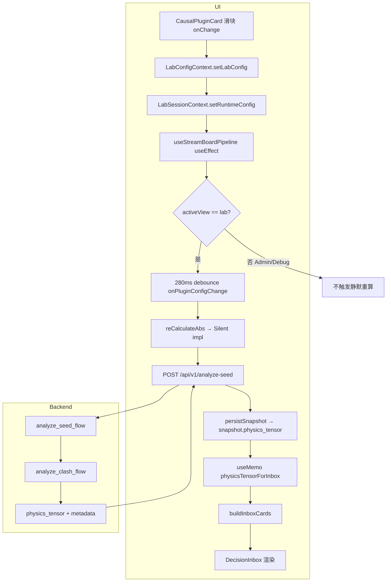
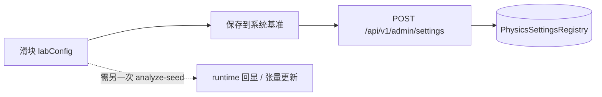

# Debug 页面可视化与状态管理审计白皮书 (v0.3)

**版本**: v0.3  
**日期**: 2026-04-11  
**范围**: Qiazhi 前端 Shell（实验室 / 黑匣子 / 机房）中与「实验性物理滑块」、Decision Inbox、能量展示、拓扑图、系统基准持久化相关的数据流。  
**说明**: 「Debug」在代码中对应 `DebugView`（黑匣子）；「收起/展开实验交互」滑块位于 **机房 → PluginManagementPanel → CausalPluginCard**。二者共享全局 `LabStore` + `LabConfigContext`，但自动重算触发条件不同，不可混为一谈。

---

## 1. 滑块交互与状态同步 (State Sync Audit)

### 1.1 滑块改的是什么

- `CausalPluginCard` 内 `input[type=range]` 的 `onChange` 调用 `setLabConfig`，更新 `PhysicsLabConfig` 中对应键（例如 `SUB_BRANCH_SANHE_ABS_BOOST`、`SUB_BRANCH_SANHE_REQ_WANG_ZHI`）。
- `LabConfigProvider` 中 `useEffect` 将 `{ labConfig, pluginSwitches, pluginWeights }` 序列化后调用 `setRuntimeConfig`，写入 `LabSessionContext` 的 `runtimeConfig`（终审后 `isFinalized` 则不再推送）。

**相关代码**: `qiazhi_bazi/frontend/src/features/admin/components/CausalPluginCard.tsx`、`qiazhi_bazi/frontend/src/features/lab-config/LabConfigContext.tsx`、`qiazhi_bazi/frontend/src/features/stream-board/stores/LabSessionContext.tsx`。

### 1.2 是否仅前端 Preview，还是打后端

- **不是**「仅前端 Preview」。设计上依赖 **`POST /api/v1/analyze-seed`** 重算整盘物理与 `metadata`。
- 后端 `analyze_seed_flow` **内部调用** `analyze_clash_flow`（与 REST `POST /v1/analyze_clash` 同源推理链）。前端日常路径不直接请求 `analyze_clash`，但语义上属于同一推理层。

**相关代码**: `qiazhi_bazi/backend/app/services/analysis_service.py`（`analyze_seed_flow` → `analyze_clash_flow`）；静默重算 `qiazhi_bazi/frontend/src/features/stream-board/hooks/useStreamBoardSilentRecalculateLayout.ts`。

### 1.3 为何滑块调到 0 时三合卡片不立即刷新

可能叠加原因：

1. **视图门控**: `useStreamBoardPipeline` 中 `runtimeConfig` 漂移触发的静默重算 **仅在 `activeView === "lab"`** 时注册防抖；在 **机房 (`admin`) 或 黑匣子 (`debug`)** 时 **不触发** `analyze-seed`，`labState.snapshot.physics_tensor` 不变，`buildSanheStructureCards` 输入不变。
2. **防抖**: 实验室内约 **280ms** `setTimeout` 合并连续拖动。
3. **忙碌门闩**: `busy` / `isStreaming` / `isExecuting` 时 effect 提前 return，不调度重算。
4. **终判屏障**: `verdictRecalcBarrierRef` 为真时静默重算推迟（`silentRecalcDeferredRef`）。
5. **单飞**: `silentRecalcInFlightRef` 避免并发重复请求。
6. **Memo 依赖正确但上游未更新**: `buildInboxCards` 的 `physicsTensor` 来自 `labState.snapshot.physics_tensor`；只有 `persistSnapshot` 合并新张量后才触发 `useMemo` 重算。

**相关代码**: `qiazhi_bazi/frontend/src/features/stream-board/controller/useStreamBoardPipeline.ts`（`activeView !== "lab"` 分支）；`qiazhi_bazi/frontend/src/features/stream-board/useStreamBoardController.ts`（`physicsTensorForInbox` + `buildInboxCards`）。

### 1.4 滑块旁 η 读数

- `runtimePhysicsNumber(physicsTensor, key)` 读取 **`physics_tensor.meta.runtime_physics_config`**（或盲派 payload 内嵌配置），反映 **最近一次成功 analyze 的回显**；若未重算，可能与滑块当前值 **短暂不一致**。

**相关代码**: `qiazhi_bazi/frontend/src/features/admin/utils/runtimePhysicsNumber.ts`。

---

## 2. 能量矩阵与拓扑图数据源 (Data Source Consistency)

### 2.1 能量矩阵（结果日志文案）

- `useSeedAnalysis` 在 `analyze-seed` 成功后若存在 `physics_tensor.normalized`，向 `resultLogs` 追加一行「能量矩阵(木火土金水)：…」。
- 属 **结果日志**，非独立拓扑组件数据源。

**相关代码**: `qiazhi_bazi/frontend/src/features/stream-board/hooks/useSeedAnalysis.ts`。

### 2.2 拓扑图

- 组件 `TopologyMapV1` 读取 **`graph.edges` / `graph.nodes` / `graph.params`**。
- 前端主线路中该图通常绑定 **`finalTopologyGraphV1`**，来自 **`generate_final_verdict`** 返回的 **`topology_graph_v1`**，**不是** `physics_tensor` 内嵌的同结构字段。

**相关代码**: `qiazhi_bazi/frontend/src/components/TopologyMapV1.tsx`、`qiazhi_bazi/backend/app/services/analysis_service.py`（`generate_final_verdict`）；静默 `analyze-seed` **不**更新 `finalTopologyGraphV1`（见 `SilentRecalcPhysicsSetters` 类型定义）。

### 2.3 后端拓扑与合成场

- `EnergyTopologySkill.build_topology` 的边来自 **`metadata.conflict_matrix.points`**，结合 **`physics_tensor.deity_energy_axes`** 与解析后的物理参数阈值；**不**从 **`composite_field_impact`（含三合簇）** 生成边。

**相关代码**: `qiazhi_bazi/backend/app/skills/energy_topology_skill.py`。

**结论**: 拓扑图 **不能** 视为 `physics_tensor` 的全量可视化；**三合等合成结构**主要在张量 **`composite_field_impact` / `meta.interaction_v2`** 与 Inbox 结构卡中体现，而非拓扑边列表。

### 2.4 二者是否「同一字段」

- **否**。能量矩阵日志用 **`physics_tensor.normalized`**；拓扑用 **`topology_graph_v1`**（终判技能产出）。二者都与一次完整推理相关，但 **字段路径不同**。

---

## 3. 「保存到系统基准」持久化

### 3.1 前端

- `CausalPluginCard.persistPhysicsBaseline` → `POST ${API_BASE}/api/v1/admin/settings`，Body 为 `{ items: [{ key, value }] }`，Header 含 **`X-Admin-Token`**（来自 `NEXT_PUBLIC_QIAZHI_ADMIN_TOKEN`）。
- 无 Token 时按钮 **disabled**；失败时展示 `detail` 或 401 提示。

**相关代码**: `qiazhi_bazi/frontend/src/features/admin/components/CausalPluginCard.tsx`、`qiazhi_bazi/frontend/src/features/admin-settings/constants.ts`。

### 3.2 后端

- `admin_physics_settings_persist` → `persist_physics_registry_updates_from_body` → `persist_physics_registry_updates`。
- **校验**: 仅当 **`key in DEFAULT_PHYSICS_SETTINGS`** 时写入 **`PhysicsSettingsRegistry`** 并 `bump_physics_settings_cache()`；否则跳过。

**相关代码**: `qiazhi_bazi/backend/app/api/router.py`、`qiazhi_bazi/backend/app/core/physics/settings_manager.py`。

### 3.3 一致性风险

- HTTP 200 且 `ok: true` 但 `changed` 为空时，前端可显示「无有效键写入」——需区分 **「写入 0 项」** 与 **「写入 n 项」**；误配 Token 会得到 **401** 与明确失败文案。非法键不会落库，**不会出现「静默写坏整表」」**。

---

## 4. Decision Inbox 卡片实时生成流

### 4.1 入口

- `useStreamBoardController` 中 `useMemo` 调用 **`buildInboxCards`**，依赖 **`metadata`、`firstPromptText`、`auditorProposalCards`、`resolvedCardIds`、`decisionSignalToNoise`、`patternProfile`、`l1JunctionFlags`、`physicsTensor`（快照）** 等。

**相关代码**: `qiazhi_bazi/frontend/src/features/stream-board/useStreamBoardController.ts`、`qiazhi_bazi/frontend/src/features/stream-board/cardBuilder.ts`。

### 4.2 主要 Filter / 分支

1. **`buildSanheStructureCards(physicsTensor)`**: 三合 **L1_STRUCTURE** 卡；数据源自 `composite_field_impact.sanhe_clusters` 或 `meta.interaction_v2.attribute_collapse` 中 `kind === "sanhe"`。
2. **`metadata` 缺失**: 仅返回 **未 resolve 的 sanheCards**。
3. **`decision_signal_to_noise.inbox_conflict_cards_eligible === false`**: 清空 **判词观察项**（`sentenceItems`），**不影响** sanhe 卡。
4. **`buildPatternSovereigntyCard`**: 条件满足时在列表前插入格局主权卡。
5. **全局 `resolvedCardIds`**: 末尾 **filter** 排除已裁决项。

### 4.3 从滑块到卡片（全链路）

滑块 → `labConfig` → `runtimeConfig` →（若满足 **实验室 Tab + 非忙碌 + 防抖**）→ **`analyze-seed`** → **`persistSnapshot`** 更新 **`physics_tensor`** → `physicsTensorForInbox` 变化 → **`buildInboxCards`** → Inbox 更新。

---

## 5. 前端数据流向图 (Mermaid)

### 5.1 实验室静默重算闭环

### 5.2 保存系统基准（与推理解耦）

---

## 6. 改进建议（供后续迭代）

1. **文档/UI**: 在机房滑块区注明「返回实验室后自动同步」或提供显式「应用并重算」按钮，降低「滑块已动、张量未变」的认知落差。
2. **拓扑**: 若需展示三合轴，需在 **`EnergyTopologySkill` 或独立 HUD** 中消费 `composite_field_impact`，而非仅 `conflict_matrix.points`。
3. **保存基准**: 成功响应时可展示 **`changed` 键列表**，便于审计与排障。

---

## 7. 关键文件索引

| 主题 | 路径 |
|------|------|
| 实验滑块与保存基准 | `frontend/src/features/admin/components/CausalPluginCard.tsx` |
| runtime 同步 | `frontend/src/features/lab-config/LabConfigContext.tsx` |
| 静默重算 | `frontend/src/features/stream-board/hooks/useStreamBoardSilentRecalculateLayout.ts` |
| 实验室门控与防抖 | `frontend/src/features/stream-board/controller/useStreamBoardPipeline.ts` |
| Inbox 装配 | `frontend/src/features/stream-board/cardBuilder.ts` |
| 视图快照（决策审计舱 / 黑匣子） | `frontend/src/components/views/DebugView.tsx`、`features/decision-cockpit/*`、`SemanticAccordion.tsx`、`semanticLexicon.ts`、`inferEnergyAttribution.ts` |
| Admin LLM 模型列表 | `backend/app/api/admin.py`（`_collect_llm_model_names`） |
| analyze-seed / clash | `backend/app/services/analysis_service.py` |
| 拓扑技能 | `backend/app/skills/energy_topology_skill.py` |
| Admin 持久化 | `backend/app/core/physics/settings_manager.py` |
| 静默重算跨视图派发 | `frontend/src/features/stream-board/physicsRecalcDispatch.ts` |

---

## 8. 审计后修正落地（与 §1–§3 对应）

**日期**: 2026-04-11  

1. **全局静默重算**: `useStreamBoardPipeline` 已取消「仅实验室 Tab」才监听 `runtimeConfig` 漂移的限制；任意 Shell 视图下（含机房）在满足 `lastSeedPayload` 且非 `busy` / `isStreaming` / `isExecuting` 时均可防抖触发 `analyze-seed`。另：从 **机房** 切回 **实验室或黑匣子** 时增加一次 **立即** `runNow()`，避免防抖尚未到期时快照滞后。  
2. **三合拓扑边**: `EnergyTopologySkill` 根据 `composite_field_impact.sanhe_clusters` 追加 `relation_type: sanhe_cluster` 的边；`CircularTopologyEngine` / `TopologyMapV1` 以金黄色区分。  
3. **保存基准反馈**: `CausalPluginCard` 成功保存后列出 `changed` 键及提交值，并 `dispatchSilentPhysicsRecalc()` 触发与 StreamBoard 同构的静默重算以刷新 `physics_tensor.meta.runtime_physics_config`（η 读数）。

---

---

## 9. 决策全景审计舱（Decision Cockpit）

**前端路径**: `frontend/src/features/decision-cockpit/*` + `frontend/src/components/views/DebugView.tsx` 集成。

- **DecisionTimeline**：`decisionTimelineModel.ts` 从 `physics_tensor` / `audit_log` / `plugin_outputs` / `hub` / `llm_prompt` / `final_verdict` 装配时序；`semanticLexicon.stripTimelineEnumJargon` / `humanizePluginId` 去除裸枚举与插件 ID；`translateBackendLine` 译为裁决者可读句。
- **StateMonitor**：四柱与岁运；`deity_energy_axes` 历史点为 `{ abs, etaSnapshot }`（`meta.runtime_physics_config` 摘要）；Sparkline 节点 `title` 悬停查看 η 快照；剧烈波动时 `inferEnergyAttribution` 展示「变动归因」。
- **PluginCollisionHub**（插件碰撞审计）：匹配插件中文名、`confidence_score`/payload 置信度百分比、`matcher_logic` → evidence/verdict/error 降级理由；`meta.causal_routing` 文案经 `stripTimelineEnumJargon`。
- **NarrativeProvenancePanel**：`humanizeProvenanceSnippet` 生成人话 `displayTitle`；系统（蓝）/ LLM（紫）片段 + Trace；**TopologyMapV1** 三合金边联动 **SanheStructurePanel**。
- **SemanticAccordion**：各区块可折叠；默认展开决策时序与判语血统，默认折叠「原始张量（完整 JSON）」。
- **逻辑检察院**：`AuditChamberPanel.tsx` 全功能嵌入 DebugView 对应 Accordion（原 AuditChamber 页仍 re-export 同组件）。

---

## 10. 运维与 Admin LLM 联调（后端）

**日期**: 2026-04-11 起迭代

- **`POST /api/admin/llm-models`**（`app/api/admin.py::_collect_llm_model_names`）：对端口 **11434** 优先 `GET …/api/tags`；`base_url` 无 `/v1` 后缀时补试 `{url}/v1/models` 再 `{url}/models`，缓解仅填 `https://api.openai.com` 时的误配 502；超时 30s、`follow_redirects=True`；失败 `detail` 串联各次尝试错误摘要。
- **`POST /api/admin/llm-test`** 稳定性：`strip_reasoning` 不再因正文任意位置出现子串 `reasoning` 整段清空（避免误判空结论）；Ollama `/api/chat` 先带 `think: false`，失败则**不带 `think`** 重试（`admin.py::_ollama_chat_no_think` 与 `app/llm/client.py::_chat_via_ollama_native`）。

**单元测试**：`tests/unit/test_api_helpers.py`（strip_reasoning）、`tests/unit/test_admin_llm_model_collect.py`（llm-models 收集顺序与 URL 组合）。

**自动化测试（仓库约定）**

| 范围 | 命令 |
|------|------|
| **后端推荐默认（完整自动化、秒级）**：unit + 非慢 integration（`test_api_flow` 等），排除需 PostgreSQL 的 `@pytest.mark.integration` 与 `slow` | `cd qiazhi_bazi/backend && python3 -m pytest tests/ -m "not slow and not integration" -q` |
| 仅慢速全路径（`analyze_clash_flow` / 多 seed 等，可能数分钟至超时） | `python3 -m pytest tests/ -m "slow" -q`（发布前 / 夜间；建议 `timeout 900 …`） |
| 仅 DB 集成（`@pytest.mark.integration`，依赖 `DATABASE_URL` 可连） | `python3 -m pytest tests/ -m "integration" -q`（无库时部分用例 skip 或较慢） |
| **前端** | `cd qiazhi_bazi/frontend && pnpm run typecheck && pnpm test` |

`pytest.ini` 已登记 `slow` marker；`test_causal_logic_cases.py` 与 `test_full_stack_plugins.py` 已挂模块级 `pytestmark = pytest.mark.slow`，避免误跑 `pytest tests/` 时被超长 `analyze_*` 挂起。

---

**文档结束**
