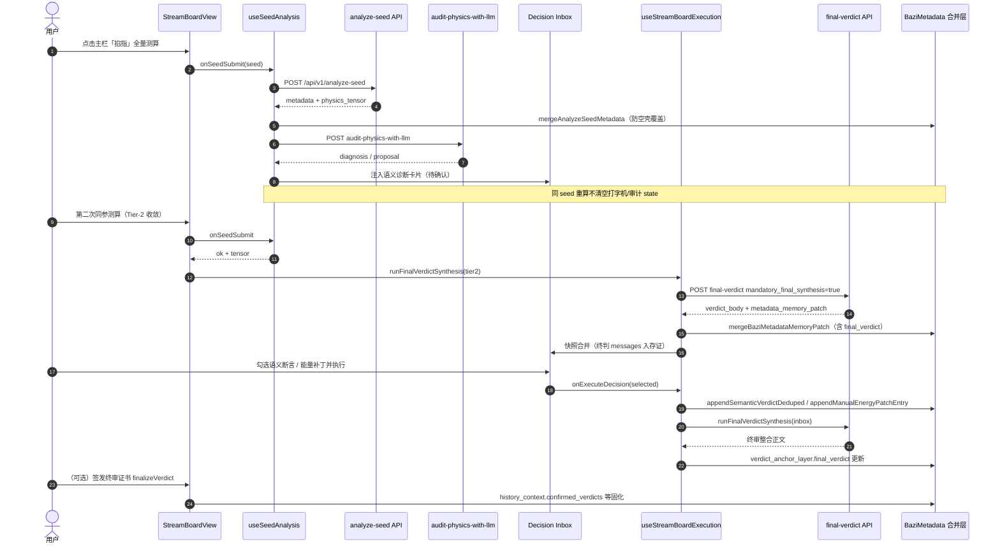

# Intelligence-Led Decision（ILD）框架：智能决断与语义沉淀架构

| 元数据 | 值 |
|--------|-----|
| 文档版本 | v2.0 |
| 适用范围 | Qiazhi-Bazi（`qiazhi_bazi/`）前端 Stream Board、后端 analyze-seed / final-verdict / 审计管线 |
| 维护约定 | 门控、持久化合并、终审合成触发策略变更时同步修订本表与「修订记录」 |

---

## 修订记录

| 版本 | 日期 | 说明 |
|------|------|------|
| v2.0 | 2026-04-12 | 初版：三层架构、反馈闭环、柔性修正协议、终审合成流、演进接口预留；与 `mergeAnalyzeSeedMetadata`、`mandatory_final_synthesis`、`persistence_layer` 实现对齐 |

---

## 0. 执行摘要：从「被动测算」到「主动审计与语义沉淀」

本框架将系统定位为 **Intelligence-Led Decision（ILD）**：物理场提供可复核的客观真值；弱模型与插件提供可质疑的语义初稿；**用户勾选与归档**构成不可随意抹除的意志层。终局阶段由 **终审合成 LLM** 在**不发明新事实**的前提下，对已确认材料做文学化整编。

**三条宪法级产品原则（与实现强绑定）：**

1. **持久化层神圣不可侵犯**：`persistence_layer` 中与 `seed_hash` 绑定的语义断语、以及 `manual_energy_patch` 侧车，不得被「空壳 API 回包」静默冲掉。
2. **LLM 输出是数字资产**：物理审计返回的 `diagnosis` 等字段应进入 Inbox 待确认队列，而非在下一轮请求开始时被无意义清空。
3. **物理参数走柔性调优，而非随意改库**：用户侧干预优先落在 **IndividualAdjustment** 协议（展示层补丁 + 元数据侧车），与全局物理常数表解耦。

---

## 1. 核心分层设计（Layered Architecture）

### 1.1 物理层（The Bone）——客观真值

| 职责 | 典型载体 | 边界 |
|------|-----------|------|
| 四柱排盘、大运流年锚点 | `BaziMetadata.pillars`、`temporal_context` | 历法与输入一致即可复算 |
| 干支能量、Abs、气候与 L1 原子管线 | `physics_tensor`（`deity_scores`、`deity_energy_axes`、`meta` 等） | **不**因某次弱模型措辞而改写 |
| 结构冲突与扫描点 | `conflict_matrix.points`、插件写入的 `meta` 证据 | 可随插件版本与参数重算变化，但需可追溯 |

**哲学**：物理层回答「场里发生了什么」，不回答「命主应当如何感受」——后者上移到语义层与裁决层。

### 1.2 语义层（The Flesh）——可读初稿

| 职责 | 典型载体 | 边界 |
|------|-----------|------|
| 弱模型物理审计 | `audit-physics-with-llm` → `diagnosis` / `causal_reasoning` / `logic_proposal` | **建议**，默认进入 Inbox，不经勾选不写持久化 |
| 首条判词流式、盲派芯片日志 | `llm_prompt` 打字机、`result_logs` 中 `MANGPAI_CHIP` 等 | 可长可碎，但必须可被引用与归档 |
| 终判段落与弱锚点 | `final_verdict.body`、`narrative_chunks`、`verdict_anchor_layer.assertions` | 强模型输出需经解析与指纹注释落档 |

**哲学**：语义层是 **翻译与假设**，允许错、允许短、允许被用户否决；系统不得把它当成已确认的「意志」。

### 1.3 持久化裁决层（The Soul）——用户意志

| 职责 | 典型载体 | 边界 |
|------|-----------|------|
| 用户勾选后的语义断语归档 | `persistence_layer.semantic_verdicts[]`（含 `seed_hash`、`source_card_id`） | **仅**在用户明确确认或等价业务动作下追加 |
| 个人能量补丁 | `manual_energy_patch`（`seed_hash` + `entries[]`） | 展示层修正十神轴，**不**直接 `UPDATE` 全局物理常数 |
| 终审整合主文（展示首位） | `verdict_anchor_layer.final_verdict` | 由终审合成管线写入；与 `assertions` 并存 |

**哲学**：Soul 层是 **「我采纳了什么」** 的合同；任何刷新元数据的行为都必须 **合并（merge）** 而非在同一生辰上下文里 **覆盖（clobber）**。

---

## 2. 交互与反馈闭环（The Feedback Loop）

### 2.1 自动汇聚：从 JSON 诊断到 Inbox 卡片

1. **analyze-seed** 完成后，前端调用 **物理审计 LLM**（`audit-physics-with-llm`）。
2. 若响应中含非空 **`diagnosis`**（及可选 `top_anomaly`、`causal_reasoning`），编排层将其 **映射为 Inbox 语义卡片**（与可执行 `sql_patch` 提案解耦），用户可在 Decision Inbox 内勾选确认。
3. 勾选执行后，正文进入 **`persistence_layer`**（按 `seedPayloadSignature` 去重追加），形成可审计的「意志痕迹」。

**设计意图**：把「模型说过一句话」变成「用户是否愿意为它背书」的可视状态机，避免黑箱一句了之。

### 2.2 防覆盖写：`seed_hash` 与增量元数据合并

同一生辰再次测算或静默重算时，服务端可能返回 **缺少** `verdict_anchor_layer`、`persistence_layer.semantic_verdicts` 或审计诊断为空的壳对象。框架要求：

- 使用 **`seedPayloadSignature`**（或四柱 JSON 一致性）判定 **是否同一生辰上下文**。
- 元数据灌入走 **`mergeAnalyzeSeedMetadata`**（及快照水合时对 `verdict_anchor_layer` 等字段的透传）：在「同 seed 重算」前提下，若新包 **空** 而本地 **非空**，则 **保留** 锚点层与已归档语义列表。
- 前端状态上，同 seed 重算时 **避免** 在请求伊始清空 **`llmDiagnosticData` / `firstPromptText` / 芯片日志** 等用户已读到的打字机与审计上下文；审计回调对字符串字段采用 **「新值非空才覆盖」** 的合并策略。

**一句话**：**空响应的权限低于已展示的人类可读内容。**

### 2.3 终审合成流（Synthesis Flow）

| 维度 | 约定 |
|------|------|
| 角色 | **终审官**：只做 **整合、润色、结构编排**，**禁止**发明未出现在 Bone/Flesh/Soul 材料中的四柱或插件事实 |
| 触发 | **Tier-2 收敛**（主栏全量测算至终局档）与 **Inbox 语义/能量补丁确认后** 等关键节点，必须发起一次 **`mandatory_final_synthesis`** 终判请求 |
| 提示注入 | User 消息块显式包含：四柱 JSON、`conflict_matrix.points`、`persistence_layer.semantic_verdicts`、物理审计摘要 |
| 落档 | 响应写入 **`metadata.verdict_anchor_layer.final_verdict`**（无 HTML 指纹噪声），并与 `final_verdict` 快照、`llm_request_messages` 一并供 Debug 与复盘 |

**与「普通终判」关系**：共用 `/api/v1/final-verdict` 与 `FinalVerdictSkill`，通过 **`mandatory_final_synthesis`** 标志切换提示权重，而非分叉两套物理引擎。

---

## 3. 柔性修正协议（Flexible Patch Protocol）

### 3.1 从 SQL 到 Patch

| 旧思路 | ILD 约定 |
|--------|-----------|
| 审计员直接下发可执行 SQL 改写全局参数表 | **废弃为唯一路径**；若仍存在 SQL 提案，仅作为 **迁移期兼容**，新 UX 以 **IndividualAdjustment** 为主 |
| 「改了就当真」 | **建议** → **勾选** → **`manual_energy_patch` / `persistence_layer`** 侧车 → 静默重算时 **按 seed 合并回灌** |

**实现锚点**：`individualAdjustment.ts`（合并、追加、去重）、`useStreamBoardExecution`（Inbox 执行分支）、静默重算 `useStreamBoardSilentRecalculateLayout`。

### 3.2 视觉透明：紫色与「∆」标记

- **Abs 分布图**（`AbsDistributionChart`）：对受 **`manual_energy_patch`** 影响的十神节点展示 **∆** 等标记，提示「此处含展示层人工偏移」，与引擎原始 `deity_scores` 区分。
- **紫色系主按钮 / 终局签发态**（`UnifiedActionBar`、`StreamBoardView` 等）：表达「可签发终审 / 因果压底」的 **仪式化 UI**，与「仅物理完成」区分。

**目标**：用户一眼能分辨 **客观场**、**模型建议** 与 **我已确认** 三层。

---

## 4. 智能化演进预留（Future Intelligence）

以下接口 **当前可为概念契约**，落地时建议以 `docs/` + `app/api/contracts` + 前端 `models` 同步演进。

### 4.1 `Style-Embedding-Tracker`（裁决者审美嵌入）

| 字段（建议） | 含义 |
|--------------|------|
| `preferred_tone` | 冷峻 / 关怀 / 仲裁式 等离散或嵌入向量 |
| `evidence_density` | 偏好「证据罗列」 vs 「结论先行」 |
| `revision_streak` | 连续再生终判时的折中方向 |

**写入点**：`metadata.history_context.learning_annotation` 已与再生事件对齐，可逐步挂载 embedding 或结构化 stamp。

### 4.2 `Conflict-Resolver`（语义与物理冲突仲裁）

| 输入 | 输出 |
|------|------|
| 芯片日志 / `conflict_matrix` 结论 vs 弱模型 `diagnosis` | `confidence` + `resolution_policy`（采信物理 / 采信语义 / 双轨展示） |

**原则**：默认 **物理层优先**；仅当门控（如 `decision_signal_to_noise`）明确放行且用户有确认行为时，才提升语义权重。

---

## 5. 序列图：从「点击主栏」到「断言持久化」

下列序列图覆盖：**全量测算 → Tier-2 → 终审合成 → 元数据落档**；Inbox 勾选路径在「用户确认」段可平行发生。

---

## 6. 哲学专节：为什么我们不再允许系统丢弃任何一句打字机文字

1. **信任成本**：流式输出是用户与系统共同经历的 **时间契约**。若在全量测算结束瞬间被默认元数据或空审计覆盖，等效于宣称「你刚才读到的可以当作没发生过」——这在命理语境下不可接受。
2. **审计与合规**：Debug 与复盘依赖 **messages / raw / 锚点层** 对齐；丢弃前端状态会造成「有终判无过程」的伪干净，掩盖模型漂移与门控错误。
3. **进化数据**：ILD 假设未来会从 `learning_annotation`、Style-Embedding、Conflict-Resolver 反学；**打字机阶段文本**是「模型在何种证据压力下说了什么」的弱标签，比仅保留最终一句 JSON 更有训练与对齐价值。

**工程转译**：同 seed 下的 `setMetadata` 必须走 **merge**；`verdict_anchor_layer` 与 `persistence_layer` 在 incoming 空时 **保留 previous**；终审合成负责 **收束** 而非 **清空**。

---

## 7. 与仓库文件的映射（便于 Cursor 跳转）

| 主题 | 主要路径 |
|------|-----------|
| 增量元数据合并 | `frontend/.../individualAdjustment.ts` → `mergeAnalyzeSeedMetadata` |
| 同 seed 不清诊断 / 审计合并 | `frontend/.../hooks/useSeedAnalysis.ts` |
| Inbox 执行与终审合成触发 | `frontend/.../controller/useStreamBoardExecution.ts` |
| 终审 HTTP 与 mandatory 标志 | `frontend/.../hooks/useVerdictExecution.ts`、`finalVerdictPayload.ts` |
| 后端终审提示与 `final_verdict` 写入 | `backend/.../final_verdict_parts/prompt_builder.py`、`backend/.../skills/final_verdict.py` |
| API 契约 | `backend/.../api/contracts.py` → `FinalVerdictRequest.mandatory_final_synthesis` |
| 断言区 UI | `frontend/.../components/MultiSourceAssertionsPanel.tsx` |
| Abs 上 ∆ 标记 | `frontend/.../components/AbsDistributionChart.tsx` |

---

## 8. 延伸阅读

- `PIPELINE_INBOX_LLM_WHITEPAPER.md`：Inbox 门控与插件证据链。
- `DEBUG_UI_STATE_AUDIT_WHITEPAPER_v0.3.md`：快照、Hub、Debug 视图与状态还原。
- `PROMPTS_ARCHITECTURE_v1.md`：提示词分层与合同化输出。

---

*本文档为 Qiazhi-Bazi 在「智能进化」阶段的架构基线；修订时请更新文首版本表与第 7 节映射表。*
