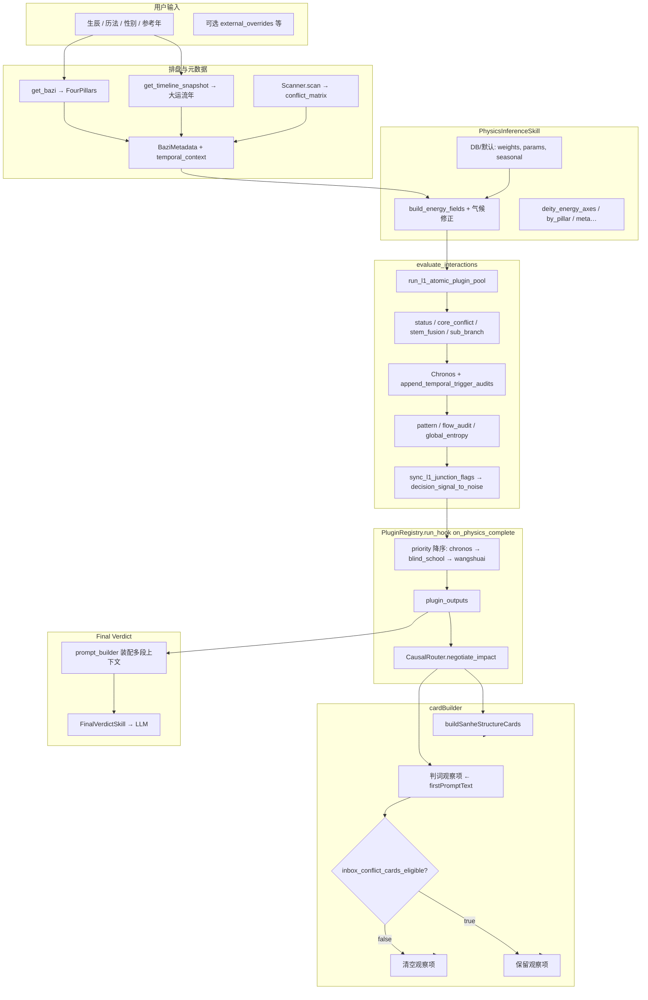

# 八字测算 → Decision Inbox → LLM 终判：全链路审计白皮书

| 元数据 | 值 |
|--------|-----|
| 文档版本 | v0.2 |
| 适用范围 | Qiazhi-Bazi（`qiazhi_bazi/`）主链路 |
| 维护约定 | 架构或门控逻辑变更时同步 bump 版本号与「修订记录」 |

---

## 修订记录

| 版本 | 日期 | 说明 |
|------|------|------|
| v0.1 | 2026-04-11 | 初版：流水线、Inbox 门控、证据脱水、插件 Hook、岁运与三合边界 |
| v0.2 | 2026-04-11 | 岁运支并入三合池（`SANHE_INCLUDE_TEMPORAL_BRANCHES`）；三合登记强制 Inbox 门控放行；证据置顶与盲派块截断 |

---

## 0. 执行摘要

| 阶段 | 核心结论 |
|------|-----------|
| **physics_tensor** | `PhysicsInferenceSkill` 生成场论与十神轴后，`evaluate_interactions` 写入 `l1_atomic_pipeline`、`composite_field_impact`、`audit_log` 等；`sync_l1_junction_flags_to_meta` 内写入 **Decision Inbox 门控** `meta.decision_signal_to_noise`。 |
| **岁运 vs 三合** | 默认在 **`SANHE_INCLUDE_TEMPORAL_BRANCHES`≥0.5** 时，`evaluate_interactions` 将 `temporal_context.dayun_ganzhi` / `liunian_ganzhi` 的地支并入 **`branches` 池**（键 `dayun` / `liunian`），与四柱一起参与 **`is_sanhe_triggered`**。Chronos 引动审计仍独立存在。中神旺支门控在 **`SANHE_TEMPORAL_WANG_ZHI_BRIDGE`≥0.5** 时可认 **`dayun`/`liunian`** 位。 |
| **Inbox** | 门控主要作用于 **由首条判词拆出的「判词观察项」**；**三合 `L1_STRUCTURE` 卡**由 `buildSanheStructureCards` **单独前置**，**不**随 `inbox_conflict_cards_eligible === false` 被清空。另：`composite_field_impact.sanhe_clusters` 非空时 **`apply_decision_inbox_signal_gate` 强制 `eligible=True`**，避免低冲战损耗掩没三合结构信号。 |
| **伤官见官 vs 三合** | 门控放行依赖 `GLOBAL_DECISION_ABS_THRESHOLD`（默认 **5.0**）与 `has_critical`（含 `sgjg_severity == "CRITICAL"` 或 `l1_inbox_signal_bypass`）。**三合不参与** `sgjg_severity`；勿与「伤官见官 MINOR」混谈。 |

**术语**：仓库内存在多组带「效率」语义的参数（如 `L1_OP_PROD_ETA`）与门控阈值 `GLOBAL_DECISION_ABS_THRESHOLD`，**不与声学分贝直接对应**；下文一律写 **实际配置键名**。

---

## 1. 数据总览（Mermaid）

### 1.1 主链路

### 1.2 L1 步拼接顺序（`interaction_pipeline`）

---

## 2. 八字测算流水线（Workflow）

### 2.1 从生辰到 `physics_tensor`（与 `analyze-seed` / `analyze_clash` 对齐）

1. **排盘**：`get_bazi`、`get_timeline_snapshot`（可经 `external_overrides` 覆盖流年大运字符串）。
2. **扫描**：`Scanner().scan(pillars)` → `conflict_matrix.points`（可选叠加盲派六穿等，见 `analysis_service.analyze_clash_flow`）。
3. **元数据**：构造 `BaziMetadata`（含 `temporal_context`）。
4. **`PhysicsInferenceSkill`**：`consume` → `produce`，读库或默认参数，生成 **`deity_energy_axes`、`by_pillar`** 等；`dayun`/`liunian` 可参与 **能量场** 路径（见 `physics_engine` / `build_energy_fields`）。
5. **`evaluate_interactions`**：  
   - `run_l1_atomic_plugin_pool`：冲合刑害、墓库、**三合全支**（`l1_atomic_plugin` + `is_sanhe_triggered`）→ `composite_field_impact`、`steps`；  
   - 依次叠加 status、core_conflict、stem_fusion、sub_branch；  
   - Chronos 与 **`append_temporal_trigger_audits`**（岁运 **引动** 审计）；  
   - `pattern_profile`、`energy_flow_audit`、`global_entropy` 等；  
   - **`sync_l1_junction_flags_to_meta`** → **`apply_decision_inbox_signal_gate`**。
6. **`PluginRegistry.run_hook("on_physics_complete")`**：按 **priority 降序** 执行已启用插件；结果入 **`physics_tensor.plugin_outputs`**，摘要写入 **`meta`**（盲派 chip 等）。

### 2.2 与「base_physics → 盲派 chip → 旺衰」的对应

| 叙述名 | 代码落点 |
|--------|-----------|
| base_physics / L1 原子 | `evaluate_interactions` 内 base 交互算子池 + `core_operators` → `l1_atomic_pipeline`、`composite_field_impact` |
| 盲派 | 插件 `classical.blind_school.v1`，`run_blind_school_plugin`，`on_physics_complete` |
| 旺衰 | 插件 `classical.wangshuai.v1`，同 hook、依赖 manifest 中 `base.physics_l1` 等声明 |

**执行顺序**：同 hook 内由 **`PluginRegistry.run_hook` 的 priority 排序** 决定（默认 Chronos > 盲派 > 旺衰），与 manifest 依赖边 **共同** 约束拓扑。

### 2.3 岁运与 `is_sanhe_triggered`

- **`interaction_pipeline._branch_map_extended`**：在 **`SANHE_INCLUDE_TEMPORAL_BRANCHES`≥0.5**（默认 1.0）时，从 `metadata.temporal_context` 解析 **`dayun_ganzhi` / `liunian_ganzhi`** 末字为地支，写入 **`dayun` / `liunian`** 键，与四柱一并传入 L1 原子池。  
- **旺支门控**：`sanhe_trine_allowed_by_wang_zhi_switch` 在 **`SANHE_TEMPORAL_WANG_ZHI_BRIDGE`≥0.5**（默认 1.0）时，中神可落在 **`dayun`/`liunian`** 支位（仍须 `SUB_BRANCH_SANHE_REQ_WANG_ZHI`≥0.5 才启用中神规则）。  
- **Chronos 引动审计**（`append_temporal_trigger_audits`）与上述 **凑局地支池** 为两条并行能力。

---

## 3. Decision Inbox 门控（Signal Gating）

### 3.1 后端：`decision_inbox_gate.py`

- **阈值**：`settings.get("GLOBAL_DECISION_ABS_THRESHOLD", 5.0)`。  
- **输入**：`clash_abs_loss_total`（来自 `meta.global_entropy_metrics`，由 L1 中 `base.clash` 步的 `abs_loss` 等累加，见 `interaction_pipeline._synthesize_global_entropy`）。  
- **规则**：  
  - `clash_abs_loss_total is None` → `inbox_conflict_cards_eligible = True`；  
  - 否则 `eligible = (loss >= threshold) OR has_critical`；  
  - `has_critical = bool(l1_inbox_signal_bypass) or (sgjg_severity == "CRITICAL")`。

### 3.2 `junction.py` 与 `l1_inbox_signal_bypass`

- 对 `l1_core` 中 **active 且 severity==CRITICAL** 的项：若为 **`SHANG_GUAN_JIAN_GUAN`** 或 **`visibility=="surface"`** 的其它核心冲突，则 **`l1_inbox_signal_bypass = True`**。  
- 故 **伤官见官 CRITICAL** 是文档化旁路之一；其它 **Surface + CRITICAL** 亦可旁路。

### 3.3 前端：`cardBuilder.ts`

- **`buildSanheStructureCards`**：**不依赖** `inbox_conflict_cards_eligible`。  
- **`sentenceItems`**：`inbox_conflict_cards_eligible === false` 时 **整段清空**（判词观察项）。  
- **合并顺序**：`[...sanheCards, ...withSovereignty]` 再过滤 `resolvedCardIds`。

---

## 4. LLM 断言协议（Narrative）

### 4.1 `prompt_builder.py`

- **System**：十神 Abs 必引用、盲派 net_effect / risk、Structure V0、L1 Junction、**三合证据行若存在须在核心气象/裁决共识评估** 等。  
- **User 块**（节选顺序）：`[Physical Evidence]` → `[盲派硬核证据]` → `[Structure Candidates V0]` → `[Knowledge Base Digest]` → 神煞（标注未参与物理计算）→ `[因果流通链]` → Consensus / Selected Decisions 等。

### 4.2 `get_logical_evidence`：保留与丢弃

**显式写入**：四柱串、性别、十神轴+气候 Before/After、根气摘要（`record` 截断 180 字）、共识与裁决项、**地支三合脱水行**（及 `interaction_v2` sanhe 回退）。

**不写入（相对完整 tensor 的「脱水」）**：完整 `by_pillar`、`deity_trace_details` 全链、`l1_atomic_pipeline.steps` 逐条、`plugin_outputs` 全量、多数 `audit_log` 分支、`interpretation` 全树（神煞另段展示）等。

### 4.3 叙事偏向风险

- **做功**：盲派 work 段约束多、篇幅大，注意力易倾斜。  
- **补偿**：Structure、L1 Junction、**三合证据强制句** 已减轻「只谈做功不谈结构」风险；仍无法单靠提示词保证 100% 遵守。

---

## 5. 插件与 Hook（Plugin Integration）

### 5.1 Hook 类型（`registry.py`）

| Hook | 用途示例 |
|------|-----------|
| `on_physics_complete` | Chronos、盲派、旺衰 |
| `on_verdict_ready` | 如 `modern.wealth_risk.v1`（终判后） |

### 5.2 `run_hook` 行为

- 过滤 `spec.hook` 与 `enabled_plugins`；  
- **priority 降序** 调用 `runner(**context)`；  
- 输出聚合为 `physics_tensor["plugin_outputs"]`；上层可将摘要写入 `meta`。

### 5.3 与核心张量的关系

- 默认 **侧车**：`plugin_outputs`、`meta.*`、`audit_log.*`。  
- **显式二次写入**（如格局纠偏回写十神轴）应在规则模块内可追溯到调用点，避免「隐式全局变量」式挂载。

---

## 6. 关键代码索引

| 主题 | 路径 |
|------|------|
| 测算聚合 | `backend/app/services/analysis_service.py` |
| L1 流水线 | `backend/app/services/helpers/interaction_pipeline.py` |
| L1 原子池 / 三合 | `backend/app/plugins/base/interactions/l1_atomic_plugin.py` |
| 岁运引动审计 | `backend/app/plugins/chronos/temporal_v2.py` |
| Inbox 门控 | `backend/app/core/rules/decision_inbox_gate.py` |
| L1 联结与 bypass | `backend/app/core/rules/junction.py` |
| 插件注册与 run_hook | `backend/app/core/plugins/registry.py` |
| 终判 prompt | `backend/app/skills/final_verdict_parts/prompt_builder.py` |
| 证据脱水 | `backend/app/skills/final_verdict_parts/evidence.py` |
| Inbox 卡片 | `frontend/src/features/stream-board/cardBuilder.ts` |
| 门控传入 UI | `frontend/src/features/stream-board/useStreamBoardController.ts` |
| 逻辑检察院（可选审计 API） | `backend/app/api/audit_router.py`、`backend/app/services/audit_chamber_service.py` |

---

## 7. 相关文档

- [engine/TRIPARTITE_PLUGIN_VERDICT_LLM_FLOW.md](../engine/TRIPARTITE_PLUGIN_VERDICT_LLM_FLOW.md)（若存在三方插件与终判衔接说明）  
- [architecture/OVERVIEW.md](./OVERVIEW.md)  
- [engine/PLUGIN_GOVERNANCE.md](../engine/PLUGIN_GOVERNANCE.md)  

---

## 8. 后续可扩展章节（占位）

- FinalVerdictSkill 内部 LLM 调用与缓存策略  
- CausalRouter 字段级对照明细表  
- 与 `legacy/` 旧系统差异矩阵（仅在需要复用历法/对照时展开）

更新本文档时，请同步更新文首 **修订记录** 与 **文档版本**。
