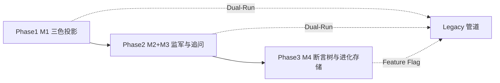

# V12.0 智能大脑重构落地执行路线图

| 元数据 | 值 |
|--------|-----|
| 文档状态 | **执行路线图（Planning）** |
| 版本 | 0.1 |
| 前置协议 | `docs/V12_BRAIN_FRAMEWORK.md`（M1–M4）、`docs/architecture/V12_INFERENCE_PULSE_WHITEPAPER.md` |
| 约束 | **本文仅为落地顺序与工程策略；不在此提交业务逻辑实现。** |

---

## 0. 起点与终点

| 维度 | V11.x（当前近似） | V12.0（目标态） |
|------|-------------------|-----------------|
| 元数据 | `metadata` + `physics_tensor.meta` 扁平混放 | **三色投影**（`Static_Fact` / `Dynamic_Inference` / `Arbiter_Bias`）可机读、可裁剪 |
| 叙事闭环 | LLM 终判为主、弱模式锚点兜底 | **PSV + SemanticAuditor** 拒稿/重试；**Logic Interrupter + M3** 主动追问 |
| 断言 | 大块 `verdict_body` + JSON assertions | **断言树** + **Stitching**；系统主控 FACT/LAW |
| 中枢形态 | 请求级线性管道 | **事件感知**（Brain Hub / EventBus）+ 双轨灰度 |

---

## 1. 三阶段里程碑

### 第一阶段：基座重组（Foundation Re-platforming）— **对应 M1**

| 项 | 说明 |
|----|------|
| **任务** | ① 在代码库引入 **三色 Schema**（TypedDict / Pydantic 等，与 `V12_BRAIN_FRAMEWORK.md` §1 对齐）。② 实现 **`MetadataProjector`**：输入现有 `metadata` + `physics_tensor`，输出 `tri_layer: { static_fact, dynamic_inference, arbiter_bias }`，映射关系遵循白皮书 **§2.1 迁移表**。 |
| **集成点** | 在 **不改 L0/L1/L2 计算结果** 的前提下，于 `analyze-seed` / orchestrator 出参路径 **并行挂载** `tri_layer`；旧字段全量保留。 |
| **目标** | 数据流具备 **特征矩阵雏形**；终判/审计 Prompt 可先 **可选读取** `tri_layer`（feature flag），默认行为与 V11 一致。 |
| **完成判据** | 同盘重放：`tri_layer` 可稳定序列化；前端或集成测试可断言三色键存在且与 `meta` 键可追溯对应。 |

---

### 第二阶段：监军与中枢建立（Brain Hub & Integrity）— **对应 M2 + M3**

| 项 | 说明 |
|----|------|
| **任务** | ① **`BrainEventBus`**（进程内优先）：订阅 `physics_update` 等价事件、插件完成、意志变更等，驱动「脉冲」节拍（与 Inference-Pulse 对齐）。② **`PSV` 构建器**：从 `tri_layer` 投影生成 `Physical Sentiment Vector`（白皮书 **§6.1**）。③ **`SemanticAuditor`**：规则层主路径 + 可选二次模型；输出 `REJECT_REASON_CODE`、**`AUTO_RETRY_PROMPT`**（**§6.2**）。④ **M3**：在 API/SSE 层下发扩展版 **`InterruptRequest`**（`trigger_kind` + `micro_inference`），接收 **`ProbingResponse`** 写回 **`Arbiter_Bias`**（**§7**）。 |
| **集成点** | 终判管线：`FinalVerdictSkill` / `build_final_verdict_messages` 之后或并行增加 **监军闸门**；`llm_meta.repair_mode` 扩展 V12 专用取值（见 §2）。 |
| **目标** | 系统具备 **拒稿权** 与 **主动中断权**；前端具备 **逻辑断点 / 微推演** 协议级交互（可先最小 UI：卡片 + 阻塞码）。 |
| **完成判据** | 构造用例：PSV 与叙事故意冲突时触发拒稿与重试；M3 blocking 未确认时终判返回约定业务码或 409。 |

---

### 第三阶段：主权回归与进化（Sovereignty & Evolution）— **对应 M4**

| 项 | 说明 |
|----|------|
| **任务** | ① **`AssertionManager`**：生成/合并 **断言树**（`FACT_NODE` / `LAW_NODE` / `WILL_NODE` / `SYNTHESIS_SLOT`），应用 **路由与剪枝**（**§8.4**）。② **拼接引擎**：组装 **`StitchingRequest`**，消费 **`Summary_Fragment`**，由系统模板生成终判展示结构。③ **`Arbiter_Preference_Store`**（命名可调整）：持久化裁决习惯摘要（与 ILD、`Arbiter_Bias`、进化回路白皮书一致），为 **逻辑预设 / 阈值建议** 提供只追加或审批后写入的存储面。 |
| **集成点** | 替代或并行于「整包 LLM 终判」：feature flag 控制 **树模式** vs **legacy 模式**。 |
| **目标** | **废除默认全量 LLM 生成终局真理**；断言 **动态生长**、可 diff；为 **自我进化**（建议态，非静默写 Manifest）留存储与审计钩子。 |
| **完成判据** | 同盘可在 legacy / 树模式间切换；树模式终判可还原到节点级证据与法典 `pattern_id`。 |

---

## 2. 双轨运行（Dual-Run）与回滚策略

### 2.1 并存原则

- **旧路径保留**：现有 `physics_tensor`、`metadata`、终判 JSON 契约在 **Phase 1–2** 必须继续可用。  
- **新路径旁挂**：`tri_layer`、PSV、断言树、EventBus 均通过 **运行时开关**（环境变量或 `runtime_config`）启用。  
- **前端**：优先 **并行展示**（例如 Debug 面板三色 JSON），再逐步切换主视图数据源。

### 2.2 利用 `repair_mode` 做灰度

当前终判已有 **`llm_meta.repair_mode`**（如 `physics_fallback_*`）。V12 建议 **扩展约定前缀**（实现时落地）：

| `repair_mode` 示例值 | 含义（规划） |
|----------------------|----------------|
| `v12_tri_layer_shadow` | 仅计算并记录 `tri_layer`，不参与门控 |
| `v12_auditor_shadow` | SemanticAuditor 运行但 **不拒稿**，仅写审计日志 |
| `v12_auditor_enforce` | 监军 **生效**，可拒稿/重试 |
| `v12_assertion_tree_beta` | 断言树拼接终判 **Beta**，失败则 fallback |

**灰度流程建议**：`shadow` → 小流量 `enforce` → 全量；每步可独立开关。

### 2.3 回滚指标（Rollback Triggers）

以下阈值为**协议占位**，具体数值由运维/产品标定，**不得写死在本文**。

| 信号 | 动作 |
|------|------|
| **断言树聚合置信** `Confidence_Score`（树级或槽级聚合）**连续 N 次**低于 `τ_conf` | 自动切换该会话/该版本至 **legacy 终判** 或 **物理兜底 JSON**（与现有 `build_minimal_verdict_json_from_core_physics` 路径对齐） |
| **拒稿率**（`LIG_*`）在窗口 W 内高于 `τ_reject` | 将 `v12_auditor_enforce` 降级为 `shadow` 并告警 |
| **M3 blocking** 超时率异常 | 暂停自动 blocking 或改为 `advisory`（与白皮书 M3 一致） |

**要求**：回滚须写入 **审计日志**（含 `seed_fingerprint`、开关状态、`repair_mode` 终值），便于复盘。

---

## 3. 第一波代码动作（Phase 1 Code-Drop）

> **范围**：仅 **M1 投影与 Schema 骨架**，不改变物理/法典算法。建议 **单一 PR**，便于 review。

### 3.1 建议新建文件

| 路径 | 职责 |
|------|------|
| `qiazhi_bazi/backend/app/schemas/tri_layer_v12.py` | 三色结构的 **Pydantic / TypedDict** 模型（`StaticFactV12`、`DynamicInferenceV12`、`ArbiterBiasV12` 等），字段与 `V12_BRAIN_FRAMEWORK.md` §1 对齐，允许 `extra` 策略明确。 |
| `qiazhi_bazi/backend/app/services/helpers/metadata_projector_v12.py` | **`MetadataProjector`**：`project_tri_layer(metadata, physics_tensor) -> dict`，内部按白皮书 **§2.1** 做键映射；无业务推断，仅搬运与裁剪。 |
| `qiazhi_bazi/backend/tests/unit/test_metadata_projector_v12.py` | 快照测试：给定最小 `physics_tensor` + `meta`，断言 `tri_layer` 关键键存在且稳定。 |

### 3.2 建议首改文件（挂载点）

| 路径 | 改动要点 |
|------|----------|
| `qiazhi_bazi/backend/app/services/orchestrator_service.py` 或 `analyze_seed` 出参组装处 | 在返回 `physics_tensor` / `metadata` 的 payload 上 **可选** 附加 `tri_layer`（由 `MetadataProjector` 生成），受 `runtime_config` 或 env 开关控制。 |
| `qiazhi_bazi/backend/app/api/contracts.py`（若需 OpenAPI 显式化） | 为响应模型增加 **可选** `tri_layer` 字段（可为 `Dict[str, Any]` 初版）。 |

**说明**：仓库中 **不存在** `app/models/` 目录，故 **不** 采用 `app/models/metadata_v12.py`；统一放在 **`app/schemas/`** + **`app/services/helpers/`** 与现有结构一致。

### 3.3 明确不在第一波做的事

- 不改 `UniversalPatternEngine`、`FinalVerdictSkill` 核心判定逻辑。  
- 不上线 SemanticAuditor 拒稿。  
- 不删任何现有 `meta` 键。

---

## 4. 阶段依赖关系（简图）

---

## 5. 修订记录

| 版本 | 日期 | 说明 |
|------|------|------|
| 0.1 | 2026-04-13 | 初版：三阶段、双轨与回滚、Phase 1 文件落点 |

---

## 6. 相关文档

- `docs/V12_BRAIN_FRAMEWORK.md`  
- `docs/architecture/V12_INFERENCE_PULSE_WHITEPAPER.md`  
- `docs/architecture/V12_DOCUMENTATION_STEWARDSHIP.md`  
- `docs/architecture/INTELLIGENCE_LED_DECISION_FRAMEWORK_v2.md`
